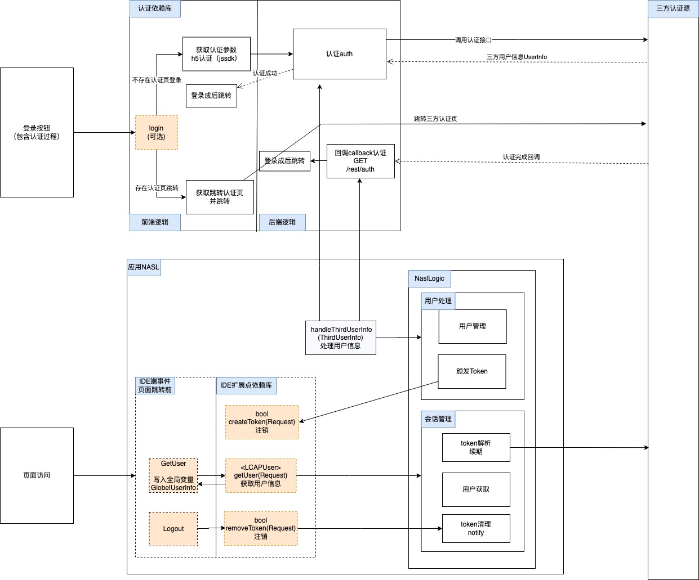
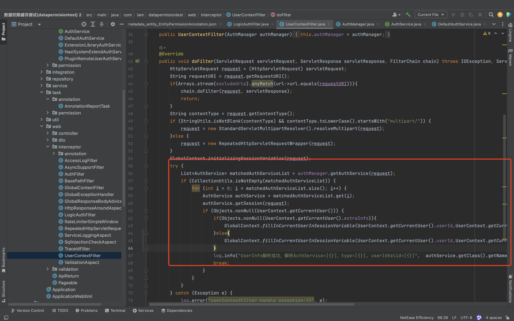
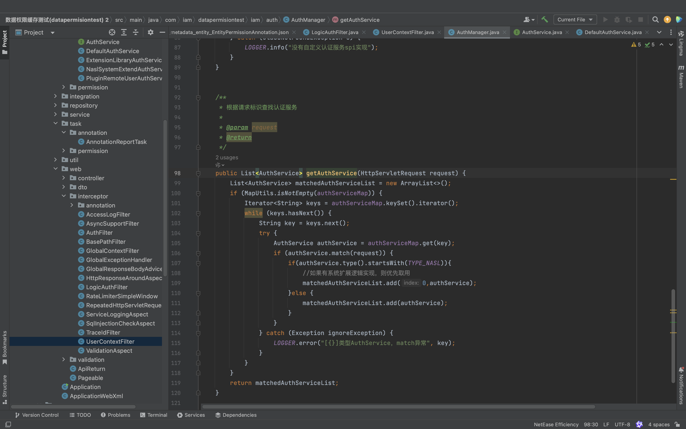
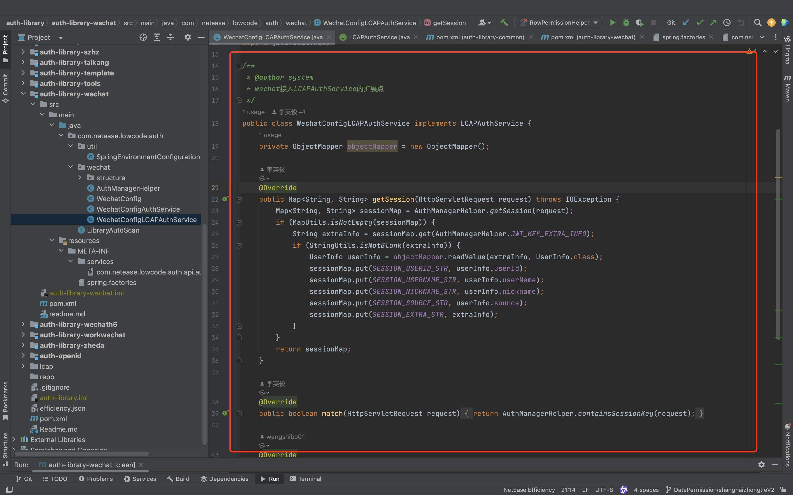
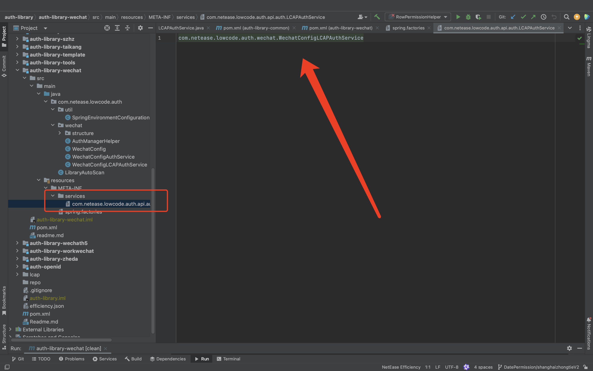
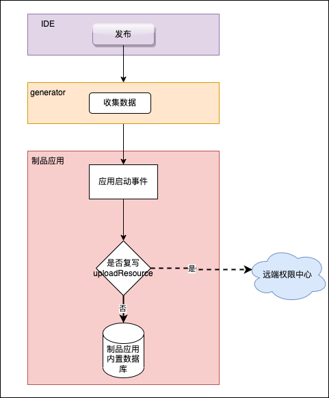
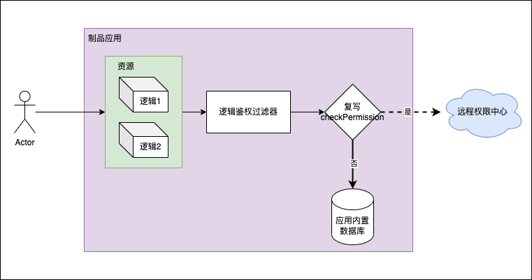
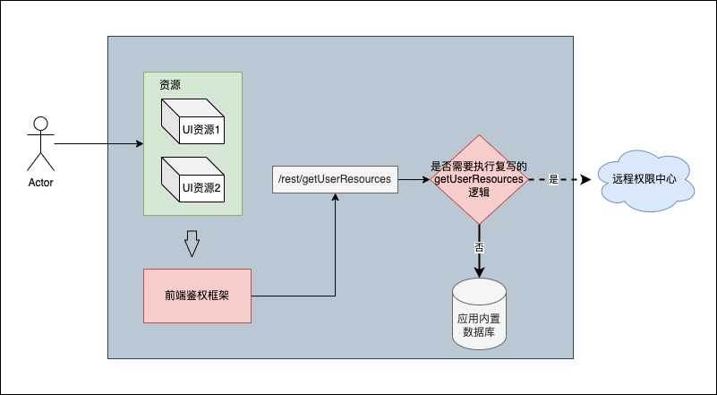
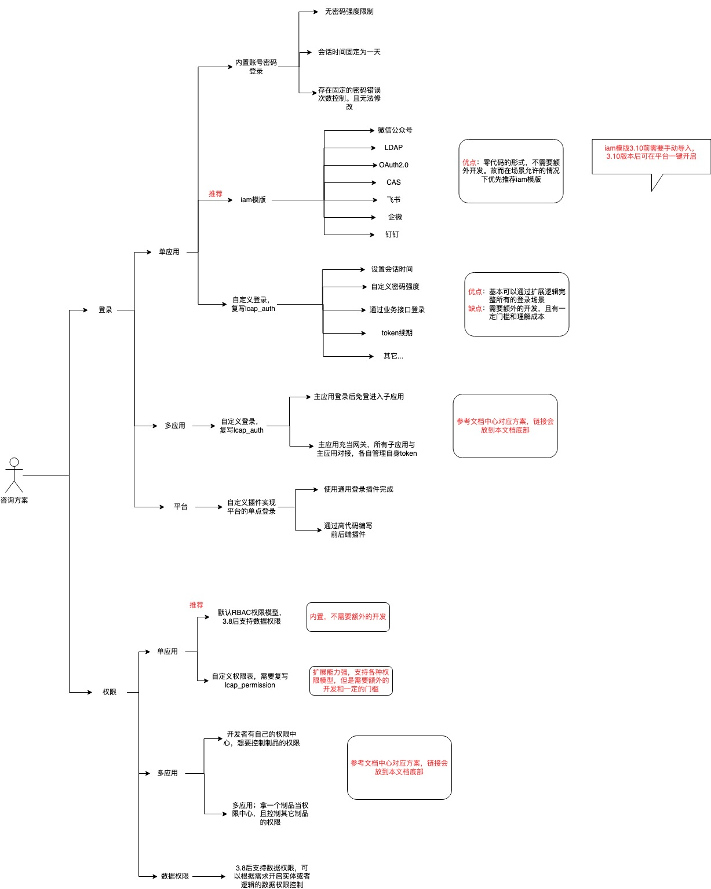
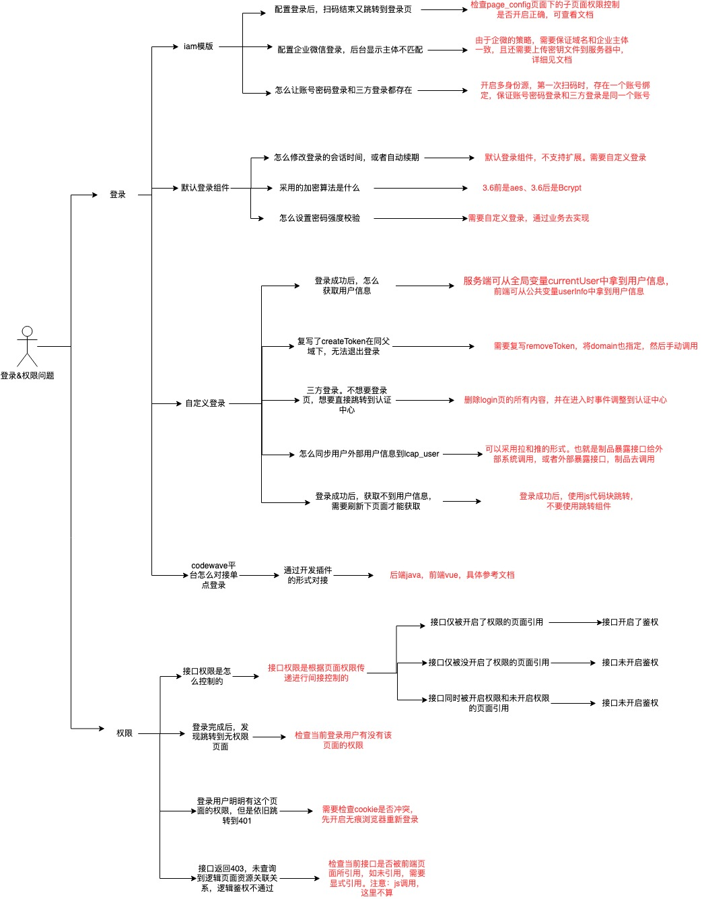

# 认证&鉴权
作者：许冠杰

<video src="http://jdvodmrvvfqeg.vod.126.net/jdvodmrvvfqeg/f2ed43a7ce044521ac2916541bd75456.mp4?wsSecret=72bed5c7624e3212bdef934f9dd6e414&wsTime=1756783180" controls="controls" style="max-width: 100%;">
</video>

> [父应用模版](https://static-vusion.nos-eastchina1.126.net/tutorial/%E6%96%87%E6%A1%A3%E4%B8%AD%E5%BF%83%E9%99%84%E4%BB%B6/%E7%99%BB%E5%BD%95%E8%AE%A4%E8%AF%81%E4%B8%8E%E6%9D%83%E9%99%90%E9%9B%86%E6%88%90/%E7%88%B6%E5%AD%90%E5%BA%94%E7%94%A8%E6%9D%83%E9%99%90%E7%AE%A1%E7%90%86/%E5%BA%94%E7%94%A8%E6%A8%A1%E6%9D%BF_%E7%88%B6%E5%AD%90%E5%BA%94%E7%94%A8-%E7%88%B6%E5%BA%94%E7%94%A8_1.0.0%EF%BC%883.13%EF%BC%89.zip) [子应用模版](https://static-vusion.nos-eastchina1.126.net/tutorial/%E6%96%87%E6%A1%A3%E4%B8%AD%E5%BF%83%E9%99%84%E4%BB%B6/%E7%99%BB%E5%BD%95%E8%AE%A4%E8%AF%81%E4%B8%8E%E6%9D%83%E9%99%90%E9%9B%86%E6%88%90/%E7%88%B6%E5%AD%90%E5%BA%94%E7%94%A8%E6%9D%83%E9%99%90%E7%AE%A1%E7%90%86/%E5%BA%94%E7%94%A8%E6%A8%A1%E6%9D%BF_%E7%88%B6%E5%AD%90%E5%BA%94%E7%94%A8-%E5%AD%90%E5%BA%94%E7%94%A8_1.0.0%EF%BC%883.13%EF%BC%89.zip)


## 文档概述：

认证和鉴权是网络安全中至关重要的两大步骤。认证是确认用户身份的过程，而鉴权则是确定用户是否有权限执行特定操作的过程。

然而，这两个概念在实际应用中经常被混淆。主要原因在于：  

首先，认证贯穿用户的整个会话周期——从初始登录时的身份验证，到后续请求中的会话校验，都属于认证范畴；
而鉴权同样贯穿整个会话过程，在用户每次访问资源时进行权限检查。
其次，在许多系统的登录流程中，身份验证和基础权限检查往往同时发生，这种紧密耦合的处理方式模糊了两者的界限。

这些因素共同导致了认证和鉴权被误解为同一概念的现象。

## 基础概念：

### 认证：

认证是验证用户身份真实性的过程，即确认"你是谁"。系统通过验证用户提供的身份凭证（如用户名密码、生物特征、数字证书等）来确认用户的身份是否属实。认证的核心目标是建立信任关系，确保访问系统的用户确实是其声称的那个人。

### 鉴权：

鉴权是在用户身份得到确认后，判断该用户是否有权限执行特定操作或访问特定资源的过程，即确定"你能做什么"。鉴权基于预定义的权限策略和规则，决定已认证用户可以访问哪些资源、执行哪些操作，以及在什么条件下可以进行这些操作。

### 身份标识：

身份标识是用于唯一标识用户的信息集合，包括用户名、用户ID、邮箱地址、手机号码等。身份标识是认证过程的基础，用于区分不同的用户实体。在分布式系统中，身份标识还可能包括组织域、租户ID等层次化信息。

### 会话：

会话是用户成功认证后，系统为维持用户登录状态而建立的临时交互上下文。会话包含用户身份信息、登录时间、过期时间、权限缓存等数据。会话管理确保用户在有效期内无需重复认证，同时提供安全的状态跟踪和生命周期管理。

### 令牌：
令牌是认证系统颁发给已认证用户的数字凭证，用于在后续请求中证明用户身份和权限。常见的令牌类型包括：
- 访问令牌（Access Token）
- 刷新令牌（Refresh Token）
- 身份令牌（ID Token）
- 会话令牌（Session Token）

## codewave的认证和鉴权核心技术：

目前平台支持两种方式完成认证和鉴权，其中为平台自带的扩展依赖库和开发者自定义认证依赖库。

### 认证扩展依赖库：lcap_auth

cw平台自带的认证依赖库，用于完成token的颁发、会话校验、token的清除。

lcap_auth拥有默认逻辑，同时也支持在ide复写该依赖库中的相应方法，复写完成后，底层会生成对应的方法，从而完成自定义的鉴权。详细请参考源码：/web/interceptor/UserContextFilter.java


**lcap_auth依赖库包含以下逻辑：**
- createToken：创建token，并将token加到cookie中；
- getUser：获取并解析cookie中的jwt token，并返回用户信息；
- removeToken：清空cookie。

**getUser**

用于获取当前的用户信息，拦截器中调用，无需手动调用，可以重写。每个认证接口都会走当前逻辑，分为以下几个步骤：

- 从浏览器中拿到cookie；
- 从cookie中拿到token；
- 解析token得到用户信息。

输出参数：

| 参数名 | 类型  | 描述  | 是否必传 |
| --- | --- | --- | --- |
| userId | String | 用户id | 是   |
| userName | String | 用户名 | 是   |
| extensionInfos | Map | 扩展信息 | 否   |

createToken

自定义登录完成拿到用户信息后调用该逻辑，用于颁发token，分为以下几个步骤：

- 拿到用户信息后，颁发token；
- 将token塞到cookie中，便于认证。

输入参数：

| 参数名 | 类型  | 描述  | 是否必传 |
| --- | --- | --- | --- |
| userId | String | 用户id | 是   |
| userName | String | 用户名 | 是   |
| extensionInfos | Map | 扩展信息 | 否   |
输出参数：true/false

**removeToken**

删除cookie，制品应用退出登录组件默认调用该逻辑

输出参数：true/false

### 自定义认证依赖库：

**使用场景：**

由于cw平台与外部程序都是通过http协议进行交互的，如果需要集成的单点登录需要使用sdk或者ldap等协议，就需要额外开发自定义认证依赖库。

**实现原理：**

主应用启动时会通过spi的形式加载当前依赖库，后续的token颁发、会话解析等操作会执行依赖库逻辑。

**主程序核心代码：**

参考/interceptor/UserContextFilter.java、iam/auth/AuthManager.java




**依赖库案例：**

参考微信登录依赖库
[auth-library-wechat](https://github.com/netease-lcap/codewave-architect-course/tree/main/example/auth-library-wechat)
1. 引入auth-library-common依赖
  ```xml
  <dependency> 
      <groupId>com.netease.lowcode</groupId> 
      <artifactId>auth-library-common</artifactId> 
      <version>1.0.0</version>
  </dependency>
  ```
1. 定义LCAPAuthService的扩展点，并实现LCAPAuthService接口，重写指定方法完成自定义会话鉴权

1. 注入spi

### 权限扩展依赖库：lcap_permission

lcap_permission为权限扩展依赖库，主要定义了uploadResource、checkPermission、getUserResources三个扩展方法用于实现用户自定义权限集成相关逻辑。**需要特殊注意**：如果需要对接远程权限中心，则必须先完成用户中心的对接

**uploadResource**

概述：在应用发布时将IDE内需要上报到权限系统的资源数据以指定方式上报到指定位置。

方法的作用：应用发布时会将需要上报到权限系统的资源数据写入到本地文件中，在应用启动完成前会调用uploadResource方法将本地的资源数据上报到指定位置。

改写后会产生的效果：分两种情况

1、仅改写了uploadResource，无IDE内显式调用

此场景无需关心入参的填充，会在应用发布(启动阶段)时将收集到本地的资源数据按照复写了的方法内容将数据上报到指定位置

2、改写了uploadResource且在IDE内其余地方显式调用

此场景需要手动处理方法的入参，会在uploadResource被调用到时执行一次指定资源的指定方法上传

推荐的使用方式：仅修改uploadResource 无需显式调用，仅需在IDE内设置哪些资源需要上报到指定位置，并编辑uploadResource的内容即可在应用成功发布后生效。

**checkPermission**

概述：输入用户id、资源唯一标识来检测指定用户是否有指定资源的访问权限。用户id可从服务端全局变量currentUser中获取，资源唯一标识为resourceValue。

方法的作用：返回输入用户是否有输入资源（此资源目前仅限于ui资源，暂不支持逻辑资源）的访问权限

改写后会产生的效果：分两种场景

1、逻辑被其他地方显式调用且用作业务判断

- checkPermission在被调用到时会执行方法内的逻辑最终返回是否有权限访问并影响业务逻辑

- 页面在调用全局逻辑时会根据改写过的checkPermission逻辑来分析某人是否有某逻辑的调用权限


2、逻辑仅被改写并无显式调用

- 页面在调用全局逻辑时会根据改写过的checkPermission逻辑来分析某人是否有某逻辑的调用权限

推荐的使用方式：修改checkPermission逻辑内容后无显式调用，此方式将仅在逻辑访问鉴权的时候生效。页面权限的访问控制已有应用框架根据/rest/getUserResources接口返回值进行控制。当然也可以在其他位置显式的调用checkPermission逻辑以完成业务逻辑的编写。

**getUserResources**

概述：输入用户标识，返回该用户所能访问的资源列表（目前仅返回UI资源列表），用户标识可从服务端全局变量currentUser中获取，返回的资源列表包含resourceValue、resourceType、clientType、description、createdTime字段

方法的作用：应用的页面显示控制框架会调用/rest/getUserResources接口来获取当前登录人可访问哪些资源，如果需要自定义用户可以获取哪些资源的逻辑，可以复写lcap-permission依赖库中的getUserResources方法并在LCAPGetUserResources逻辑中调用getUserResources方法来达到复写用户可访问哪些资源的控制目的。

推荐的使用方式：修改getUserResources逻辑内容后无显式调用

###  接口权限是怎么控制的：
接口权限是由页面权限间接控制的，即存在以下几种场景：
1. 当前接口未被前端页面所调用  ==> 无权限： 403（未查询到逻辑页面资源关联关系，逻辑鉴权不通过）
2. 当前接口只被一个前端页面所调用  ==> 跟随当前页面的权限，如果当前页面未开启权限，即该接口也无需鉴权
3. 当前接口被多个页面所调用  ==> 跟随最小权限的页面

核心逻辑：/web/interceptor/LogicAuthFilter.java

**注意事项：**
实际开发中需要这里，如果一个接口被多个页面所引用，如果这些页面的权限级别不一样，可能会导致垂直越权的安全问题。


例如：管理端和用户端使用后了同一个接口，用户端抓包修改入参即可获取管理端的数据。


## 认证模块与技术：

认证的核心是为了获取和校验用户信息，确保访问系统的用户身份真实可信。现代认证系统通常采用多层次、多模式的认证架构，以适应不同场景和安全需求。常见的认证技术有如下几块：

### 核心认证服务

1. 用户名密码认证
2. 手机号验证码认证
3. 邮箱验证码认证
4. 生物识别认证接口
5. ...

### 多因素认证(MFA)

1. TOTP令牌生成与验证
2. 短信验证码服务
3. 邮箱验证码服务
4. MFA策略管理
5. ...

### 社交账号认证

1. 微信登录集成
2. GitHub登录集成
3. Google登录集成
4. ...

### 企业身份认证

1. LDAP/AD集成
2. OAuth 2.0集成
3. OpenID Connect
4. ...

## 授权管理模块：

目前cw平台内置了一套RBAC权限模型，开发者只需要一键开启权限模版，即可完成RBAC权限模型的集成。但是开发者若想集成外部的权限中心，则不用关心权限模型，无论RBAC还是ABAC，权限管理的最终目的都是鉴权，所以开发者只用根据业务场景复写上文所标识的lcap_permission依赖库即可。

### RBAC权限模型

1. 角色定义管理：

   a. 支持多级角色体系，如系统角色、业务角色、功能角色

   b. 角色创建、激活、停用、删除的完整生命周期管理

   c. 角色名称、描述、优先级、有效期、使用范围等属性

2. 资源权限配置：

   a. 按业务模块、功能域、数据类型等维度分类

   b. 支持页面级、功能级、字段级、数据行级权限

   c. 父子资源权限继承、权限依赖链管理

   d. 权限打包、批量授权、权限组合优化

3. 用户-角色分配

   a. 支持单用户多角色、多用户单角色的批量操作

   b. 基于部门、职位、入职时间等规则的自动分配

   c. 临时角色授权、到期自动回收

4. 角色继承关系

   a. 支持角色树状结构、权限向下继承

   b. 继承关系的性能优化和缓存机制

   c. 权限累加、权限覆盖、权限排斥等继承策略


### ABAC权限模型

1. 属性定义管理

   a. 主体属性：用户ID、用户姓名、邮箱、手机号、部门等

   b. 客体属性：资源ID、资源名称、所有者、责任人、管理部门、项目归属等

   c. 环境属性：当前时间、IP地址、天气、地点等

2. 策略规则引擎

   a. Open Policy Agent、、Drools等

3. 条件表达式解析

   a. 逻辑运算符：AND、OR、NOT、XOR等逻辑操作

   b. 比较运算符：等于、不等于、大于、小于、包含、匹配

   c. 算术运算符：加减乘除、取模、幂运算

   d. 集合运算符：交集、并集、差集、子集判断

   e. 字符串操作：连接、截取、查找、替换、正则匹配

4. 环境属性收集
5. 多策略组合评估


### 资源访问控制

#### 功能权限：

控制页面、按钮的显隐，以及接口的是否调用权限

1. 菜单
2. 按钮
3. 接口

#### 数据权限：

控制不同人看到的数据行和列不同，目前cw基于实体、逻辑完成行权限和字段权限的控制。

详细请参考：[数据权限入门](https://community.codewave.163.com/CommunityParent/fileIndex?filePath=20.%E5%BA%94%E7%94%A8%E5%BC%80%E5%8F%91%2F10.%E9%A1%B5%E9%9D%A2%E8%AE%BE%E8%AE%A1%2F35.%E6%9D%83%E9%99%90%E6%A8%A1%E5%9D%97%2F009.%E6%95%B0%E6%8D%AE%E6%9D%83%E9%99%90%E5%85%A5%E9%97%A8.md&version=3.13&title=%E6%95%B0%E6%8D%AE%E6%9D%83%E9%99%90%E5%85%A5%E9%97%A8&selectType=codewave)

1. 行权限控制
2. 列权限控制


## 数据权限详情：
目前CodeWave内置的数据权限也是基于RBAC去实现，且能控制到实体的行、列级别，数据权限的最小权限点（资源）也就是实体，支持对实体字段的权限管控。

### 数据权限解释：
1. 行权限：控制某人看到的数据行数，配置权限规则不同，看到的数据行不同。底层相当于在sql上添加where条件
2. 列权限：控制某人看到的数据列，配置权限规则不同，看到的数据列不同。底层相当于sql的 select xxx from

### 数据权限四大基础行权限：
1. 可读本人：只能查看本人数据
2. 本人及下属：可查看本人及下属的数据
3. 部门及部门以下：可查看当前部门和下级部门人员的所有数据
4. 可读全部：能看所有，相当于未控制数据权限的行权限

目前这部分行权限默认是根据业务表的createBy来定位到用户的，且这部分逻辑都在ide的逻辑控制的，开发者可自行修改这块代码，从而完成各自的定制需求。
### 自定义行权限：
开发者可自定义配置属性及属性规则，比如user表配置name = 张三，那么这个用户就只能看到姓名为张三的数据
### 数据权限缓存：
目前实体的数据权限是基于mybatis的动态表达式去实现的，即在业务的执行过程中可能需要频繁去查询数据权限，所以这里默认设计了jvm缓存，开发者可自行开启，也可以根据需求自定义数据权限依赖库，引入redis缓存。
### 数据权限扩展依赖库：
lcap_annotation_data_permission

同功能权限的lcap_permission设计一致，主应用通过spi的形式加载该依赖库，只需要在依赖库中自定义资源上报、行列权限开发。

例如：默认支持如下操作符，但是如果有特殊需求，比如需要添加数据条件json匹配，则可在数据权限依赖库中进行扩展jsonContains

| 数据条件名称 | 条件说明 | 对应DB语法 |
| --- | --- | --- |
| equal | 等于  | =   |
| notEqual | 不登录 | =   |
| greater | 大于  | >   |
| less | 小于  | <   |
| greaterEquals | 大于等于 | >=  |
| lessEquals | 小于等于 | <=  |
| like | 模糊匹配 | like %xxx% |
| notLike | 不匹配 | not like %xxx% |
| leftLike | 左模糊 | like %xxx |
| notLeftLike | 非左模糊 | not like %xxx |
| rightLike | 右模糊 | like xxx% |
| notRightLike | 非右模糊 | not like xxx% |
| in  | 包含  | in  |
| notIn | 不包含 | not in |


## codewave认证权限自助排查指南
### 方案：


### 问题：


## codewave常见认证&权限集成场景

CodeWave智能开发平台目前支持六种常见的登录和权限场景，涵盖了业内常见的认证场景。开发者可以参考每个场景的介绍，结合自身业务需求选择最适合的场景，并查看详细的接入文档和示例。

| 集成场景 | 场景描述 | 接入文档 |
| --- | --- | --- |
| 单体应用接入SSO（OAuth2.0） | - 针对一个和或者几个的少量应用<br><br>- 每个应用都需要实现SSO | [权限认证模块配置](https://community.codewave.163.com/CommunityParent/fileIndex?filePath=40.%E6%89%A9%E5%B1%95%E4%B8%8E%E9%9B%86%E6%88%90%2F20.%E9%9B%86%E6%88%90%E5%BC%80%E5%8F%91%E6%96%B9%E5%BC%8F%2F50.%E7%99%BB%E5%BD%95%E8%AE%A4%E8%AF%81%E4%B8%8E%E6%9D%83%E9%99%90%E9%9B%86%E6%88%90%2F60.IAM%E5%B1%80%E9%83%A8%E6%A8%A1%E7%89%88%2F010.%E6%9D%83%E9%99%90%E8%AE%A4%E8%AF%81%E6%A8%A1%E5%9D%97%E9%85%8D%E7%BD%AE.md&version=3.13&selectType=codewave) |
| 网关应用接入SSO | - 只用申请一套AK/SK即可完成所有应用的SSO登录<br><br>- 存在网关应用，控制所有应用的SSO | [网关应用接入SSO](https://community.codewave.163.com/CommunityParent/fileIndex?filePath=40.%E6%89%A9%E5%B1%95%E4%B8%8E%E9%9B%86%E6%88%90%2F20.%E9%9B%86%E6%88%90%E5%BC%80%E5%8F%91%E6%96%B9%E5%BC%8F%2F50.%E7%99%BB%E5%BD%95%E8%AE%A4%E8%AF%81%E4%B8%8E%E6%9D%83%E9%99%90%E9%9B%86%E6%88%90%2F20.%E8%AE%A4%E8%AF%81%E9%9B%86%E6%88%90%E5%9C%BA%E6%99%AF%E5%88%97%E8%A1%A8%2F020.%E7%BD%91%E5%85%B3%E5%BA%94%E7%94%A8%E6%8E%A5%E5%85%A5SSO%EF%BC%88OAuth2.0%EF%BC%89.md&version=3.13) |
| 父子应用登录认证和权限集成 | - 父应用充当权限中心、认证中心控制子应用的登录、权限<br><br>- 门户网站（工作台模式） | - 认证：根据不同场景请参考<br><br>[同父域父子应用实现免登](https://community.codewave.163.com/CommunityParent/fileIndex?filePath=40.%E6%89%A9%E5%B1%95%E4%B8%8E%E9%9B%86%E6%88%90%2F20.%E9%9B%86%E6%88%90%E5%BC%80%E5%8F%91%E6%96%B9%E5%BC%8F%2F50.%E7%99%BB%E5%BD%95%E8%AE%A4%E8%AF%81%E4%B8%8E%E6%9D%83%E9%99%90%E9%9B%86%E6%88%90%2F20.%E8%AE%A4%E8%AF%81%E9%9B%86%E6%88%90%E5%9C%BA%E6%99%AF%E5%88%97%E8%A1%A8%2F030.%E5%90%8C%E7%88%B6%E5%9F%9F%E7%88%B6%E5%AD%90%E5%BA%94%E7%94%A8%E5%AE%9E%E7%8E%B0%E5%85%8D%E7%99%BB.md&version=3.13)<br><br>、[实现多应用免登](https://community.codewave.163.com/CommunityParent/fileIndex?filePath=40.%E6%89%A9%E5%B1%95%E4%B8%8E%E9%9B%86%E6%88%90%2F20.%E9%9B%86%E6%88%90%E5%BC%80%E5%8F%91%E6%96%B9%E5%BC%8F%2F50.%E7%99%BB%E5%BD%95%E8%AE%A4%E8%AF%81%E4%B8%8E%E6%9D%83%E9%99%90%E9%9B%86%E6%88%90%2F20.%E8%AE%A4%E8%AF%81%E9%9B%86%E6%88%90%E5%9C%BA%E6%99%AF%E5%88%97%E8%A1%A8%2F040.%E5%AE%9E%E7%8E%B0%E5%A4%9A%E5%BA%94%E7%94%A8%E5%85%8D%E7%99%BB.md&version=3.13)<br><br>- 权限：<br><br>[父子应用权限管理](https://community.codewave.163.com/CommunityParent/fileIndex?filePath=40.%E6%89%A9%E5%B1%95%E4%B8%8E%E9%9B%86%E6%88%90%2F20.%E9%9B%86%E6%88%90%E5%BC%80%E5%8F%91%E6%96%B9%E5%BC%8F%2F50.%E7%99%BB%E5%BD%95%E8%AE%A4%E8%AF%81%E4%B8%8E%E6%9D%83%E9%99%90%E9%9B%86%E6%88%90%2F30.%E6%9D%83%E9%99%90%E9%9B%86%E6%88%90%E5%9C%BA%E6%99%AF%E5%88%97%E8%A1%A8%2F010.%E7%88%B6%E5%AD%90%E5%BA%94%E7%94%A8%E6%9D%83%E9%99%90%E7%AE%A1%E7%90%86.md&version=3.13) |
| 权限中心集成 | - CodeWave应用对接外部应用的权限中心 | [权限中心集成](https://community.codewave.163.com/CommunityParent/fileIndex?filePath=40.%E6%89%A9%E5%B1%95%E4%B8%8E%E9%9B%86%E6%88%90%2F20.%E9%9B%86%E6%88%90%E5%BC%80%E5%8F%91%E6%96%B9%E5%BC%8F%2F50.%E7%99%BB%E5%BD%95%E8%AE%A4%E8%AF%81%E4%B8%8E%E6%9D%83%E9%99%90%E9%9B%86%E6%88%90%2F30.%E6%9D%83%E9%99%90%E9%9B%86%E6%88%90%E5%9C%BA%E6%99%AF%E5%88%97%E8%A1%A8%2F020.%E6%9D%83%E9%99%90%E4%B8%AD%E5%BF%83%E9%9B%86%E6%88%90.md&version=3.13) |
| 多应用跳转实现免登 | - 外部应用登录后免登访问CodeWave应用 | [实现多应用免登](https://community.codewave.163.com/CommunityParent/fileIndex?filePath=40.%E6%89%A9%E5%B1%95%E4%B8%8E%E9%9B%86%E6%88%90%2F20.%E9%9B%86%E6%88%90%E5%BC%80%E5%8F%91%E6%96%B9%E5%BC%8F%2F50.%E7%99%BB%E5%BD%95%E8%AE%A4%E8%AF%81%E4%B8%8E%E6%9D%83%E9%99%90%E9%9B%86%E6%88%90%2F20.%E8%AE%A4%E8%AF%81%E9%9B%86%E6%88%90%E5%9C%BA%E6%99%AF%E5%88%97%E8%A1%A8%2F040.%E5%AE%9E%E7%8E%B0%E5%A4%9A%E5%BA%94%E7%94%A8%E5%85%8D%E7%99%BB.md&version=3.13) |
| 单体应用接入SSO（CAS） | - CAS协议<br><br>- 单点登录 | [CAS协议登录集成](https://community.codewave.163.com/CommunityParent/fileIndex?filePath=40.%E6%89%A9%E5%B1%95%E4%B8%8E%E9%9B%86%E6%88%90%2F20.%E9%9B%86%E6%88%90%E5%BC%80%E5%8F%91%E6%96%B9%E5%BC%8F%2F50.%E7%99%BB%E5%BD%95%E8%AE%A4%E8%AF%81%E4%B8%8E%E6%9D%83%E9%99%90%E9%9B%86%E6%88%90%2F20.%E8%AE%A4%E8%AF%81%E9%9B%86%E6%88%90%E5%9C%BA%E6%99%AF%E5%88%97%E8%A1%A8%2F050.CAS%E5%8D%8F%E8%AE%AE%E7%99%BB%E5%BD%95%E9%9B%86%E6%88%90.md&version=3.13) |CAS） | - CAS协议<br><br>- 单点登录 | [CAS协议登录集成](https://community.codewave.163.com/CommunityParent/fileIndex?filePath=40.%E6%89%A9%E5%B1%95%E4%B8%8E%E9%9B%86%E6%88%90%2F20.%E9%9B%86%E6%88%90%E5%BC%80%E5%8F%91%E6%96%B9%E5%BC%8F%2F50.%E7%99%BB%E5%BD%95%E8%AE%A4%E8%AF%81%E4%B8%8E%E6%9D%83%E9%99%90%E9%9B%86%E6%88%90%2F20.%E8%AE%A4%E8%AF%81%E9%9B%86%E6%88%90%E5%9C%BA%E6%99%AF%E5%88%97%E8%A1%A8%2F050.CAS%E5%8D%8F%E8%AE%AE%E7%99%BB%E5%BD%95%E9%9B%86%E6%88%90.md&version=3.13) |