# 案例：能源行业系统
作者：许建平

<video src="https://jdvodmrvvfqeg.vod.126.net/jdvodmrvvfqeg/527104e8ae8c4481b024c6586c8418f3.mp4?wsSecret=d8479118c1906d841cfa12e2d736ce27&wsTime=1991028695" controls="controls" style="max-width: 100%;">
</video>

## 背景：

系统复杂、功能多、数据量大，如果由单一应用独立完成，开发效率低，页面卡顿。遂将系统拆分，分为4个子应用和一个门户，且门户具有基础的5a能力，还能支持高代码应用集成。

## 1\. 系统目标

- 构建统一的企业级应用平台，支持多业务系统集成、支持高、低代码应用的集成

- 使用用户、组织、角色的统一管理

- 实现统一的用户认证与权限管理

- 提供安全可靠的内网系统与外网应用的安全对接

- 支持移动办公需求，提升用户体验

## 2\. 系统架构设计

### 2.1 总体架构

本系统采用微服务架构，将整个系统拆分为5个核心应用，实现业务解耦和独立部署：

- 门户系统： 提供统一认证、账号管理、权限管理、单点登录、日志审计等功能

- 安全中心：负责系统安全策略、风险监控

- 行政中心：处理企业日常行政事务

- 项目管理：管理能源项目全生命周期

- 门户系统移动端：提供移动端访问支持，并作为内外网通信代理

### 2.3 架构原则

- 高内聚低耦合：各应用模块职责明确，接口清晰

- 安全优先：构建多层次安全防护体系

- 可扩展性：支持业务快速扩展和系统容量弹性伸缩

- 用户体验：提供一致、便捷的用户交互体验

## 3\. 门户（基础服务）设计

### 功能定位

门户系统作为整个平台的入口，承担统一认证、应用管理、权限管理、单点登录等核心功能，是连接各子系统的枢纽。

### 核心功能

- 统一用户管理：维护用户基本信息、生命周期、组织架构

- 权限管理：基于RBAC模型的权限控制体系

- 认证服务：提供账号密码和企微登录，并提供应用的单点登录功能

- 应用集成：管理各子系统的接入与展示

- 个性化配置：支持用户界面个性化定制

### 核心功能设计

#### 应用管理

核心目的：本系统对用户的感知上是一个应用，但是底层上采用多个应用去开发，所以这里必须将多个应用的权限、认证统一进行管理，并且各个应用的登录态应该保持一致，即一方登录、整个系统的应用都登录了。

1. 支持单点登录

  a. 采用cookie的domain机制完成登录态的共享

2. 应用注册

  a. ak/sk注册，便于后续rest api的交互调用

  b. 支持管理低码应用和各类高码应用

  c. 回调地址， 认证成功后的跳转地址

  d. 用户端点，获取认证用户信息的接口

#### 内网环境下的企微认证

背景：用户侧的电脑属于内网环境，而企微服务又是公网的，这里需要将内网的应用和公网的企微打通，从而完成企微的统一认证。

正常企微交互流程：

  a. 发起授权请求，企微返回二维码

  b. pc端显示二维码，移动端扫描二维码

  c. pc端监听扫码事件，轮询获取扫码结果，拿到code

  d. 通过code换token

  e. 通过token换用户信息

环境信息：

  e. pc端：内网访问

  f. nginx服务端：可连接内外网

  g. 企微：外网

  h. 移动端：内外网都可访问

由于pc端不能直接与外网通信，所有这里参照原有的方案其实是行不通的。

这里设计了两个方案：分别如下

方案一：结合nginx代理请求到企微服务器

方案二：通过移动端请求企微服务端，pc端轮询移动端的企微结果

结论：

由于pc端二维码是企微的sdk组件，扫码完成后的轮询接口是固定的，遂无法经过nginx，所以方案一并不能获取到code，则使用方案二。

#### 会话管理

- 采用JWT技术 + redis实现令牌管理与缓存

- 支持令牌刷新与失效机制

#### 权限管理

采用基于RBAC(角色基础访问控制)模型的权限管理体系，通过用户-角色-权限的关联关系实现精细化权限控制。并且实现统一权限中心，需要结合应用，将各个应用的资源、角色进行隔离。

权限模型设计

- 用户：系统的使用者，具有唯一标识

- 角色：权限的集合，代表一类用户的职责

  - 应用间隔离：每个应用都有自己独立的角色

  - 添加子角色概念：每个角色可以关联其他角色，方便管理员分配权限给其它分级管理员

- 权限：系统中的操作许可，如查看、编辑、删除等

- 资源：系统中的业务对象，如数据、功能等

权限控制范围

- 前端控制：基于菜单和按钮的可见性控制

- 后端控制：基于接口和方法的访问控制

- 数据控制：基于数据范围的过滤控制

#### 账号管理

  a. 用户管理 ==> 生命周期。 正常、锁定、离职等

  b. 部门管理 ==> 组织，部门，虚拟部门

  c. 数据上下游同步 ==> excel 和 openapi

#### open api

  a. 满足RESTful API设计风格

  b. 所有控制台的api都提供openapi

  c. openapi独立的进行ak/sk鉴权

  d. 支持其他语言的应用集成

### 扩展功能：

#### 基础服务：

使用其它现有的公共服务，管理现有的业务应用

1. xxl-job分布式任务调度 -- 依赖库

2. nacos注册配置中心 -- 依赖库

3. apollo配置中心 -- 连接器

4. dubbo集成 -- 依赖库

5. ....

#### 5A平台

1. 应用管理

  a. 单点配置

    i. 支持添加应用到单点
    
    ii. 支持应用面板配置（也是个应用）

  b. 应用注册

    i. ak/sk
    
    ii. 回调地址
    
    iii. token端点
    
    iv. 用户端点

  c. 应用登录控制

    i. 账号密码登录
    
    ii. 手机号验证码 ==> 接入云信还是开发者接口？
    
    iii. 手机号密码
    
    iv. 邮箱密码

  d. 应用类型

    i. 单点应用
    
    ii. 自建应用

  e. 访问授权

    i. 允许/拒绝全部人
    
    ii. 授权用户、角色、部门

2. 认证管理

  a. oauth2.0配置

  b. cas协议配置

  c. 企微配置

  d. 钉钉配置

  e. 手机号配置

3. 权限管理

  a. 角色管理

  b. 资源管理 ==> 树形

  c. 策略管理

    i. 功能资源
    
    ii. 数据资源

  d. 授权管理

  e. 权限视图

4. 账号管理

  a. 用户管理 ==> 生命周期

  b. 部门管理 ==> 组织，部门，虚拟部门

  c. 数据上下游同步 ==> excel 和 openapi

5. 审计日志

  a. 用户操作日志

  b. 管理员行为日志

  c. 业务应用日志

6. 安全配置

  a. 密码策略

  b. 会话管理

  c. 账号锁定规则 ==> 是否开启自助解锁

7. open api

  a. 所有控制台的api都需要提供openapi

  b. openapi需要独立的进行ak/sk鉴权

#### 其它：

1. 代办中心

2. 邮件、短信、通知中心

3. 流程中心