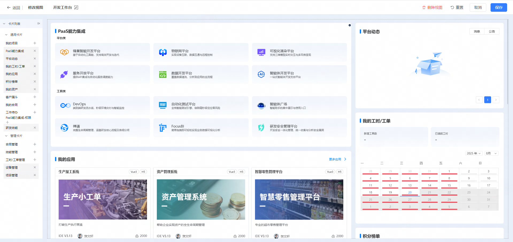
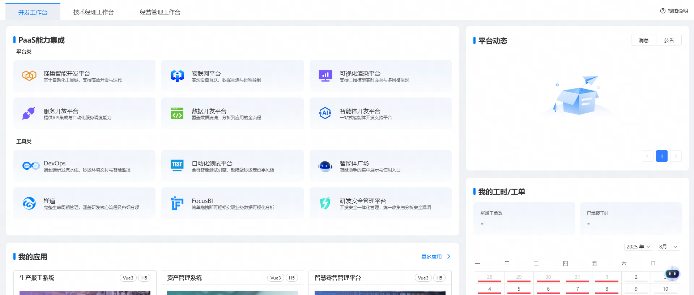
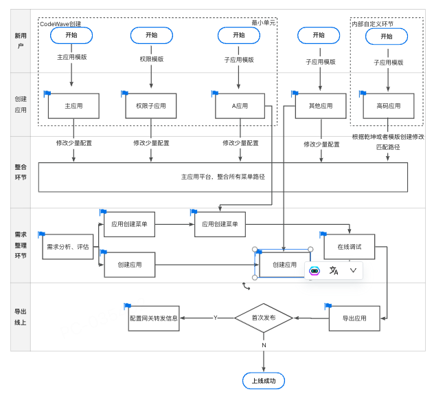

# 案例：交通行业系统

## 一、项目背景
XX公司在24年底的时候，通过POC项目选拔确认用网易CodeWave平台进行数字化转型的驱动力量。那作为公司的新势力，自然要在项目中表现出实力去印证平台是满足交付项目的能力。所以客户挑选了XX运维这个项目作为试点应用。

XX运维项目在公司内部已经运行4年左右，典型的老旧项目而且经过了多次的改造翻新和重构，XX项目有2个数据库，50+个页面，1000+的接口，本次重构的目标就是沿用之前项目的后端，使用平台去翻新前端，以证明平台能力和观察低代码平台搭建速度。

## 二、项目配置

|角色|人数|
|---|---|
|项目经理|2|
|技术经理|常驻2人（1前1后），冲刺阶段4人|
|产品经理|常驻1名，冲刺阶段3人|
|教练|常驻15人，其中新人5名 （老带新比例：2:1）|
|测试|常驻2名，冲刺阶段4名|

## 三、项目过程

首先，看到这个项目的时候，第一时间就意识到这是平台目前为止遇到的最庞大、最复杂、最行业化的应用，那在没有深入调研系统业务前，首先要处理的是系统的性能问题。

1.如何进行系统功能业务的拆分，做到一主多子架构

在进行系统拆分时，我们是根据业务来进行的，那这就要说到一点，在进行项目交付前期，ba进行需求分析的重要性了，那在完整的分析完成需求和原始系统架构后，想要做到系统级别的拆分，也就轻而易举，看如下图我们就能够把一个大型的应用拆分为多个子系统了，这样就能做到把一个大目标分解为多个小目标，在项目管理角度也是完美契合，所以应用拆分的意识是一定要有的，而且不是盲目去拆，是要拆且要拆的好。

2.找到共用模块，提炼能服用的内容。

做完应用拆分之后，我们观察老系统，那些是可以服用的，需要提前做的。

1.布局组件，首先确认的是共用的布局，如表格和抽屉等。

2.复用的逻辑，各个应用之间可能存在通用的逻辑，这样只需要在一个应用当中先开发，后面的模块通过接口的形式调用即可。

3.定制化的组件，减少低代码的开发时间。比如说换行水印，定制化的日历。

3.系统拆分后，然后就是各自为战。

每个模块都是采用老带新的原则，先重点后边缘的方式。

4.如何将客户的源码组件，引入进平台作为ide开发组件

因为我们是不了解业务结构的，所以当时是让客户先梳理好数据结构，基本采用的都是确认好入参以后，然后在进行提炼。

## 四、项目资产

除了一些依赖库的沉淀之外，我们还有一个场景的沉淀。

#### 1.大屏的缩放场景，适配不同容器下的大屏效果

#### 2.工作台组件

## 五、成果与价值

最终项目顺利通过，客户的满意度还是挺高的，带来了其他项目。

它给我们带来的价值主要有三方面：

组件沉淀：沉淀了交通行业特定组件和通用能力。

交付方案沉淀：总结出大应用交付的 SOP，包括微前端架构、模块拆分、制品交付全流程。

业务拓展价值：成功案例提升客户信任，形成示范效应，促进更多项目落地。

## 六、未来场景思考

## 七、用户故事

A项目经理接到需求，通过需求分析，组内讨论或由项目负责人确认需求归属。决定在哪些应用下面，建立哪些个菜单分组，哪些菜单项。会后根据讨论在系统中建立菜单，确定菜单名称，确定菜单路径。开发人员可以将功能拆分，每个人可以负责自己熟悉的一块，不会影响别人。根据开发路径在指定的子应用下面新建页面即可。后期只需要搭建业务需求即可。最后上线自动完整业务整合。在主应用下通过权限注册对应的子应用，展示权限所对应的菜单。