# 案例： 无界微前端架构搭建案例

> 视频直播内容： https://community.codewave.163.com/CommunityParent/videodetail?courseid=3285158193822720

## 微前端集成的必要性
> 微前端将一个大型、复杂的前端应用拆分成多个独立的子应用，但又保持用户体验的一致性。每个子应用可由独立的团队进行开发，并允许使用不同的技术栈进行开发，也可独立测试和部署。这样可以提高开发速度、降低维护成本，并促进团队之间的协作。

使用微前端架构在 CodeWave 上开发大型应用的好处至少有以下几点：
- 开发体验提升，单个应用专注于某一个业务模块，NASL 节点数量可控
- 应用解藕，业务聚焦，开发效率高，显著降低开发和维护成本
- 扩展性极强，可以低成本的无限扩展子应用
- 集成简单，仅需简单的配置，就能将新的应用集成进系统
- 隔离性好，子应用的上下线，不会对已发布的应用造成影响
- 侵入性小，仅需引入 wujie 框架 和封装的主子应用前端 sdk 即可，其中仅需对链接跳转进行改造即可

## 背景介绍
> 本文，将从实际项目出发，介绍一下「教务系统」，如何从传统架构迁移到微前端架构。
>
> **说明**：本项目采用的是 wujie 微前端框架，其他微前端框架类似

本次架构重构的要求有以下几点：
- 将单体应用拆分为多个应用，方便后续扩展迭代
- 各子应用的公共能力统一由框架层提供
- 所有页面均可在标签页打开，且可以自由配置组合菜单
- 主子应、子子应用间可以无缝跳转引用

应用拆分如下，

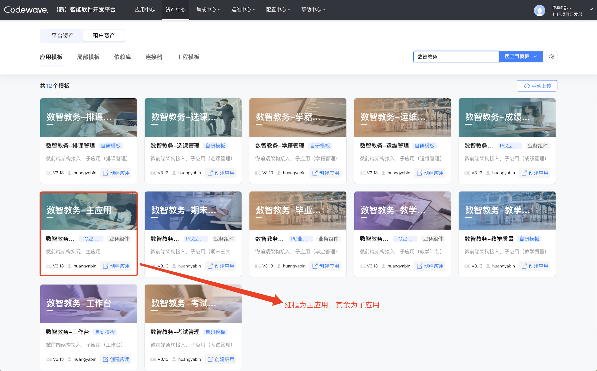

基于以上几点要求，我们有如下设计，
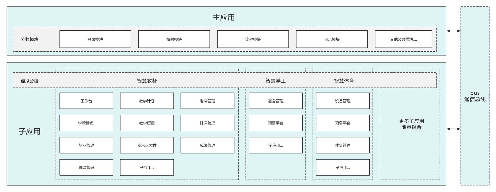

- 主应用
> 框架的核心实现层，主要包含：应用调度、通信总线、各子应用的公共模块实现等。
- 子应用
> 框架的业务集成层，主要包含：应用集成、具体的业务实现等。

如图，整个界面
- 绿色区块，为主应用公共组件，各子应用共享，无需单独开发
- 红色区块，为子应用容器，负责加载子应用内容，各子应用独立开发

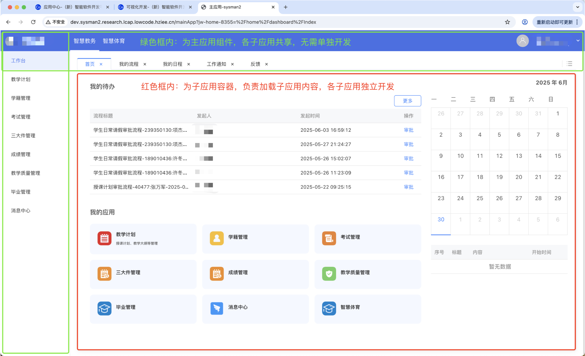

## 基础数据介绍
> 在现有的应用 > 菜单层次上，新增了应用分组（平台/系统）的概念。整个数据结构为，平台 > 应用 > 菜单三层级联（platform > subApp > menu，后文皆以这些单词代表其实体）。

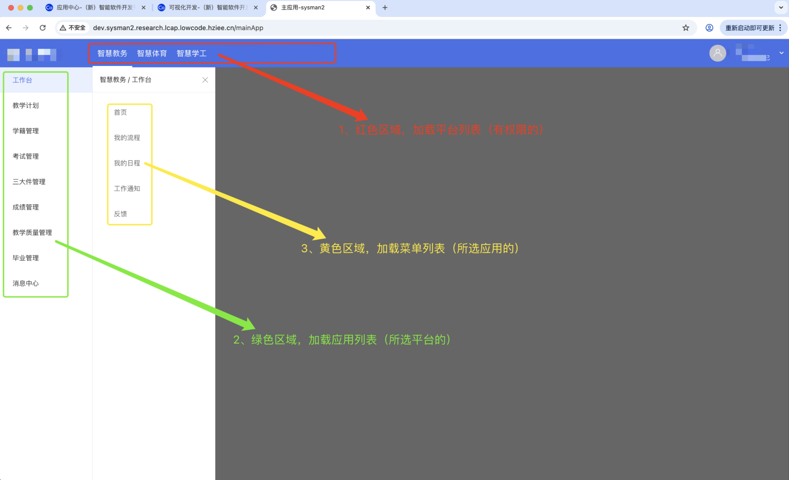


## 路径介绍
> 由于所有页面都在主应用的应用容器内加载。所以只有一个访问路径 `/mainApp`，各子应用路由通过 query 参数传递 `?jw-home-7421=/home/dashboard/processCenter`，如图，
``` txt
路径结构形如，/mainApp?${platform}-${subApp}-${nonce}=${path}

其中 ${platform}-${subApp}-${nonce}=${path} 标识当前打开的子应用页面（kv 结构）
 - ${platform}  平台，如 jw（表示，智慧教务）
 - ${subApp}    子应用，如 home（表示，工作台应用）
 - ${nonce}     随机串，用来支持子应用多开（同时打开同一个子应用的同一个页面，且互相隔离）
 - ${path}      子应用访问路径，如 /home/dashboard/processCenter?param=value...
```
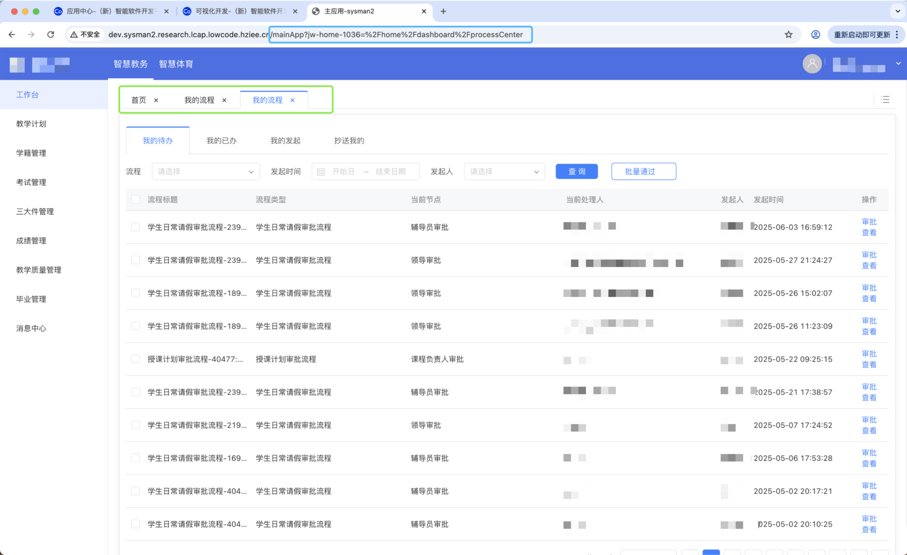

## 标签页介绍
> 每个 tab 页打开一个子应用，支持应用的多开。同时右上角提供一些导航工具，用来实现 tab 的快速切换和关闭；当前 tab 页内的路由导航等

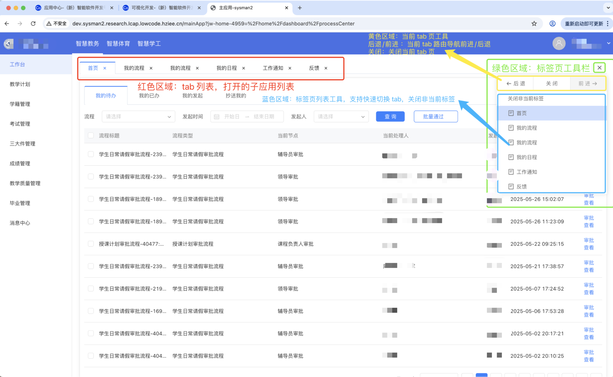

## 数据结构设计
- ### Wujie，应用全局状态
> 核心数据结构，存储整个主子应用的状态信息

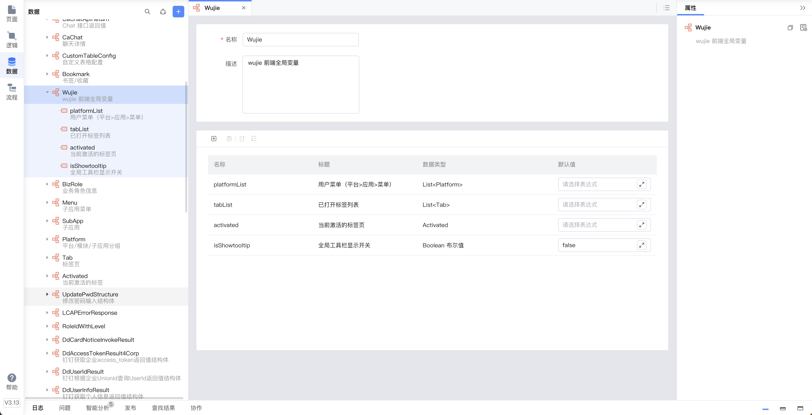

- ### Platform，平台信息（应用分组信息）

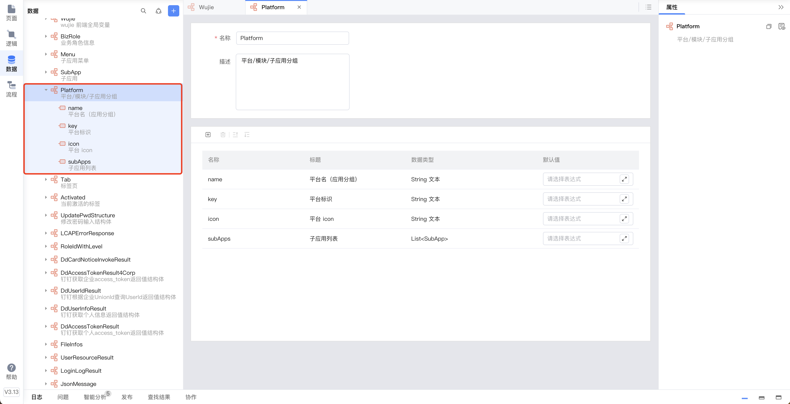

- ### Subapp，子应用信息

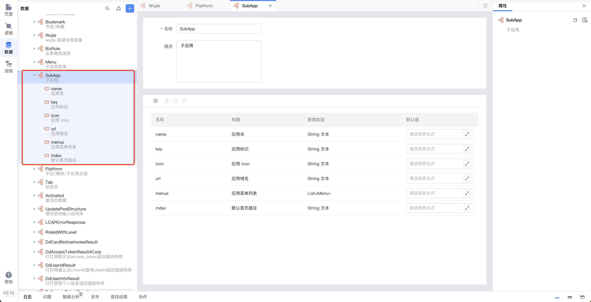

- ### Menu，子应用菜单信息

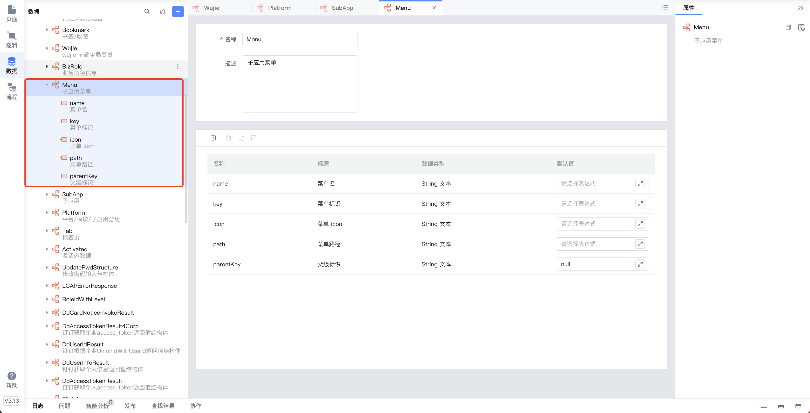

- ### Tab，标签页信息（选项卡标签）

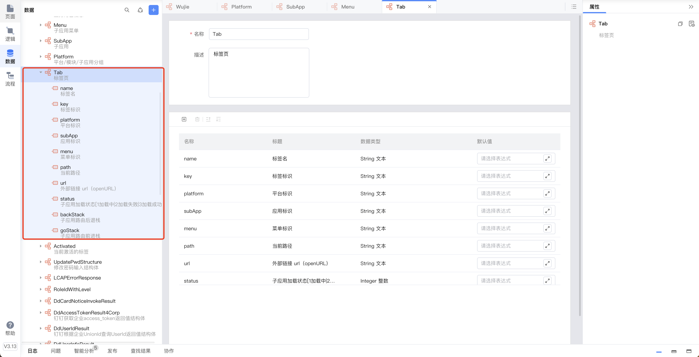

- ### Activated，当前激活的标签页信息

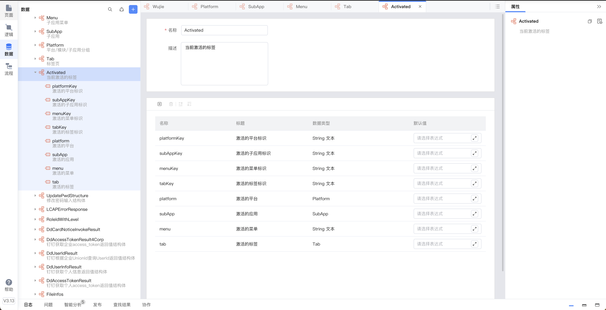

## 主应用

### 选项卡组件设置
> 子应用页面均以新开标签页的形式打开，天然的容器隔离互不影响，支持页面重复打开

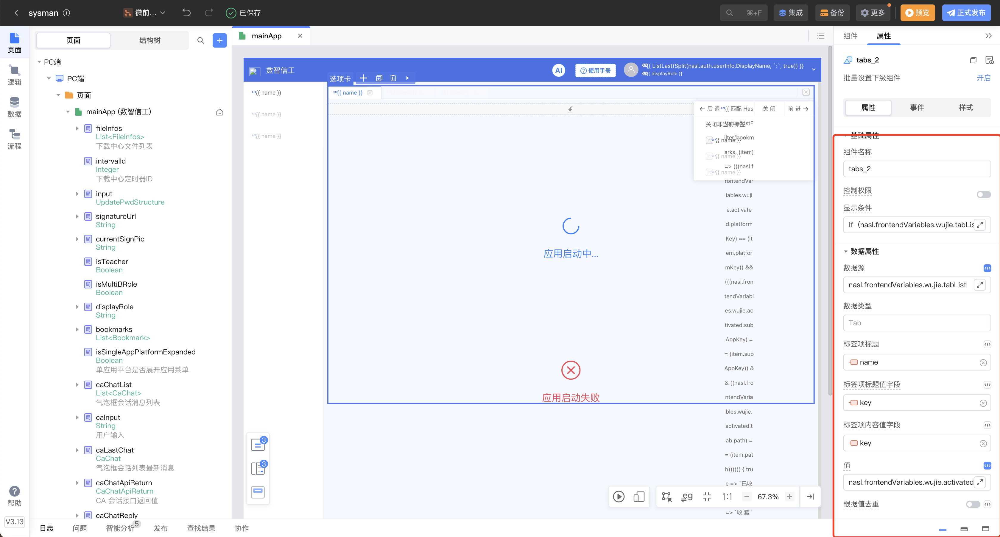

### 主应用 SDK 封装
> 在应用容器页面的「**进入页面时**」事件中引入如下 js 块，完成主应用的改造
>
> **说明**：本项目为 mainApp 页面，后续子应用页面都在 mainApp 页面的选项卡内加载

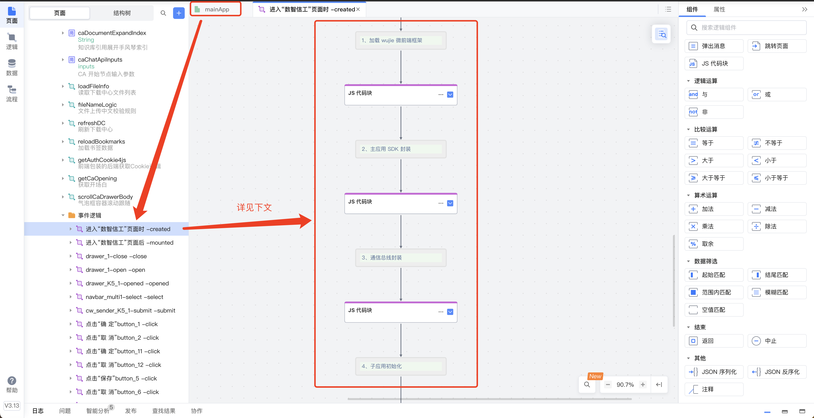

#### 1、加载 wujie 微前端框架
```javascript
/**
 * wujie 环境初始化
 */
function loadScript(src) {
    const script = document.createElement('script');
    script.src = src;
    const res = new Promise((res, rej) => {
        script.onload = res;
        script.onerror = rej;
    });
    document.head.appendChild(script);
    return res;
}

const src = 'https://unpkg.com/wujie@1.0.24/lib/index.js';

if (!window.wujie) {
    await loadScript(src);
}
```
#### 2、主应用 SDK 封装
> 核心实现，对所有设计进行了封装，提供了一个全局对象

```javascript
/**
 * wujie 自定义全局对象
 */
const _this  = this;
const _utils = this.$utils;
const _fv = this.$global.frontendVariables;

// 最大打开标签数（>1 限制，<=1 不限制）
const MAX_TABS = 8;
// 是否支持重复打开
const ALLOW_DUPLICATE_TABS = false;

this.$global.wujie = {
    /**
     * 启动应用（不推荐直接调用，不会自动维护相关数据）
     */
    __startApp: function() {
        const { startApp, bus } = window.wujie;
        const { tab, subApp } = _fv.wujie.activated;
        const { utils, lifecycle } = _this.$global.wujie;
        // 延时启动，避免 dom 还未渲染完成，就开始启动子应用
        setTimeout(() => {
            startApp({
                name: tab.key,
                // 兼容 platformList 权限内外
                // url: utils.isNull(subApp) ? tab.path : subApp.url + tab.path,
                url: !utils.isNull(tab.url) ? tab.url : subApp.url + tab.path,
                el: "#" + tab.key,
                exec: true,
                sync: true,
                alive: true,
                props: {
                    bus, 
                    tabKey: tab.key, 
                    data: _fv.wujie.platformList
                },
                beforeLoad: lifecycle.beforeLoad,
                loadError: lifecycle.loadError,
                activated: lifecycle.activated,
                deactivated: lifecycle.deactivated,
                // 解决各种弹出组件错位问题
                plugins: [{
                    // 在子应用所有的 css 之前
                    cssBeforeLoaders: [
                        // 强制使子应用 body 定位是 relative
                        { content: "body{position: relative !important}" },
                    ],
                },{
                    jsLoader: (code) => {
                        // 替换 popper.js 内计算偏左侧偏移量
                        var codes = code.replace(
                            "left: elementRect.left - parentRect.left",
                            "left: fixed ? elementRect.left : elementRect.left - parentRect.left"
                        );
                        // 替换 popper.js 内右侧偏移量
                        return codes.replace("popper.right > data.boundaries.right", "false");
                    }
                }],
            });
        }, 100);
    },

    /**
     * 启动应用（自动维护相关数据，platformList 权限内）
     * 
     * @param platformKey 必选
     * @param subAppKey 必选
     * @param menuKey 可选
     * @param path 可选，默认 subApp.index
     * @param tabName 可选，默认 subApp.name
     * @return boolean
     */
    startApp: function(platformKey, subAppKey, menuKey, path, tabName) {
        const _wujie = _this.$global.wujie;
        const { isNull }  = _wujie.utils;
        const { detectStartupConstraints, tabHandler, activatedHandler, __startApp } = _wujie;
        // 检测启动约束
        if (!detectStartupConstraints(platformKey, subAppKey, path)) {
            return true;
        }
        // 构建 tab
        const tab = tabHandler.buildTab(platformKey, subAppKey, menuKey, path, tabName);
        if (isNull(tab)) {
            return false;
        }
        // 维护数据
        tabHandler.add(tab);
        activatedHandler.setActivated(platformKey, subAppKey, menuKey, tab.key);
        // 启动应用
        __startApp();
        return true;
    },

    /**
     * 通过 URI 启动应用
     * 
     * @param search ?platform-subapp[-nonce]=path
     * @return boolean
     */
    startAppViaURI: function(search) {
        const _wujie = _this.$global.wujie;
        const { startApp } = _wujie;
        const { findTabsByPath, parseTabName } = _wujie.tabHandler;
        const { isNotEmptyStr, safeDecodeURIComponent } = _wujie.utils;
        if (!isNotEmptyStr(search)) {
            return false;
        }
        // 解析 search 
        const params = search.startsWith('?') ? search.substring(1) : search;
        const [ tabKey, ...pathParts ] = params.split("=");
        const [ platformKey, subAppKey, nonce ] = tabKey.split("-");
        const path = safeDecodeURIComponent(pathParts.join("="));
        // 启动应用，「首页」无需再次启动
        if (findTabsByPath(platformKey, subAppKey, path).length >= 1) {
            return false;
        }
        // 启动应用，platformList 权限外
        if (isNotEmptyStr(nonce) && nonce.length == 3) {
            console.log("启动失败: 权限外应用无法通过 URL 启动");
            window.VueRouterInstance.replace(`${window.VueRouterInstance.history.current.path}`);
            return false;
        }
        const menu = parseTabName(platformKey, subAppKey, path);
        // 启动应用，platformList 权限内
        return startApp(
            platformKey, 
            subAppKey,
            menu?.key,
            path, 
            menu?.name
        );
    },

    /**
     * 启动默认应用
     * 
     * @return boolean
     */
    startDefaultApp: function(platformKey, subAppKey, menuKey, tabName) {
        return _this.$global.wujie.startApp(
            platformKey, 
            subAppKey,
            menuKey,
            null,
            tabName
        );
    },

    /**
     * 启动应用（自动维护相关数据，platformList 权限外）
     * 
     * @param url 必选
     * @param tabName 可选，默认“标签”
     * @param platformKey 可选，从哪个平台打开
     * @param subAppKey 可选，从哪个应用打开
     * @return boolean
     */
    startAppOutsideAuthority: function(url, tabName, platformKey, subAppKey) {
        const _wujie = _this.$global.wujie;
        const { isNull, parseURLPath } = _wujie.utils;
        const { detectStartupConstraints, tabHandler, activatedHandler, __startApp } = _wujie;
        // 统一权限外 tab 的数据抽象层
        platformKey = isNull(platformKey) ? 'out' : platformKey;
        subAppKey = isNull(subAppKey) ? 'authority' : subAppKey;
        // 检测启动约束
        if (!detectStartupConstraints(platformKey, subAppKey, parseURLPath(url))) {
            return true;
        }
        // 构建 tab
        const tab = tabHandler.buildTabOutsideAuthority(url, tabName, platformKey, subAppKey);
        if (isNull(tab)) {
            return false;
        }
        // 维护数据
        tabHandler.add(tab);
        activatedHandler.setActivated(tab.platform, tab.subApp, tab.menu, tab.key);
        // 启动应用
        __startApp();
        return true;
    },

    /**
     * 关闭应用（不推荐直接调用，不会自动维护相关数据）
     */
    __closeApp: function(key) {
        window.wujie.destroyApp(key);
    },

    /**
     * 关闭应用（自动维护相关数据）
     */
    closeApp: function(key) {
        const _wujie = _this.$global.wujie; 
        const { tabList, activated } = _fv.wujie;
        const { tabHandler, activatedHandler, asyncURI, __closeApp } = _wujie;
        const index = _utils.ListFindIndex(tabList, (item) => item.key == key);
        // 没找到/当前为「首页」则不删除，若 <0 则是可删
        if (index <= 0) {
            return;
        }
        // 删除 tab
        tabHandler.removeByIndex(index);
        // 关闭后，如果 tabList 为空
        if (tabList.length == 0) {
            activatedHandler.clearActivated();
            __closeApp(key);
            return;
        }
        // 如果关闭的应用是激活状态
        if (key == _fv.wujie.activated.tabKey) {
            // 关闭的应用是第一个 tab，则激活其后的 tab；否则，激活其前的 tab
            const tab = tabList[index == 0 ? 0 : index - 1 ];
            activatedHandler.setActivated(tab.platform, tab.subApp, tab.menu, tab.key);
            asyncURI();
            // 取消加载中状态（解决快速打开多个 tab，还未渲染完成就切换走了的情况）
            if (activated.tab.status == 1) {
                activated.tab.status = 3;
            }
        }
        // 关闭应用
        __closeApp(key);
    },

    /**
     * 关闭所有非激活应用（自动维护相关数据）
     */
    closeAllAppWithoutActivated: function() {
        const { tabList, activated } = _fv.wujie;
        const { closeApp } =  _this.$global.wujie;
        // 不能直接循环 tabList 删除，需要克隆/转换一个新数组
        const tabKeys = _utils.ListTransform(tabList, item => {
            return item.key;
        });
        tabKeys.forEach(item => {
            if (item != activated.tabKey) {
                closeApp(item);
            }
        });
    },

    /**
     * 检测启动约束
     * 
     * @return boolean
     */
    detectStartupConstraints: function(platformKey, subAppKey, path) {
        const _wujie = _this.$global.wujie;
        const { tabHandler, activatedHandler, closeApp, asyncURI } = _wujie;
        const { tabList, activated } = _fv.wujie;
        // 重复打开约束
        if (!ALLOW_DUPLICATE_TABS) {
            /**
             * 当前只检测 tab.path 是否一致，即来源一致的 tab 应用内跳转了，是可以重复打开的（path 不一样）
             * 如果不允许来源一致的 tab 重复打开，则需要严格检测，可以对比 tab.backStack[0]（表示 tab 的来源地址）
             */
            const tabs = tabHandler.findTabsByPath(platformKey, subAppKey, path);
            if (tabs.length > 0) {
                activatedHandler.setActivated(tabs[0].platform, tabs[0].subApp, tabs[0].menu, tabs[0].key);
                asyncURI();
                // 取消加载中状态（解决快速打开多个 tab，还未渲染完成就切换走了的情况）
                if (activated.tab.status == 1) {
                    activated.tab.status = 3;
                }
                return false;
            }
        }
        // 最大标签数约束
        if (MAX_TABS > 1 && tabList.length >= MAX_TABS) {
            // 超过上限，则删除最早手动打开的标签（tabList[0] 固定标签不支持删除）
            closeApp(tabList[1].key);
        }
        return true;
    },

    /**
     * 主应用 URI 同步/修正
     * 
     * activated/tab `切换`的时候必须调一次，第一次设置是不需要的
     */
    asyncURI: function() {
        const { key, path } = _fv.wujie.activated.tab;
        // console.log( `asyncURI: ${window.VueRouterInstance.history.current.path}?${key}=${path}`);
        window.VueRouterInstance.replace(
            `${window.VueRouterInstance.history.current.path}?${key}=${path}`
        );
    }
}

this.$global.wujie.lifecycle = {
    /**
     * 应用加载前
     */
    beforeLoad: function(window) {},

    /**
     * 应用加载失败
     */
    loadError: function(url, e) {
        _this.$global.wujie.activatedHandler.setStatus(2);
        console.log(`启动失败: ${e}(${url})`);
    },

    /**
     * 应用激活
     */
    activated: function(window) {
        _this.$global.wujie.activatedHandler.setStatus(3);
    },
    
    /**
     * 应用失活
     */
    deactivated: function(window) {}
}

this.$global.wujie.stackHandler = {
    /**
     * 访问
     * 
     * 异步调用（可能先打开的 tab 后回调，不能用同步思路）
     */
    visit: function(tab, path) {
        const { backStack, goStack } = tab;
        const { asyncURI } = _this.$global.wujie;
        // 后退栈入栈
        backStack.push(path);
        // 前进栈清空
        goStack.length = 0;
        // 更新 path
        tab.path = path;
        // 同步 URI
        asyncURI();
    },

    /**
     * 后退
     * 
     * @return 后退栈栈顶元素，即当前应该访问的路径
     */
    back: function() {
        const { activated } = _fv.wujie;
        const { backStack, goStack } = activated.tab
        // 后退栈出栈
        const popPath = backStack.pop();
        // 前进栈进栈
        goStack.push(popPath);
        // 更新 path
        activated.tab.path = backStack[backStack.length - 1];
        return activated.tab.path
    },

    /**
     * 前进
     * 
     * @return 前进栈出栈元素，即当前应该访问的路径
     */
    go: function() {
        const { activated } = _fv.wujie;
        const { backStack, goStack } = activated.tab
        // 前进栈出栈
        const popPath = goStack.pop();
        // 后退栈进栈
        backStack.push(popPath);
        // 更新 path
        activated.tab.path = popPath;
        return activated.tab.path;
    },
}

this.$global.wujie.activatedHandler = {
    /**
     * 应用加载状态设置
     * 
     * tabList 无需维护，因为 activated.tab 是强引用
     */
    setStatus(status) {
        // 延时改变状态，避免子应用 dom 还未渲染完成，就改变状态
        setTimeout(() => {
            _fv.wujie.activated.tab.status = status;
        }, 800);
    },

    /**
     * 清空 activated
     */
    clearActivated: function() {
        const { platformHandler, subAppHandler, menuHandler, tabHandler} = _this.$global.wujie;
        platformHandler.clearActivated();
        subAppHandler.clearActivated();
        menuHandler.clearActivated();
        tabHandler.clearActivated();
    },

    /**
     * 设置 activated
     */
    setActivated: function(platformKey, subAppKey, menuKey, tabKey) {
        const { platformHandler, subAppHandler, menuHandler, tabHandler} = _this.$global.wujie;
        platformHandler.setActivated(platformKey);
        subAppHandler.setActivated(subAppKey);
        menuHandler.setActivated(menuKey);
        tabHandler.setActivated(tabKey);
    }
}

this.$global.wujie.platformHandler = {
    /**
     * 新增 platform
     */
    add: function(platform) {
        _fv.wujie.platformList.push(platform);
    },

    /**
     * 清空 activated.platform*
     */
    clearActivated: function() {
        const { activated } = _fv.wujie;
        activated.platformKey = null;
        activated.platform = null;
    },

    /**
     * 设置 activated.platform*
     */
    setActivated: function(key) {
        const { platformList, activated } = _fv.wujie;
        const { isNotEmptyStr, findItemByKey } = _this.$global.wujie.utils;
        if (!isNotEmptyStr(key)) {
            return;
        }
        activated.platformKey = key;
        activated.platform = findItemByKey(platformList, key);
    },

    /**
     * 根据 appKey 查询 platform 
     */
    findPlatformByAppKey: function(appKey) {
        return _utils.ListFind(_fv.wujie.platformList, (platform) => {
            return _utils.ListFindIndex(platform.subApps, (subApp) => subApp.key == appKey) >= 0;
        });
    }
}

this.$global.wujie.subAppHandler = {
    /**
     * 清空 activated.subApp*
     */
    clearActivated: function() {
        const { activated } = _fv.wujie;
        activated.subAppKey = null;
        activated.subApp = null;
    },

    /**
     * 设置 activated.subApp*
     */
    setActivated: function(key){
        const { activated } = _fv.wujie;
        const { isNotEmptyStr, findItemByKey } = _this.$global.wujie.utils;
        if (!isNotEmptyStr(key)) {
            return;
        }
        activated.subAppKey = key;
        activated.subApp = findItemByKey(activated.platform.subApps, key);
    }
}

this.$global.wujie.menuHandler = {
    /**
     * 清空 activated.menu*
     */
    clearActivated: function() {
        const { activated } = _fv.wujie;
        activated.menuKey = null;
        activated.menu = null;
    },

    /**
     * 设置 activated.menu*
     */
    setActivated: function(key){
        const { activated } = _fv.wujie;
        const { isNotEmptyStr, findItemByKey } = _this.$global.wujie.utils;
        if (!isNotEmptyStr(key)) {
            return;
        }
        activated.menuKey = key;
        activated.menu = findItemByKey(activated.subApp.menus, key);
    },
}

this.$global.wujie.tabHandler = {
    /**
     * 设置 Path
     */
    setPath: function(key, path) {
        const { stackHandler, utils } = _this.$global.wujie;
        const { isNull, isLast, findItemByKey } = utils;
        const tab = findItemByKey(_fv.wujie.tabList, key);
        if (!isNull(tab) && !isLast(tab?.backStack, path)) {
            stackHandler.visit(tab, path);
        }
    },

    /**
     * 查询 tab
     */
    findTabsByPath: function(platformKey, subAppKey, path) {
        return _fv.wujie.tabList.filter(item => {
            return item.platform == platformKey 
            && item.subApp == subAppKey 
            && item.path == path;
        })
    },

    /**
     * 删除 tab
     * 
     */
    removeByIndex: function(index) {
        const { removeItemByIndex } = _this.$global.wujie.utils;
        removeItemByIndex(_fv.wujie.tabList, index);
    },

    /**
     * 删除 tab
     * 
     * @return 返回索引，-1 表示未找到
     */
    remove: function(key) {
        const { removeItemByKey } = _this.$global.wujie.utils;
        return removeItemByKey(_fv.wujie.tabList, key);
    },

    /**
     * 新增 tab
     */
    add: function(tab) {
        _fv.wujie.tabList.push(tab);
    },

    /**
     * 清空 activated.tab*
     */
    clearActivated: function() {
        const { activated } = _fv.wujie;
        activated.tabKey = null;
        activated.tab = null;
    },

    /**
     * 设置 activated.tab*
     */
    setActivated: function(key){
        const { tabList, activated } = _fv.wujie;
        const { isNotEmptyStr, isNull, findItemByKey } = _this.$global.wujie.utils;
        if (!isNotEmptyStr(key)) {
            return;
        }
        const tab = findItemByKey(tabList, key);
        if (isNull(tab)) {
            return;
        }
        activated.tabKey = key;
        activated.tab = tab;
    },

    /**
     * 生成 tabKey
     */
    generateTabKey: function(platformKey, subAppKey, isOutsideAuthority = false) {
        let times = 0;
        const keys = new Set(_fv.wujie.tabList.map(tab => tab.key));
        while(times < 100) {
            const key = isOutsideAuthority 
                ? `${platformKey}-${subAppKey}-${_utils.RandomInt(100, 999)}` 
                : `${platformKey}-${subAppKey}-${_utils.RandomInt(1000, 9999)}`;
            if (!keys.has(key)) {
                return key;
            }
            times++;
        }
        return null;
    },

    /**
     * 构建 tab（platformList 权限内）
     */
    buildTab: function(platformKey, subAppKey, menuKey, path, tabName) {
        const _wujie = _this.$global.wujie;
        const { generateTabKey, parseTabName } = _wujie.tabHandler;
        const { isNotEmptyStr, isNull, findItemByKey } = _wujie.utils;
        if (!isNotEmptyStr(platformKey) || !isNotEmptyStr(subAppKey)) {
            return null;
        }
        // platformKey 无效
        const platform = findItemByKey(_fv.wujie.platformList, platformKey);
        if (isNull(platform)) {
            return null;
        }
        // subAppKey 无效
        const subApp = findItemByKey(platform.subApps, subAppKey);
        if (isNull(subApp)) {
            return null;
        }
        // 构建 tab
        return {
            name: isNotEmptyStr(tabName) ? tabName : subApp.name,
            key: generateTabKey(platformKey, subAppKey),
            platform: platformKey,
            subApp: subAppKey,
            menu: menuKey,
            path: isNotEmptyStr(path) ? path : subApp.index,
            // 子应用加载状态[1加载中|2加载失败|3加载成功]
            status: 1,
            // 子应用导航栈初始化
            backStack: [],
            goStack: []
        }
    },

    /**
     * 构建 tab（platformList 权限外）
     */
    buildTabOutsideAuthority: function(url, tabName, platformKey, subAppKey) {
        const _wujie = _this.$global.wujie;
        const { generateTabKey } = _wujie.tabHandler;
        const { isNotEmptyStr } = _wujie.utils;
        if (!isNotEmptyStr(url)) {
            return null;
        }
        // 构建 tab
        return {
            name: isNotEmptyStr(tabName) ? tabName : '标签',
            key: generateTabKey(platformKey, subAppKey, true),
            platform: platformKey,
            subApp: subAppKey,
            url: url,
            // 子应用加载状态[1加载中|2加载失败|3加载成功]
            status: 1,
            // 子应用导航栈初始化
            backStack: [],
            goStack: []
        }
    },

    /**
     * 解析 tabName
     */
    parseTabName: function(platformKey, subAppKey, path) {
        const { platformList } = _fv.wujie;
        const { isNull, findItemByKey } = _this.$global.wujie.utils;
        const platform = findItemByKey(platformList, platformKey);
        const subApp = findItemByKey(platform.subApps, subAppKey);
        return _utils.ListFind(subApp.menus, (item) => item.path == path);
    }
}

this.$global.wujie.utils = {
    /**
     * 空对象判断
     */
    isNull: function(obj) {
        return obj === null || obj === undefined;
    },

    /**
     * 非空字符串判断
     */
    isNotEmptyStr: function(str) {
        return typeof str === 'string' && str.trim() !== '';
    },

    /**
     * 判断元素是否是数组的最后一个元素
     */
    isLast: function(list, item) {
        const index = list.lastIndexOf(item);
        return index !== -1 && index === list.length - 1;
    },

    /**
     * 根据 key 查询索引
     */
    findIndexByKey: function(list, key) {
        return _utils.ListFindIndex(list, (item) => item.key == key);
    },

    /**
     * 根据 key 查询对象
     */
    findItemByKey: function(list, key) {
        return _utils.ListFind(list, (item) => item.key == key);
    },

    /**
     * 根据 index 删除对象
     * 
     * @return 返回索引
     */
    removeItemByIndex: function(list, index) {
        list.splice(index, 1);
    },

    /**
     * 根据 key 删除对象
     * 
     * @return 返回索引
     */
    removeItemByKey: function(list, key) {
        const { removeItemByIndex } = _this.$global.wujie.utils;
        const index = _utils.ListFindIndex(list, (item) => item.key == key);
        if (index >= 0) {
            removeItemByIndex(list, index);
        }
        return index;
    },

    /**
     * 解析 URL 的路径信息
     */
    parseURLPath: function(urlStr, includeSearch = true, includeHash = true) {
        try {
            const url = new URL(urlStr);
            let path = url.pathname;
            if (includeSearch) path += url.search;
            if (includeHash) path += url.hash;
            return path;
        } catch(e) {
            return null;
        }
    },

    /**
     *  安全的多层 URI 解码
     */
    safeDecodeURIComponent: function(str) {
        let last;
        let now = str;
        do {
            last = now;
            try {
                now = decodeURIComponent(now);
            } catch(e) {
                return last;
            }
        } while (now !== last);
        return now;
    }
}
```
#### 3、通信总线封装
```javascript
/**
 * wujie 通信总线
 */
const _this = this;
const _wujie = this.$global.wujie;
const _fv = this.$global.frontendVariables;
const { bus } = window.wujie;
const { isNull, findItemByKey } = _wujie.utils;

/**
 * 子应用路由上报（主应用路由同步）
 */
bus.$on("routeReport", (event) => {
    // console.log(`routeReport: ${_fv.wujie.activated.tabKey} <?> ${event.tabKey} : ${event.path}`);
    _wujie.tabHandler.setPath(event.tabKey, event.path);
});

/**
 * 子应用主动关闭（关闭标签页）
 */
bus.$on("closeApp", (event) => {
    _wujie.closeApp(event.tabKey);
});

/**
 * 跨应用跳转（新建标签页，platformList 权限内）
 * 
 * @param event { [platformKey], subAppKey, path, [tabName] }
 * 注意：目前的设计是 subApp:platform = 1:1，
 *      可以通过 subAppKey 查询到 platform，故 platformKey 为可选参数
 *      如果后期需要修改为 1:N，则 platformKey 参数需修改为必选
 */
bus.$on("openPage", (event) => {
    const { findPlatformByAppKey } = _wujie.platformHandler;
    const { parseTabName } = _wujie.tabHandler;
    const { isNotEmptyStr, isNull, findItemByKey } = _wujie.utils;
    const { platformKey, subAppKey, path, tabName } = event;
    
    let platform;
    if (isNotEmptyStr(platformKey)) {
        platform = findItemByKey(platformKey);
    } else {
        // todo: 如果 subApp:platform = 1:N，则 return
        platform = findPlatformByAppKey(subAppKey);
    }
    if (isNull(platform)) {
        console.log("启动失败: 应用不存在或无权限");
        return;
    }
    const menu = parseTabName(platform.key, subAppKey, path);
    // 启动应用
    _wujie.startApp(platform.key, subAppKey, menu?.key, path, tabName);
});

/**
 * 跨应用跳转（新建标签页，platformList 权限外）
 * 
 * @param event { url, [tabName], [platformKey], [subAppKey]}
 * [platformKey/subAppKey] 表示该 url 从何打开，并不表示 url 归属于 platform/subApp
 */
bus.$on("openURL", (event) => {
    const { isNotEmptyStr } = _wujie.utils;
    const { url, tabName, platformKey, subAppKey} = event;
    if (!isNotEmptyStr(url)) {
        console.log("启动失败: url 参数为空");
        return;
    }
    // 启动应用
    _wujie.startAppOutsideAuthority(url, tabName, platformKey, subAppKey);
});

/**
 * 子应用删除书签（home 首页「我的收藏」删除）
 */
bus.$on("removeBookmark", (event) => {
    const index = _this.bookmarks.findIndex(item => {
        return item.id == event.bookmark.id;
    });
    if (index >= 0) {
        // 收到某个子应用删除后，主应用通知其他子应用删除（处理打开多个 home 的情况）
        bus.$emit('modifyBookmark', {
            tabKey: event.tabKey,
            bookmark: _this.bookmarks[index],
            isAdd: false,
        });
        // 主应用删除书签
        _this.bookmarks.splice(index, 1);
    }
});

/**
 * activated.tabKey 监听
 */
this.$watch(
    () => _fv.wujie.activated.tabKey,
    (tabKey, lastTabKey) => {
        // console.log(`mainApp: ${tabKey} - ${lastTabKey}`);
        if (isNull(lastTabKey)) {
            return;
        }
        bus.$emit('activateTab', { 
            tabKey, 
            path: _fv.wujie.activated?.tab?.path
        });
    }, 
    {
        immediate: true
    }
)
```
#### 4、子应用初始化
```javascript
/**
 * 应用初始化
 */
const { startAppViaURI, startDefaultApp } = this.$global.wujie;

/**
 * 子应用初始化
 * 
 * 1、URI 中有启动参数，则使用参数启动
 * 2、URI 中无启动参数，且默认子应用启动开关打开，则启动默认子应用
 */
function init() {
    startDefaultApp("gzt", "home", "11010100", "首页");
    startAppViaURI(window.location.search);
}

init();
```

## 子应用
### 开启微前端集成
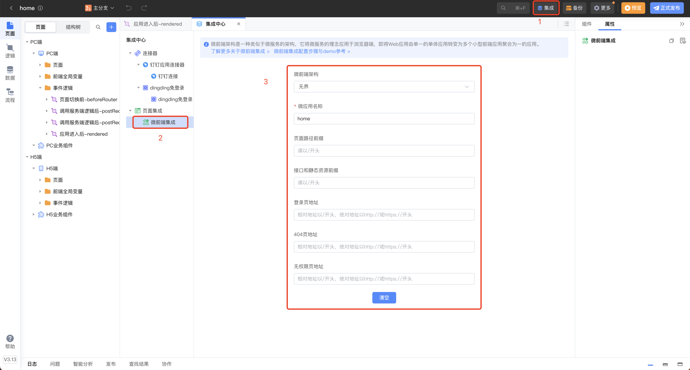

### 解决跨域问题
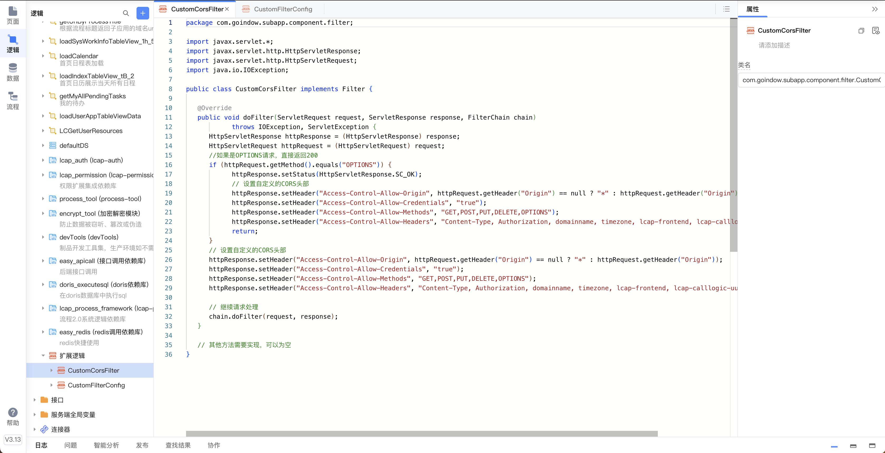
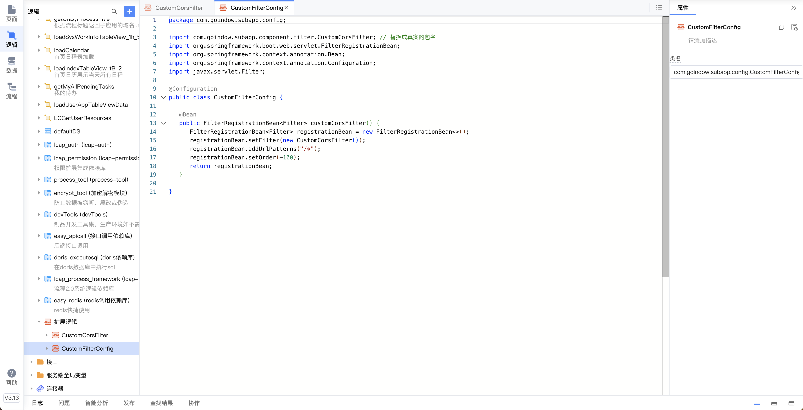


### 子应用 SDK 封装
> 在子应用的「**应用进入后**」事件中引入如下 js 块，完成子应用的改造

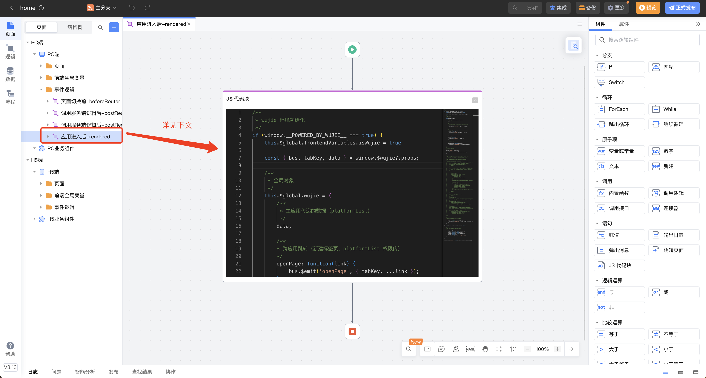
```javascript
/**
 * wujie 环境初始化
 */
if (window.__POWERED_BY_WUJIE__ === true) {
    this.$global.frontendVariables.isWujie = true
    
    const { bus, tabKey, data } = window.$wujie?.props;

    /**
     * 全局对象
     */
    this.$global.wujie = {
        /**
         * 主应用传递的数据（platformList）
         */
        data,

        /**
        * 跨应用跳转（新建标签页，platformList 权限内）
        */
        openPage: function(link) {
            bus.$emit('openPage', { tabKey, ...link });
        },

        /**
        * 跨应用跳转（新建标签页，platformList 权限外）
        */
        openURL: function(link) {
            bus.$emit('openURL', { tabKey, ...link });
        },

        /**
         * 子应用主动关闭（关闭标签页）
         */
        closeApp: function() {
            bus.$emit('closeApp', { tabKey });
        },

        /**
         * 子应用删除书签
         */
        removeBookmark: function(bookmark) {
            bus.$emit('removeBookmark', { tabKey, bookmark })
        }
    }

    /**
     * 主应用路径下发跳转
     */
    bus.$on("jumpTo", (event) => {
        if (tabKey == event.tabKey) {
            window.VueRouterInstance.push(event.path);
        }
    });

    /**
     * 子应用路由上报（主应用路由同步）
     */
    Promise.resolve().then(()=>{
        window.VueRouterInstance.afterEach((to) => {
            bus.$emit('routeReport', { tabKey, path: to.fullPath });
        });
    })

} else {
    this.$global.frontendVariables.isWujie = false;

    /**
     * 全局对象（非无界环境，降级兼容）
     */
    this.$global.wujie = {
        data: null,
        openPage: function() { this.degrade(); },
        openURL: function() { this.degrade(); },
        closeApp: function() { this.degrade(); },
        degrade: function() {
            console.log("非 wujie 环境，无法调用");
        }
    }

}

console.log("isWujie: " + this.$global.frontendVariables.isWujie);
```
子应用 SDK 供 3 个全局方法供子应用调用：
- **openPage( *{[platformKey], subAppKey, path, [tabName]}* )**，新建标签页打开链接（当前业务角色权限内）
- **openURL (*{url, [tabName], [platformKey], [subAppKey]}* )**，新建标签页打开链接（当前业务角色权限外）
- **closeApp()**，子应用主动关闭所在的标签页

调用如下方法，改造原有的页面跳转

```javascript
// platformList 权限内（当前业务角色，权限范围内）
this.$global.wujie.openPage({
    // 应用
    subAppKey: "sds",
    // 路径
    path: "/sds/dashboard/approveStuLeave?taskId=047cf3ff-4059-11f0-ae5e-ea0828c17195&dataId=140",
    // 标签名
    tabName: "审批",
});


// platformList 权限外（当前业务角色，权限范围外）
this.$global.wujie.openURL({
    /**
     * 页面展示的平台和应用，可选，如果不传页面将不展示选中的平台和应用列表，
     * URL 可以不归属相关的平台和应用，仅表示当前 URL 是从该平台和应用打开的。
     * 如下审批页是属于「智慧学工」的，表示该审批页由「工作台-首页」进入
     */
    // 从哪个平台打开
    platformKey: "gzt",
    // 从哪个应用打开
    subAppKey: "home",
    // URL
    url: "http://dev.sds.research.lcap.lowcode.hziee.cn/sds/dashboard/approveStuLeave?taskId=047cf3ff-4059-11f0-ae5e-ea0828c17195&dataId=140",
    // 标签名
    tabName: "审批",
});

// 子应用主动关闭（关闭当前标签页）
this.$global.wujie.closeApp();
```

提供 1 个事件供子应用监听：
- activateTab，Tab 激活事件（不包含首次打开，在每次 Tab 切换时触发），可以用来进行数据重载
```javascript
/**
 * 主应用激活标签事件监听
 */
const { bus, tabKey } = window.$wujie?.props;

bus.$on("activateTab", async (event) => {
    /**
     * 注意:
     *
     * event: { tabKey, path } 
     * 1. 由于应用多开，仅处理自己的 tab 激活事件，「tabKey == event.tabKey」
     * 2. 由于事件监听写在当前页的 created 里（推荐做法），所以不需要判断 path；
     *    若事件监听写在应用的 rendered 里（不要这样用），还需判断 path，
     *    如，工作台首页需要监听的话「"/home/dashboard/Index" == event.path」
     */
    if (tabKey == event.tabKey) {
        // 激活标签时，重载「我的待办」
        await this.reloadMyPendingTasks();
    }
});
```

## 踩过的一些坑
> 子应用单独打开没问题，集成到主应用后出现问题！
### 1、选项卡关闭某个标签页，其他标签页内容错乱
> 选项卡组件内部 BUG，标签页没有添加唯一标识，导致组件被复用，进而乱序
>
> **说明**：和 IDE 使用的前端资源包版本有关系，不一定会遇到

如遇此问题，可联系 CodeWave 官方客服替换前端资源包

### 2、上传组件报错跨域
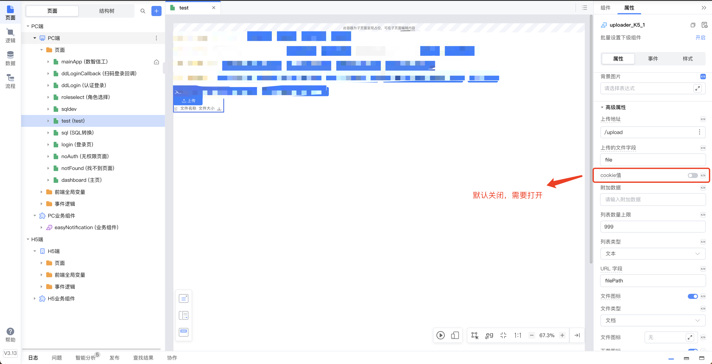

同时需配和跨域拦截器（见上文）

### 3、弹出悬浮类组件位置偏移
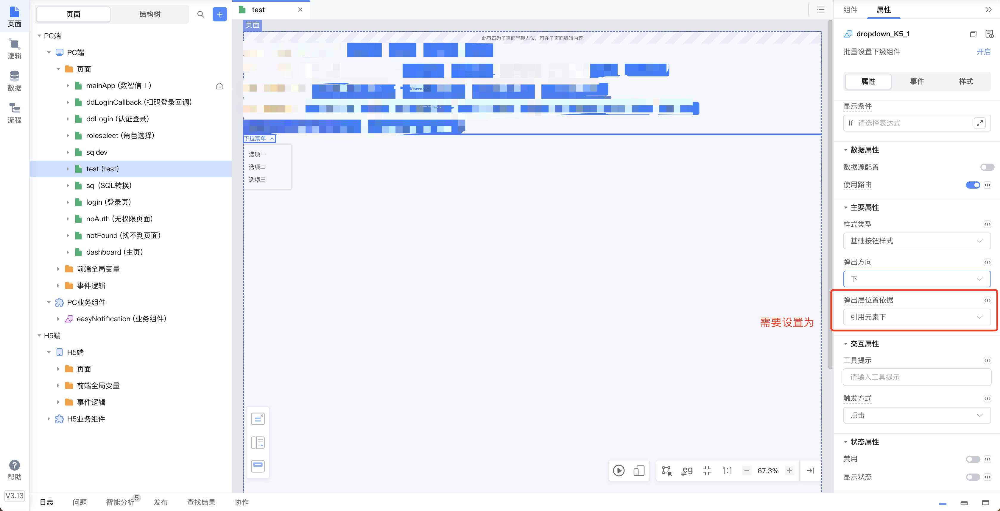

同时主应用 SDK 需要配置如下插件

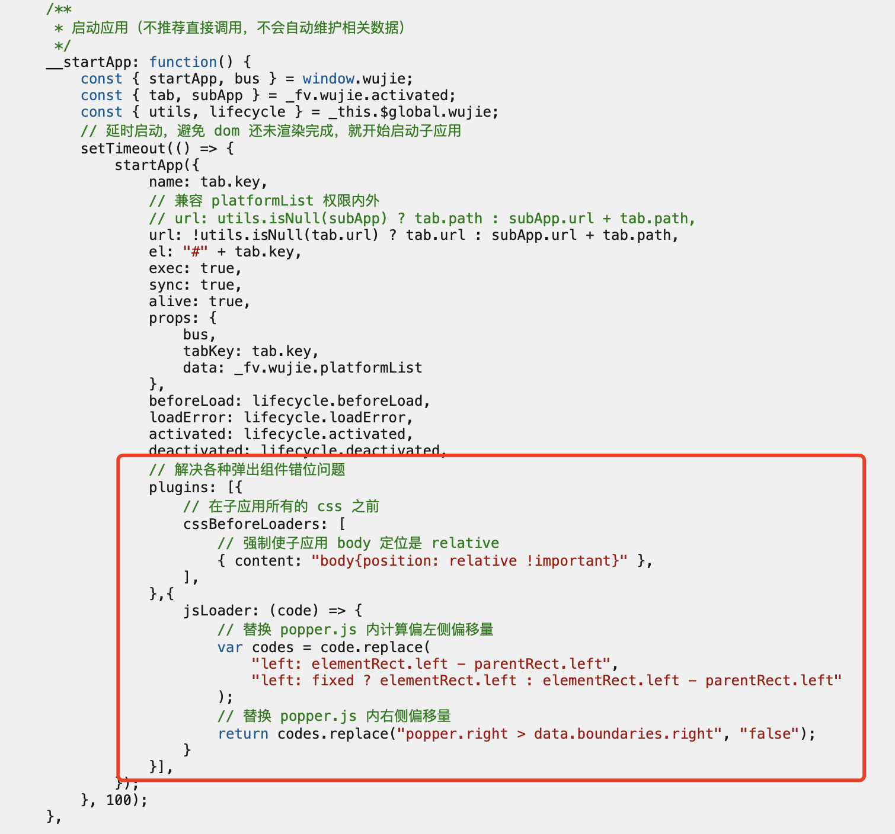
