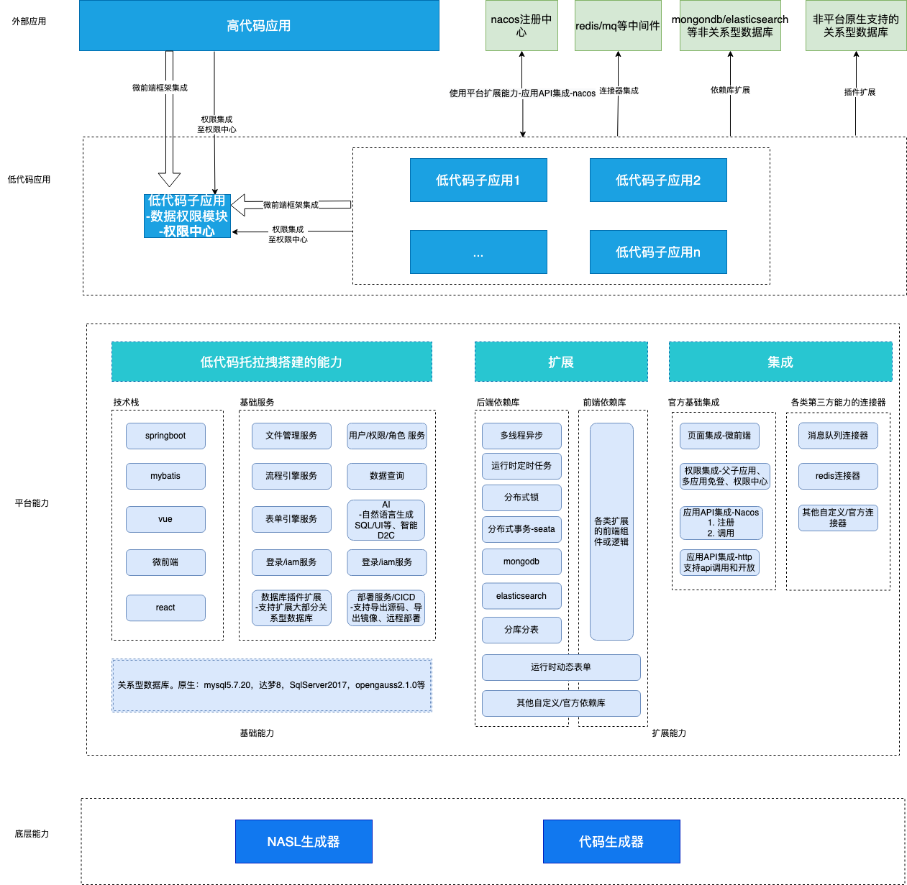
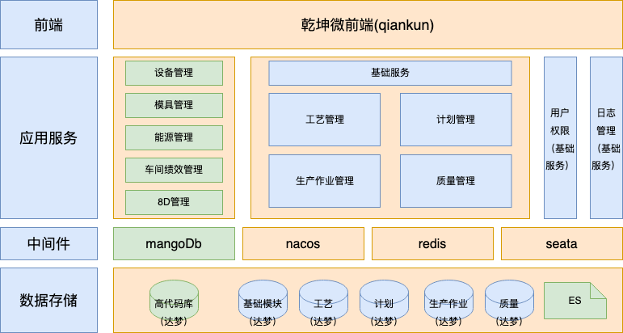
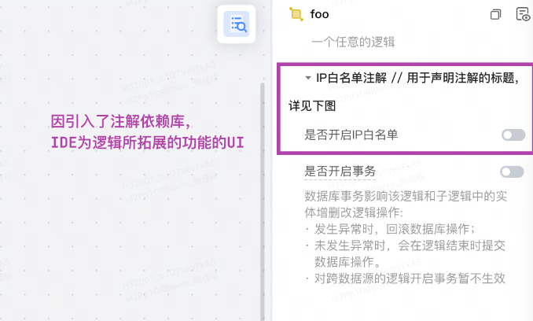
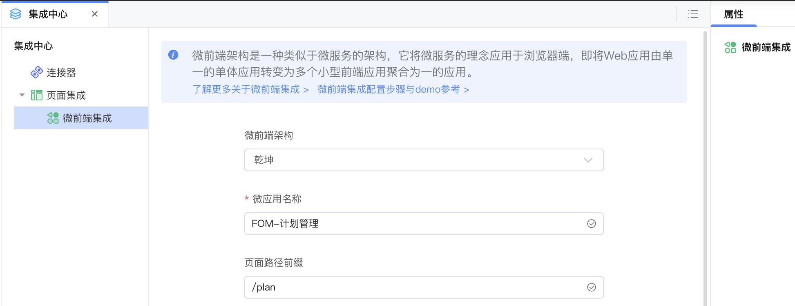
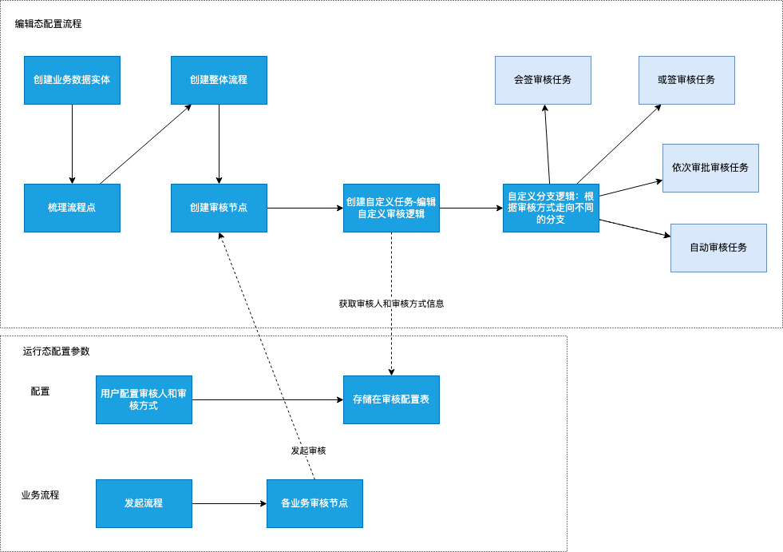
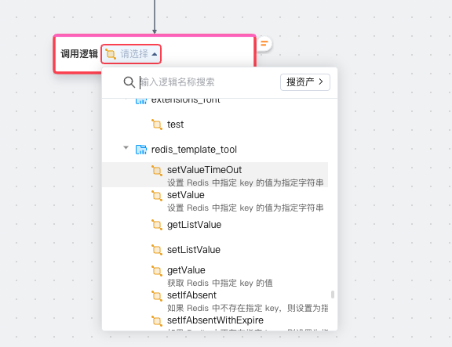

# 案例：大型MES系统
作者：鲍家珍

<video src="http://jdvodmrvvfqeg.vod.126.net/jdvodmrvvfqeg/269f517661a84e7d8dc0e2a7a350de77.mp4?wsSecret=117d78124926cf7712587e3ef1bc5349&wsTime=1756786543" controls="controls" style="max-width: 100%;">
</video>

> [代码范例](https://github.com/netease-lcap/codewave-architect-course/tree/main/example/big-app) 

## 一、系统总体设计
### 低代码平台技术架构

### FOM系统技术架构图


- 信创支持：应用支持达梦V8、麒麟V10等信创环境。
- es：存储系统日志，高、低代码均可通过切面方式记录日志，统一在基础服务模块查询。
- mangoDb：设备、能源模块做数据采集存储。
- nacos：微服务注册中心，低代码应用可通过连接器完成服务注册和调用，作为内部服务之间调用组件。
- redis：各个模块存储缓存、实现分布式锁，低代码应用可通过连接器对接。
- seata：处理分布式事务，低代码应用可通过依赖库完成事务处理。
- qiankun：微前端框架，各个应用模块通过微前端组合成一个统一的用户界面。
## 二、应用拆分和整合设计
### 后端服务拆分
低代码需求部分将拆分为基础管理服务、工艺管理服务、计划管理服务、生产作业管理服务、质量管理服务5个子应用，每个应用使用独立的数据库，每个应用均可导出源码或镜像独立部署。各个应用服务支持可插拔组成不同的场景解决方案。
#### 应用之间服务调用
应用通过逻辑开放为接口，通过连接器注册到Nacos注册中心的方式，完成应用与应用之间的服务调用。这种方式可以使逻辑更易于重用，提高了系统的灵活性和可维护性。
#### 统一用户和权限
基础管理服务提供统一的用户和权限管理服务，其他应用通过nacos调用。
#### 统一日志管理
日志统一存储在elasticsearch库中。存储的日志类型分别为调用外部接口日志、操作日志和访问日志。

使用低代码CodeWave AOP机制实现切面。CodeWave  AOP机制落地形式是后端依赖库提供注解+切面，可以在不需要对平台本身进行迭代的情况下，为任意逻辑Logic和实体Entity拓展任意功能。

CodeWave AOP定义逻辑/实体的切面开关，再针对切面定制切面逻辑。 在低代码编辑态时，低代码开发者为需要开启切面拦截的逻辑打开开关，并且可以配置逻辑自定义描述参数。切面开关开启时，调用该逻辑/实体操作时，自动执行切面定制逻辑。

定义复写逻辑，并且在切面的定制逻辑调用中复写逻辑。复写逻辑由CodeWave低代码在IDE工作台中实现。用户可自由使用低代码搭建es操作的逻辑。

- 访问日志场景：针对访问场景的逻辑打开开关。
- 操作日志场景：针对操作的逻辑打开开关。
- 调用外部接口日志场景：调用es依赖库保存接口，主动保存日志。
### 微前端整合
微前端是一种架构风格，目标是将前端应用程序拆分成多个更小的、独立的部分，这些部分可以由不同的团队开发和部署，同时还可以组合成一个完整的前端应用程序。本次项目选型qiankun框架。

#### 基础服务作为微前端主应用
基础服务包含菜单管理、权限管理等模块，适合作为主应用。
CodeWave暂不支持应用发布为主应用，需导出源码后修改，独立部署的方式运行。

#### 低代码子应用微前端集成
平台支持通过配置的方式完成


#### 高代码微前端集成
1. 老系统需要完成页面集成微前端； 
2. 免登、权限接入改造。

## 三、系统集成和接口设计
### 低代码API管理中心
CodeWave开发平台提供统一的API管理中心，开发者可在平台通过页面配置的方式完成接口集成开发。开发好的接口可作为平台资产，供其他开发者直接复用。
#### 调用外部接口
根据FOM系统集成对接要求，可按系统建立SAP系统、SCM系统等分组，在分组内配置维护对应的接口。 根据接口对接协议，RESTful API 方式的接口可直接在页面完成接口地址、鉴权、请求信息、响应信息等配置。

#### 对外提供接口
应用内通过编写逻辑，将逻辑发布为接口。对外发布的接口也将进入API管理中心，外部系统可根据暴露的接口地址直接访问。

## 四、其他核心功能设计
### 业务自定义流程方案
平台支持可视化的流程设计，开发者可将流程组件拖拽到画布上，设计各流程组件之间的逻辑顺序，完成流程编写。常用于项目中需要管理或审批的场景。支持将业务数据带入流程，并且可以在审批过程中查询或修改业务数据。
#### 自定义运行时调整流程

#### 客户场景
1. 运行时配置审批人和审批方式——上图方式获取运行时数据，使用分支逻辑决定走向。
2. 运行时配置下一个节点——上图方式获取运行时数据，使用分支逻辑决定走向。
3. 节点可撤销——创建一个副本，重新发起流程，针对修改了下发人等信息并打开开关的节点，重新执行流程。
4. 流程可查当前状态——原生能力
### 分布式事务
与前面的日志管理一样，分布式事务的实现可以使用低代码AOP机制。 
1. 定义分布式事务依赖库的开关 
2. 为需要开启分布式事务的逻辑，打开此开关 
3. 在分布式事务依赖库中，对拦截到的逻辑，实现seata的分布式事务
### 分布式锁
实际场景：XX业务时，需要根据流水号获取锁。5s内获取不到锁即抛出异常，5s内获取锁则继续执行流程。
   
处理方式：redis依赖库封装逻辑，传入时间t和锁key，在t内获取锁则返回true，未获取则返回false。在低代码可视化开发工作台使用调用逻辑组件，选择redis依赖库中的逻辑即可。

redis依赖库逻辑如下（大概版本）：
```java
String lockKey = "lock:" + sku;
boolean acquiredLock = false;
// 设置锁的超时时间
long timeoutMillis = 5 * 1000; // 5s
long startTime = System.currentTimeMillis();
while (!acquiredLock && (System.currentTimeMillis() - startTime) < timeoutMillis) {
// 尝试获取锁，如果锁已经存在，说明有其他线程正在执行相关操作
Boolean locked = redisTemplate.opsForValue().setIfAbsent(lockKey, "locked");
if (locked != null && locked) {
acquiredLock = true;
// 设置锁的过期时间，防止锁被一直占用
redisTemplate.expire(lockKey, 10, TimeUnit.SECONDS);
} else {
Thread.sleep(100); // 可能需要根据实际情况调整等待时间
}
}
return acquiredLock;
```
### 文档在线预览/编辑
#### 方案一：仅支持预览，不支持编辑
官方扩展方式在线预览和查看各种文档格式（如PDF、Word、Excel等）的内容，操作文档见：
https://community.codewave.163.com/CommunityParent/CodeWareMarketLibraryDetail?id=2746571021661696&isLatest=false&isClassics=false
tips：ppt预览需要80端口通外网
#### 方案二：接入kkFileViewOfficeEdit
https://gitee.com/253281376/kkFileViewOfficeEdit
在低代码制品中，用iframe组件外挂kkFileViewOfficeEdit的预览url或编辑url。

## 五、数据结构设计
沿用高代码实现的数据库设计

## 六、部署架构
导出jar包部署。

