# 微前端
作者： 许冠杰

> [示例模版](https://github.com/netease-lcap/codewave-architect-course/tree/main/example/qiankun)

## 1\. 概念介绍

微前端（Micro Frontends）这个概念来源于ThoughtWorks公司的技术雷达报告。微前端将一个大型、复杂的前端应用拆分成多个独立的子应用，但又保持用户体验的一致性。每个子应用可由独立的团队进行开发，并允许使用不同的技术栈进行开发，也可独立测试和部署。这样可以提高开发速度、降低维护成本，并促进团队之间的协作。

## 2\. 微前端集成的优势

1. 模块化开发：微前端将前端应用拆分为小的独立模块，使得应用更易于开发、维护和扩展。

2. 独立部署：每个微前端应用都可以独立部署，使得应用的上线和更新更加灵活和快速。

3. 技术栈多样化：不同的微前端应用可以使用不同的技术栈，使得团队可以选择最适合自己的技术栈来开发应用。

4. 提高团队协作效率：微前端应用可以由不同的团队开发和维护，使得团队之间的协作更加高效。

5. 提高开发体验：应用模块之间相互独立，开发者只关心自己的代码。

CodeWave平台搭建的应用可以做为子应用，集成到其它主应用。CodeWave平台提供了集成配置页面。简单配置后，CodeWave平台会根据选择的微前端框架在生成的代码中加入对应的集成代码。

## 3.什么情况下考虑使用微前端

如果你的应用符合以下至少 1 条，可考虑微前端：

1. 应用规模大到单应用难以维护，迭代效率低；

2. 需要整合旧系统，且重构成本过高；

3. 多团队协作，技术栈 / 规范无法统一；

4. 不同模块迭代节奏差异大，需要独立发布；

5. CodeWave搭建的应用，nasl节点过大，打开编辑器慢。

反之，若应用简单、无历史包袱，则优先选择单应用架构，避免引入微前端的额外复杂度。

## 4.使用场景

主要分以下2中场景

- 场景一：高码主应用 + CodeWave子应用（可选） + 高码子应用（可选）

- 场景二：CodeVave 主应用 + CodeVave子应用（可选） + 高码子应用（可选）

### 场景一

#### 搭建CodeWave子应用

1. 新建页面并自定义页面名称，例如将页面命名为about，在about页面下完成页面搭建。当前页面即为子应用的about页面。这里需要注意的是，页面权限应该交给主应用，子应用关注资源权限即可。

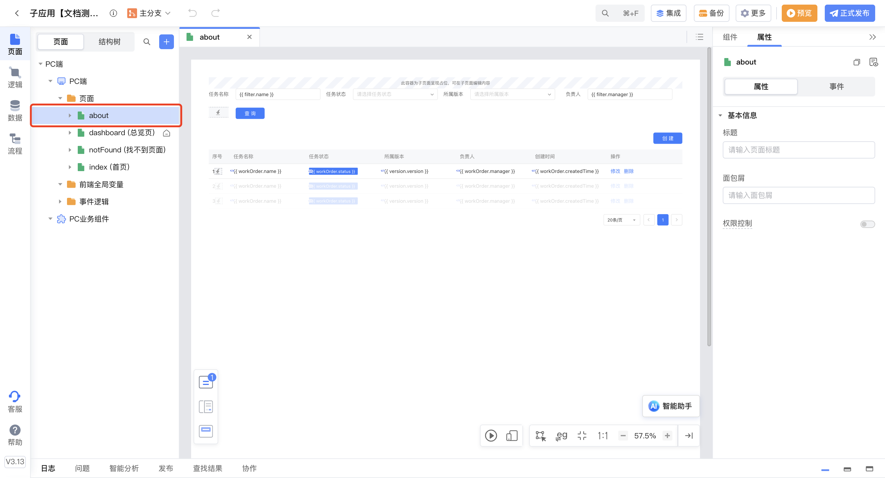

2. 点击IDE顶部的“集成”按钮，打开微前端集成配置页面，参数修改后需要CodeWave应用发布后才会生效。

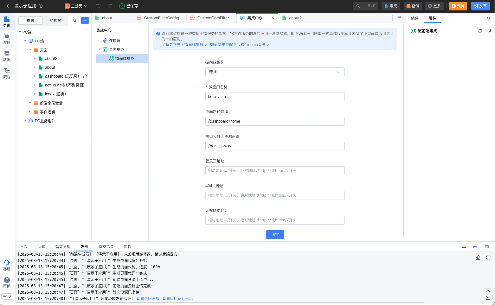

选择使用的微前端框架之后，CodeWave平台生成应用代码时会添加微前端框架相关的代码和配置。当CodeWave应用作为微应用被集成到其它主应用内部时，会根据这些配置对CodeWave应用做调整。当然，如果集成了微前端框架，但是直接访问CodeWave应用时，这些配置是不会生效的。

上图中配置的微应用名称’“bata-auth” ，页面前缀路径"/dashboard/home"，接口和静态资源前缀"/home\_proxy"。

### 场景二

在微前端集成的相关介绍中，我们不难发现，CodeWave应用既能够充当微应用，也可以作为主应用。在文档CodeWave作为子应用的微前端集成和CodeWave作为主应用的微前端集成(乾坤qiankun)的阐述中，平台已经分别介绍了CodeWave应用作为子应用以及作为主应用的具体操作步骤，并提供了传统代码开发应用Demo展示了集成效果。

#### 搭建CodeWave主应用

进入CodeWave智能开发平台，创建3.13以及之后版本的应用进行开发。

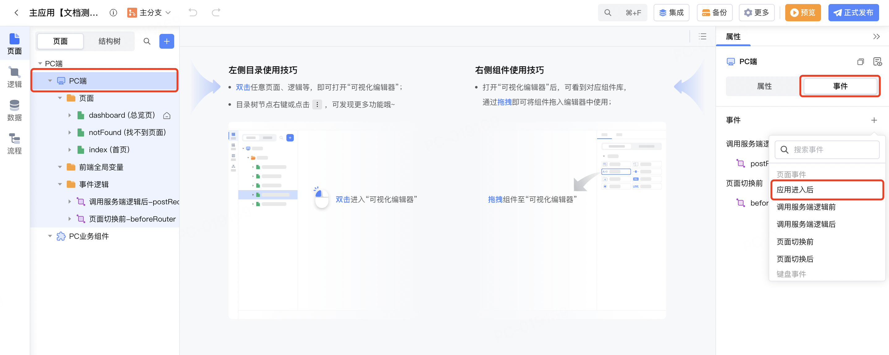

#### 引入乾坤sdk

应用进入时代码如下：

``` js
// 注册加载script标签函数 
function loadScript(src) { 
    const script = document.createElement('script'); 
    script.src = src; 
    const res = new Promise((res, rej) => { 
        script.onload = res; 
        script.onerror = rej; 
    }); 
    document.head.appendChild(script); 
    return res; 
} 
// 使用乾坤框架相关的配置 
const src = 'https://unpkg.com/qiankun@2.10.8/dist/index.umd.min.js'; 
await loadScript(src); const { registerMicroApps, start } = window.qiankun; // 注册微服务，微服务为子应用的地址 
registerMicroApps( 
    [ 
        { 
            name: 'beta-auth', 
            entry: '//dev.zyy.cwasset.lcap.163yun.com', 
            container: '#qiankun', 
            activeRule: '/dashboard/home', 
        }, 
    ],{ 
    beforeLoad: (app) =>{console.log('before load', app.name)}, 
    beforeMount: (app) =>{console.log('before mount', app.name)},  
    beforeUnmount: (app) => console.log('before beforeUnmount', app.name), 
    afterUnmount: (app) => console.log('after beforeUnmount', app.name), 
} 
); start({ 
    sandbox: true, 
});
```
##### registerMicroApps方法下微应用包含的配置信息如下：

- name：微应用的名称。用于在主应用中标识该微应用，对应上文集成微前端时配置的“微应用名称”。

- entry：微应用的入口地址。主应用会通过这个地址加载微应用的资源，对应子应用的访问地址。子应用的访问地址即上文发布子应用后获取的应用地址的相对路径。

- container：微应用挂载的容器。主应用会将微应用渲染到这个 DOM 节点中，自定义命名，例如qiankun。容器名称需要与下文添加微应用容器时锚点组件的组件名称和标识保持一致。

- activeRule：激活规则。当主应用的路由匹配到该规则时，会加载并渲染对应的微应用，对应上文集成微前端时配置的“页面路径前缀”，也可以使用更复杂的匹配规则。

#### 添加主应用容器

dashborad页面下新建一个home页面中，在home页面中拖拽放置一个锚点组件，并把锚点组件的组件名称和标识改为“qiankun”，即对应注册微应用时registerMicroApps方法下的微应用挂载的容器container。该锚点组件即作为微应用的放置容器。

·

#### 添加子应用路由

主应用需要创建一个与子应用页面对应的路由，例如，子应用有一个“/about”页面，那么主应用需要在页面前端路径对应的home页面下再创建一个名为about的子页面。为了达到更好的切换效果，我们新建2个页面。

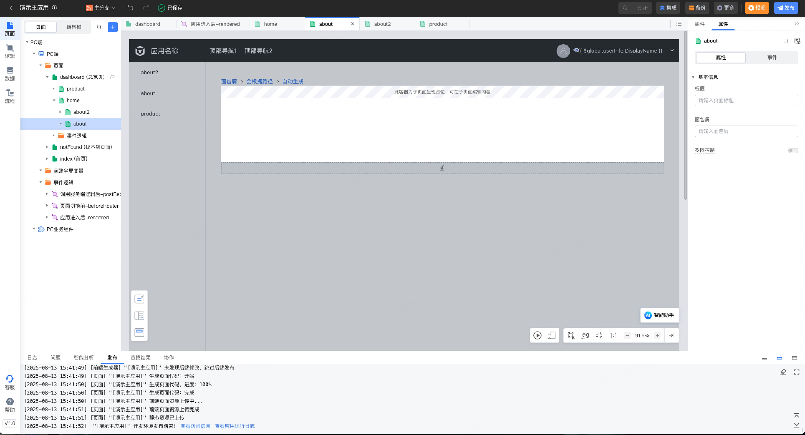

由于home页面需要添加子页面about，因此页面中的“子页面容器”组件不可删除，但about页面显示的内容为子应用，“子页面容器”没有实际作用，将其显示条件设为false。为什么一定要设置成false呢。因为这个容器的class设置了高度。

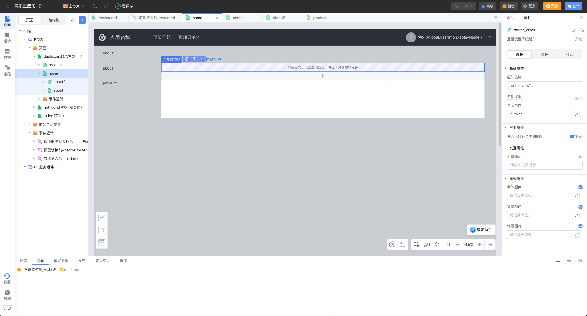

#### 搭建CodeWave子应用

搭建子应用的方式没有变化，请参考场景一的搭建CodeWave自应用。

💡

你以为到这里就结束了吗？其他这才刚刚开始！

## 5.微前端的核心

PlantUML

模板

视图

@startmindmap 
* 微前端的核心 
** 模块页面集成 
** 接口及资源代理 
** 模块通讯 
** 权限集成 
@endmindmap 


## 6.解决资源跨域

### 开启扩展逻辑及按需生成接口

在子应用中设置如下，

在“更多->系统偏好设置”中打开使用扩展逻辑和按需生成接口。

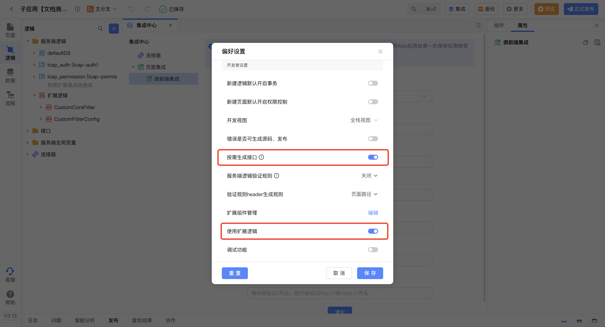

1. 新建两个扩展逻辑

例如CustomCorsFilter和CustomFilterConfig。注意替换逻辑中真实的包名和类名。

- CustomCorsFilter

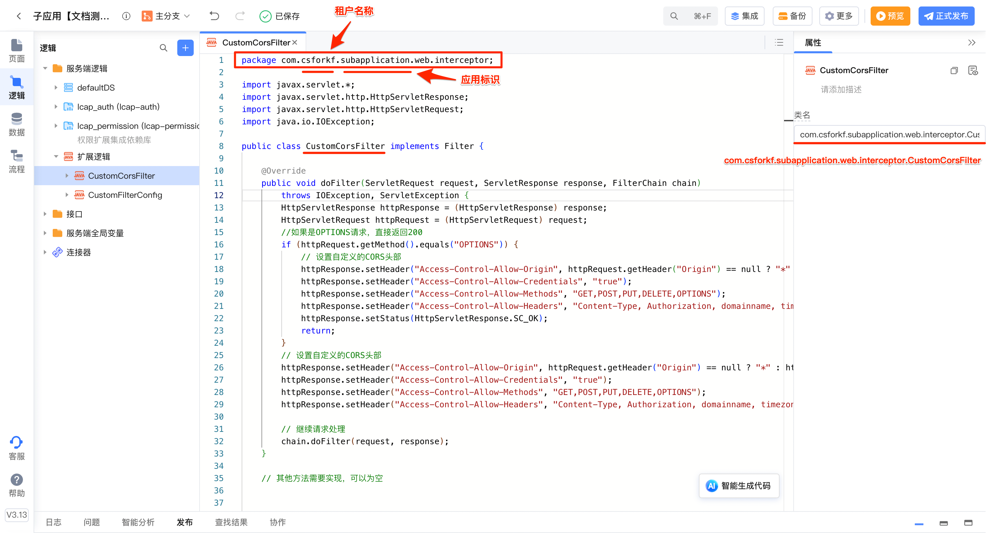

``` js
//  
package com.csforkf.subapplication.web.interceptor; import javax.servlet.*; 
import javax.servlet.http.HttpServletResponse; 
import javax.servlet.http.HttpServletRequest; 
import java.io.IOException; public class CustomCorsFilter implements Filter { 
    @Override 
    public void doFilter(ServletRequest request, ServletResponse response, FilterChain chain) 
        throws IOException, ServletException { 
        HttpServletResponse httpResponse = (HttpServletResponse) response; 
        HttpServletRequest httpRequest = (HttpServletRequest) request; 
        //如果是OPTIONS请求，直接返回200 
        if (httpRequest.getMethod().equals("OPTIONS")) { 
            // 设置自定义的CORS头部 
            httpResponse.setHeader("Access-Control-Allow-Origin", httpRequest.getHeader("Origin") == null ? "*" : httpRequest.getHeader("Origin")); 
            httpResponse.setHeader("Access-Control-Allow-Credentials", "true"); 
            httpResponse.setHeader("Access-Control-Allow-Methods", "GET,POST,PUT,DELETE,OPTIONS"); 
            httpResponse.setHeader("Access-Control-Allow-Headers", "Content-Type, Authorization, domainname, timezone, lcap-frontend, lcap-calllogic-uuid, env"); 
            httpResponse.setStatus(HttpServletResponse.SC_OK); 
            return; 
        } 
        // 设置自定义的CORS头部 
        httpResponse.setHeader("Access-Control-Allow-Origin", httpRequest.getHeader("Origin") == null ? "*" : httpRequest.getHeader("Origin")); 
        httpResponse.setHeader("Access-Control-Allow-Credentials", "true"); 
        httpResponse.setHeader("Access-Control-Allow-Methods", "GET,POST,PUT,DELETE,OPTIONS"); 
        httpResponse.setHeader("Access-Control-Allow-Headers", "Content-Type, Authorization, domainname, timezone, lcap-frontend, lcap-calllogic-uuid, env"); 
        // 继续请求处理 
        chain.doFilter(request, response); 
    }     
}
```

- CustomFilterConfig

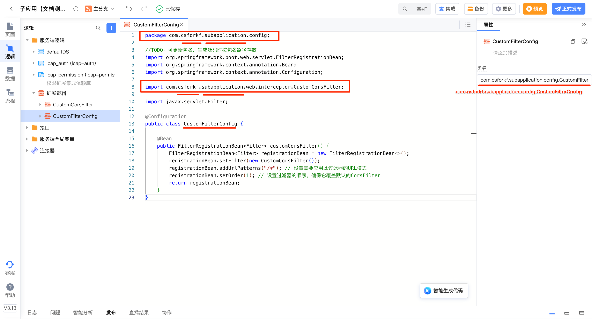

``` java
package com.csforkf.subapplication.config; import com.csforkf.subapplication.web.interceptor.CustomCorsFilter; 
import org.springframework.boot.web.servlet.FilterRegistrationBean; 
import org.springframework.context.annotation.Bean; 
import org.springframework.context.annotation.Configuration; 
import javax.servlet.Filter; @Configuration 
public class CustomFilterConfig { 
    @Bean 
    public FilterRegistrationBean<Filter> customCorsFilter() { 
        FilterRegistrationBean<Filter> registrationBean = new FilterRegistrationBean<>(); 
        registrationBean.setFilter(new CustomCorsFilter()); 
        registrationBean.addUrlPatterns("/*"); // 设置需要应用此过滤器的URL模式 
        registrationBean.setOrder(1); // 设置过滤器的顺序，确保它覆盖默认的CorsFilter 
        return registrationBean; 
    } 
}
```

完成以上步骤，恭喜你可以发布应用，查看集成效果了。

### 效果展示

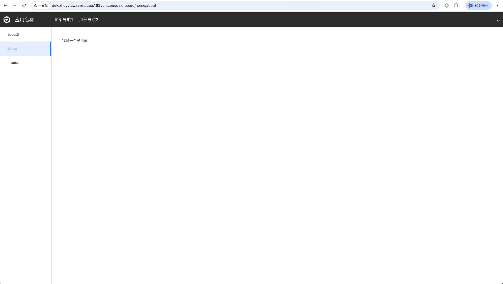

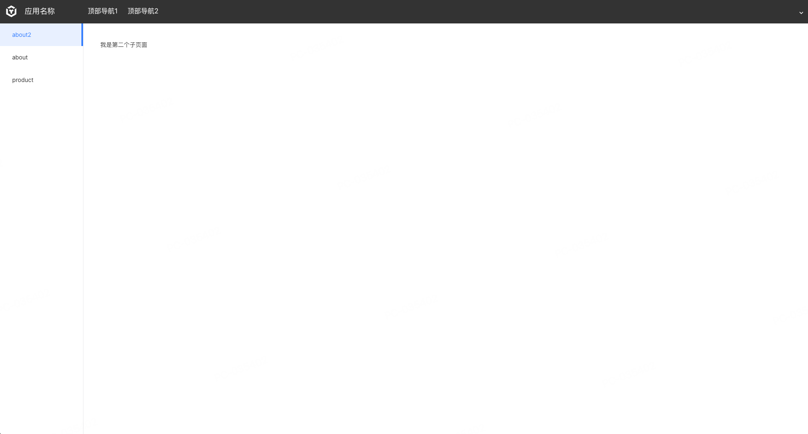

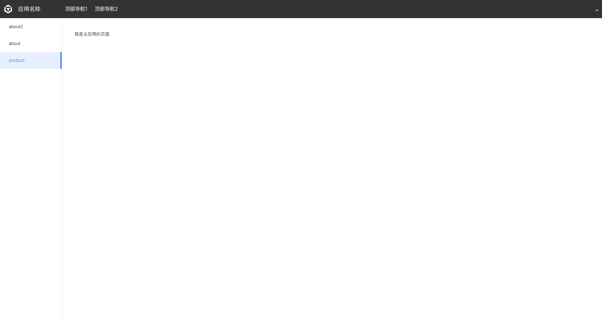

## 7.接口转发

### 子应用集成内容


### 转发规则

在主应用下面配置ingress转发规则,简单可以理解成

💡

访问主应用下的子应用集成的接口转发到子应用下的域名

/home\_proxy ->[http://dev.zi2.cwasset.lcap.163yun.com/](http://dev.zi2.cwasset.lcap.163yun.com/)

💡

操作需谨慎，让专门的运维来操作！

## 8.模块之间的通讯

因为vue本就是一个事件总线，因此我们可以取巧一下。

### 子应用通知主应用

#### 主应用修改应用进入时代码块

``` JavaScript
// 注册加载script标签函数 
function loadScript(src) { 
    const script = document.createElement('script'); 
    script.src = src; 
    const res = new Promise((res, rej) => { 
        script.onload = res; 
        script.onerror = rej; 
    }); 
    document.head.appendChild(script); 
    return res; 
} 
// 使用乾坤框架相关的配置 
const src = 'https://unpkg.com/qiankun@2.10.8/dist/index.umd.min.js'; 
await loadScript(src); 
const { registerMicroApps, start } = window.qiankun; const eventBus = new window.Vue() 
Vue.prototype.$EventBus = eventBus  // 我订阅一下，home-load事件 
eventBus.$on("home-load",(data)=>{ 
    console.log('主应用的收到：',data) 
}) // 注册微服务，微服务为子应用的地址 
registerMicroApps( 
    [ 
        { 
            name: 'beta-auth', 
            entry: '//dev.zyy.cwasset.lcap.163yun.com', 
            container: '#qiankun', 
            activeRule: '/dashboard/home', 
            props: { $eventBus: eventBus }, // 将事件中心传递给应用 
        }, 
    ],{ 
    beforeLoad: (app) =>{ 
        console.log('before load', app.name) 
    }, 
    beforeMount: (app) =>{ 
        console.log('before mount', app.name) 
    },  
    beforeUnmount: (app) => console.log('before beforeUnmount', app.name), 
    afterUnmount: (app) => console.log('after beforeUnmount', app.name), 
} 
); start({ 
    sandbox: true, 
});
```
#### 子应用应用进入时增加代码块

```JavaScript
window.$eventBus = window?.LcapMicro?.props?.$eventBus 
if(window.$eventBus){ 
    window.$eventBus.$emit("home-load",'我来了') 
}
```
#### 子应用的页面进入时增加

``` js
window.$eventBus.$emit("home-load",'我来到了about页面')
```
#### 展示效果


### 主应用通知子应用

#### 主应用任意按钮增加

```JavaScript
this.$eventBus.$emit("home-title-edit","你好呀！")
```
#### 子应用about页面页面进入时修改代码块，同时增加一个绑定title变量的文本

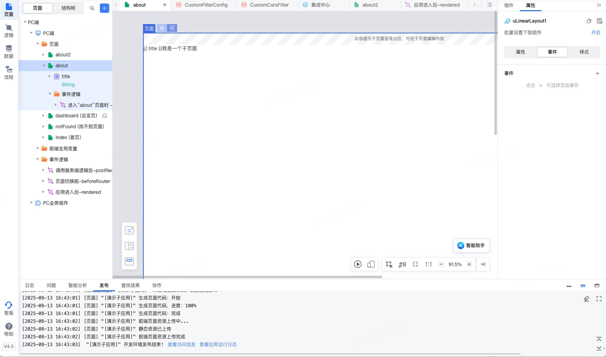

```JavaScript
window.$eventBus.$emit("home-load",'我来到了about页面') window.$eventBus.$on("home-title-edit",(data)=>{ 
    this.title = data 
})
```
#### 展示效果

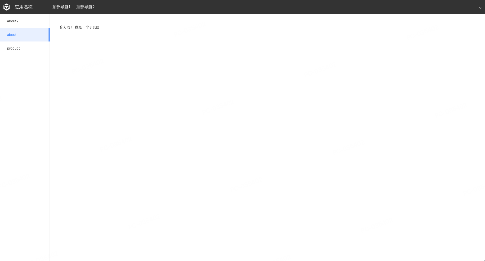

# 经典案例

## 案例一

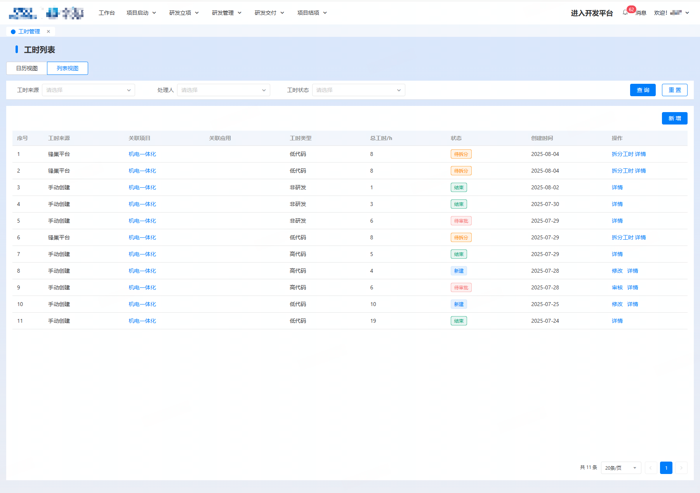

## 案例二

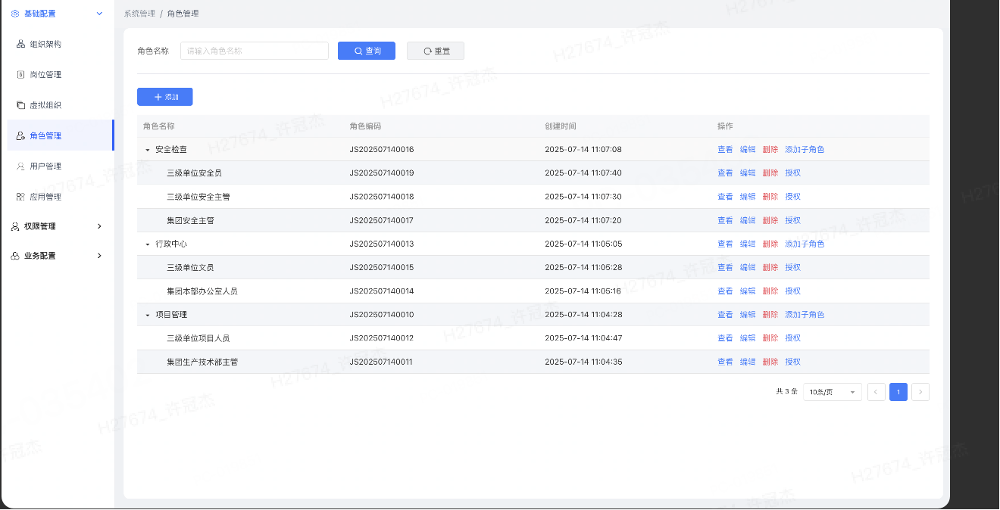

## 案例三

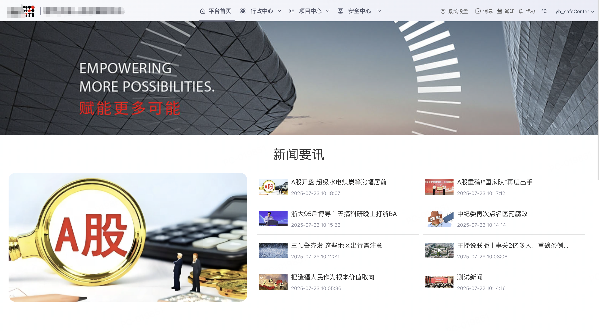