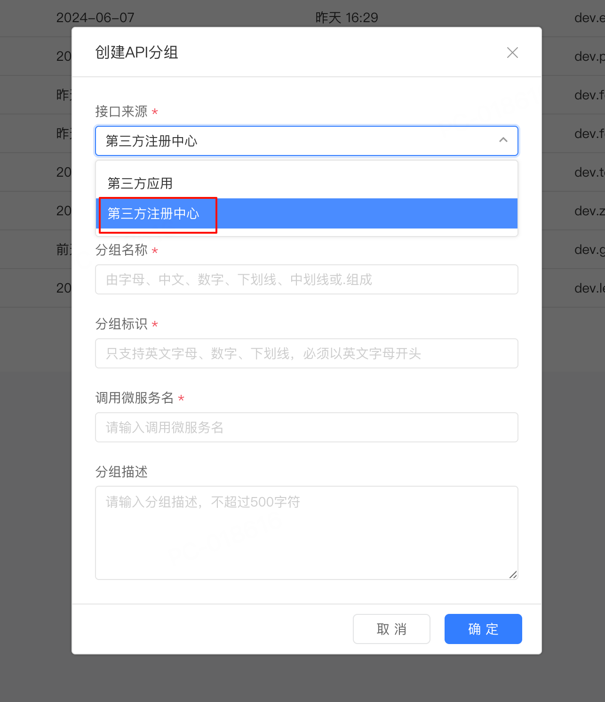
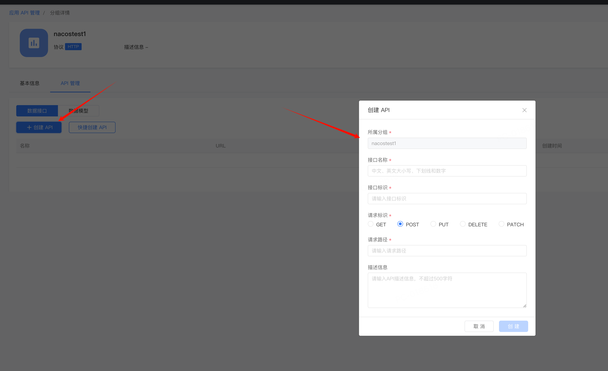
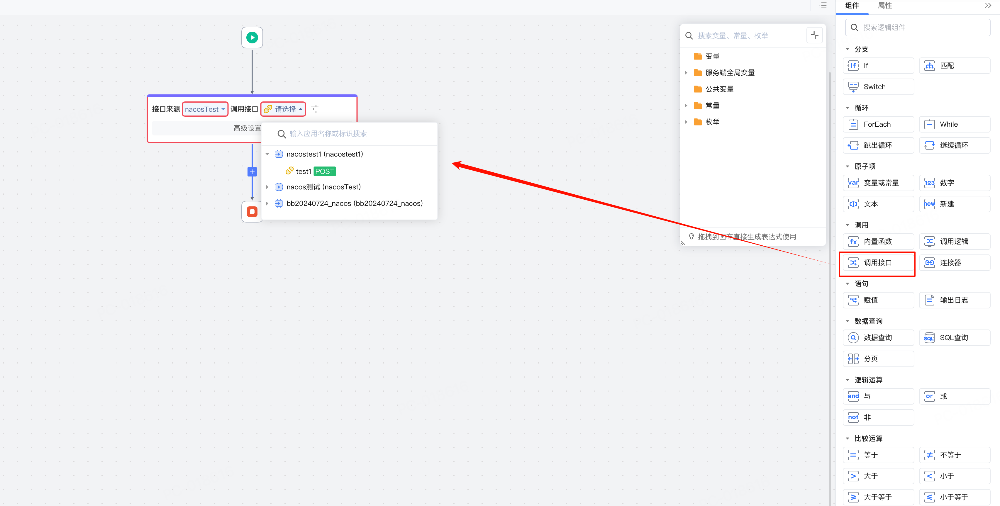
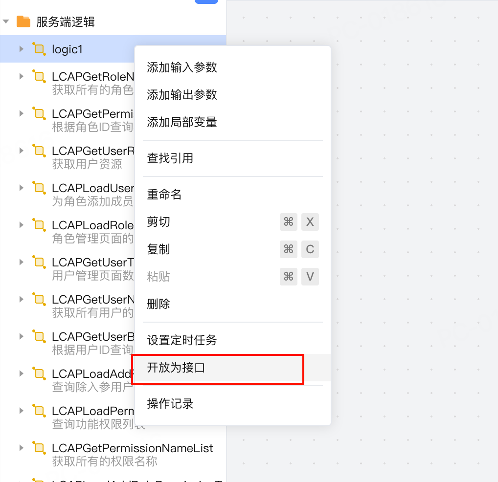
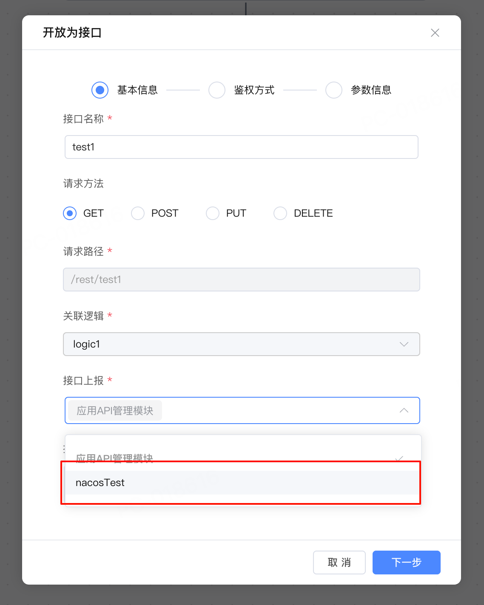

# 微服务架构对接

CodeWave平台3.9版本开始支持制品应用对接已有的微服务架构，实现服务发现与服务注册，在CodeWave应用中可调用微服务接口，应用开放的接口也可以自动上报到注册中心，方便其他服务调用。

对接微服务需要依赖微服务连接器，下面将介绍如何使用微服务连接器将CodeWave应用融入现有微服务架构中。

## CodeWave应用调用其他微服务接口

1. 在IDE中点击集成-导入连接器按钮打开连接器导入页面，并导入微服务连接器（如Nacos连接器）

2. 导入后点击添加并在弹出页面输入连接信息。

3. 在集成中心->应用API管理中添加API分组并录入调用接口的具体信息。

4. 在逻辑中使用“调用接口”即可调用配置好的微服务接口

## 其他微服务调用CodeWave应用接口

配置了微服务连接器后，将逻辑导出为接口，并在“接口上报”选项中选择配置的微服务连接。服务启动时会自动连接并上报接口，其他微服务即可进行调用。

