# 微服务架构对接

CodeWave平台3.9版本开始支持制品应用对接已有的微服务架构，实现服务发现与服务注册，在CodeWave应用中可调用微服务接口，应用开放的接口也可以自动上报到注册中心，方便其他服务调用。

对接微服务需要依赖微服务连接器，下面将使用Nacos连接器为例介绍如何使用微服务连接器将CodeWave应用融入现有微服务架构中。


## 准备

### 部署Nacos

要求可以被需要注册到Nacos的应用访问，如暴露在公网（不推荐）或在同一内网中。可参考[Nacos官方文档](https://nacos.io/docs/latest/quickstart/quick-start/)进行部署，如使用Docker部署一个单机Nacos（仅供测试使用，来自官方教程）：
```shell
docker run --name nacos-standalone-derby \
    -e MODE=standalone \
    -e NACOS_AUTH_TOKEN=${your_nacos_auth_secret_token} \
    -e NACOS_AUTH_IDENTITY_KEY=${your_nacos_server_identity_key} \
    -e NACOS_AUTH_IDENTITY_VALUE=${your_nacos_server_identity_value} \
    -p 8080:8080 \
    -p 8848:8848 \
    -p 9848:9848 \
    -d nacos/nacos-server:latest
```
### 部署高码微服务应用

如需测试CodeWave应用与其他微服务之间的调用，还需要编写并部署一个web服务并注册到Nacos。这里提供一个简单的[Spring Boot应用](assets/nacos-test.zip)用于演示。由于CodeWave应用Nacos连接器时上报的地址为Pod的IP，因此想要部署的微服务应用调用CodeWave应用，需要将其部署在同一集群内。如只需CodeWave应用调用其他微服务应用，则无同一集群要求，网络能访问即可（如暴露在公网）。

如使用示例代码，需要修改配置文件`application.properties`

```properties
spring.application.name=nacos-test

server.port=8081

# 修改为部署的Nacos地址
spring.cloud.nacos.discovery.server-addr=127.0.0.1:8848
# 如果部署该应用的机器有多个ip，需要指定注册ip
#spring.cloud.nacos.discovery.ip=127.0.0.1 

# 修改为需要调用的微服务名（如CodeWave应用名）
nacos.feign.name=nacos-test
```

## CodeWave应用调用其他微服务接口

1. 在IDE中点击集成-导入连接器按钮打开连接器导入页面，并导入微服务连接器（如Nacos连接器）。
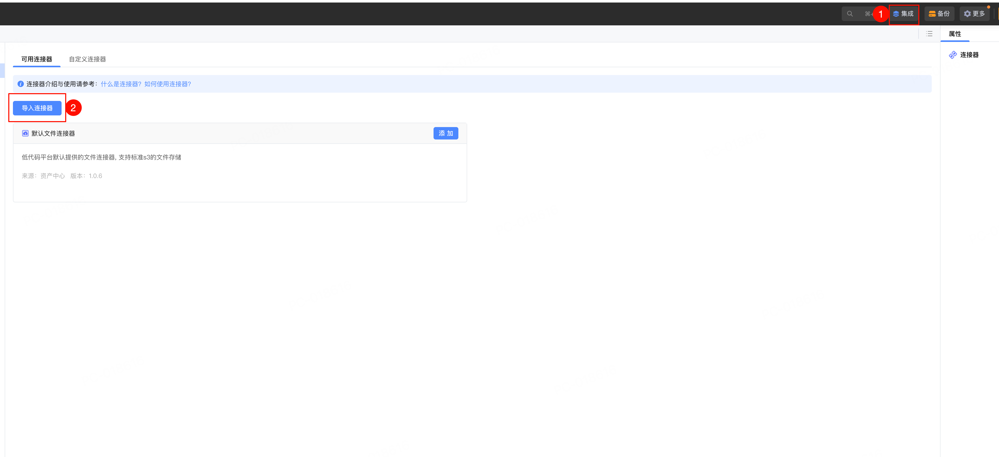
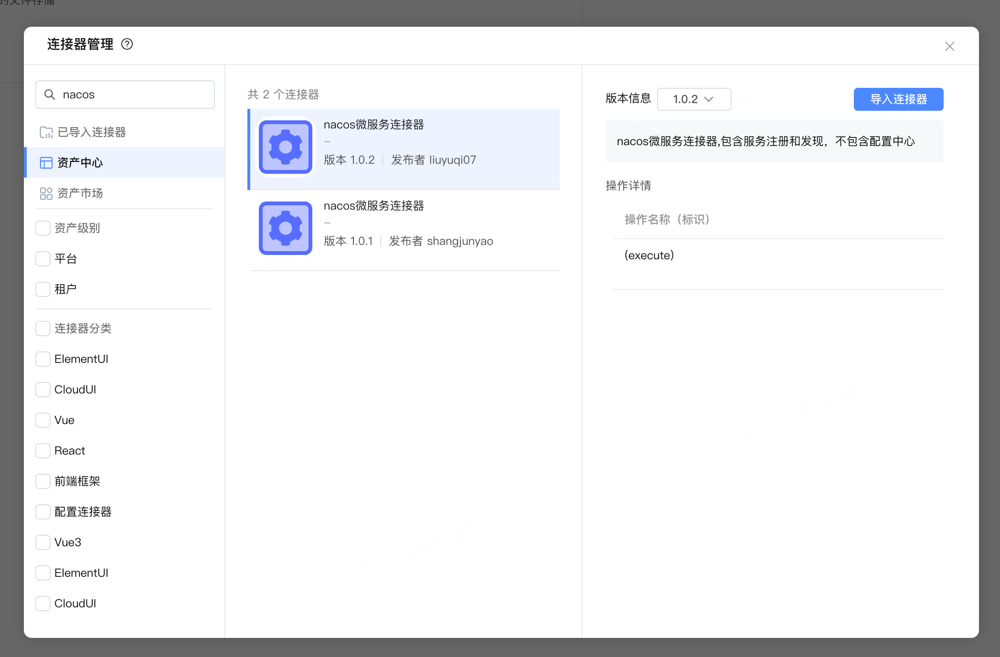
2. 导入后点击添加并在弹出页面输入连接信息（即上面部署的Nacos）。
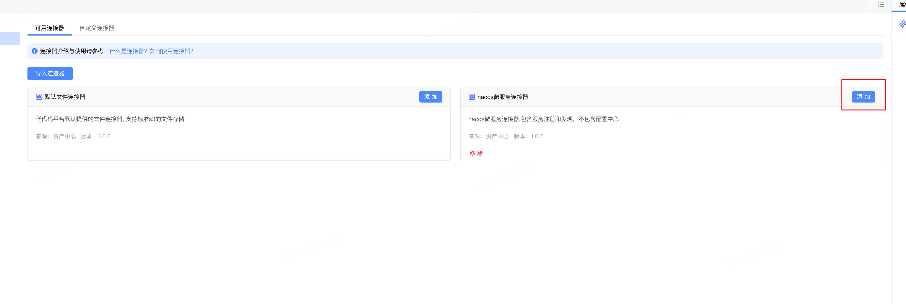
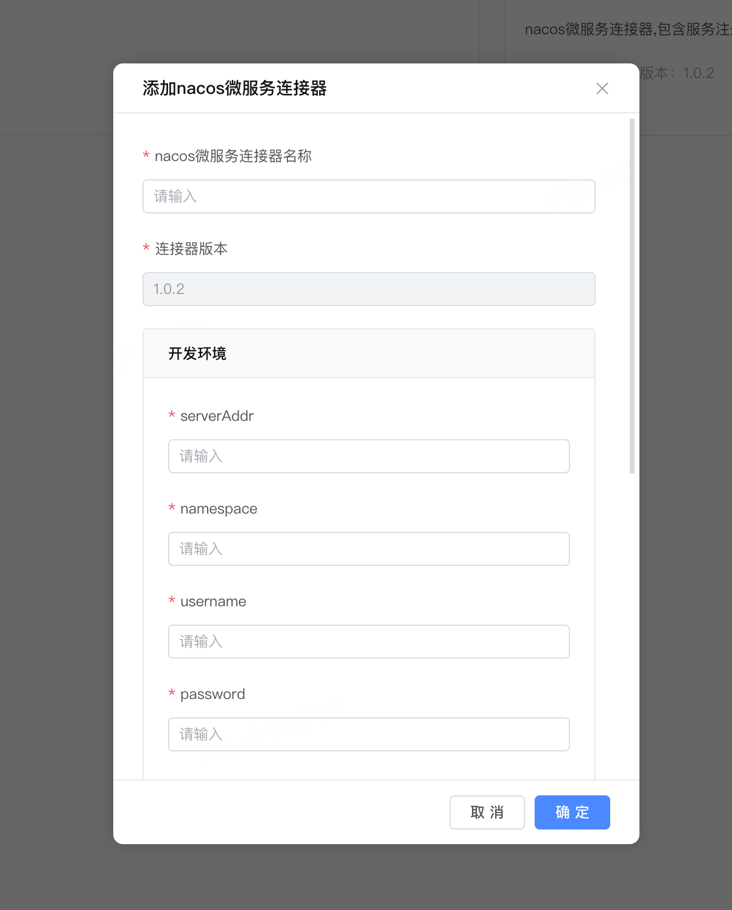
3. 在集成中心->应用API管理中添加API分组并录入调用接口的具体信息并设置返回体。
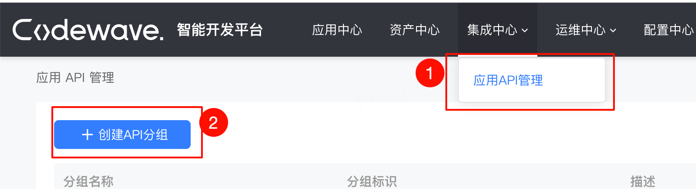
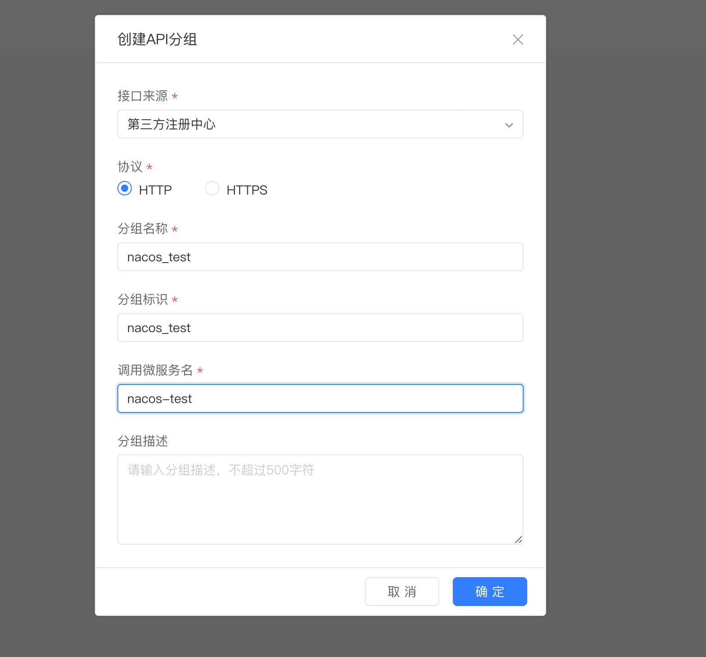
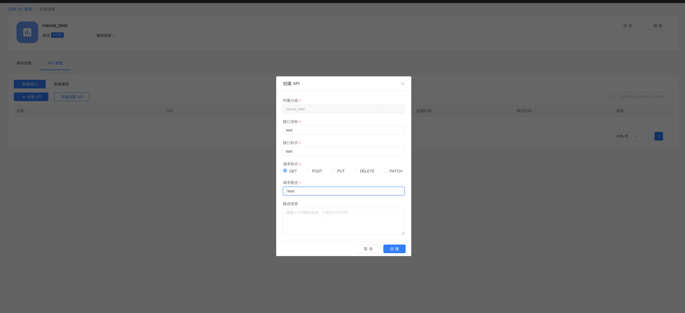
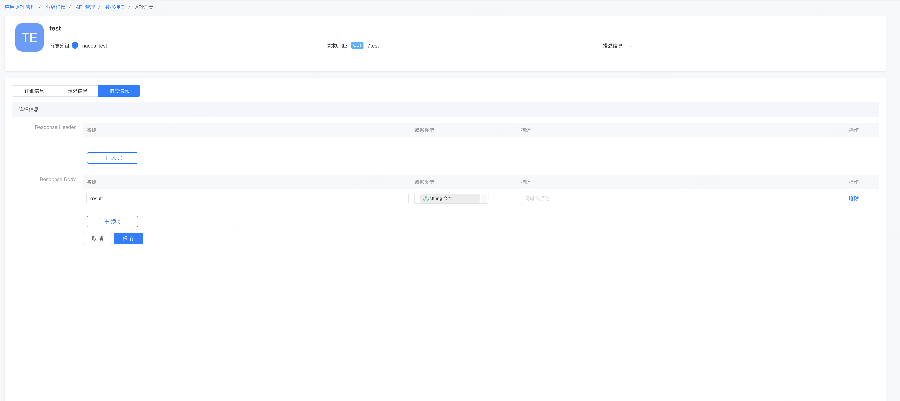
4. 在逻辑中使用“调用接口”即可调用配置好的微服务接口。注意在后端逻辑中才可以调用微服务接口。
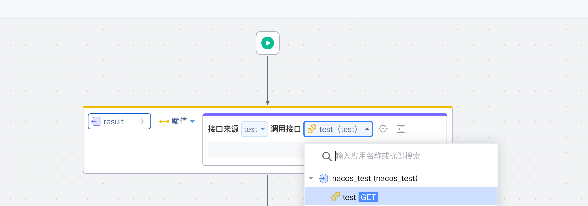
5. 发布应用进行测试。在该应用中添加了一个按钮，在点击按钮后会调用后端逻辑，后端逻辑中会调用微服务接口并将结果返回给前端。
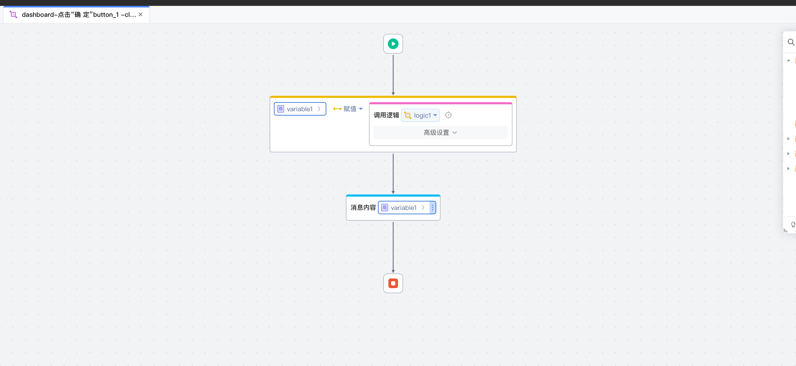


## 其他微服务调用CodeWave应用接口

1. 配置微服务连接器。
2. 将逻辑导出为接口，并在“接口上报”选项中选择配置的微服务连接。
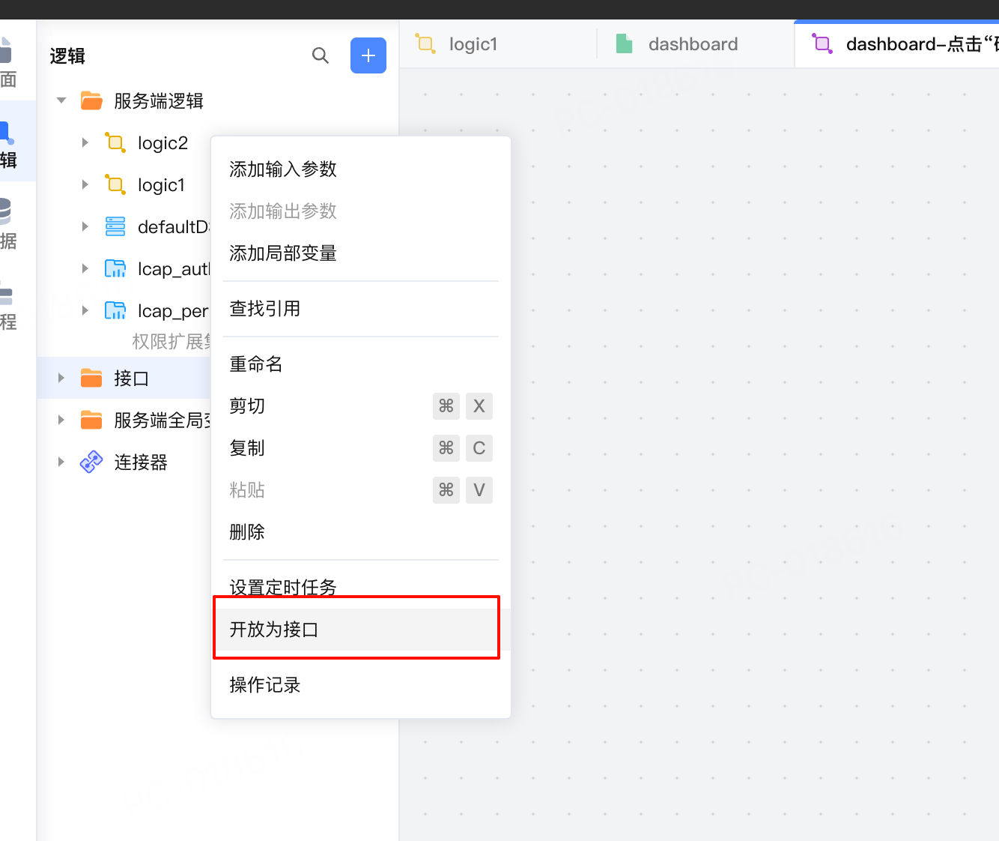
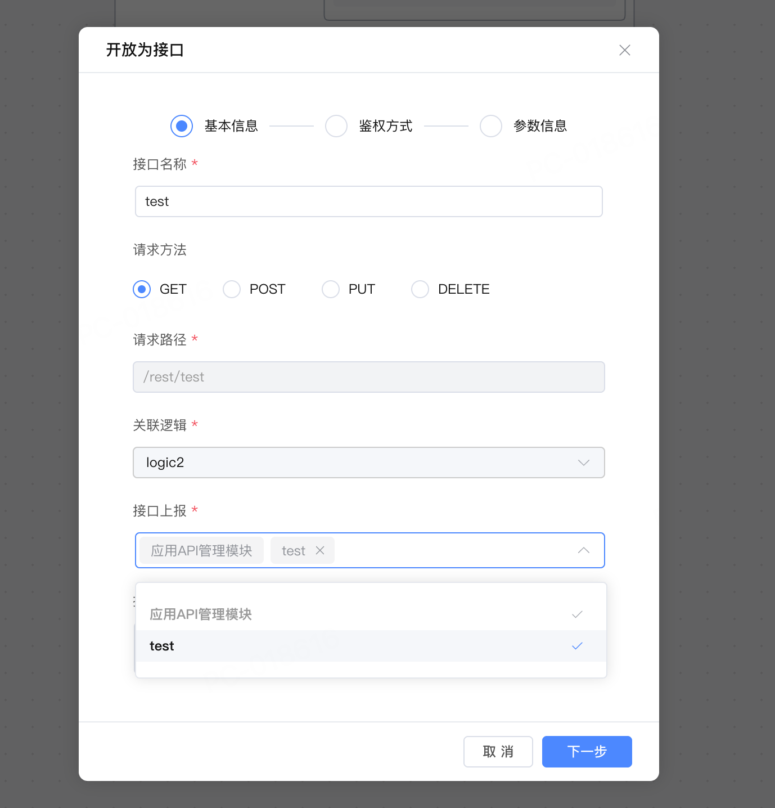
3. 预览/发布应用，导出的接口会上报至Nacos。
4. 使用其他连接到该Nacos的应用通过`http://{应用名}/{请求路径}`即可访问。需注意调用方必须和CodeWave应用处于同一集群下。

## CodeWave应用之间通过微服务接口调用

提供接口的应用参考上面“其他微服务调用CodeWave应用接口”部分将接口上报，调用接口的应用参考上面“CodeWave应用调用其他微服务接口”调用接口即可。下面为实操步骤。

1. 创建两个应用，一个为调用方，一个为被调用方，都引入Nacos连接器并配置同一个Nacos地址。
2. 在应用二中创建接口作为被调用接口，导出接口将接口上报至Nacos并预览/发布。
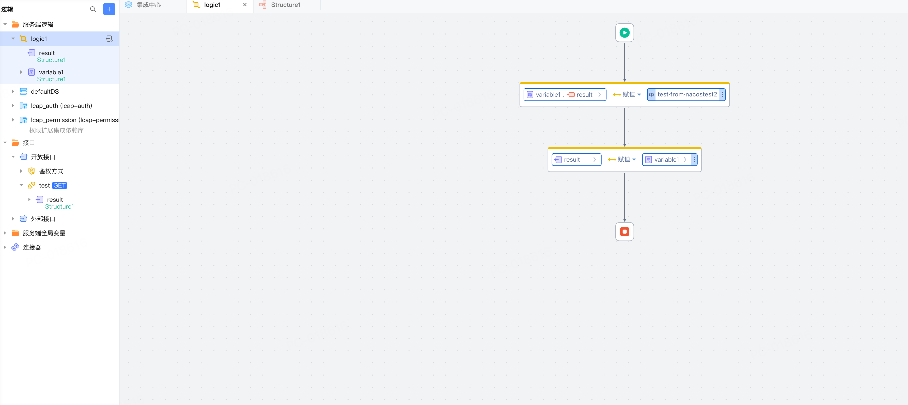
3. 在集成中心->应用API管理中添加API分组并录入在应用二中创建的接口信息。
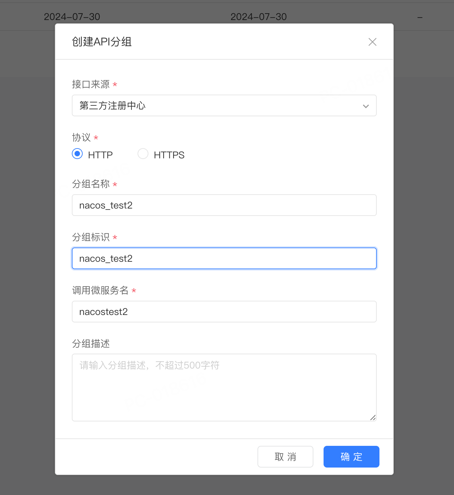
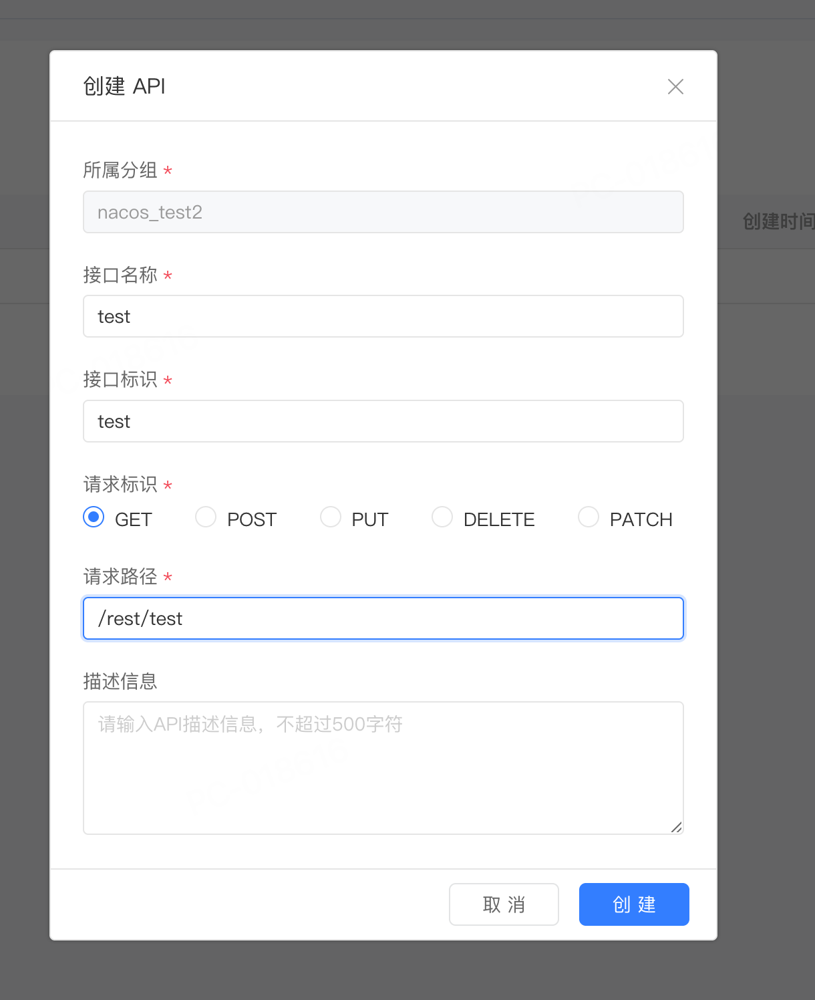
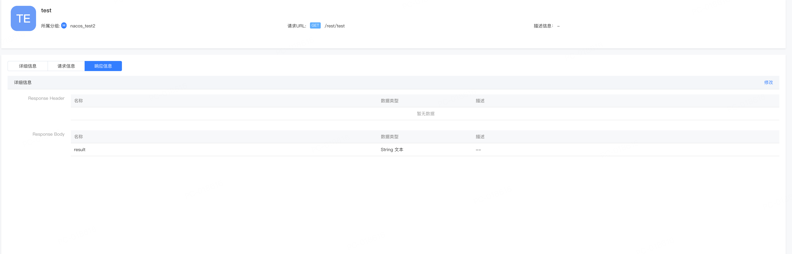
4. 在应用一中创建逻辑并调用应用二暴露的接口。
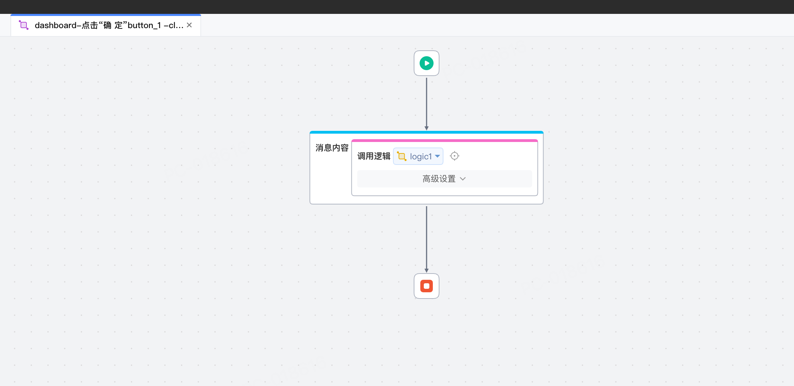
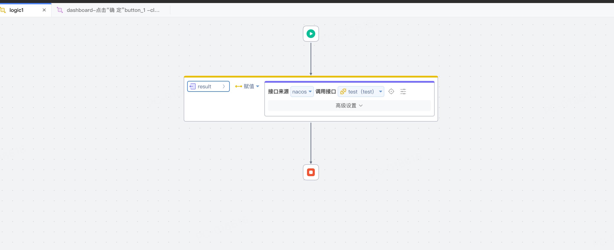
5. 预览/发布应用一进行测试。


