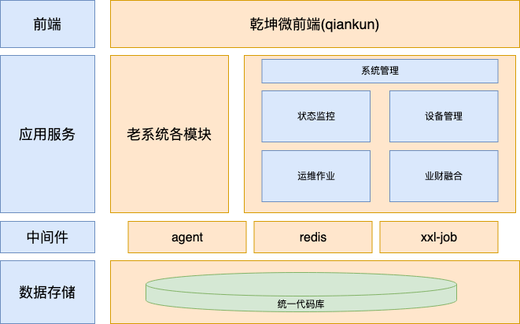

# 案例一：多应用
作者：鲍佳珍

## 场景描述
在使用Codewave之前，客户侧已存在一完整的高代码应用。需要使用CodeWave平台复刻并优化该应用。
首先将应用按照业务场景拆分为状态监测、设备管理、系统管理、运维作业、业财融合和其应用。其中将系统管理作为主应用，由CodeWave搭建。将状态监测、设备管理、系统管理、运维作业、业财融合作为子应用，同样由CodeWave搭建。其他应用继续复用高代码服务。在系统管理系统中，集成原有高代码服务和CodeWave搭建的子应用服务。主子应用、高低代码之间，互相存在接口交互。
## 解决思路
### 微前端
采用乾坤框架做微前端集成。技术经理指导客户前端开发对高代码前端代码进行微前端适配改造。低代码制品使用微前端父/子应用方案集成。
### 数据库使用
低代码的主子应用和高代码都使用同一个数据库。
### 用户认证与权限
使用同域父子应用免登方案。
### 应用间服务调用
包括低代码调低代码、低代码调高代码。使用API开放和调用的方式。
客服要求应用间服务调用也须实现免登，结合同域父子应用免登方案，传入cookie实现免登。
使用依赖库给api调用统一增加header，由低代码逻辑编排实现header具体内容，获取当前的用户信息传入cookie信息。
### xxl-job集成、agent集成等中间件的集成
使用依赖库实现。
### 部署
使用大应用拆分后独立部署集成实现。前后端分离部署。外部访问前端地址，在ng中做转发，转发至前端各子应用或后端各服务。
详见：[多应用集成独立部署](/deployment/multi-application-deploy.html)
### 架构图

