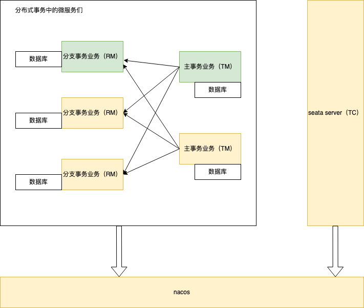
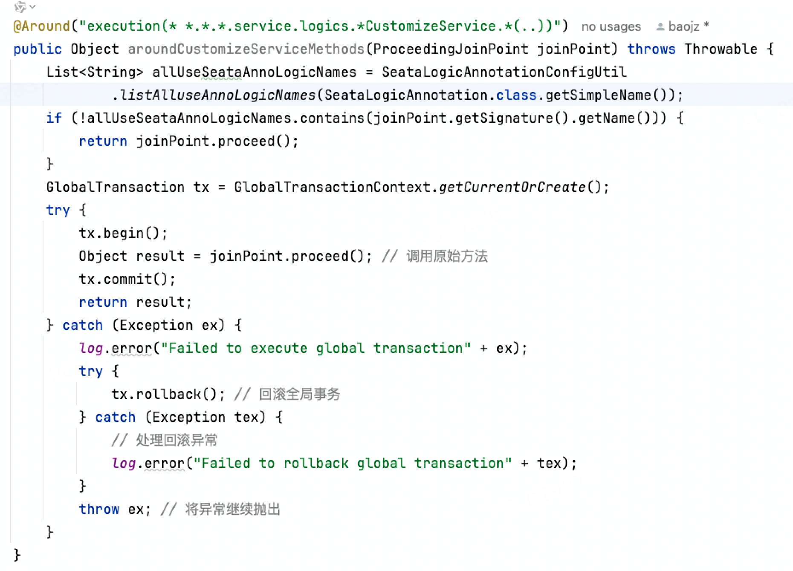
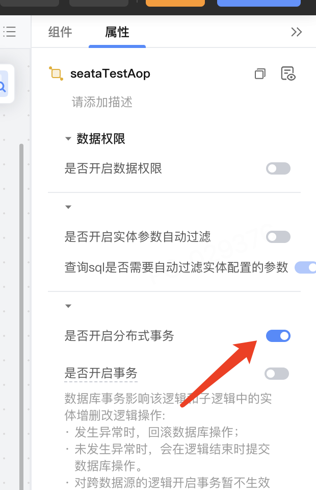
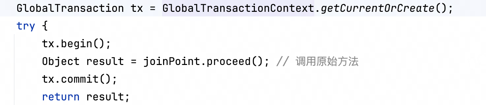
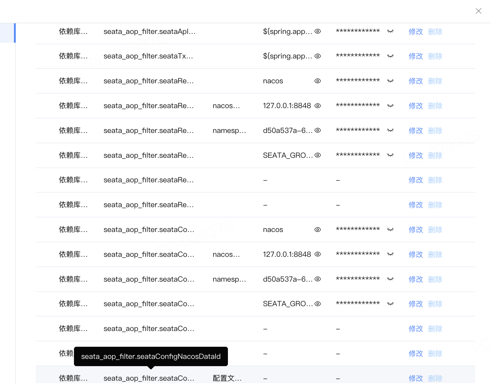
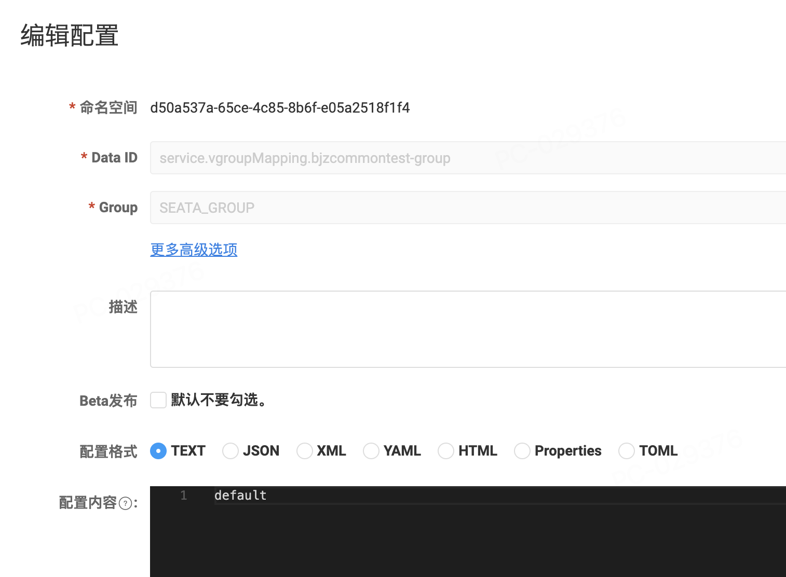
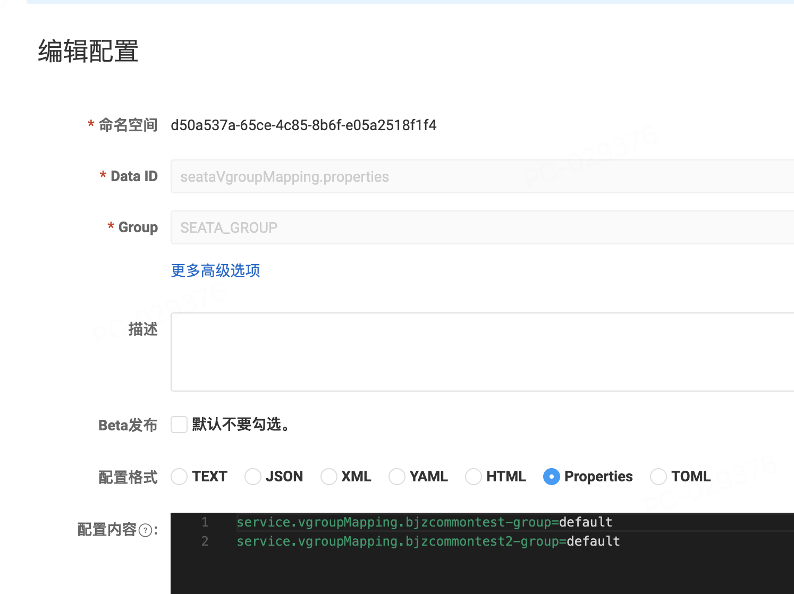
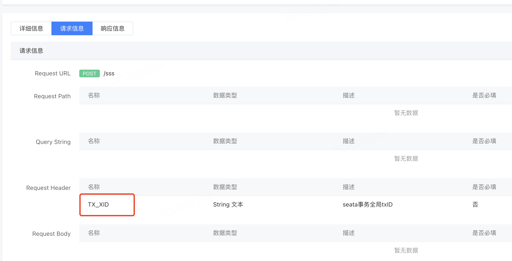
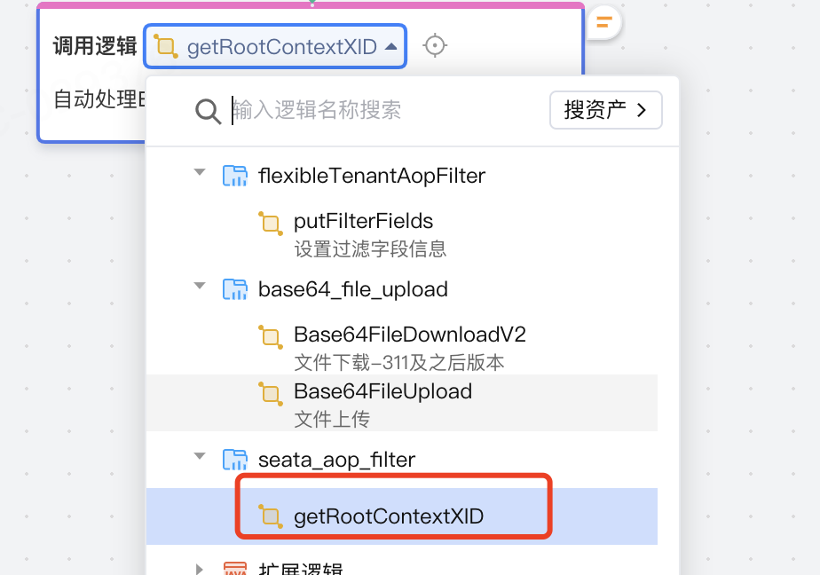

# 分布式事务

## 概念原理和背景

微服务：使用CodeWave的nacos连接器实现。

seata-server：脱离CodeWave平台独立搭建。

CodeWave事务：使用spring事务的默认模式。基于但数据源，不支持跨数据源。

实地场景：大应用拆分后，各应用间使用nacos连接器实现逻辑调用。

## 案例展示
下图中绿色部分表示低代码业务，黄色部分表示高代码业务。本方案支持高低代码混用。


### 技术方案

1.  使用codewave AOP定义IDE的注解SeataLogicAnnotation，供用户编辑态启用分布式事务开关。CodeWave AOP详见：[基于AOP的实现可拓展功能最佳实践](https://community.codewave.163.com/CommunityParent/fileIndex?filePath=40.%E6%89%A9%E5%B1%95%E4%B8%8E%E9%9B%86%E6%88%90%2F10.%E6%89%A9%E5%B1%95%E5%BC%80%E5%8F%91%E6%96%B9%E5%BC%8F%2F30.%E6%9C%8D%E5%8A%A1%E7%AB%AF%E6%89%A9%E5%B1%95%E5%BC%80%E5%8F%91%2F10.%E4%BE%9D%E8%B5%96%E5%BA%93%E5%BC%80%E5%8F%91%2F35.%E5%9F%BA%E4%BA%8EAOP%E7%9A%84%E5%AE%9E%E7%8E%B0%E5%8F%AF%E6%8B%93%E5%B1%95%E5%8A%9F%E8%83%BD%E6%9C%80%E4%BD%B3%E5%AE%9E%E8%B7%B5.md\&version=3.10\&selectType=codewave)
2.  使用@NaslConfiguration定义nacos和seata的配置，在CodeWave IDE中供用户配置。
3.  制品启动时，AOP机制会将开启了codewave AOP定义IDE的注解SeataLogicAnnotation的逻辑存储在json文件中。
4.  逻辑被调用时，使用Aspect拦截所有自定义逻辑，依赖库中，判断当前被调用逻辑是否开启SeataLogicAnnotation。若开启，则对逻辑做**手动编程式事务管理**。



## 实操演示

1.  新增undo_log表

必须确保每个业务数据库中都创建了undo_log表
```
    CREATE TABLE `undo_log` (
      `id` bigint(20) NOT NULL AUTO_INCREMENT,
      `branch_id` bigint(20) NOT NULL,
      `xid` varchar(100) NOT NULL,
      `context` varchar(128) NOT NULL,
      `rollback_info` longblob NOT NULL,
      `log_status` int(11) NOT NULL,
      `log_created` datetime NOT NULL,
      `log_modified` datetime NOT NULL,
      PRIMARY KEY (`id`),
      UNIQUE KEY `ux_undo_log` (`xid`,`branch_id`)
    ) ENGINE=InnoDB AUTO_INCREMENT=1 DEFAULT CHARSET=utf8;
```
2. 开启逻辑的分布式事务开关

3. 开启分布式事务的逻辑在执行时会触发seata全局事务，如下图所示：

4. 应用配置中，配置seata和nacos信息。下图为示例，等同效果：
```declarative
seata:
  application-id: ${spring.application.name}
  # seata 服务分组，要与服务端配置service.vgroup_mapping的后缀对应
  tx-service-group: ${spring.application.name}-group
  registry:
    # 指定nacos作为注册中心
    type: nacos
    nacos:
      server-addr: localhost:8848
      namespace: d50a537a-65ce-4c85-8b6f-e05a2518f1f4
      group: SEATA_GROUP
  config:
    # 指定nacos作为配置中心
    type: nacos
    nacos:
      server-addr: 127.0.0.1:8848
      namespace: d50a537a-65ce-4c85-8b6f-e05a2518f1f4
      group: SEATA_GROUP
```


5. seata所需的VgroupMapping可以直接配置在nacos配置中心，如图1。也可以按照图2配置properties文件，再将dataId配置在应用配置中的dataId参数中。


6. 在主事务中调用微服务时，使用nacos连接器。nacos连接器是http协议，因此需要在api定义中新增header名称为TX\_XID。在调用这个API时，set header信息。通过本依赖库获取。


前端调用使用custom-filter，后端调用使用custom-backend-remotecall-filter，用于给API请求统一修改header。

7.主事务应用和分支事务应用都需要引入本依赖库，并配置应用配置。仅主事务业务需要开启分布式事务注解。

