# 后端翻译器插件开发指导
作者：张鹏澜

<video src="http://jdvodmrvvfqeg.vod.126.net/jdvodmrvvfqeg/5bb0fa69b8ed4a79a83d91585fdb6271.mp4?wsSecret=4f852be77648f118a16bd6224d88b76a&wsTime=1756868817" controls="controls" style="max-width: 100%;">
</video>

## 1. 概念介绍
### 1.1 功能概述
Codewave支持管理平台中的源码翻译器插件，通过翻译器插件可以实现个性化定制生成源码规则。

### 1.2 概念介绍
- **NASL**：NASL 是 CodeWave 智能开发平台用于描述低代码应用的领域特定语言，关于 NASL 的更多介绍可参考：https://nasl.codewave.163.com
- **翻译器**：用于将 NASL 翻译成前后端的编程语言。例如，服务端翻译器会将 NASL 语言翻译成 Java 语言项目，前端翻译器会将 NASL 语言翻译成前端项目。
- **翻译器插件**：翻译器的扩展机制，可以定制某些翻译行为，从而生成符合定制化要求的源码。
- **执行流程**：
  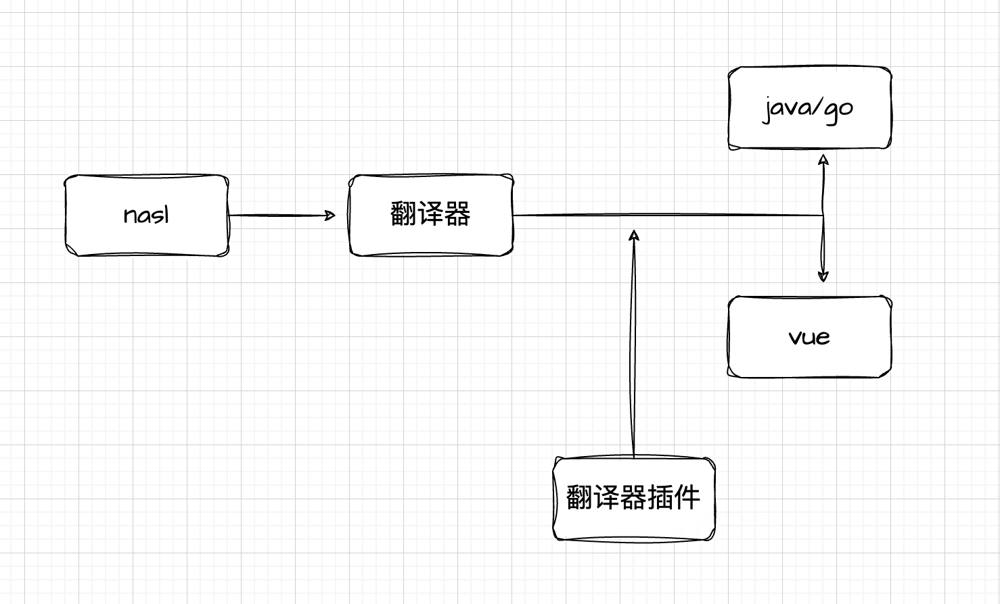

### 1.3 适用场景
- 当平台导出的应用源代码、项目目录结构不符合企业内部代码规范的时候，需要按要求调整代码格式内容以及框架，以满足企业内部开发规范要求。
- 为低代码应用导出的源码适配企业技术栈，例如需要引入企业开发的 jar 包，适配企业内部的微前端框架等。
- 导出的源码需要自定义第三方依赖，例如第三方依赖存在漏洞时需要升级版本，或者添加自定义的三方依赖。

### 1.4 能力一览
- 自定义包目录结构；
- 自定义 GAV（Maven 的 GroupId、ArtifactId、Version）；
- 自定义三方依赖，如添加自定义三方依赖，修改默认三方依赖版本等；
- 增加配置文件信息
- 自定义 Dockerfile 文件；
- 源码完全可自定义，常见使用场景如下：
  - 覆写默认源码文件，如覆写默认源码调用新增的自定义源码；
  - 新增自定义源码文件；
  - 完全覆写翻译内核，生成其他语言的制品，如将制品应用翻译为 Go 语言项目

### 1.5 翻译器插件实现
根据实际需求，实现翻译器插件扩展接口。翻译器插件扩展（Extension）分为两大类：
- NASL语言翻译扩展（Translator）
- 翻译器高级扩展（ExtensionPoint）

Translator类扩展可以覆写NASL语言的抽象语法树节点的翻译，通过改变NASL语言节点的翻译实现达到定制翻译出的制品项目源码。ExtensionPoint类扩展是翻译器针对特定定制能力开放的扩展点。Translator与ExtensionPoint的关系如下图：

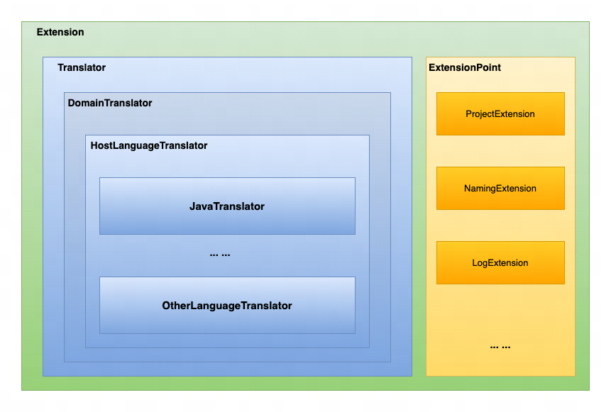

## 2. 如何开发翻译器插件
### 2.1 开发流程
开发依赖库的环境准备：maven3.0 以上版本、JDK1.8。

翻译器插件的开发步骤如下：
1. 基于 spring 打开 maven 工程
2. 编写对应代码，package 打包出对应 jar 包
3. 编写 description.json 文件，连同上述 jar 包压缩成 zip 包
4. 在平台上传翻译器插件进行验证

### 2.2 开发环境准备
#### 2.2.1 创建 maven 项目
创建 maven 项目，确保 maven 使用 3.6.3 以上版本，JDK 仅支持 1.8。

#### 2.2.2 本地安装依赖（已安装可忽略）
https://github.com/netease-lcap/codewave-architect-course/blob/main/example/generator-plugin/%E4%BE%9D%E8%B5%96%E9%9B%86.zip
```bash
mvn install:install-file -Dfile=nasl-translator-extension-3.13-rc.38.pom -DgroupId=com.netease.cloud -DartifactId=nasl-translator-extension -Dversion=3.13-rc.38 -Dpackaging=pom

mvn install:install-file -Dfile=nasl-ast-3.13.jar -DpomFile=nasl-ast-3.13.pom -DgroupId=com.netease.cloud -DartifactId=nasl-ast -Dversion=3.13

mvn install:install-file -Dfile=nasl-translator-plugin-3.13-rc.38.jar -DpomFile=nasl-translator-plugin-3.13-rc.38.pom -DgroupId=com.netease.cloud -DartifactId=nasl-translator-plugin -Dversion=3.13-rc.38

mvn install:install-file -Dfile=nasl-context-1.5-rc.19.jar -DpomFile=nasl-context-1.5-rc.19.pom -DgroupId=com.netease.cloud -DartifactId=nasl-context -Dversion=1.5-rc.19

mvn install:install-file -Dfile=nasl-generator-bom-1.8-rc.16.pom -DgroupId=com.netease.cloud -DartifactId=nasl-generator-bom -Dversion=1.8-rc.16 -Dpackaging=pom
```

#### 2.2.3 新建 maven 工程设置父依赖
创建Maven项目，继承插件脚手架作为parent。
```xml
<project xmlns="http://maven.apache.org/POM/4.0.0"
         xmlns:xsi="http://www.w3.org/2001/XMLSchema-instance"
         xsi:schemaLocation="http://maven.apache.org/POM/4.0.0 http://maven.apache.org/xsd/maven-4.0.0.xsd">

    <parent>
        <groupId>com.netease.cloud</groupId>
        <artifactId>nasl-translator-extension</artifactId>
        <version>版本号</version>
    </parent>

    <modelVersion>4.0.0</modelVersion>

    <groupId>com.test</groupId>
    <artifactId>custom-plugin</artifactId>
    <packaging>jar</packaging>

    <build>
        <plugins>
            <plugin>
                <groupId>org.apache.maven.plugins</groupId>
                <artifactId>maven-assembly-plugin</artifactId>
            </plugin>
        </plugins>
    </build>
</project>
```
插件脚手架会自动引入翻译器插件扩展。各版本翻译器插件扩展所开放的扩展点不尽相同，由于翻译器架构不断演进，部分旧版本插件扩展可能存在不兼容情况，但大部分会遵循高版本向下兼容原则。


### 2.4 制品应用定制案例
#### 2.4.1 定制JVM启动参数

示例：
```java
public class CustomProjectExtension implements SpringProjectExtension {

    /**
     * 指定JVM启动参数，如指定初始堆内存、最大堆内存等
     */
    @Override
    public String getJavaOpts() {
        return "-Xms512m -Xmx1024m";
    }

}
```

#### 2.4.2 定制项目GA（groupId, ArtifactId）

示例：
```java
public class CustomProjectExtension implements SpringProjectExtension {

    /**
     * 指定groupId : com.custom
     */
    @Override
    public String getGroupId() {
        return "com.custom";
    }

    /**
     * 指定artifactId : test-app
     */
    @Override
    public String getArtifactId() {
        return "test-app";
    }

}
```

#### 2.4.3 定制项目依赖
示例
```java
public class CustomProjectExtension implements SpringProjectExtension {

    @Override
    public String getSpringBootVersion(SpringBootVersion version) {
        if (version != SpringBootVersion.RELEASE_2_3_12) {
            version = SpringBootVersion.RELEASE_2_3_12;
        }
        return version.value();
    }

    @Override
    public List<Dependency> getDependencies() {
        Dependency commonLang3 = new Dependency("org.apache.commons", "commons-lang3", "3.17.0");
        Dependency jasyptSpringBootStarter = new Dependency("com.github.ulisesbocchio", "jasypt-spring-boot-starter", "2.1.2");
        return asList(commonLang3, jasyptSpringBootStarter);
    }

}
```
getSpringBootVersion方法返回的SpringBoot版本号若不在SpringBootVersion枚举范围内，则平台不保证其Spring版本的兼容性。 getDependencies方法若返回null或长度为0的空列表，则项目依赖不做任何改变。若其返回的依赖项目中不存在，则新增，若已存在则更新此依赖的版本号。 

#### 2.4.4 定制项目Properties
示例
```java
public class CustomProjectExtension implements SpringProjectExtension {
    
    @Override
    public Map<String, String> getSpringProperties(SpringPropertySearcher searcher) {
        Map<String, String> properties = newHashMap();
        properties.put("spring.datasource.username", "testUser");
        properties.put("spring.datasource.password", "testPassword");
        properties.put("test.key", "test.value");
        return properties;
    }
}
```
getSpringProperties方法可以新增、修改项目Properties，即可以定制制品应用中application-{profile}.yaml文件中的配置。SpringPropertySearcher对象可以查询应用的默认配置值。 

#### 2.4.5 后置处理java代码，主要是处理规范类问题
除了通过翻译器提供拓展能力处理pom，配置文件等问题，对于企业针对制品源码的规范问题，常用的方式就是通过后置处理java代码，工具使用javaParser，版本3.26.4
```java
public class ExampleJavaCodeBatchFormatExtension extends JavaCodeBatchFormatExtension {

	@Override
	public void batchFormat(Map<Path, SourceFile> files) {
		files.forEach((path, sourceFile) -> {
			try {
				String code = sourceFile.getSourceCode();
				code = ConnTranslatorProcessor.process(code, null);
				code = JsonPropertyAnnotationFormatter.addJsonPropertyAnnotations(code);
				code = CodeStyleFormatter.formatCodeStyle(code);
				Files.write(path, code.getBytes());
			} catch (IOException e) {
				e.printStackTrace();
			}
        });
	}
}
```

#### 2.4.6 后置处理指定java文件
如果不需要批量处理java文件，而是对指定文件进行处理，可以使用下述方法
```java
public class SpringCloudAnnotationExtension extends AbstractSourceFileFormatExtension<SourceFile> {

  private static final String ANNOTATION_NAME = "EnableDiscoveryClient";
  private static final String ANNOTATION_FULL_NAME = "org.springframework.cloud.client.discovery.EnableDiscoveryClient";
  private static final String APPLICATION = "Application";


  @Override
  protected Class<SourceFile> type() {
      return SourceFile.class;
  }

  @Override
  protected boolean doAccept(SourceFile file) {
      return APPLICATION.equals(file.getName());
  }

  /**
   * 使用JavaParser解析Java源码并添加类注解。
   */
  @Override
  public String format(String code) {
    logger.info("翻译器插件: Application启动类添加注解开始...");
    CompilationUnit unit = StaticJavaParser.parse(code);
    unit.addImport(ANNOTATION_FULL_NAME);
    ClassOrInterfaceDeclaration applicationClass = unit.getClassByName(APPLICATION).get();
    applicationClass.addAnnotation(ANNOTATION_NAME);
    code = unit.toString();
    logger.info("翻译器插件: Application启动类添加注解结束");
    return code;
  }

  /**
   * 不做操作。
   */
  @Override
  public void format(Path file) {

  }

}
```

### 2.5 添加 plugin-metadata.properties
当前使用版本（SPI 声明为 com.netease.cloud.nasl.translator.Translator 的），ast 版本和 plugin 版本需要相同，最小为 3.10，SPI 为 com.netease.cloud.nasl.extension.ExtensionPoint 不受影响。
​            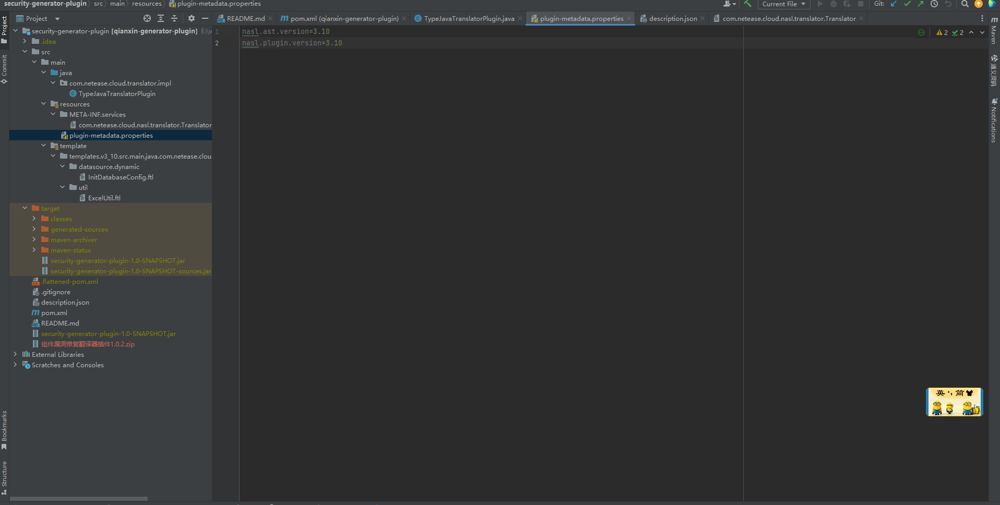
```properties
nasl.ast.version=3.13
nasl.plugin.version=3.13
```

### 2.6 接口注册
注册遵循JDK自带的SPI机制，在src/main/resources目录下的META-INF/services目录中创建扩展接口注册文件，使用所有扩展接口的基类的全类名作为文件名：com.netease.cloud.nasl.
extension.ExtensionPoint（若实现的扩展为Translator则其注册文件名为：com.netease.cloud.nasl.translator.Translator），文件内输入实现类的路径即可。。

```
src/main/resources/META-INF/services/com.netease.cloud.nasl.extension.ExtensionPoint
```
注册文件内填写扩展实现类全类名：
```
com.test.custom.plugin.CustomProjectExtension
```

### 2.7 编写 description.json
根据低代码平台规范，需要编写编译器插件描述文件：description.json。文件内容规范如下：
```json
{
    "symbol": "upgrade-security-version",
    "name": "组件漏洞修复翻译器插件",
    "version": "1.0.2",
    "ideVersion": "3.10",
    "description": "根据组件安全漏洞报告，升级 SpringBoot 版本与 pom 文件依赖版本",
    "endType": "backend"
}
```

### 2.8 使用 maven 进行 clean package 打包
​            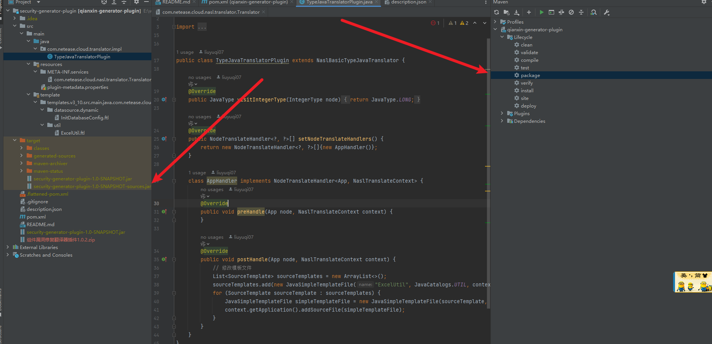

### 2.9 压缩为 zip 包并上传 IDE 测试
压缩后的 zip 包包含 jar 文件和 description.json，zip 包名称随便取名（支持中文字母数字小数点）。
**压缩**
​            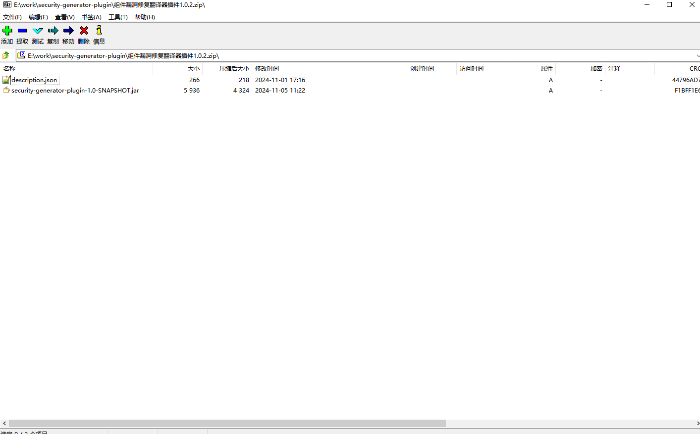
**翻译器上传**
​            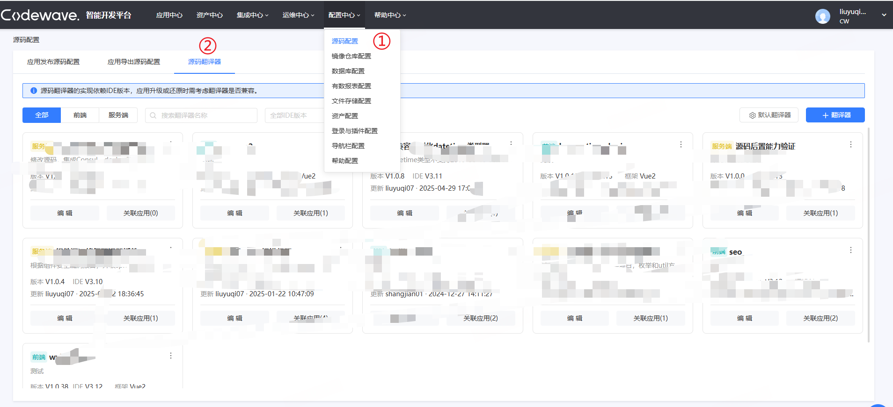
​            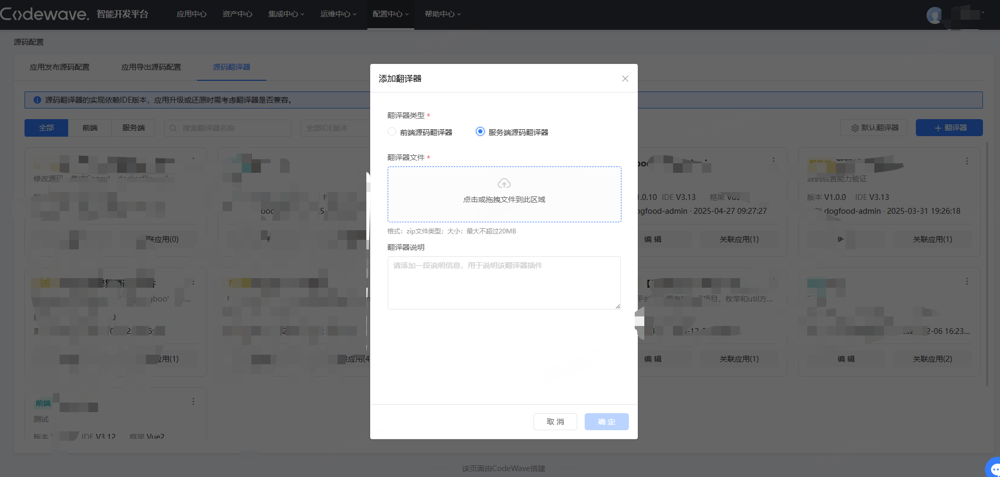
**关联应用**

打开低代码应用，即可关联插件。操作路径为：编辑应用信息 -> 源码配置 -> 自定义服务端源码翻译器。
可指定生效范围为导出生效或者发布生效，默认为全部生效。
​            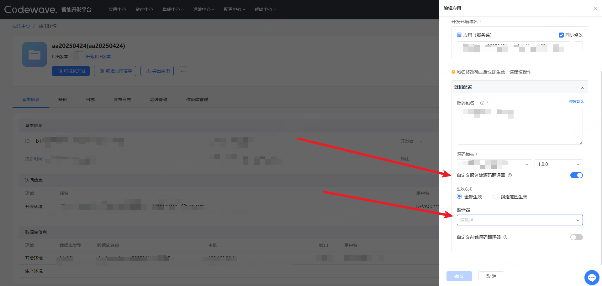


### 2.10 后续迭代
打包 jar，并将 description.json 中的 version + 0.0.1，重新上传翻译器插件验证，IDE 内不需要做任何改动。每次翻译代码的时候会重新拉取对应 symbol 的最新版本。


上传翻译器插件（需有权限，翻译器插件作用范围为租户级别）
​            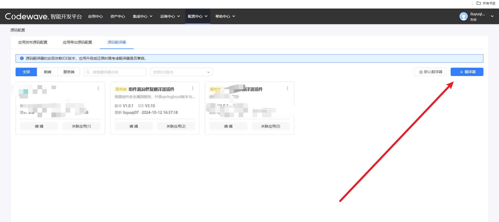
编辑应用页面（直接新建应用的页面无法指定翻译器插件，需要创建完再编辑）
​            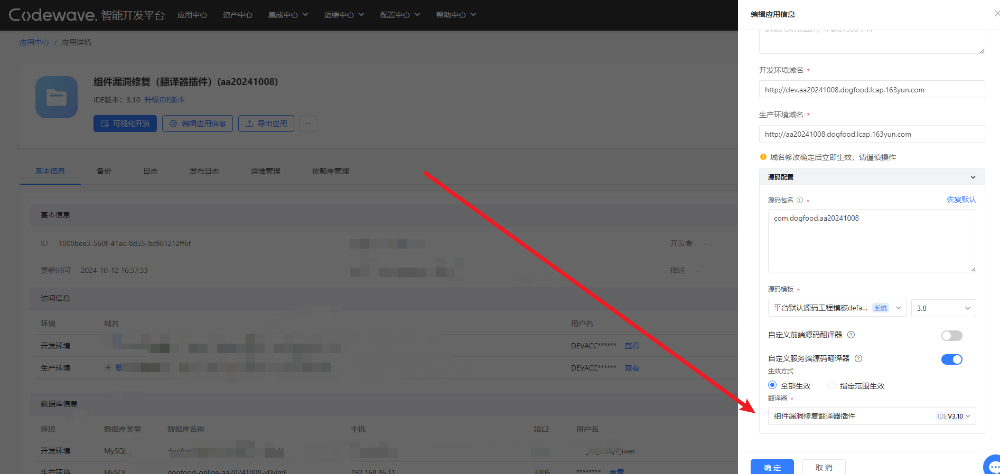
指定翻译器插件与生效范围，导出后端源码验证。
​            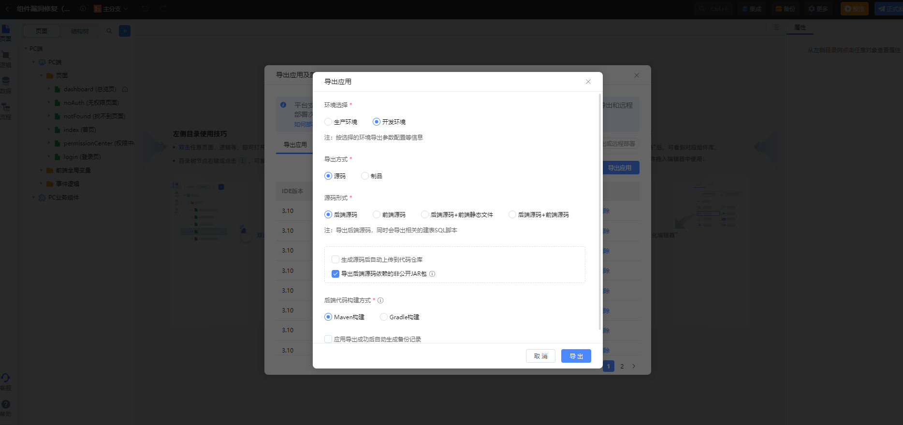

## 3. 开发问题排查
### 3.1 翻译插件如何打日志
使用示例：
```java
private static final Logger log = LoggerFactory.getLogger(xxx.class);
// 使用 log 输出日志，例如：
public static void commentClass(SourceFile file, String comment) {
    logger.info("comment class with comment: {}", comment);
    if (isBlank(comment) || isNull(file)) return;
    if (JavaClass.class.isInstance(file)) {
        JavaClass.class.cast(file).setComment(JavaBuilder.comment(true, comment));
    }
}
```

### 3.2 codewave 平台如何查看对应翻译器插件日志
- 有管理员权限：运维中心 - 日志与监控 - 平台 - nasl-generator-new 查看日志

- 有服务器权限：
```bash
kubectl get pod -n low-code | grep generator-new
kubectl exec -it generator-new-xxx -n low-code -- bash
ls -l
```


## 4. 常见问题
### 4.1 maven 报错
#### 使用 maven clean 命令，报错
错误提示：`Failed to execute goal org.codehaus.mojo:flatten-maven-plugin:1.6.0:clean (flatten.clean) on project xxxx: The plugin org.codehaus.mojo:flatten-maven-plugin:1.6.0 requires Maven version 3.6.3 -> [Help 1]`

解决方案：在 idea 的 settings - Bulid Tools - Maven 中查看当前 maven 的版本，可以尝试切换为 Idea 自带的 maven 版本（idea 版本需 >2023.1），或者手动安装 3.6.3 以上版本的 maven。
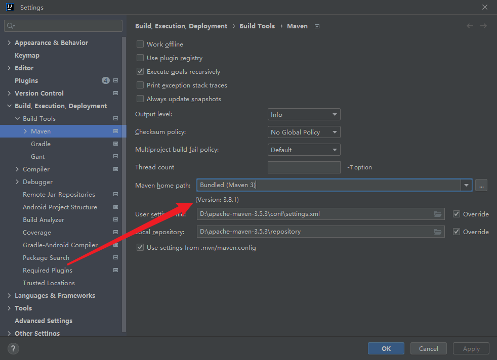
#### maven complie 报错

解决方案：查看 maven 仓库里 com/neteas/cloud 目录下是否已安装二方包，如已安装，检查当前 jdk 版本是否为 jdk8，并连接阿里云仓库下载依赖（https://maven.aliyun.com/repository/public）。

### 4.2 IDE 提示后端翻译器错误
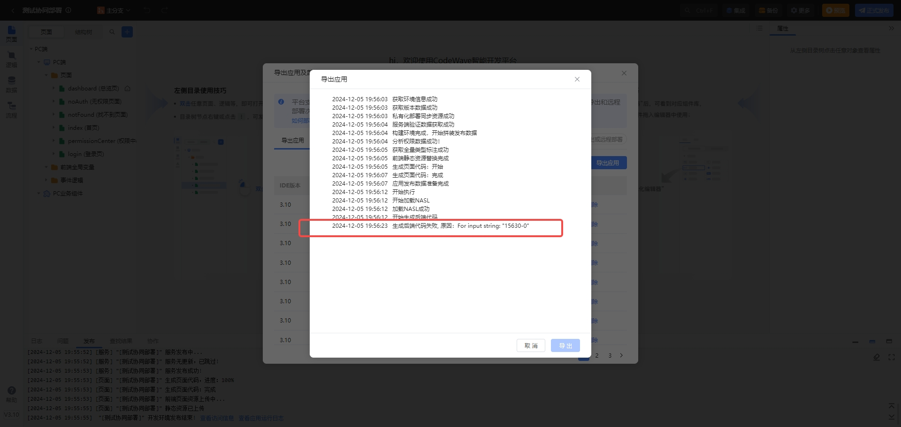
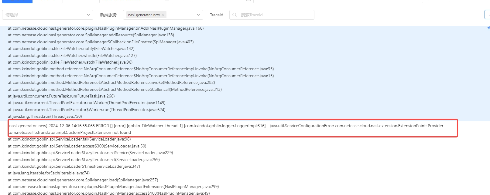
这个错误是指实现 SpringProjectExtension 接口，但是没有声明对应的 SPI（在 resources/META-INF/services 下新建 com.netease.cloud.nasl.extension.ExtensionPoint 文件）。

### 4.3 导出源码提示翻译器安装超时
错误提示：`生成代码失败，原因：等待翻译器插件安装超时，插件ID：xxxx`

这个错误一般是相同翻译器版本重复上传，导致reload失败，将description里的version+0.0.1，或者修改symbpl，然后重新上传翻译器导出。如果还不能解决需要手动重启nasl-generator-new服务

### 4.4 翻译器未生效
在日常开发中可能会遇到翻译器未生效的问题，请按以下思路排查
- 是否正确进行spi注册
- 翻译器插件版本是否正确
- 翻译器插件是否正确关联应用
- 翻译器是否完成注册，可以在nasl-generator-new服务中搜索对应类进行查看
- 通过打印日志，并搜索日志关键字，并观察执行过程是否有报错  
如果以上都没有问题，可rg客服排障


## 5. 插件脚手架GA
```xml
<groupId>com.netease.cloud</groupId>
<artifactId>nasl-translator-extension</artifactId>
```
### 5.1 对应插件脚手架版本
```
ide版本 --- > 脚手架版本
3.13 --- > 3.13-rc.38
3.14 --- > 3.14-rc.20
4.0 --- > 4.0-rc.22
4.1 --- > 4.1-rc.2
```
