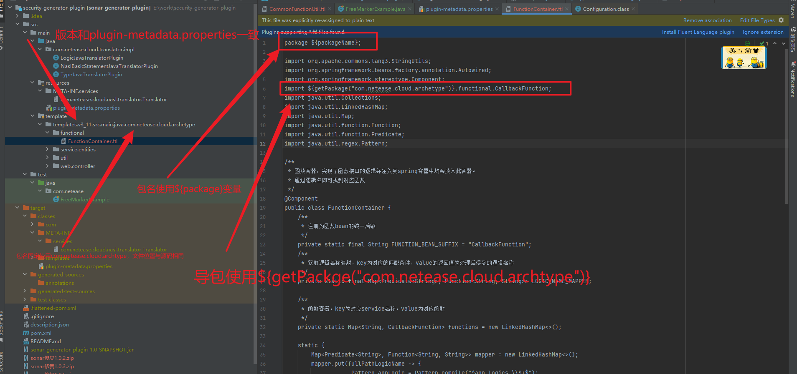
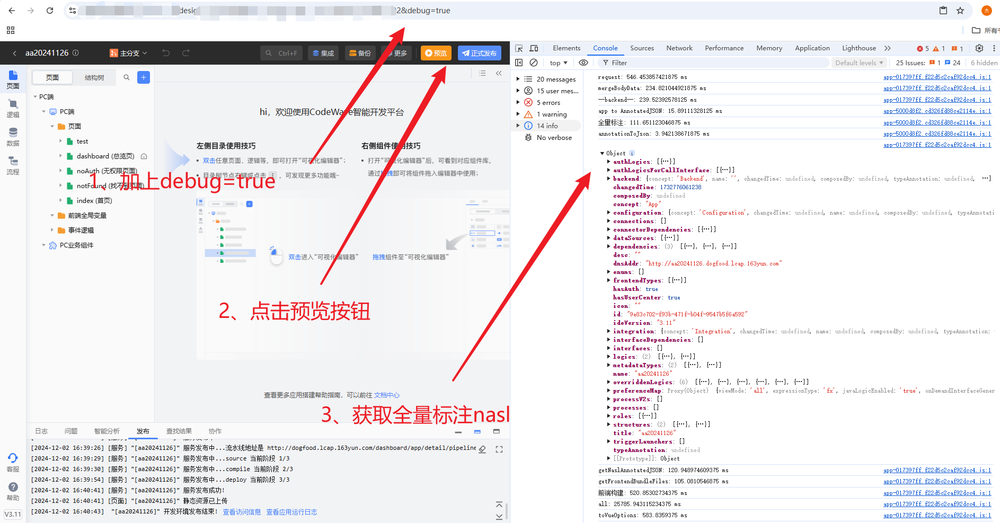
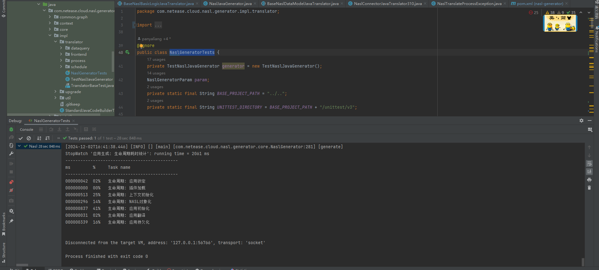
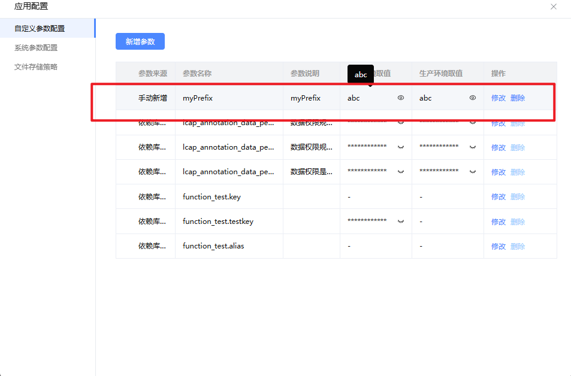

# 后端翻译器插件开发指导

## 1. 概念介绍
### 功能概述
Codewave支持管理平台中的源码翻译器插件，通过翻译器插件可以实现个性化定制生成源码规则。

### 概念介绍
- **NASL**：NASL 是 CodeWave 智能开发平台用于描述低代码应用的领域特定语言，关于 NASL 的更多介绍可参考：https://nasl.codewave.163.com
- **翻译器**：用于将 NASL 翻译成前后端的编程语言。例如，服务端翻译器会将 NASL 语言翻译成 Java 语言项目，前端翻译器会将 NASL 语言翻译成前端项目。
- **翻译器插件**：翻译器的扩展机制，可以定制某些翻译行为，从而生成符合定制化要求的源码。

### 适用场景
- 当平台导出的应用源代码不符合企业内部代码规范的时候，需要按要求调整代码格式及代码内容，以满足企业内部开发规范要求。
- 为低代码应用导出的源码适配企业技术栈，例如需要引入企业开发的 jar 包，适配企业内部的微前端框架等。
- 导出的源码需要自定义第三方依赖，例如第三方依赖存在漏洞时需要升级版本，或者添加自定义的三方依赖。

### 能力一览
- 自定义包目录结构；
- 自定义 GAV（Maven 的 GroupId、ArtifactId、Version）；
- 自定义三方依赖，如添加自定义三方依赖，修改默认三方依赖版本等；
- 自定义 Dockerfile 文件；
- 源码完全可自定义，常见使用场景如下：
  - 覆写默认源码文件，如覆写默认源码调用新增的自定义源码；
  - 新增自定义源码文件；
  - 完全覆写翻译内核，生成其他语言的制品，如将制品应用翻译为 Go 语言项目

翻译器插件与工程模板都可以进行源码的定制化修改，工程模板只支持粗粒度的源码定制，翻译器插件可以进行更细粒度的定制，翻译器插件完全涵盖工程模板的能力，工程模板的能力都可以用翻译器插件实现。

## 2. 如何开发翻译器插件
### 2.1 开发流程
开发依赖库的环境准备：maven3.0 以上版本、JDK1.8。

翻译器插件的开发步骤如下：
1. 基于 spring 打开 maven 工程
2. 编写对应代码，package 打包出对应 jar 包
3. 编写 description.json 文件，连同上述 jar 包压缩成 zip 包
4. 在平台上传翻译器插件进行验证

### 2.2 开发环境准备
#### 2.2.1 创建 maven 项目
创建 maven 项目，确保 maven 使用 3.6.3 以上版本，JDK 仅支持 1.8。

#### 2.2.2 本地安装依赖（已安装可忽略）
https://github.com/netease-lcap/codewave-architect-course/tree/master/example/generator-plugin/security-generator-plugin/jar
```bash
mvn install:install-file -Dfile=nasl-translator-extension-3.10-SNAPSHOT.pom -DgroupId=com.netease.cloud -DartifactId=nasl-translator-extension -Dversion=3.10-SNAPSHOT -Dpackaging=pom
mvn install:install-file -Dfile=nasl-ast-3.10-SNAPSHOT.jar -DpomFile=nasl-ast-3.10-SNAPSHOT.pom -DgroupId=com.netease.cloud -DartifactId=nasl-ast -Dversion=3.10-SNAPSHOT
mvn install:install-file -Dfile=nasl-translator-plugin-3.10-SNAPSHOT.jar -DpomFile=nasl-translator-plugin-3.10-SNAPSHOT.pom -DgroupId=com.netease.cloud -DartifactId=nasl-translator-plugin -Dversion=3.10-SNAPSHOT
mvn install:install-file -Dfile=nasl-generator-bom-1.3-SNAPSHOT.pom -DgroupId=com.netease.cloud -DartifactId=nasl-generator-bom -Dversion=1.3-SNAPSHOT -Dpackaging=pom
mvn install:install-file -Dfile=nasl-context-1.3.jar -DpomFile=nasl-context-1.3.pom -DgroupId=com.netease.cloud -DartifactId=nasl-context -Dversion=1.3
mvn install:install-file -Dfile=nasl-context-1.3-SNAPSHOT.pom -DgroupId=com.netease.cloud -DartifactId=nasl-context -Dversion=1.3-SNAPSHOT -Dpackaging=pom
```

#### 2.2.3 新建 maven 工程设置父依赖
**PS：这里的版本最好以开发时最新版本为准，可以二次确认下，例如 1.5.2**
```xml
<parent>
    <groupId>com.netease.cloud</groupId>
    <artifactId>nasl-translator-extension</artifactId>
    <version>3.10-SNAPSHOT</version>  <!--根据ide版本号修改引用版本-->
</parent>
```

#### 2.2.4 声明 SPI
有两种实现：

##### 2.2.4.1 针对 pom 文件和 dockerfile 文件的定制
拓展时需要在插件工程中实现 SpringProjectExtension 接口实现需要拓展方法，更多扩展点详见[扩展接口清单](https://docs.popo.netease.com/lingxi/9a2ec1e246294f51aadfff20008e0751?xyz=1745219265752#2nrx-1745218705712)，并且通过 SPI 机制完成注册，在 resources/META-INF/services 下新建 com.netease.cloud.nasl.extension.ExtensionPoint 文件，文件内输入实现类的路径即可。

示例：
```java
public class CustomDependeniesExtension implements SpringProjectExtension {
    /**
     * 指定应用启动 JAVA_OPTS.
     *
     * @return String
     */
    @Override
    public String getJavaOpts() {
        return "-XX:+HeapDumpOnOutOfMemoryError";
    }

    /**
     * 指定应用基础包名.
     *
     * @return String 返回 null 或空字符串将使用默认配置
     */
    @Override
    public String getBasePackage() {
        return "com.test.client.custom";
    }

    /**
     * 指定应用使用的 SpringBoot 版本.
     *
     * @param version 默认使用的 SpringBoot 版本号
     * @return String SpringBoot 版本号 - 返回 null 将使用默认版本.
     */
    @Override
    public String getSpringBootVersion(SpringBootVersion version) {
        return "2.5.4";
    }

    @Override
    public String getGroupId() {
        // 指定应用 GroupId 为 com.test.client
        return "com.test.client";
    }

    @Override
    public String getArtifactId() {
        // 指定应用 ArtifactId 为 client-custom-app
        return "client-custom-app";
    }

    @Override
    public List<Dependency> getDependencies() {
        // 添加依赖，如果已经存在则会被覆盖
        Dependency poi = new Dependency("org.apache.poi", "poi", "5.3.0");
        Dependency mybatis_spring = new Dependency("org.mybatis.spring.boot", "mybatis-spring-boot-starter", "1.3.5");
        return asList(poi, mybatis_spring);
    }

    @Override
    public Map<String, String> getSpringProperties(SpringPropertySearcher searcher) {
        // 添加 spring 配置
        Map<String, String> properties = new HashMap();
        properties.put("spring.test", "custom properties test");
        properties.put("spring.datasource.url", "custom datasource test");
        return properties;
    }
}
```

##### 2.2.4.2 针对 java，xml 模板文件的定制
拓展时需要在插件工程中实现任意 visit 方法，并且通过 SPI 机制完成注册，在 resources/META-INF/services 下新建 com.netease.cloud.nasl.translator.Translator 文件，文件内输入实现类的路径即可。

- **制作 ftl 模板**
注意不同应用 IDE 版本的源码的差异性，对于不兼容的可以开发多个翻译器插件。翻译器内置了 `${packageName}` 和 `${getPackage("com.netease.cloud.archetype")}` 的实现。可将需要修改的 java 类（开发者需自行根据应用 IDE 版本导出源码）重命名为 ftl 文件，并修改 package 和 import，并放置在 template 目录下的对应目录。
  ​            
- **编写实现代码**
至少需要 visit 一个方法，实现参考：
```java
package com.netease.cloud.translator.impl;
import com.netease.cloud.nasl.ast.App;
import com.netease.cloud.nasl.ast.IntegerType;
import com.netease.cloud.nasl.source.application.project.JavaCatalogs;
import com.netease.cloud.nasl.source.lang.java.element.JavaType;
import com.netease.cloud.nasl.source.template.JavaSimpleTemplateFile;
import com.netease.cloud.nasl.source.template.SourceTemplate;
import com.netease.cloud.nasl.translator.context.NaslTranslateContext;
import com.netease.cloud.nasl.translator.context.NodeTranslateHandler;
import com.netease.cloud.nasl.translator.lang.java.NaslBasicTypeJavaTranslator;
import java.util.ArrayList;
import java.util.List;

public class TypeJavaTranslatorPlugin extends NaslBasicTypeJavaTranslator {
    @Override
    public JavaType visitIntegerType(IntegerType node) {
        return JavaType.LONG;
    }

    @Override
    public NodeTranslateHandler<?, ?>[] setNodeTranslateHandlers() {
        return new NodeTranslateHandler<?, ?>[]{new AppHandler()};
    }

    class AppHandler implements NodeTranslateHandler<App, NaslTranslateContext> {
        @Override
        public void preHandle(App node, NaslTranslateContext context) {
        }

        @Override
        public void postHandle(App node, NaslTranslateContext context) {
            // 修改模板文件，类名需要选取对应的文件夹
            List<SourceTemplate> sourceTemplates = new ArrayList<>();
            sourceTemplates.add(new JavaSimpleTemplateFile("HealthMetricController", JavaCatalogs.CONTROLLER, context));
            sourceTemplates.add(new JavaSimpleTemplateFile("FunctionContainer", JavaCatalogs.FUNCTIONAL, context));
            sourceTemplates.add(new JavaSimpleTemplateFile("FileUploadUtils", JavaCatalogs.UTIL, context));
            sourceTemplates.add(new JavaSimpleTemplateFile("CommonFunctionUtil", JavaCatalogs.UTIL, context));
            for (SourceTemplate sourceTemplate : sourceTemplates) {
                JavaSimpleTemplateFile simpleTemplateFile = new JavaSimpleTemplateFile(sourceTemplate, context);
                context.getApplication().addSourceFile(simpleTemplateFile);
            }
        }
    }
}
```

- **本地自测**
添加测试依赖，作用域为 test：
```xml
<dependency>
    <groupId>org.springframework.boot</groupId>
    <artifactId>spring-boot-starter-test</artifactId>
    <version>2.2.9.RELEASE</version>
    <scope>test</scope>
</dependency>
<dependency>
    <groupId>org.freemarker</groupId>
    <artifactId>freemarker</artifactId>
    <version>2.3.31</version>
    <scope>test</scope>
</dependency>
```

本地测试类自测 freemark 模板生成 java 类：
```java
package com.netease;
import freemarker.template.*;
import org.junit.Test;
import java.io.File;
import java.io.FileWriter;
import java.io.IOException;
import java.io.Writer;
import java.net.URLDecoder;
import java.util.HashMap;
import java.util.List;
import java.util.Map;

public class FreeMarkerExample {
    @Test
    public void test1() throws TemplateException, IOException {
        String className = "FunctionContainer";
        Configuration configuration = new Configuration(Configuration.VERSION_2_3_30);
        //获取模板文件路径
        String srcFilePath =  FreeMarkerExample.class.getClassLoader().getResource("templates/v3_11/src/main/java/com/netease/cloud/archetype/functional").getFile();
        String decodedUrl = URLDecoder.decode(srcFilePath, "UTF-8");
        File srcFile = new File(decodedUrl);
        configuration.setDirectoryForTemplateLoading(srcFile);
        configuration.setDefaultEncoding("utf-8");
        //获取模板文件
        Template template = configuration.getTemplate(className + ".ftl");
        // 创建数据模型
        Map<String, Object> map = new HashMap<>();
        map.put("packageName", "com.abc");
        map.put("getPackage", new TemplateMethodModelEx() {
            @Override
            public Object exec(List list) throws TemplateModelException {
                // 在这里编写获取包名的逻辑，例如：
                // String packageName = list.get(0).toString();
                // 执行相应的逻辑...
                return "com.abc"; // 返回实际的包名
            }
        });
        // 创建 Writer 对象，输出到 target/classes/templates 目录下
        Writer out = new FileWriter(new File(decodedUrl + "/" + className + ".java"));
        // 输出
        template.process(map, out);
        //关闭 Writer 对象
        out.close();
    }
}
```

##### 2.2.4.3 针对java文件的后置处理
在翻译过程中有时候并不能处理所有的java 文件，比如客户的源码规范定制化高，可以采用后置处理的方式，首先通过SPI机制完成注册，在resources/META-INF/services下新建com.netease.cloud.nasl.extension.ExtensionPoint文件，文件内输入实现类的路径即可。

示例：
```java
package com.example.plugin;

import java.io.IOException;
import java.nio.file.*;
import java.util.Map;
import java.util.regex.Pattern;

import com.netease.cloud.nasl.extension.java.JavaCodeBatchFormatExtension;
import com.netease.cloud.nasl.source.SourceFile;

/**
 * @author codewave
 */
public class ExampleJavaCodeBatchFormatExtension extends JavaCodeBatchFormatExtension {

	@Override
	public void batchFormat(Map<Path, SourceFile> files) {
		files.forEach((path, sourceFile) -> {
			try {
				String code = sourceFile.getSourceCode();

				code = JsonPropertyAnnotationFormatter.addJsonPropertyAnnotations(code);
				code = CodeStyleFormatter.formatCodeStyle(code);
				code = JavaFieldNameConverter.changeApiReturn(code);
				// 处理构造函数里的业务逻辑
				code = ConstructorLogicExtractor.processConstructor(code);

				// 处理空块
				code = EmptyBlockFormatter.emptyBlockFormatter(code);
				code = ModifierOrderFormatter.formatWithCustomModifierOrder(code);
				// 处理三元表达式
				code = TernaryToIfElseReplacer.ternaryToIfElseReplacer(code);
				// 处理if条件里的复杂逻辑
				code = IfConditionSplitter.ifConditionSplitter(code);
				// 增加枚举的注释
				code = AutoGenerateEnumComment.autoGenerateEnumComment(code);
				// 处理常量
				code = ConstantUpperCaseConverter.convertConstants(code);

				// 处理魔法值问题，本期针对性处理就行
				code = MagicValueFormatter.constantExtractor(code);
				// 给pojo类增加toString方法，这个要放在处理魔法值之前
				code = AddToStringToPojo.addToStringToPojo(code);
				// 处理if，else，For，do，while语句必须使用大括号问题
				code = AddBracesToControlStatements.addBracesToControlStatements(code);
				code = MagicValueGlobal.processMagicValues(code);
				code = MethodRenameTool.renameMethodsWithDefaultMapping(code);
				code = FieldRenameTool.convertFieldsToCamelCase(code);

				code = code.replaceAll("(?m)(\\belse\\s*\\{\\s*\\})", "");
				code = code.replaceAll("batchList.size() >= 0", "batchList.size() > 0");
				code = code.replaceAll("x >= 0 && x < index_64.length", "x > 0 && x < index_64.length");
				code = code.replaceAll("null : total, page, size", "null : total.intValue(), page.intValue(), size.intValue()");
				code = code.replaceAll("DepartmentRes department = null;", "DepartmentRes department = new DepartmentRes();");
				code = code.replaceAll("class logReportParamsDTO", "class LogReportParamsDTO");
				code = code.replaceAll("logReportParamsDTO logReportParamsDTO", "LogReportParamsDTO logReportParamsDTO");
				code = code.replaceAll("globalCDD638E00095E76C42DB80D69DFDEC30currentUser", "globalBoeCurrentUser");

				// Objects.equals 这个先处理
				code = AdjustEqualsCalls.equalsMethodFixer(code);
				code = code.replaceAll("switch\\(", "switch \\(");
				code = code.replaceAll(Pattern.quote("uiBasePath.equals(\"/\")"), "\"/\".equals(uiBasePath)");
				code = CodeCommentFormatter.addComments(code);
				Files.write(path, code.getBytes());
			} catch (IOException e) {
				e.printStackTrace();
			}
        });
	}
}
```
通过这种方式，可以批量处理java文件。

##### 2.2.4.4 针对指定文件的修改
在实际运用中，我们可能需要修改某个指定的java文件，首先通过SPI机制完成注册，在resources/META-INF/services下新建com.netease.cloud.nasl.extension.ExtensionPoint文件，文件内输入实现类的路径即可。

```java
package com.example.plugin;

import com.github.javaparser.StaticJavaParser;
import com.github.javaparser.ast.CompilationUnit;
import com.github.javaparser.ast.body.ClassOrInterfaceDeclaration;
import com.kxindot.goblin.logger.Logger;
import com.kxindot.goblin.logger.LoggerFactory;
import com.netease.cloud.nasl.extension.AbstractSourceFileFormatExtension;
import com.netease.cloud.nasl.source.SourceFile;

import java.io.FileNotFoundException;
import java.io.IOException;
import java.nio.file.Files;
import java.nio.file.Path;
import java.nio.file.StandardOpenOption;
import java.util.Optional;

public class ExampleJavaCodeFormatExtension extends AbstractSourceFileFormatExtension<SourceFile> {

    private static final Logger logger =
        LoggerFactory.getLogger(ExampleJavaCodeFormatExtension.class);
    @Override
    protected Class<SourceFile> type() {
        return SourceFile.class;
    }

    @Override
    protected boolean doAccept(SourceFile file) {
        // 获取需要更改的文件名
        // demo修改ExpressionWrapper的类名
        boolean expressionWrapper = file.getName().equals("DictconnConnector_jxdict_Config");
        if (expressionWrapper) {
            logger.info("正在处理文件：" + file.getAbsolutePath());
        }
        return expressionWrapper;
    }

    @Override
    public String format(String code) {
        // 直接返回code
        return code;
    }

    @Override
    public void format(Path file) {
        logger.info("正在处理文件2：" + file.toAbsolutePath());
        try {
            // 1. 读取文件内容并解析为CompilationUnit
            CompilationUnit cu = StaticJavaParser.parse(file.toFile());

            // 2. 查找类声明并修改类名
            Optional<ClassOrInterfaceDeclaration> classDecl = cu.findFirst(ClassOrInterfaceDeclaration.class);
            if (classDecl.isPresent()) {
                ClassOrInterfaceDeclaration cls = classDecl.get();
                cls.setName("DictconnConnectorjxdictConfig");

                // 3. 删除原文件
                Files.deleteIfExists(file);

                // 4. 创建新文件并写入修改后的内容
                Path newFile = file.resolveSibling("DictconnConnectorjxdictConfig.java");
                Files.write(
                    newFile,
                    cu.toString().getBytes(),
                    StandardOpenOption.CREATE,
                    StandardOpenOption.WRITE,
                    StandardOpenOption.TRUNCATE_EXISTING
                );

            }
        } catch (IOException e) {
            e.printStackTrace();
        }
    }
}
```

#### 2.2.5 添加 plugin-metadata.properties
当前使用版本（SPI 声明为 com.netease.cloud.nasl.translator.Translator 的），ast 版本和 plugin 版本需要相同，最小为 3.10，SPI 为 com.netease.cloud.nasl.extension.ExtensionPoint 不受影响。
​            
```properties
nasl.ast.version=3.10
nasl.plugin.version=3.10
```

### 2.3 编写 description.json
```json
{
    "symbol": "upgrade-security-version",
    "name": "组件漏洞修复翻译器插件",
    "version": "1.0.2",
    "ideVersion": "3.10",
    "description": "根据组件安全漏洞报告，升级 springboot 版本与 pom 文件依赖版本",
    "endType": "backend"
}
```

### 2.4 使用 maven 进行 clean package 打包
​            

### 2.5 压缩为 zip 包并上传 IDE 测试
压缩后的 zip 包包含 jar 文件和 description.json，zip 包名称随便取名（支持中文字母数字小数点）。
**压缩**
​            
**翻译器上传**
​            
​            
**关联应用**

可指定生效范围为导出生效或者发布生效，默认为全部生效。
​            


### 2.2.6 后续迭代
打包 jar，并将 description.json 中的 version + 0.0.1，重新上传翻译器插件验证，IDE 内不需要做任何改动。每次翻译代码的时候会重新拉取对应 symbol 的最新版本。

## 3. 开发问题排查
### 3.1 翻译插件如何打日志
使用示例：
```java
private static final Logger log = LoggerFactory.getLogger(xxx.class);
// 使用 log 输出日志，例如：
public static void commentClass(SourceFile file, String comment) {
    logger.info("comment class with comment: {}", comment);
    if (isBlank(comment) || isNull(file)) return;
    if (JavaClass.class.isInstance(file)) {
        JavaClass.class.cast(file).setComment(JavaBuilder.comment(true, comment));
    }
}
```

### 3.2 如何获取当前 IDE 项目的 nasl 本地验证
1. 获取当前 IDE 应用的 nasl
   ​            
2. 使用 NaslGeneratorTests，本地生成源码（核心代码基本相同）
   **4.0版本会给出本地调试功能**
   ​            
3. 将翻译器插件改动本地调试，是否生效

### 3.3 codewave 平台如何查看对应翻译器插件日志
- 有管理员权限：运维中心 - 日志与监控 - 平台 - nasl-generator-new 查看日志

- 有服务器权限：
```bash
kubectl get pod -n low-code | grep generator-new
kubectl exec -it generator-new-xxx -n low-code -- bash
ls -l
```

## 4. 案例演示
### 4.1 组件漏洞修复
源码：https://github.com/netease-lcap/codewave-architect-course/tree/main/example/generator-plugin/security-generator-plugin
```java
package com.netease.lib.translator;
import com.netease.cloud.nasl.extension.SpringProjectExtension;
import com.netease.cloud.nasl.source.application.project.build.dependency.Dependency;
import com.netease.cloud.nasl.source.application.project.build.dependency.DependencyScope;
import com.netease.cloud.nasl.source.application.project.build.dependency.ExclusionDependency;
import com.netease.cloud.nasl.source.framework.spring.SpringBootVersion;
import java.util.*;

/**
 * 修复组件漏洞
 */
public class CustomSpringProject implements SpringProjectExtension {
    @Override
    public List<Dependency> getDependencies() {
        List<Dependency> list = new ArrayList<>();
        //必须要有版本号，否则不会翻译
        list.add(addDependency("com.google.guava", "guava", "32.0.0-jre"));
        list.add(addDependency("org.yaml", "snakeyaml", "2.0"));
        list.add(addDependency("com.h2database", "h2", "2.2.220"));
        list.add(addDependency("org.json", "json", "20231013"));
        list.add(addDependencyWithExclusions("org.apache.poi", "poi-ooxml", "4.1.2", new String[]{"org.apache.commons", "commons-compress"}));
        list.add(addDependencyWithExclusions("org.springframework.boot", "spring-boot-loader-tools", "${spring-boot.version}", new String[]{"org.apache.commons", "commons-compress"}));
        list.add(addDependency("org.apache.commons", "commons-compress", "1.26.0"));
        list.add(addDependencyWithExclusions("org.springframework.boot", "spring-boot-starter-mail", "${spring-boot.version}", new String[]{"org.springframework", "spring-expression"}));
        list.add(addDependency("org.mybatis", "mybatis", "3.5.6"));
        list.add(addDependency("commons-io", "commons-io", "2.14.0"));
        list.add(addDependencyWithExclusions("org.springframework.boot", "spring-boot-starter-web", "${spring-boot.version}", new String[]{"org.springframework", "spring-web"}));
        list.add(addDependency("org.springframework", "spring-web", "5.3.39"));
        list.add(addDependencyWithExclusions("com.amazonaws", "aws-java-sdk-core", "1.12.440", new String[]{"com.fasterxml.jackson.core", "jackson-databind"}, new String[]{"com.fasterxml.jackson.dataformat", "jackson-dataformat-cbor"}, new String[]{"org.apache.httpcomponents", "httpclient"}, new String[]{"software.amazon.ion", "ion-java"}));
        list.add(addDependencyWithExclusions("com.netease.cloud", "nos-sdk-java-publiccloud", "1.3.1", new String[]{"log4j", "log4j"}, new String[]{"org.bouncycastle", "bcprov-jdk15on"}, new String[]{"commons-codec", "commons-codec"}));
        list.add(addDependency("io.micrometer", "micrometer-registry-prometheus", "1.9.13"));
        list.add(addDependencyWithExclusions("org.liquibase", "liquibase-core", "4.17.2", new String[]{"ch.qos.logback", "logback-classic"}, new String[]{"org.yaml", "snakeyaml"}));
        list.add(addDependencyWithExclusions("org.mybatis.spring.boot", "mybatis-spring-boot-starter", "1.3.2", new String[]{"org.springframework.boot", "spring-boot-starter-logging"}, new String[]{"org.yaml", "snakeyaml"}));
        list.add(addDependencyWithExclusions("mysql", "mysql-connector-java", "8.0.28", new String[]{"com.google.protobuf", "protobuf-java"}));
        list.add(addDependency("com.googlecode.aviator", "aviator", "5.2.0"));
        return list;
    }

    /**
     * 添加依赖，如已有相同依赖也可以更新版本号
     */
    private Dependency addDependency(String groupId, String artifactId, String version) {
        return new Dependency(groupId, artifactId, version);
    }

    /**
     * 删除依赖
     */
    private Dependency removeDependency(String groupId, String artifactId, String version) {
        //todo 目前翻译器插件还不支持直接删除依赖，先暂时改成 test 作用域，后续再优化
        Dependency dependency = new Dependency(groupId, artifactId, version);
        dependency.setScope(DependencyScope.TEST);
        return dependency;
    }

    /**
     * 修改依赖 exclusions
     */
    public Dependency addDependencyWithExclusions(String groupId, String artifactId, String version, String[]... exclusions) {
        Dependency dependency = new Dependency(groupId, artifactId, version);
        Set<ExclusionDependency> exclusionSet = new HashSet<>();
        for (String[] exclusionArray : exclusions) {
            if (exclusionArray.length == 2) {
                ExclusionDependency exclusion = new ExclusionDependency(exclusionArray[0], exclusionArray[1]);
                exclusionSet.add(exclusion);
            }
        }
        dependency.setExclusions(exclusionSet);
        return dependency;
    }

    @Override
    public String getSpringBootVersion(SpringBootVersion version) {
        return "2.7.18";
    }

    @Override
    public Map<String, String> getSpringProperties(SpringPropertySearcher searcher) {
        //因 spring-boot 升级至 2.7.x，兼容配置文件语法
        HashMap<String, String> map = new HashMap<>();
        map.put("spring.config.use-legacy-processing", "true");
        //允许循环依赖
        map.put("spring.main.allow-circular-references", "true");
        return map;
    }
}
```

上传翻译器插件（需有权限，翻译器插件作用范围为租户级别）
​            
编辑应用页面（直接新建应用的页面无法指定翻译器插件，需要创建完再编辑）
​            
指定翻译器插件与生效范围，导出后端源码验证。
​            
### 4.2 修改 3.10 文件上传代码
源码：https://github.com/netease-lcap/codewave-architect-course/tree/main/example/generator-plugin/uploadContorller-generator-plugin
```java
package com.netease.lib.translator.impl;
import com.netease.cloud.nasl.ast.App;
import com.netease.cloud.nasl.ast.IntegerType;
import com.netease.cloud.nasl.source.application.project.JavaCatalogs;
import com.netease.cloud.nasl.source.lang.java.element.JavaType;
import com.netease.cloud.nasl.source.template.JavaSimpleTemplateFile;
import com.netease.cloud.nasl.source.template.SourceTemplate;
import com.netease.cloud.nasl.translator.context.NaslTranslateContext;
import com.netease.cloud.nasl.translator.context.NodeTranslateHandler;
import com.netease.cloud.nasl.translator.lang.java.NaslBasicTypeJavaTranslator;
import org.apache.commons.lang3.StringUtils;
import org.slf4j.Logger;
import org.slf4j.LoggerFactory;
import java.util.ArrayList;
import java.util.List;

public class TypeJavaTranslatorPlugin extends NaslBasicTypeJavaTranslator {
    private static final Logger log = LoggerFactory.getLogger(TypeJavaTranslatorPlugin.class);

    @Override
    public JavaType visitIntegerType(IntegerType node) {
        return JavaType.LONG;
    }

    @Override
    public NodeTranslateHandler<?, ?>[] setNodeTranslateHandlers() {
        return new NodeTranslateHandler<?, ?>[]{new AppHandler()};
    }

    class AppHandler implements NodeTranslateHandler<App, NaslTranslateContext> {
        @Override
        public void preHandle(App node, NaslTranslateContext context) {
        }

        @Override
        public void postHandle(App node, NaslTranslateContext context) {
            // 修改模板文件
            List<SourceTemplate> sourceTemplates = new ArrayList<>();
            //获取 IDE-应用配置-自定义参数配置，对应 application.yml 文件，需要带上前缀 custom
            String property = (String) getApplication().getSpringProperties(context.getEnv().value()).getProperty("custom.myPrefix");
            log.info("myPrefix:{}", property);
            if (!StringUtils.isBlank(property)) {
                sourceTemplates.add(new JavaSimpleTemplateFile("FileUploadController", JavaCatalogs.CONTROLLER, context));
                for (SourceTemplate sourceTemplate : sourceTemplates) {
                    JavaSimpleTemplateFile simpleTemplateFile = new JavaSimpleTemplateFile(sourceTemplate, context);
                    simpleTemplateFile.put("myPrefix", property);
                    context.getApplication().addSourceFile(simpleTemplateFile);
                }
            }
        }
    }
}
```

IDE 配置
​            
导出源码
​            
## 5. 常见问题
### 5.1 maven 报错
#### 使用 maven clean 命令，报错
错误提示：`Failed to execute goal org.codehaus.mojo:flatten-maven-plugin:1.6.0:clean (flatten.clean) on project xxxx: The plugin org.codehaus.mojo:flatten-maven-plugin:1.6.0 requires Maven version 3.6.3 -> [Help 1]`

解决方案：在 idea 的 settings - Bulid Tools - Maven 中查看当前 maven 的版本，可以尝试切换为 Idea 自带的 maven 版本（idea 版本需 >2023.1），或者手动安装 3.6.3 以上版本的 maven。

#### maven complie 报错

解决方案：查看 maven 仓库里 com/neteas/cloud 目录下是否已安装二方包，如已安装，检查当前 jdk 版本是否为 jdk8，并连接阿里云仓库下载依赖（https://maven.aliyun.com/repository/public）。

### 5.2 freemark 自测报错
报错信息：
```
FreeMarker template error:
The following has evaluated to null or missing:
==> upload  [in template "FileUploadController.ftl" at line 77, column 15]
FTL stack trace ("~" means nesting-related):
    - Failed at: ${upload.base - path}  [in template "FileUploadController.ftl" at line 77, column 13]
----
```

解决方案：对应的内容需要转义，根据报错提示，`@Value("${upload.base-path}")` 需改为 `@Value("${r"${upload.base-path}"}")`。

### 5.3 IDE 提示后端翻译器错误


这个错误是指实现 SpringProjectExtension 接口，但是没有声明对应的 SPI（在 resources/META-INF/services 下新建 com.netease.cloud.nasl.extension.ExtensionPoint 文件）。

### 5.4 导出源码提示翻译器安装超时
错误提示：`生成代码失败，原因：等待翻译器插件安装超时，插件ID：xxxx`

这个错误一般是相同翻译器版本重复上传，导致reload失败，将description里的version+0.0.1，或者修改symbpl，然后重新上传翻译器导出。如果还不能解决需要手动重启nasl-generator-new服务