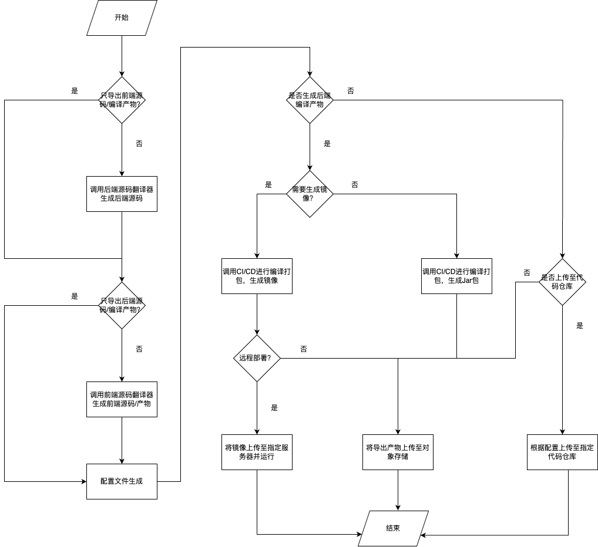
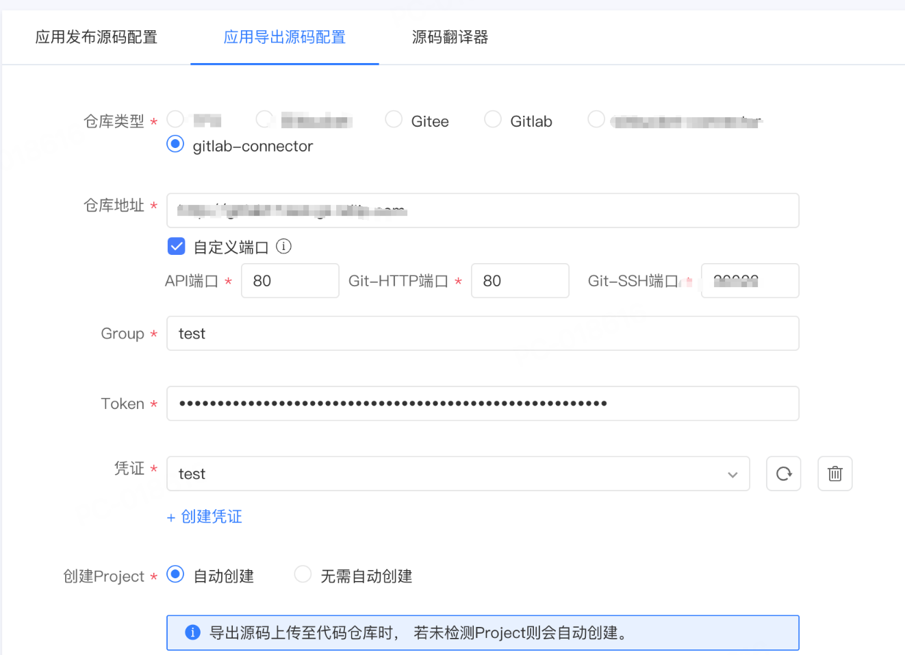
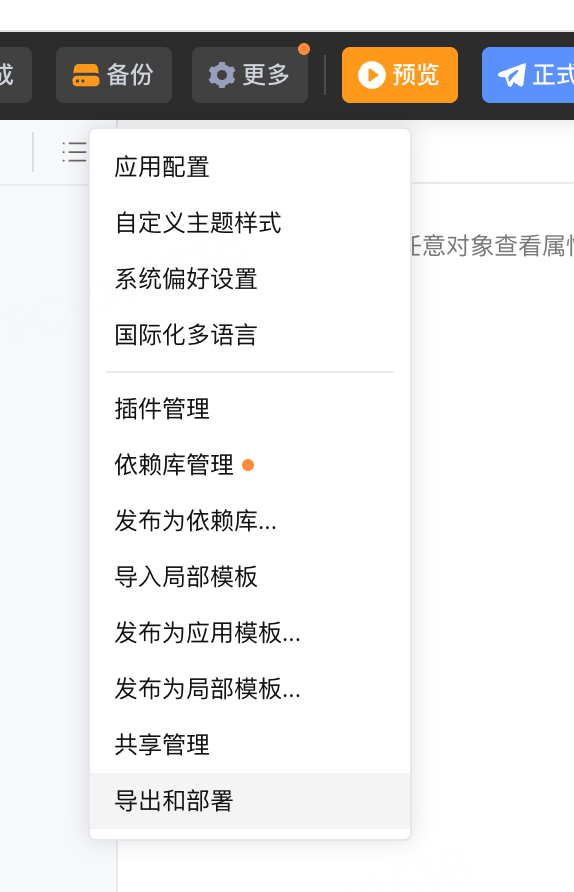
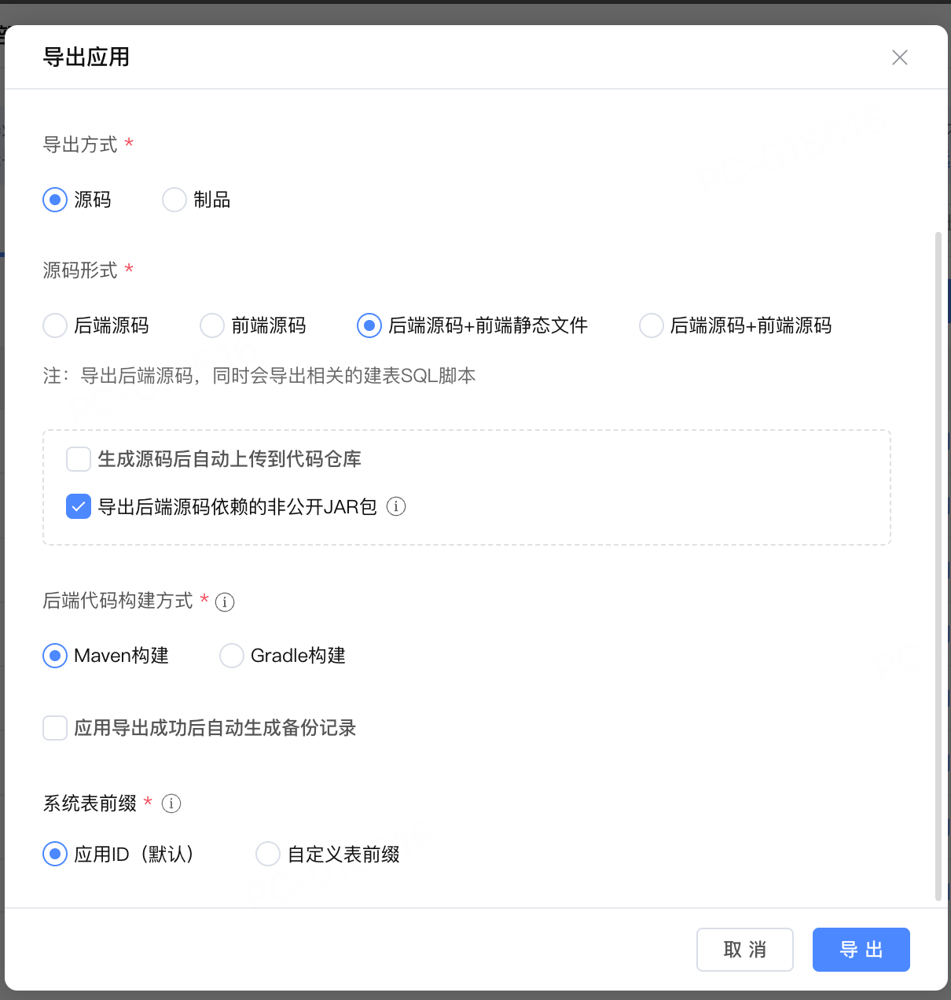
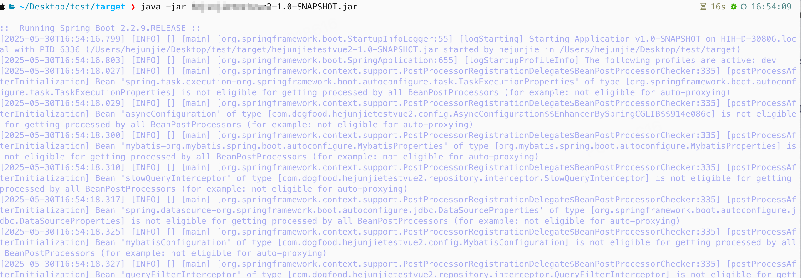
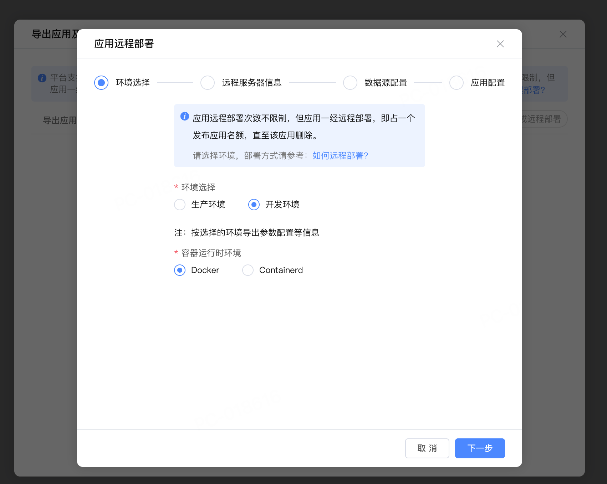
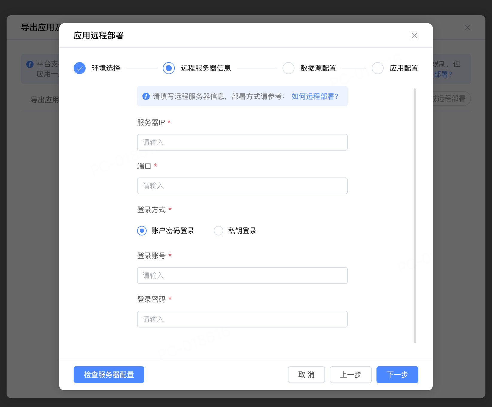
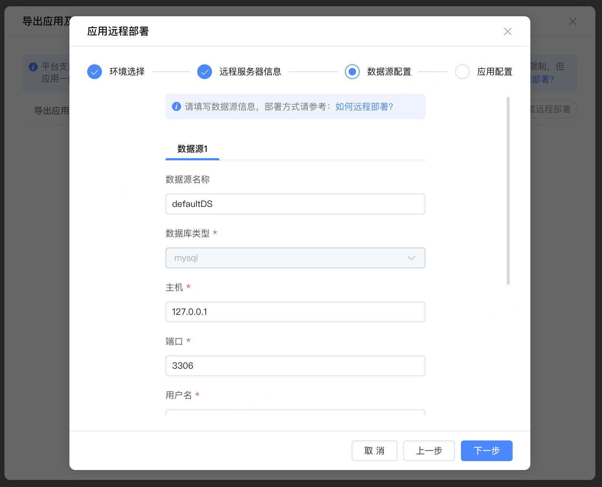
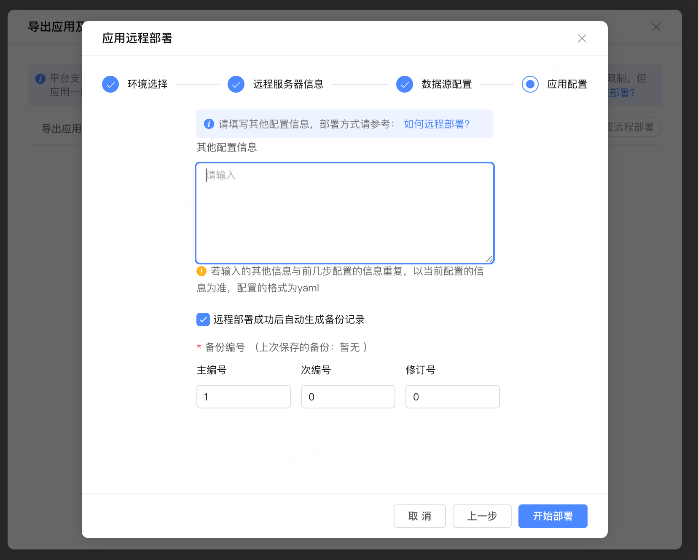

# 源码导出
作者：李英俊

<video src="https://jdvodmrvvfqeg.vod.126.net/jdvodmrvvfqeg/76256f6d1dbd4975bd93c53bfcbc6fc3.mp4?wsSecret=b2dcd89d97557ec45111d5a12b0f09bf&wsTime=1991028695" controls="controls" style="max-width: 100%;">
</video>

## 功能介绍

导出源码功能可以将Codewave平台的应用翻译成前后端源码并导出到S3或Gitlab等代码管理平台，以供二次开发或自行部署。

### 源码导出类型

- 后端源码+前端静态文件：后端为Java源码，前端为平台翻译后的静态文件
- 后端源码+前端源码：后端为Java源码，前端为JavaScript/TypeScript+HTML+CSS源码
- 镜像：编译打包后的docker镜像
- JAR包+前端静态文件：后端为编译后的Jar包，前端为基于生成的vue文件编译后的dist目录压缩包
- 远程部署：直接将镜像部署至指定服务器

平台也支持单独导出后端源码或前端源码；支持单独导出Jar包和静态文件

## 原理介绍

### 实现原理

源码导出将平台所使用的NASL翻译为Java（后端）+TypeScript/JavaScript+HTML+CSS（前端），并根据导出参数将源码进一步翻译和打包，生成最终产物。



### 导出产物目录结构

#### 后端源码+前端静态文件

```shell
.
├── dependency
│   └── ... // 后端源码依赖的依赖库等非公开包
├── Dockerfile
├── exec.sh
├── metadata.json
├── pom.xml
├── README.md
└── src
    └── main
        ├── java
        │   └── ... // Java后端源码
        └── resources
            ├── ... // 主要为配置文件
            └── static
                └── ... // 前端静态文件
```

#### 后端源码+前端源码

```shell
.
├── client // 前端源码
│   └── pc // 浏览器端源码
├── dependency
│   └── ... // 后端源码依赖的依赖库等非公开包
├── Dockerfile
├── exec.sh
├── metadata.json
├── pom.xml
├── README.md
└── src  // 后端源码
    └── main
```

#### 镜像

```shell
.
├── config  // 配置文件
│   ├── application-dev.yml
│   └── application.yml
├── db
│   └── all-defaultDS-mysql.sql  // 全量SQL文件
└── image
    └── xxx.tar.gz  // docker镜像
```

#### JAR包+前端静态文件

```shell
.
├── client  // 前端静态文件
│   └── ...
└── xxx.jar  // 后端Jar包
```

### 代码仓库连接器介绍

目前导出至源码仓库功能内置了Gitlab和Gitee两个源码仓库的支持。源码仓库连接器用于适配更多类型的源码仓库，使用默认租户上传之后即可在导出源码配置页面看到相关配置项，配置后即可在IDE内导出源码功能中使用。



### 部署配置文件介绍

在导出源码/产物后部署时一般需要根据实际情况对配置文件（位于`src/main/resources`目录下）进行修改，下面是一份配置文件，并添加了部分注释。

```yaml
management: # 管理端口等配置
  server:
    port: 9090
  metrics:
    export:
      prometheus:
        enabled: true
    tags:
      application: ${spring.application.id}
  endpoints:
    web:
      base-path: /management
      exposure:
        include:
          - health
          - prometheus
logging:
  file:
    path: ${user.home}
  path: ${logging.file.path}
spring:
  mvc:
    static-path-pattern: /**
  resources:
    static-locations[0]: classpath:/static/
    static-locations[1]: classpath:/static/assets/
    static-locations[2]: classpath:/static/packages/
  main:
    lazy-initialization: false
  application:
    name: test
    id: dfdad2c9-c8ed-4051-bf8f-85143da8e64b
  liquibase:
    enabled: false
  initDatabase:
    enabled: false
  quartz:
    enabled: false
  devtools:
    restart:
      enabled: false
    livereload:
      enabled: false
  datasource: # 数据库相关配置 根据实际使用的数据库进行修改
    type: com.zaxxer.hikari.HikariDataSource
    driver-class-name: com.mysql.cj.jdbc.Driver
    url: jdbc:mysql://xxx
    username: xxx
    password: ''
    connection-timeout: 3000
    hikari:
      poolName: Hikari
      auto-commit: false
      data-source-properties:
        cachePrepStmts: true
        prepStmtCacheSize: 250
        prepStmtCacheSqlLimit: 2048
        useServerPrepStmts: true
  servlet:
    multipart:
      max-file-size: 50MB
      max-request-size: 50MB
  messages:
    basename: i18n/messages
mybatis:
  mapper-locations: classpath*:mappings/**/*Mapper.xml
  type-handlers-package: com.test.repository.handler,com.netease.codewave.domain.datasource.handler
  configuration:
    database-id: mysql
    default-enum-type-handler: com.netease.codewave.domain.datasource.handler.AutoEnumTypeHandler
    log-impl: org.apache.ibatis.logging.log4j2.Log4j2Impl
    call-setters-on-nulls: true
server:
  port: 8080
  compression:
    enabled: true
    mime-types: text/html,text/xml,text/plain,text/css, application/javascript, application/json
    min-response-size: 1024
lcp:
  snowflakeNodeId: null
  authCenter:
    enable: true
    address: http://nuims.low-code:8081/nuims
    host: nuims.low-code
    hasUserCenter: true
    hasAuth: true
    security:
      lockMilliseconds: 900000
      maxFailureTimes: 5
    taskEnable: true
    noAuthPaths: /api/a_0bxb:POST,/upload/download_files:POST,/api/logics/downloadFile:POST,/api/logics/downloadFile:GET
  gatewayUrl: ''
  uiResourceAddress: /client.js
  gatewayType: light
  upload: # 对象存储配置 根据实际情况修改
    sinkType: s3
    sinkPath: /app
    s3Address: http://minio-api.test.com
    s3AccessKey: ''
    s3SecretKey: ''
    s3Bucket: lowcode-static
    access: public
    ttl: -1.0
    cdnAddress: ''
  logResponse: false
  logRequest: true
  report:
    host: ''
    tokenKey: ''
    domainId: null
    projectId: null
    reportIdMap: { }
    componentIdMap: { }
  nuims: http://nuims.low-code:8081
  private: null
  process:
    database:
      schema: ''
      table:
        prefix: PDFDAD2C_
      isPlugin: false
  frontends:
    pc:
      name: pc
      path: /
      title: PC端
      type: pc
  integration:
    hasJsonType: false
  quartzTables: { }
  multiDatasource: false
upload:
  base-path: app
file:
  types: text/plain;text/html;text/css;application/javascript
  event:
    watcher:
      dirs:
        - permission
        - validation
    enable: true
    rootPathEnv: SYSTEM_RELOAD_RESOURCE_PATH
validation:
  onDemandInterfaceGeneration: false
lcap:
  datasource:
    init-config[0]:
      name: defaultDS
      all: db/all-defaultDS-*.sql
      upgrade: db/upgrade-defaultDS-*.sql
  domain:
    package:
      base: com.test.test
      domain: com.test.test.domain
      structure: com.test.test.domain.structure
      anonymous_structure: com.test.test.domain.structure.anonymous
      entities: com.test.test.domain.entities
      enumeration: com.test.test.domain.enumeration
extensions:
  bims_log_aop:
    custom:
      projectInfoTabMapper: ''
      saleRateTabMapper: ''
      machineCardInfoTabMapper: ''
      tSysLogMapper: ''
      serviceInfoTabMapper: ''
  lcap_process_framework:
    custom:
      ignoreExceptionConfig: 'true'
logicAuthFlag: false
auth:
  token:
    secret: 8e5aa447fa55dbe
    expire: 86400
  plugin:
    list:
      Normal:
        category: main
  types: Normal
  Normal: '{"category":"main"}'
process:
  env: dev
connector:
  default_fileStorage_connection:
    accessKey: ''
    secretKey: ''
    bucket: lowcode-static
    privateBucket: 'false'
    endpoint: http://minio-api.test.com
    pathStyleAccessEnabled: 'true'
    cdnAddress: null
    sinkPath: /app
gw:
  app:
    addr:
      lowcode: http://lcap.low-code:22988
      nuims: http://nuims.low-code:8081
custom:
  api:
    context-path: /
  system:
    time-zone: user
fileStorage:
  lcap_default_connection: '{"refConnection":"","defaultConnection":true,"title":"系统文件存储"}'

```

## 实操演示

### 通用步骤

以下两个步骤为大部分部署方式都需要执行的通用步骤，这里统一进行介绍。

- 执行SQL。需要使用命令行/数据库管理工具连接到数据库执行。主要为表的创建语句。如果是第一次部署，执行`all-defaultDS-mysql.sql`；如果非首次部署、表结构发生了变更且在导出源码时选择了生成增量SQL，则仅需执行另外一个增量sql文件。
- 修改配置。下面列出几个常见需要修改的配置项：
     - spring.datasource.url：指定数据库的地址
     - spring.datasource.username：指定连接数据库的用户名
     - spring.datasource.password：指定连接数据库的密码
     - server.port：应用启动端口

### 后端源码+前端静态文件

#### 导出源码

在平台上导出源码下载到本地并解压





#### 本地部署

1. 安装依赖。使用命令行进入`dependency`目录执行安装脚本将依赖安装至本地的Maven仓库。在目录下存在两个安装脚本：

    - install-dependency.bat 该脚本供Windows10及以上版本的Windows使用。
    - install-dependency.sh 该脚本供MacOS和Linux使用。

    如果使用Windows10以下版本的系统，可使用 [install.cmd](https://gitee.com/KEHFAN_admin/cw-deploy-doc/blob/master/maven/install.cmd)
    ，将该脚本放置到dependency目录下执行。该脚本依赖7Zip，需要安装7Zip到C:\Program Files\7-Zip\目录下。

2. 执行SQL。使用数据库工具/命令行连接数据库执行`src/main/resources/db`目录下的SQL文件。

3. 配置修改。本地运行时，需要根据本地环境来修改配置文件。

    - 如导出开发环境，配置文件目录为：src/main/resources/application-dev.yml
    - 如导出生产环境，配置文件目录为：src/main/resources/application-online.yml

4. 编译。在源码目录下执行mvn clean package。注意须使用Java 1.8。

5. 运行。编译后的Jar包在target目录下。执行 `java -jar xxx.jar` 即可。



### 后端源码+前端源码

后端源码+前端源码与上面后端源码+前端静态文件的区别在于前端部分是以源码的形式提供，需要单独运行或编译为静态文件使用Nginx等Web服务器来处理请求。

下面将介绍如何本地运行前端服务。

1. 参照上一部分“后端源码+前端静态文件”启动后端服务。
2. 进入client/pc目录执行`npm install --legacy-peer-deps`安装前端源码所需依赖。
3. 根据需要修改vue.config.js配置文件。主要需要修改port以及proxy下的target。

```javascript
const path = require("path");

module.exports = {
    configureWebpack(config) {
        if (process.env.NODE_ENV === "production") {
            config.devtool = false;
        }


    },
    chainWebpack(config) {
        // 构建产物中删除console相关代码
        // config.optimization.minimizer('terser')
        //     .tap((args) => {
        //         args[0].terserOptions.compress.drop_console = ['info', 'log', 'warn'];
        //         return args;
        //     });
    },
    lintOnSave: false,
    runtimeCompiler: true,
    devServer: {
        compress: true,
        port: 8810,  // 前端服务端口号
        proxy: {  // 将下面的target修改为后端服务地址和端口号
            "/assets": {
                target: "http://localhost:8080",
                changeOrigin: true,
                autoRewrite: true,
            },
            "/api": {
                target: "http://localhost:8080",
                changeOrigin: true,
                autoRewrite: true,
            },
            "/rest": {
                target: "http://localhost:8080",
                changeOrigin: true,
                autoRewrite: true,
            },
            "^/gateway/": {
                target: "http://localhost:8080",
                changeOrigin: true,
                autoRewrite: true,
            },
            "^/gw/": {
                target: `http://localhost:8080`,
                changeOrigin: true,
                autoRewrite: true,
            },
            "^/upload": {
                target: "http://localhost:8080",
                changeOrigin: true,
                autoRewrite: true,
            },
        },
    },
};
```

4. 使用npm run serve运行前端服务器。

### 镜像

1. 前置条件：需安装docker。
2. 导出源码选择制品->镜像，将压缩包下载至需要部署服务的机器上并解压。
3. 执行SQL。使用数据库管理工具/命令行连接到数据库执行db文件夹下的SQL文件。
4. 修改配置文件。根据导出的环境不同修改config文件夹下的application-dev.yml或者application-online.yml。
5. 加载镜像。使用`docker load -i {docker镜像文件名}`加载image文件夹内的镜像。如`docker load -i export-test.tar.gz`。
6. 运行镜像。

```shell
docker run --name {容器名} -i -p {宿主机端口}:{配置文件中配置的服务端口} --mount type=bind,source={config目录地址},target=/config -d {docker加载后的镜像名}
例: docker run --name exportdemo -i -p 8080:8080 --mount type=bind,source=/root/deploy/image_export/config,target=/config  -d exportdemo:1675996801568
```

7. 其他注意事项
    - 日志。如果需要日志文件，可以在宿主机上创建一个文件夹并挂载到容器的`/root/logs`目录。

### Jar包+前端静态文件

使用该种方式推荐先导出一次后端源码获取到SQL文件并执行后再使用该方式部署服务。

1. 前置准备
    - JRE 1.8
    - Nginx或其他Web服务器，下面以Nginx为例
2. 导出源码选择制品->jar包+前端静态文件，将压缩包下载至需要部署服务的机器上并解压。
3. 后端部署。在启动命令后添加需要修改的配置参数。以端口号为例：`–server.port=8082`
   ，其中server.port是application-dev.yml中的配置标识，可以在后端源码中查看。下面是一个启动命令示例。

```shell
java -jar .\export111-1.0-SNAPSHOT.jar --server.port=8082 --spring.datasource.url="jdbc:mysql://localhost:3306/dev?useUnicode=true&characterEncoding=utf8&useSSL=false&useLegacyDatetimeCode=false&serverTimezone=Asia/Shanghai&nullCatalogMeansCurrent=true&zeroDateTimeBehavior=CONVERT_TO_NULL" --spring.datasource.username=root --spring.datasource.password=root
```

4. 前端部署和后端请求转发。修改Nginx配置文件。下面是一个实例。

```
http {
    server {
        listen 8080;  // 监听端口

        location / {
            root /test/client;  // 前端client文件夹路径
            index index.html index.htm;
            try_files $uri $uri/ /index.html;
            add_header Cache-Control "private, no-store, no-cache, must-revalidate, proxy-revalidate";
            add_header Pragma no-cache;
            add_header Expires 0;
        }

        // 下面四个均为后端端口转发 将地址和端口改为后端服务部署地址和端口
        location /api {
            proxy_pass http://localhost:8082;
        }

        location /rest {
            proxy_pass http://localhost:8082;
        }

        location /gateway {
            proxy_pass http://localhost:8082;
        }

        location /gw {
            proxy_pass http://localhost:8082;
        }
    }
 }
```

### 远程部署

1. 根据实际情况选择部署环境和容器运行时。
   
2. 输入部署服务器连接信息。可使用用户名&密码或者用户名&私钥登录。输入完成后可点击左下角“检查服务器配置”按钮检查是否能连接。点击下一步也会自动检查能否正常连接。
   
3. 输入数据库信息。
   
4. 如需修改配置（如服务端口等）可手动输入相关配置，具体格式可以导出源码查看完整配置文件。完成后点击开始部署。
   
5. 如果提示部署失败等，可登录部署服务器查看。如使用docker运行时，可以先执行`docker ps -a`找到对应容器，然后使用
   `docker logs {容器名}`来查看日志。

### 代码仓库连接器开发

#### 概览

3.13.2新增了代码仓库连接器，作用是在“导出应用”弹框勾选“生成源码后自动上传到代码仓库”时，额外的同步到代码仓库的处理，可插件化运作。

需要注意，该功能**仅供私有化用户使用**，只有defaulttenant租户的管理员账户能够上传代码代码仓库连接器。


#### 快速开始

1. 将以下依赖安装至本地Maven仓库（）：
   
   - [code-repository-connector-api](https://github.com/netease-lcap/codewave-architect-course/blob/main/docs/deployment/assets/code-repository-connector-api.zip)
   - [code-repository-connector-maven-plugin](https://github.com/netease-lcap/codewave-architect-course/blob/main/docs/deployment/assets/code-repository-connector-maven-plugin.zip)
   - [code-repository-connector-archetype](https://github.com/netease-lcap/codewave-architect-course/blob/main/docs/deployment/assets/code-repository-connector-archetype.zip)

2. 执行以下命令生成一个代码仓库连接器骨架（注意将{your_title}换为实际的连接器名称）：

```shell
mvn archetype:generate \
-DarchetypeGroupId=com.netease.codewave \
-DarchetypeArtifactId=code-repository-connector-archetype \
-DarchetypeVersion=1.0.0-SNAPSHOT \
-DgroupId=com.netease.codewave \
-DartifactId=code-repository-connector-{your_title}  \
-Dpackage=com.netease.codewave.coderepo.{your_title} \
-DarchetypeCatalog=local \
-DinteractiveMode=false
```

#### 生成连接器骨架

shell执行完毕后，日志中可见以下内容。

使用IDE打开这个目录进行插件开发，如下所示，插件骨架已经生成每个接口的empty-implements，并标注了TODO，开发者逐个完成TODO即可。

#### 依赖说明

Quick Start仅依赖Maven Central Repository，不依赖杭研Nexus，且杭研Gitlab也是非必须，如果访问不到杭研Gitlab，从这里下载源码。

#### 实现指南

插件开发者需要做的是实现每一个拓展点方法，实现内容为拓展点签名上所描述的功能。

实现示例：[gitlab-code-repository-connector](https://github.com/netease-lcap/codewave-architect-course/blob/main/docs/deployment/assets/gitlab-code-repository-connector.zip)

该示例实现了gitlab的导出操作以及group/project创建等必要操作。

#### 拓展点一览

| 接口                   | 方法                      | 功能描述                                                  | 备注                                                                                                                                                        |
|----------------------|-------------------------|-------------------------------------------------------|-----------------------------------------------------------------------------------------------------------------------------------------------------------|
| SourceCodeRepository | export                  | 执行导出到源码仓库                                             | 该方法会在生成源码后被调用，开发者在该方法内可以根据需要对源码进行处理（如调用Git推送代码）                                                                                                           |
| SourceCodeRepository | getTenantConfig         | 实现这个方法用于声明本连接器有哪些租户级配置定义，租户级配置渲染在“配置中心-源码配置-应用导出源码”页面 | 目前支持四种类型的配置：单行文本、多行文本、单选、多选；单选多选需要配置config参数（例：config.setConfig("[{\"name\": \"选项一\", \"code\": \"code1\"}, {\"name\": \"选项二\", \"code\": \"code2\"}]");） |
| SourceCodeRepository | getAppConfig            | 实现这个方法用于声明本连接器有哪些应用级配置定义，应用级配置渲染在”IDE-更多-导出源码“弹框      | 目前支持四种类型的配置：单行文本、多行文本、单选、多选；单选多选需要配置config参数（例：config.setConfig("[{\"name\": \"选项一\", \"code\": \"code1\"}, {\"name\": \"选项二\", \"code\": \"code2\"}]");） |
| SourceCodeRepository | addGroup                | 添加group，选择自动创建Project时会调用该方法创建group                   |                                                                                                                                                           |
| SourceCodeRepository | getSourceCodeRemoteAddr | 需要拼接并返回项目导出地址                                         |                                                                                                                                                           |

#### 拓展点被调用时机

IDE导出应用勾选“生成源码自动上传到代码仓库”时，程序入口为low-code工程UploadAppCodeFileExportHandler#pushToGitlab方法的调用新插件分支。

#### 异常处理

协议允许并仅允许内部抛出以下异常，并承诺进行以下处理

- `SourceCodeRepositoryException` 抛出该异常时，框架承诺将e.getMessage()展示到页面，可通过抛出这个异常将错误信息告知用户，当lcap的日志级别为debug时，还会通过log.error打印堆栈信息
- `RuntimeException` 抛出其他异常时，框架只将"内部错误"打印向用户，但依然会通过log.error打印堆栈


#### 插件打包

执行`mvn package`对插件进行打包

执行完毕后，target目录下会生成连接器zip压缩包。

#### 插件交付方案

将打包后产生的zip文件，通过资产中心上传至CodeWave平台，上传完毕后，配置中心-源码配置-应用导出源码页面的“仓库类型”中，会出现该源码仓库插件。注意只有defaulttenant租户的管理员账户能够上传代码代码仓库连接器。
