# 前端翻译器插件
## 翻译器插件开发流程
### 背景&目的
在CodeWave平台中，前端源码支持灵活定制以满足客户的不同需求。定制机制主要由如下两个特性组成，分别对应不同复杂度的定制：

1. 工程模板。
    -  对项目源码做**简单定制**，上手难度较低。
    -  修改初始的项目模板文件，如增加文件、图片等。但无法修改翻译器后续生成出的代码。
2. 前端代码翻译器插件。
    - 对项目源码做**更复杂、更加细节的定制**，上手难度相对较高。但完整覆盖工程模板的所有能力。
    - 对代码生成的整个过程进行定制，让生成出的代码使用自研脚手架、微前端框架。
### 技术储备&插件原理介绍
#### 技能储备
用户最好满足如下条件：
1. 了解编译原理，包括抽象语法树、中间表示、代码生成等基本概念。
2. 熟悉TypeScript编程。

#### 术语对齐
| **术语** | **解释** |
| --- | --- |
| **NASL**(**N**ext **A**pplication **S**pecific **L**anguage) | **“NASL** 是网易数帆 CodeWave 智能开发平台用于描述 Web 应用的领域特定语言。它主要包含两部分：**基础语言**和Web应用特定领域（如数据定义、数据查询、页面、流程、权限等）的**子语言集合**。”<br><br>(来源：<https://nasl.codewave.163.com/>) |
| **抽象语法树**(**A**bstract **S**yntax **T**ree, AST) | “在计算机科学中，**抽象语法树**（**A**bstract **S**yntax **T**ree，AST），或简称**语法树**（Syntax tree），是源代码语法语法结构的一种抽象表示。它以树状的形式表现编程语言的语法结构，树上的每个节点都表示源代码中的一种结构。”<br><br>（来源：Wiki <https://zh.wikipedia.org/zh-hans/%E6%8A%BD%E8%B1%A1%E8%AA%9E%E6%B3%95%E6%A8%B9）><br><br>NASL的AST结构可以参考：<https://nasl.codewave.163.com/docs/current/ast/intro> |
| **中间表示**(**I**ntemediate **R**epresentations，IR) | 从**抽象语法树**到目标语言的编译通常不是一蹴而就。我们往往会先将**抽象语法树**处理成为介于两者之间的中间数据结构，被称作中间表示。这种中间的数据结构可以和目标语言无关。 |
| **代码生成**(**Code** **Gen**eration, **Codegen**) | 指从中间表示得到到目标语言的过程。 |
| **翻译** | 在本文档中，特指“**NASL**的**抽象语法树**到目标领域的语言”的**代码生成**。 |
| **翻译器** | 执行**翻译**的程序。 |
| **前端代码翻译器** | 在本文档中，特指从**NASL**到前端领域代码（例如，JavaScript、TypeScript等语言，React、Vue等框架代码）的**翻译器**。 |
| **代码生成器** | 特指前端代码翻译器中，负责驱动整个翻译过程，生成源码的程序。 |
| **翻译器插件** | 指可以改变现有**前端代码翻译器**行为的程序。<br><br>**前端代码翻译器**支持用户通过**翻译器插件**的形式修改行为，使其翻译出符合自身需求的代码，乃至不同目标语言的代码。 |
| **翻译器插件脚手架** | 兼具前端翻译器插件开发初始化、调试、打包功能的仓库。 |

#### 翻译器架构

整个翻译器的架构由以下部分构成：
1. 中间表示（下称IR）。作为NASL AST和源代码之间的中介数据结构，与具体的前端框架无关、与具体的语言无关。
2. IR构建器（IR Builder）。负责将NASL AST转换为框架无关的IR，在这个步骤做一些翻译到各个目标前端框架都通用的处理。
3. 代码生成器。负责调用其他所有插件，是翻译器的核心组件。它以NASL AST和配置项作为输入，调用相关插件，将代码输出到虚拟文件系统中。
4. 插件系统和插件生态
    - JavaScript/TypeScript代码生成
    - 框架代码生成（目前主要包括React代码生成）
      - 状态管理
      - 应用路由
    - 国际化
    - 项目结构
    - 组件库适配器
    - 预置组（Presets）
    - 微前端
    - 应用代码生成器
    - ...

#### 前端翻译器插件开发使用流程
前端翻译器插件的开发使用流程如下图所示。

1. 主要分为如下几个阶段：
2. 插件开发调试。
3. 插件使用。
    - 打包并上传。用户利用脚手架打包前端翻译器插件和翻译器本体，并上传到平台上。
    - 翻译。平台调用用户上传的翻译器及其插件，翻译应用。
本部分主要关注图中重点标出的1)插件开发调试阶段。
### 翻译器插件能力介绍
包括但不限于：
1. 调整前端项目结构，使其符合某种的开发规范。
2. 调整前端项目依赖（package.json）。
3. 支持新的前端脚手架（如Rspack、Vite，或是自研脚手架）。
4. 支持其他的微前端框架（如无界）。
5. 其他修改前端工程模板无法完成的源码定制需求……
### 插件开发
#### 环境要求
1. git
2. node.js >= 18（或最新的LTS版本）
3. pnpm >= 9

#### 脚手架的环境配置
脚手架仓库：https://github.com/netease-lcap/nasl-frontend-generator-playground

克隆插件脚手架项目到本地，并安装依赖
```bash
git clone git@github.com:netease-lcap/nasl-frontend-generator-playground.git
cd nasl-frontend-generator-playground
pnpm i
```
#### 插件脚手架目录结构
插件脚手架目录结构如下。其中：
1. `playground/container.ts`是插件打包的入口，引用用户自定义的插件，并注入容器。
2. 而 `playground/customization` 文件夹下存放用户修改、新增的插件，供`container.ts`引用。
```text
.
├── README.md                                    # 脚手架说明文档
├── dist                                         # 打包后的插件。未打包前可能为空或不存在
│   ├── README.md
│   ├── description.json
│   └── plugin.js                                # 打包后的插件 js
├── out                                          # 调试结果的输出目录
├── nodemon.json 
├── package.json
├── playground                                   # 脚手架代码目录
│   ├── container.ts                             # 构建插件系统依赖注入容器，是用户插件的总入口
│   ├── customization                            # 用户自定义插件的目录
│   │   ├── custom-compiler.ts                   # 插件使用示例：定制前端打包工具(脚手架)
│   │   ├── custom-eslint.ts                     # 插件使用示例：增加eslint
│   │   ├── custom-microfrontend.ts              # 插件使用示例：修改微前端框架
│   │   ├── custom-npm-package.ts                # 插件使用示例：修改package.json中的npm包
│   │   ├── custom-project-layout.ts             # 插件使用示例：修改项目结构
│   │   └── custom-performance.ts                # 插件使用示例：优化前端性能
│   ├── debug.ts                                 # 调试入口文件
│   ├── envs.ts                                  # 环境变量
│   ├── fixtures                                 # 预置的应用NASL目录
│   │   ├── b0fb29f7-9cf3-4f47-b49d-4935183aaa66 # 应用1 NASL
│   │   │   └── annotation-1718699989055
│   │   └── e6196626-e639-4d52-b6f1-f1ed00eef706 # 应用2 NASL
│   │       └── annotation-1716975881205
│   ├── index.ts
│   ├── translate.ts
│   ├── types.ts
│   └── utils.ts
├── plugin.zip                                   # 打包后的插件压缩包
├── pnpm-lock.yaml
├── public                                       # 用户插件包的静态文件目录
│   ├── README.md                                # 插件包的说明文档
│   └── description.json                         # 插件包的描述文件
├── rsbuild.config.ts
├── scripts                                      # 辅助打包插件的代码
│   ├── build-plugin.ts
│   └── test-plugin.ts
└── tsconfig.json
```
#### 一些约定
1. 插件位置。用户的对插件的所有修改，都建议放在playground/customization目录下。
2. 插件打包的入口是playground/container.ts。
    - 其中的makeContainer函数会被代码生成器执行，生成依赖注入容器。这个容器包含翻译所需的所有插件实例。

简而言之，插件开发就是在container.ts中的makeContainer函数中修改默认的Container，替换原本的插件或是增加插件。

#### 插件开发
翻译服务在翻译应用时，会拉取当前应用绑定的插件压缩包，读取其中的makeContainer函数创建容器。每一个容器都包含一套能执行完整的NASL到源码翻译的翻译器。

未经任何定制的官方的标准实现为：

```ts
import { makeDefaultContainer } from "@lcap/nasl-unified-frontend-generator";

export async function makeContainer() {
  return makeDefaultContainer(); // 构造默认容器
}
```

若想要定制生成的源码，则可以新增或替换容器中已有的插件。以下是一个做了4种定制的例子：

```ts
import { makeDefaultContainer } from "@lcap/nasl-unified-frontend-generator";
import { setupPerformanceOptions } from "./customization/custom-performance";
import { setupNpmPackages } from "./customization/custom-npm-package";
import { setupCompilerToWebpack } from "./customization/custom-compiler";
import { setupMicrofrontend } from "./customization/custom-microfrontend";

export async function makeContainer() {
  const container = makeDefaultContainer(); // 构造默认容器
  return Promise.resolve(container)
    .then(setupPerformanceOptions) // 修改性能配置
    .then(setupNpmPackages) // 修改npm包
    .then(setupCompilerToWebpack) // 修改前端编译器为Webpack
    .then(setupMicrofrontend); // 修改微前端配置
}
```

### 插件调试
#### 环境变量配置
1. 确保.env文件存在。如果你的仓库根目录下没有.env文件，需要将.env.template复制到.env。
2. 修改NASL_ZLIB_PATH变量为要使用的应用的NASL AST。
    - 我们在插件的脚手架项目中，预置了几个简单应用的NASL AST，其命名为annotation-{timestamp}。这些文件是NASL AST的JSON表示，并经zlib压缩的结果，是二进制的，需要解压后打开。解压相关代码可以参考：playground/utils.ts内的readNASLZLibObject函数。
    - 你可以修改NASL_ZLIB_PATH的值，换成你的playground/fixtures目录下的annotation文件。
      - React应用时，可以使用默认值。默认值为"./playground/fixtures/b0fb29f7-9cf3-4f47-b49d-4935183aaa66/annotation-1718699989055"
#### 启动调试
执行如下命令启动翻译过程，进行翻译调试。
这个命令会执行playground/debug.重新ts文件，并监控playground目录下所有*.ts文件的改动，有改动的时候执行翻译过程。
```bash
pnpm dev
```
如果一切顺利，你就会在终端看到形如如下的日志：
```text
[19:19:25.743] INFO (5585): [翻译] 开始翻译
[19:19:25.806] INFO (5585): [compileAsProject] 开始翻译代码
[19:19:25.806] INFO (5585): [compileAsProject] 启用制品日志插件
[19:19:25.806] INFO (5585): [compileAsProject] 载入项目模板
[19:19:25.808] INFO (5585): [downloadDependenciesToProject] 前端依赖库列表
    feExtensions: [
      "@lcap/pc-react-ui@1.0.0"
    ]
[19:19:25.808] INFO (5585): [downloadDependenciesToProject] 开始下载前端依赖库
[19:19:25.808] INFO (5585): [downloadDependenciesToProject] 下载依赖库
    ext: {
      "name": "@lcap/pc-react-ui",
      "version": "1.0.0",
      "kind": "standard"
    }
[19:19:25.808] INFO (5585): [翻译过程] 开始翻译
[19:19:25.848] INFO (5585):
    0: {
      "kind": "standard",
      "name": "@lcap/pc-react-ui",
      "version": "1.0.0"
    }
[19:19:25.848] INFO (5585): [downloadDependenciesToProject] 下载文件列表
    urls: [
      "https://minio-api.codewave-test.163yun.com/lowcode-static/packages/@lcap/pc-react-ui@1.0.0/dist-theme/index.js",
      "https://minio-api.codewave-test.163yun.com/lowcode-static/packages/@lcap/pc-react-ui@1.0.0/dist-theme/index.css"
    ]
[19:19:26.197] INFO (5585): [翻译过程] 翻译结束
[19:19:27.631] INFO (5585): [downloadDependenciesToProject] 依赖库下载完成
[19:19:27.631] INFO (5585): [compileAsProject] 启用全局前缀: sysPrefixPath = /wdk-dev
[19:19:27.632] INFO (5585): [compileAsProject] rspack配置
    publicPath: "//minio-api.codewave-test.163yun.com/lowcode-static/csautotest/b0fb29f7-9cf3-4f47-b49d-4935183aaa66/dev/test/"
    backendUrl: "http://dev.aasdasd.csautotest.lcap.codewave-test.163yun.com/wdk-dev"
[19:19:27.646] INFO (5585):
    0: "/pc/README.md"
    1: "/pc/client-lazyload-template.js"
    2: "/pc/index.html"
    3: "/pc/package.json"
    4: "/pc/pnpm-lock.yaml"
    5: "/pc/public/vite.svg"
    6: "/pc/rspack.config.js"
    7: "/pc/src/Hooks.tsx"
    8: "/pc/src/Router.tsx"
    9: "/pc/src/entry/helper.tsx"
    10: "/pc/src/entry/index.tsx"
    11: "/pc/src/index.css"
    12: "/pc/src/init.ts"
    13: "/pc/src/main.tsx"
    14: "/pc/src/nasl.ts"
    15: "/pc/src/router/component.tsx"
    16: "/pc/src/router/hooks.tsx"
    17: "/pc/src/vite-env.d.ts"
    18: "/pc/src/packages/@lcap/pc-react-ui@1.0.0/dist-theme/index.css"
    19: "/pc/src/packages/@lcap/pc-react-ui@1.0.0/dist-theme/index.js"
    20: "/pc/src/apis.tsx"
    21: "/pc/src/pages/Page2.tsx"
    22: "/pc/src/pages/Ww.tsx"
    23: "/pc/src/components/FrontendEventWrapper.tsx"
    24: "/pc/src/platform.config.ts"
    25: "/pc/src/global-variables.tsx"
    26: "/pc/tsconfig.json"
[19:19:27.646] INFO (5585): [翻译] 写入文件
    0: "/pc/README.md"
    1: "/pc/client-lazyload-template.js"
    2: "/pc/index.html"
    3: "/pc/package.json"
    4: "/pc/pnpm-lock.yaml"
    5: "/pc/public/vite.svg"
    6: "/pc/rspack.config.js"
    7: "/pc/src/Hooks.tsx"
    8: "/pc/src/Router.tsx"
    9: "/pc/src/entry/helper.tsx"
    10: "/pc/src/entry/index.tsx"
    11: "/pc/src/index.css"
    12: "/pc/src/init.ts"
    13: "/pc/src/main.tsx"
    14: "/pc/src/nasl.ts"
    15: "/pc/src/router/component.tsx"
    16: "/pc/src/router/hooks.tsx"
    17: "/pc/src/vite-env.d.ts"
    18: "/pc/src/packages/@lcap/pc-react-ui@1.0.0/dist-theme/index.css"
    19: "/pc/src/packages/@lcap/pc-react-ui@1.0.0/dist-theme/index.js"
    20: "/pc/src/apis.tsx"
    21: "/pc/src/pages/Page2.tsx"
    22: "/pc/src/pages/Ww.tsx"
    23: "/pc/src/components/FrontendEventWrapper.tsx"
    24: "/pc/src/platform.config.ts"
    25: "/pc/src/global-variables.tsx"
    26: "/pc/tsconfig.json"
[19:19:27.646] INFO (5585): [代码写入] 开始写入output目录
[19:19:27.665] INFO (5585): [代码写入] 全部写入完成
[19:19:27.665] INFO (5585): [翻译] 翻译结束
```
你可以在output目录看到这些翻译出的文件。

在修改插件之后，翻译会自动重新执行，你可以观察这些文件来调试你的插件。

### 插件构建
开发完成插件之后，可以执行如下命令打包插件，产出插件的压缩包以供后续上传使用。
```bash
pnpm build:plugin
```
注意：
1. 脚手架通过检查public/description.json是否存在来判断当前是否是在创建一个新插件。

若未创建过插件（），则会询问插件名、插件版本号；否则，脚手架会询问是否要更新插件的版本号。如下：
```text
? 是否更新[我的翻译器插件@1.0.1]的版本号 yes
? 请输入新的版本号 1.0.2
// public/description.json
{
  name: '我的翻译器插件',
  version: '1.0.2',
  ideVersion: '3.11',
  description: '测试',
  endType: 'frontend',
  symbol: '7e6c728a-6680-43ba-b283-25904d967432'
}
```
控制台会输出：
```text
开始打包插件
打包完成
压缩包路径: /Users/xxx/workspace/nasl-frontend-generator-playground/plugin.zip
```
### 案例介绍

#### React应用：增加 lint 命令及配置
我们来考虑一个简单的定制需求，目标如下：
1. 为项目增加lint命令。
2. 修改package.json，增加eslint作为devDependencies。
3. 增加eslint配置文件。

执行如下步骤：
1. 创建插件。我们需要创建插件项目，请参考“创建插件项目”一节。
2. 新建插件文件。在playground/customization目录下新建插件文件，命名为custom-test.ts。
3. 在custom-test.ts中撰写插件逻辑。
```ts
import {
  GeneratorInfrastructureDomain,
  JavaScriptDomain,
  ServiceMetaKind,
} from "@lcap/nasl-unified-frontend-generator";
import { Container } from "inversify";

export function setupTestPlugins(container: Container) {
  const npmPackageJSONManagerPlugin =
    container.get<JavaScriptDomain.FrontendApplicationDomain.NpmPackageJSONManager>(
      ServiceMetaKind.NpmPackageJSONManager
    );

  // 增加lint命令
  npmPackageJSONManagerPlugin.patch({
    scripts: {
      lint: "eslint --fix",
    },
  });

  // 增加eslint作为依赖
  npmPackageJSONManagerPlugin.patch({
    devDependencies: {
      eslint: "latest",
    },
  });

  // 创建eslint配置文件
  const fsPlugin =
    container.get<GeneratorInfrastructureDomain.FileSystemProvider>(
      ServiceMetaKind.FileSystemProvider
    );
  fsPlugin.write("/.eslintrc.js", `module.exports = { extends: 'eslint:recommended' }`);

  return container;
}
```
4. 修改playground/container.ts中的makeContainer函数，调用刚刚写好的插件。
```ts
import { makeDefaultContainer } from "@lcap/nasl-unified-frontend-generator";
import { setupTestPlugins } from "./customization/custom-test";

export async function makeContainer() {
  const container = makeDefaultContainer(); // 构造默认容器
  return Promise.resolve(container).then(setupTestPlugins);
}
```
现在，执行pnpm dev开始调试插件。插件的调试方式可以参考“插件调试”一节。
调试启动后，源码会输出到out目录下。现在out目录下的内容为：
```text
.
├── .eslintrc.js
├── package.json
└── ... # 省略
```
而package.json的内容则变为了：
```json
{
  "name": "react-template",
  "private": true,
  "version": "0.0.0",
  "scripts": {
    "dev": "rspack serve -c ./rspack.config.js",
    "start": "npm run dev",
    "build": "rspack build -c ./rspack.config.js",
    "postyalc": "pnpm i",
    "lint": "eslint --fix"
  },
  "dependencies": {
    "@lcap/basic-template": "http://minio-api.codewave-test.163yun.com/lowcode-static/packages/%40lcap/basic-template%401.4.1/zip.tgz",
    "ahooks": "3.7.10",
    "antd": "5.14.0",
    "i18next": "23.11.5",
    "lodash": "4.17.11",
    "mobx": "6.12.0",
    "mobx-react-lite": "4.0.5",
    "react": "18.2.0",
    "react-dom": "18.2.0",
    "react-router-dom": "6.20.1"
  },
  "resolutions": {
    "commander": "11.1.0"
  },
  "devDependencies": {
    "@rspack/cli": "0.5.3",
    "@rspack/core": "0.5.3",
    "@rspack/plugin-react-refresh": "0.5.3",
    "@types/react": "18.2.64",
    "@types/react-dom": "18.2.18",
    "html-webpack-plugin": "5.6.0",
    "react-refresh": "0.14.0",
    "typescript": "5.4.4",
    "eslint": "latest"
  }
}
```
#### Vue应用：通过文件读写插件增加lint命令及配置
> ⚠️ 对Vue应用，目前我们暂时只开放了在导出源码之前通过文件系统插件读写文件的能力。
且在调试之前，需要用户自己手动导出Vue源码，放入到脚手架目录中。

我们来考虑一个简单的定制需求，目标如下：
1. 为项目增加lint命令。
2. 修改package.json，增加eslint作为devDependencies。
3. 增加eslint配置文件。

步骤：
1. 下载导出的Vue应用源码。解压后，放入脚手架的playground/fixtures/client目录中。此时client目录下应该有pc或是h5目录。形如：

```text
client
└── pc
    ├── babel.config.js
    ├── mock
    │   └── index.js
    ├── package.json
    ├── public
    │   ├── assets
    │   │   ├── avatar-default.svg
    │   │   ├── cloud-ui
    │   │   │   ├── 1.jpg
    │   │   │   └── 3.jpg
    │   │   ├── error-code.svg
    │   │   ├── footer-icon-sns.png
    │   │   ├── lcap-logo-light.svg
    │   │   ├── login-bg-1.jpg
    │   │   ├── tenant-expired.png
    │   │   ├── weibo@2x.png
    │   │   └── weixin@2x.png
    │   ├── favicon.ico
    │   └── index.html
    ├── src
    │   ├── App.vue
    │   ├── assets
    │   │   └── css
    │   │       └── index.css
    │   ├── components
    │   │   └── index.js
    │   ├── init.js
    │   ├── library.js
    │   ├── main.js
    │   ├── metaData
    │   ├── metaData.js
    │   ├── platform.config.json
    │   ├── plugins
    │   │   ├── dataTypes
    │   │   │   └── index.js
    │   │   └── router
    │   │       ├── index.js
    │   │       └── processService.js
    │   ├── router
    │   │   ├── guards
    │   │   │   └── title.js
    │   │   ├── index.js
    │   │   ├── init.js
    │   │   └── routes.js
    │   ├── setConfig.js
    │   └── views
    │       ├── dashboard
    │       │   └── index.vue
    │       ├── index
    │       │   └── index.vue
    │       ├── noAuth
    │       │   └── index.vue
    │       └── notFound
    │           └── index.vue
    └── vue.config.js
```

2. 视情况修改.env环境变量中的源码目录（可选）。
在.env文件中，LEGACY_CLIENT_PATH变量的默认值为
```text
LEGACY_CLIENT_PATH=./playground/fixtures/client
```
这个变量用来控制导入的Vue应用源码放在哪里。你可以修改它，指向自己的源码目录。
1. 创建插件。我们需要创建插件项目，请参考“创建插件项目”一节。
2. 新建插件文件。在playground/customization目录下新建插件文件，命名为custom-test.ts。
3. 在custom-test.ts中撰写插件逻辑。

```ts
import {
  GeneratorInfrastructureDomain,
  LifeCycleHooksPlugin,
  Logger,
  ServiceMetaKind,
} from "@lcap/nasl-unified-frontend-generator";
import dedent from "dedent";
import { Container, inject, injectable } from "inversify";

export function setupTestPlugins(container: Container) {
  @injectable()
  class MyEslintPlugin extends LifeCycleHooksPlugin {
    constructor(
      @inject(ServiceMetaKind.FileSystemProvider)
      protected fileSystemProvider: GeneratorInfrastructureDomain.FileSystemProvider
    ) {
      super(fileSystemProvider);
    }
    afterAllFilesGenerated(): void {
      const logger = Logger("自定义Lint插件");

      logger.info("写入eslint配置文件");
      this.fileSystemProvider.write(
        "/pc/eslint.config.mjs",
        dedent`
          // @ts-check
          import eslint from '@eslint/js';
          import tseslint from 'typescript-eslint';

          export default tseslint.config(
            eslint.configs.recommended,
            ...tseslint.configs.recommended,
          );
          `
      );
      const packageJSONPath = "/pc/package.json";
      const res = this.fileSystemProvider.read(packageJSONPath) ?? "{}";
      const json = JSON.parse(res);
      json.devDependencies["eslint"] = "^8.0.0";
      // 增加lint 命令
      json.scripts = {
        ...json.scripts,
        lint: "eslint --fix",
      };
      logger.info(json, "修改后的package.json内容");
      this.fileSystemProvider.write(packageJSONPath, JSON.stringify(json, null, 2));
    }
  }

  container
    .bind<GeneratorInfrastructureDomain.CodeGenerationLifecycleHooks>(
      ServiceMetaKind.CodeGenerationLifecycleHooks
    )
    .to(MyEslintPlugin);

  return container;
}
```
6. 修改container.ts，加载刚刚创建好的插件。
```ts
import { makeDefaultContainer } from "@lcap/nasl-unified-frontend-generator";
import { setupTestPlugins } from "./customization/custom-test";

export async function makeContainer() {
  const container = makeDefaultContainer(); // 构造默认容器
  return Promise.resolve(container).then(setupTestPlugins); // 修改npm包
}
```
现在，执行pnpm dev开始调试插件。插件的调试方式可以参考“插件调试”一节。
调试启动后，源码会输出到out目录下。刚刚修改的package.json处于 out/pc/package.json，其内容为：
```json
{
  "name": "asjkhdashjkkasjd",
  "version": "0.1.0",
  "private": true,
  "scripts": {
    "serve": "vue-cli-service serve",
    "build": "vue-cli-service build",
    "lint": "eslint --fix"
  },
  "dependencies": {
    "@vusion/utils": "^0.4.10",
    "babel-polyfill": "^6.26.0",
    "core-js": "^3.6.5",
    "vue": "2.6.12",
    "vue-i18n": "^8.28.2",
    "lcap-login": "1.2.3",
    "@lcap/pc-ui": "http://minio-api.codewave-test.163yun.com/lowcode-static/packages/@lcap/pc-ui@1.2.0/zip.tgz",
    "@lcap/core-template": "http://minio-api.codewave-test.163yun.com/lowcode-static/packages/@lcap/core-template@1.5.0/zip.tgz"
  },
  "devDependencies": {
    "@vue/cli-plugin-babel": "~4.5.13",
    "@vue/cli-plugin-eslint": "~4.5.13",
    "@vue/cli-plugin-router": "~4.5.13",
    "@vue/cli-service": "~4.5.13",
    "babel-eslint": "^10.1.0",
    "eslint": "^8.0.0",
    "eslint-plugin-vue": "^6.2.2",
    "mockjs": "^1.1.0",
    "vue-template-compiler": "2.6.12",
    "webpack": "^4.47.0"
  }
}
```
eslint.config.mjs文件位于out/pc/eslint.config.mjs，其内容为：
```js
// @ts-check
import eslint from '@eslint/js';
import tseslint from 'typescript-eslint';

export default tseslint.config(
  eslint.configs.recommended,
  ...tseslint.configs.recommended,
);
```
至此，我们成功达成了需求。
#### React应用：接入无界微前端框架
我们来考虑一个相对复杂的定制需求：将CodeWave导出的React应用代码使用单例模式接入[无界微前端](https://github.com/Tencent/wujie/tree/master)。
> 无界微前端是一款基于 Web Components + iframe 微前端框架，具备成本低、速度快、原生隔离、功能强等一系列优点。
1. 下载主应用。
如果你没有主应用，可以先执行如下命令克隆无界官方项目。接下来，我们使用无界官方的示例作为主应用，编写前端翻译器插件将React应用接入主应用。
```bash
git clone https://github.com/Tencent/wujie.git
cd wujie
pnpm i
pnpm start
```
注意：如果你使用node 18来启动这个主应用，可能会报错error:03000086:digital envelope routines::initialization error'。这个时候可使用如下命令启动主应用
```bash
NODE_OPTIONS=--openssl-legacy-provider pnpm start
```
接着你可以通过[http://localhost:7700/#/home](http://localhost:7700/#/home)访问主应用。

2. 配置主应用。
    - 在主应用的examples/main-react/src/index.js文件中，注册子应用：
```js
setupApp({
  name: "lcap",
  url: hostMap("//localhost:8810/"),
  attrs,
  exec: true,
  fetch: credentialsFetch,
  degrade,
  ...lifecycles,
});
```

  - 再创建Lcap组件examples/main-react/src/pages/Lcap.js，如下。这个组件的代码基本复制自examples/main-react/src/pages/React16.js，但是根据我们刚刚注册的子应用修改了path和react16Url等变量。
```js
import React from "react";
import hostMap from "../hostMap";
import WujieReact from "wujie-react";
import { useNavigate, useLocation } from "react-router-dom";

export default function React16() {
  const navigation = useNavigate();
  const location = useLocation();
  const path = location.pathname.replace("/lcap-sub", "").replace("/lcap", "").replace("/",""); ////
  const react16Url = hostMap("//localhost:8810/") + path;
  const props = {
    jump: (name) => {
      navigation(`/${name}`);
    },
  };
  return (
    // 单例模式，name相同则复用一个无界实例，改变url则子应用重新渲染实例到对应路由
    <WujieReact
      width="100%"
      height="100%"
      name="react16"
      url={react16Url}
      sync={!path}
      props={props}
    ></WujieReact>
  );
}
```
  - 配置React主应用的路由，在examples/main-react/src/App.js文件中，增加一条路由。
```js
<Routes>
// 省略...新增下面一条路由
  <Route exact path="/lcap" element={<Lcap />} /> 
  <Route exact path="/all" element={<All />} />
  <Route path="*" element={<Navigate to="/home" replace />} />
</Routes>
```
  - 并增加一条import语句引入刚刚定义好的Lcap组件。
```js
import Lcap from "./pages/Lcap";
```
至此，主应用配置完毕。这些内容和翻译器插件的开发本身无关。
3. 创建插件。我们需要创建插件项目，请参考“创建插件项目”一节。
4. 新建插件文件。在playground/customization目录下新建插件文件，命名为custom-test.ts。
5. 在custom-test.ts中撰写插件逻辑。
```ts
import {
  JavaScriptDomain,
  MicroFrontendPlugin,
  NASLAppIR,
  ServiceMetaKind,
} from "@lcap/nasl-unified-frontend-generator";
import dedent from "dedent";
import { Container, inject, injectable } from "inversify";

export function setupWujiePlugins(container: Container) {
  @injectable()
  class WujieMicroFrontendPlugin
    implements JavaScriptDomain.FrontendApplicationDomain.MicroFrontendManager
  {
    constructor(
      @inject(MicroFrontendPlugin)
      private oldMicroFrontendPlugin: MicroFrontendPlugin
    ) {}
    produceScript(ir: NASLAppIR): string {
      const oldScript = this.oldMicroFrontendPlugin.produceScript(ir);
      // 可以输出原始的微前端代码作为参考
      console.log(oldScript)
      // 微前端配置可以从这读出
      console.log(ir.configs.microApp);
      const wujieScript = dedent`
        if (window.__POWERED_BY_WUJIE__) {
          window.__WUJIE_MOUNT = () => {
            window.LcapMicro = {};
            renderApp();
          };
          window.__WUJIE_UNMOUNT = () => {
            const container = document.getElementById("root");
            container.innerHTML = null;
            if (window.appVM) {
              window.appVM.$destroy();
            }
            document.querySelectorAll('script.lazyload').forEach((ele) => {
              ele.active = false;
            });
          };
        } else {
          renderApp();
        }
      `;
      return `/** 微前端脚本开始 */\n${wujieScript}\n /** 微前端脚本结束 */`;
    }
  }

  // 将MicroFrontendPlugin注入到MicroFrontendPlugin
  // MicroFrontnedPlugin对象本身也可以作为一个注入标识符
  container.bind(MicroFrontendPlugin).to(MicroFrontendPlugin);

  // 将ServiceMetaKind.MicroFrontendManager替换为MyMicroFrontendPlugin
  container
    .rebind(ServiceMetaKind.MicroFrontendManager)
    .to(WujieMicroFrontendPlugin);

  return container;
}
```
6. 在playground/container.ts中的makeContainer函数中引入插件。
```ts
import { makeDefaultContainer } from "@lcap/nasl-unified-frontend-generator";
import { setupWujiePlugins } from "./customization/custom-test";

export async function makeContainer() {
  const container = makeDefaultContainer(); // 构造默认容器
  return Promise.resolve(container).then(setupWujiePlugins);
}
```
7. 接着，启动调试。我们对微前端插件的修改，影响的是out/pc/src/entry/index.tsx文件。
现在它的内容应该是：
```js
//@ts-nocheck
import './../init.ts';
import { renderApp } from './helper.tsx';

export function startApp() {
  if (window.LcapMicro) {
    // 已经被加载于微前端环境
    renderApp();
  } else {
    const loadAssets = renderApp;
    /** 微前端脚本开始 */
    if (window.__POWERED_BY_WUJIE__) {
      window.__WUJIE_MOUNT = () => {
        window.LcapMicro = {};
        renderApp();
      };
      window.__WUJIE_UNMOUNT = () => {
        const container = document.getElementById('root');
        if (window.appVM) {
          window.appVM.$destroy();
        }
        document.querySelectorAll('script.lazyload').forEach((ele) => {
          ele.active = false;
        });
      };
    } else {
      renderApp();
    }
    /** 微前端脚本结束 */
  }
}
```

在out目录下找到刚刚翻译出的代码，安装依赖并启动：
```bash
pnpm dev # 启动调试
# 到out目录下刚刚翻译出的前端代码中
pnpm i
pnpm dev
```
你应该可以通过如下链接访问到子应用了：[https://localhost:7700/#/lcap](https://localhost:7700/#/lcap)

### 常见问题&注意事项
- 报错: NASL_ZLIB_PATH未设置请检查是否存在.env文件。

  翻译器会从.env文件中读取翻译所需的环境变量。请检查此文件中的NASL_ZLIB_PATH是否有值、是否是一个绝对路径、是否指向一个存在的标注文件。
- 报错: ReferenceError: Blob is not defined

  请使用node.js >= 18再试。
- 绑定了插件，但是React、Vue应用的预览、正式发布没有使用插件，只在导出源码使用了插件

  这是一个已知问题。对React应用来说，只有导出应用时才会使用用户插件。我们将在后续处理这个问题。

- 脚手架不支持调试Vue应用的代码导出
  这是一个已知问题。我们将在后续完善脚手架。

### 参考资源
前端翻译器插件API参考文档 [https://nasl.codewave.163.com/codegen/index/](https://nasl.codewave.163.com/codegen/index/)

## 翻译器插件使用流程
### 前置准备
准备好前端翻译器插件压缩包文件，需要在平台中上传该文件。如果翻译器已经上传过，可跳过此步骤。

上传前端翻译器插件需要登录账号具备平台管理员或租户管理员权限，如果没有该权限，可让**管理员在权限管理>角色管理**下添加账号。
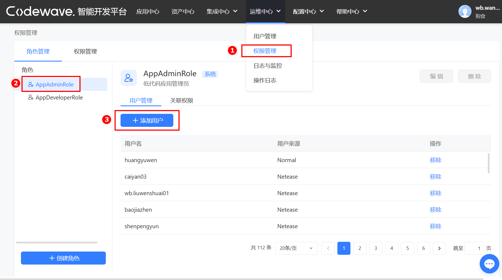
### 配置插件
#### 上传翻译器插件
进入到**源码配置>源码翻译器**配置中，点击按钮进行上传。
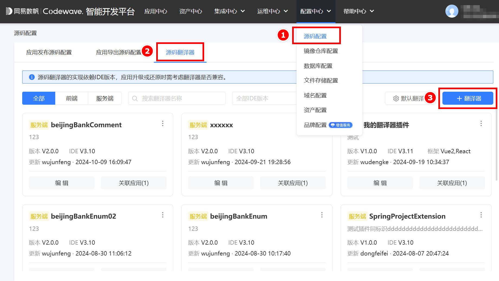
翻译器类型：选择前端源码翻译器。
框架：按需选择。
翻译器文件：上传开发好的翻译器插件zip包。
翻译器说明：备注信息。
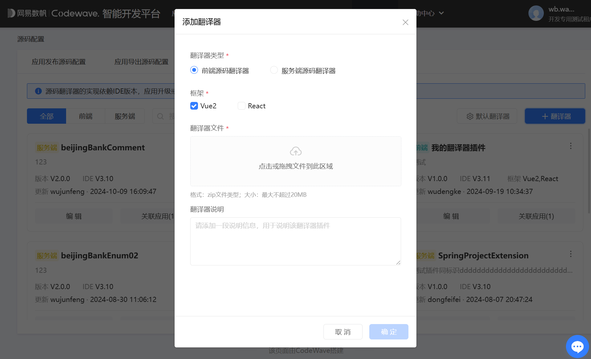
#### 为特定版本设置默认插件
在**源码翻译器**设置中点击“默认翻译器”。
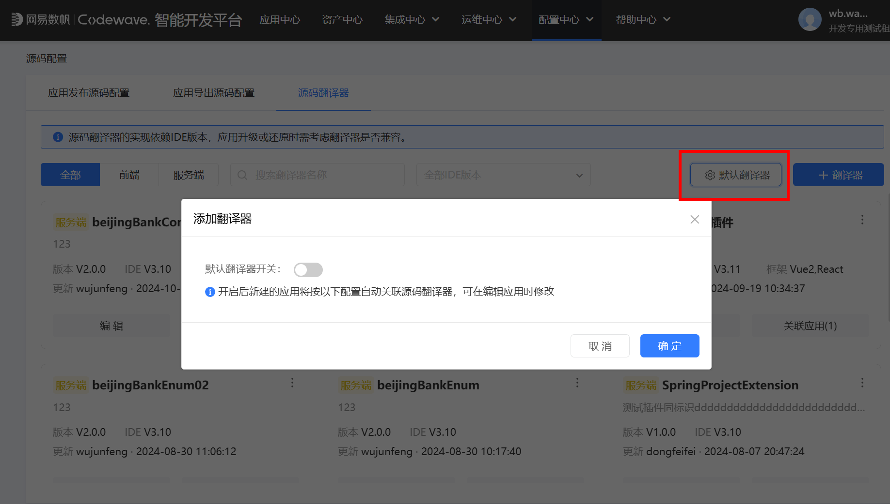
开启“默认翻译器开关”，选择需要设置翻译器插件的IDE版本（可选的IDE版本不包含3.10以下版本）。
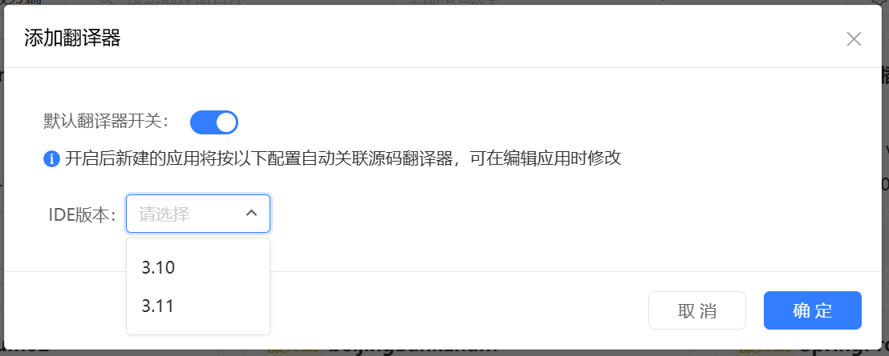
选择版本后，下方表格中可以为该版本选择前端源码翻译器插件，点击确定即可。
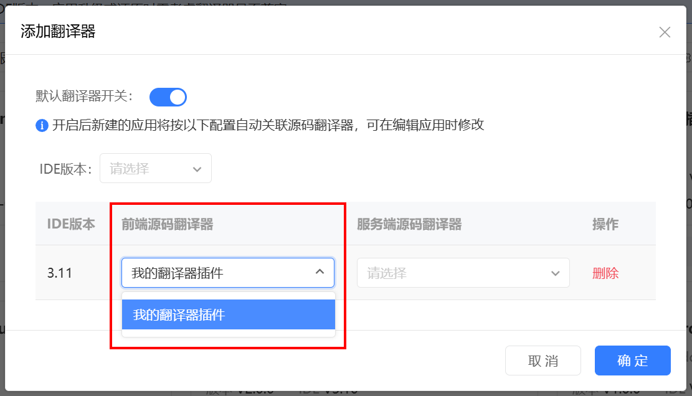
#### 为单独应用设置插件
进入到应用详情界面，点击应用信息，开启“自定义前端源码翻译器”开关，选择所需的插件即可。
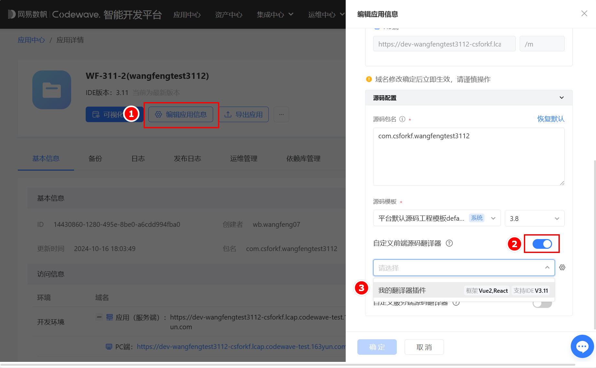
#### 删除插件
点击翻译器插件右上角纵点，点击删除即可。如果该翻译器插件已被低代码应用关联使用，则不允许删除，必须解除关联后才可删除。
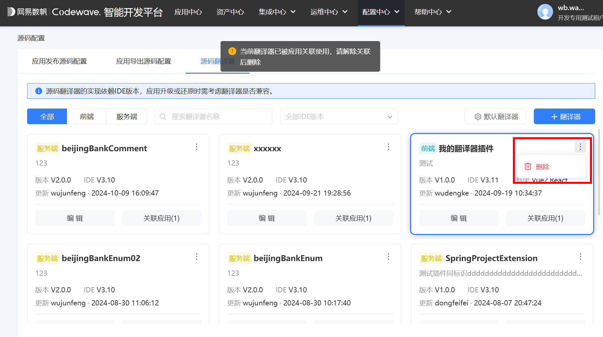
可以查看翻译器插件关联的应用并快捷跳转到该应用，关联应用列表中仅包含单独指定前端翻译器的应用。
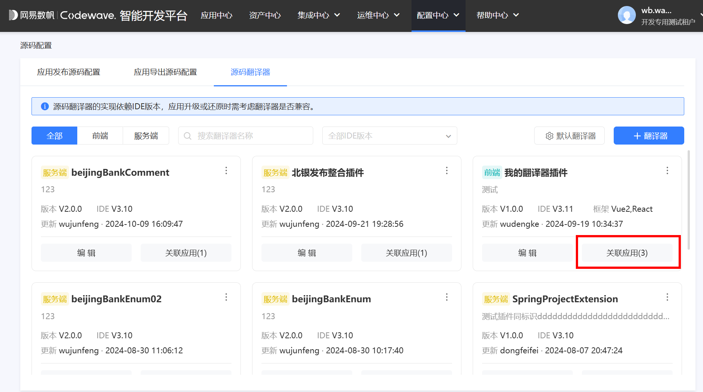
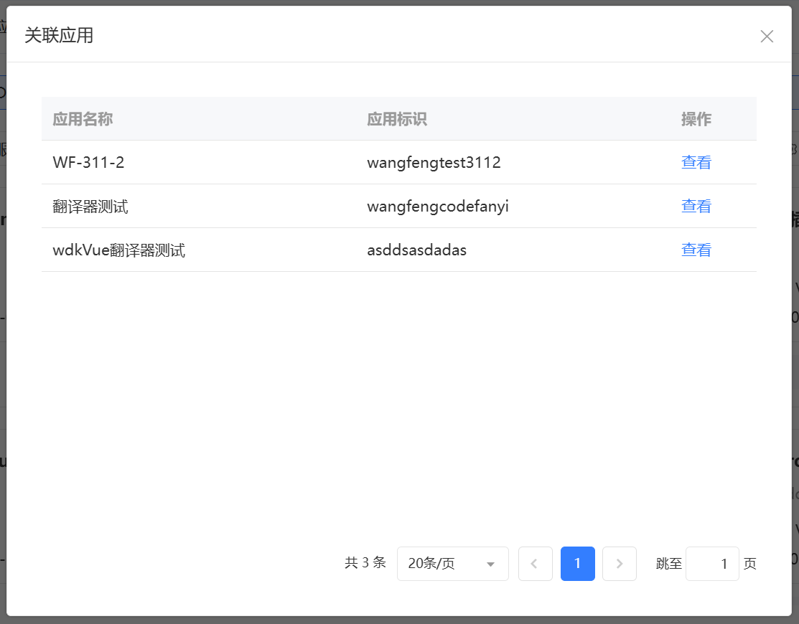

至此我们已经完成了前端翻译器插件，从开发、测试到正式在平台上的使用整个流程。
