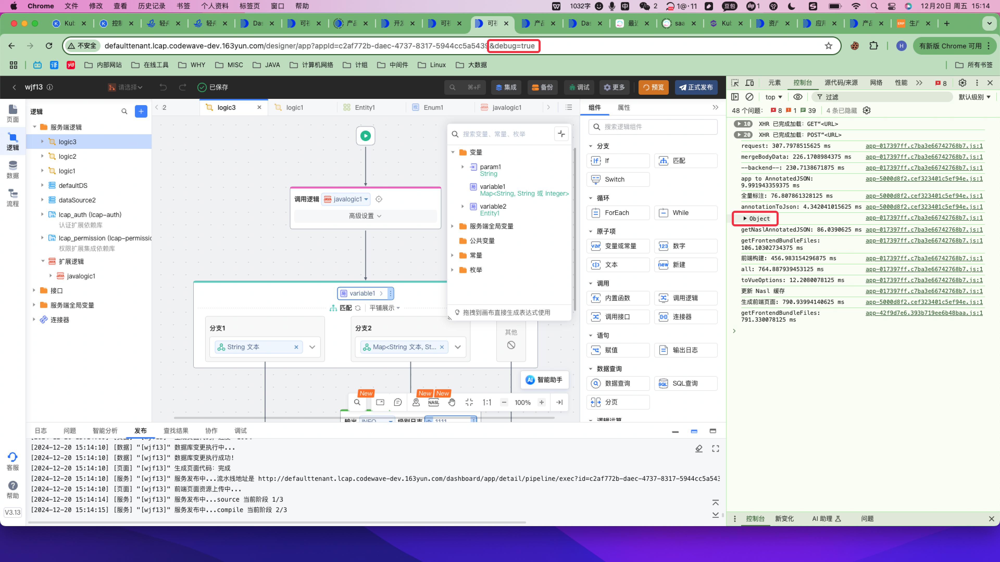

# 日志监控

## 日志问题排查

### 应用发布过程中常见问题错误码

| 错误码   | 错误提示                                                          | 可能原因  |修复建议                                |
|-------|---------------------------------------------------------------|---------------------------------------|------|
| 31000 | 平台重启导致的发布失败                                                   | 平台升级导致的发布失败，可在超时后再次尝试                 |自行重试
| 31002 | DDL执行失败                                                       | 权限，语法等问题           |根据控制台提示自行解决                     |
| 31004 | AES加密密码错误                                                     | 3.0以前版本应用兼容性问题，建议升级                   |建议升级到3.x GA版本
| 31005 | git地址解析失败                                                     | 源码地址是否配置正确                            | 联系运维检查地址配置和网络连通性
| 31006 | 不支持的代码仓库类型                                                      | 仓库类型是否配置正确                            |联系运维检查代码仓库配置
| 31007 | 请检查依赖包是否上传                                                    | 引用的依赖库是否正确上传                          |根据控制台提示自行解决 
| 31008 | 依赖包未找到，请检查依赖包是否上传                                             | 引用的依赖库是否正确上传                          |根据控制台提示自行解决 
| 31009 | Docker Info信息不存在                                              | docker info平台信息配置错误                   |联系运维检查镜像仓库地址配置和网络连通性
| 31010 | 发布失败，构建资源不足，请再次尝试发布，或者联系技术支持人员                                | 当前发布人数较多，可稍后再试                        | 建议添加构建资源 or 重试 
| 31011 | 超时发布失败，在应用详情的运维管理中，停用当前环境的应用后，再尝试发布，或者联系技术支持人员                | 租户物理资源不足                              | 联系运维添加资源 
| 31012 | SQL变更前置校验未通过                                                  | 当前实体类型变更在该数据库类型下不允许                   |根据控制台提示自行解决 
| 31014 | 生成实体DDL失败                                                     | SQL预校验未通过，查看生成实体后详细信息                 |根据控制台提示自行解决 
| 31015 | OWL请求返回                                                       | sql执行时校验未通过，查看具体返回 sql，查看是否有字段类型变更不允许 |根据控制台提示自行解决 
| 31016 | 运行期角色和编辑期角色同名                                                 | 平台添加的角色和制品添加的角色存在同名关系，需修改             |根据控制台提示自行解决 
| 31017 | 请检查默认角色[角色名称]是否被篡改                                            | 用户通过制品修改过系统角色                         |根据控制台提示自行解决 
| 31018 | 扩展逻辑错误：[扩展逻辑名称]编译失败, 行号: [扩展逻辑行号], 错误信息：[错误信息],请修改正确后重新发布!    | 用户编写的扩展逻辑存在错误                         |根据控制台提示自行解决 
| 31019 | 依赖库日志框架与默认集成Log4j2日志框架冲突，请检查！                                 | 用户引入的 jar包中含有日志jar包，与制品log4j2冲突       |根据控制台提示自行解决 
| 31020 | 无法找到类型为[bean类名称]的 bean，请检查导入的依赖库                              | 检查依赖库或是否存在jar包冲突                      |根据控制台提示自行解决 
| 31021 | 无法找到类 [类名称]，请检查导入的依赖库！                                        | 检查依赖库/链接器或是否存在jar包冲突                      |根据控制台提示自行解决 
| 31022 | 创建名为 [bean类名称] 的 bean 出错，请检查导入的依赖库！                           | 检查依赖库/链接器或是否存在jar包冲突                      |根据控制台提示自行解决 
| 31023 | 在类路径资源 [引入类] 中定义名为 [bean名称] 的 bean 时出错，请检查导入的依赖库！             | 检查依赖库/链接器或是否存在jar包冲突                      |根据控制台提示自行解决 
| 31024 | 创建 bean [bean 名称] 时绑定属性 [属性名称] 出错，请检查导入的依赖库或者远程配置中心！          | 检查依赖库/链接器或是否存在jar包冲突                      |根据控制台提示自行解决 
| 31025 | 视图[实体名称]不存在                                                   | 制品实体表名不存在                             |根据控制台提示自行解决 
| 31026 | 视图不允许修改表名                                                     | 制品实体表名不允许修改                           |根据控制台提示自行解决 
| 31027 | 视图不支持新增字段                                                     | 制品实体表名不允许新增字段                         |根据控制台提示自行解决 
| 31028 | 视图不支持修改字段                                                     | 制品实体表名不允许修改字段                         |根据控制台提示自行解决 
| 31029 | 视图不支持删除字段                                                     | 制品实体表名不允许删除字段                         |根据控制台提示自行解决 
| 31030 | 数据库不支持将自增主键修改为非自增主键                                           | 制品实体不支持将自增主键修改为非自增主键                  |根据控制台提示自行解决 
| 31031 | SQL检查错误                                                       | 数据库不支持实体变更                     |根据控制台提示自行解决 
| 31032 | 检查引入 [bean 名称] 类的依赖库版本是否有更新！                                        | 检查依赖库/链接器或是否存在jar包冲突                      |根据控制台提示自行解决 
| 31033 | 在URL [引入类] 中定义名为 [bean类名称] 的 bean 时出错，请检查导入的依赖库！                     | 检查依赖库/链接器或是否存在jar包冲突                      |根据控制台提示自行解决 
| 31034 | 无法注册类路径资源 [引入类] 中定义的 bean [bean类名称]。类路径资源 [引入类] 中已定义同名 bean，请检查导入的依赖库！ | 检查依赖库或是否存在jar包冲突                      |根据控制台提示自行解决 
| 31035 | 数据库可用连接不够，启动应用失败                                              | 数据库是否可正常连接                            |联系运维检查DB链接配置 
| 31036 | 数据库连接失败，请检查数据库配置                                              | 数据库是否可正常连接                            |联系运维检查DB链接配置 
| 31037 | RabbitMQ连接器 初始化失败，请检查RabbitMQ配置                               | RabbitMQ是否可正常连接      |          根据控制台提示自行解决        |
| 31038 | Kafka连接器 初始化失败，请检查Kafka配置                                     | kafka是否可正常连接                          |根据控制台提示自行解决
| 31039 | NASL Schema 检查错误 | 通过位置跳转查看具体报错(如类型缺失)  |根据控制台提示自行解决                        
| 31040 | Nasl Schema Checker服务异常 | nasl checker服务异常，可能网络或者服务异常  |联系运维解决             |
| 30003    | 版本低于3.14，极速模式等待前端标注Nasl超时 | 应用过大，资源不足  |联系运维调大generator-fe规格|

### 应用启动失败

**1.私有化发布预览缺包，修改mavensetting不生效**

> 定位步骤：
> 
> 先尝试删pod重新发布，如果依然不行，检查ci_mavenSetting_info里的数据有无一起改

> 解决方法：
> 
> 若没有改，则base64化mavensetting.xml内容后，更新到ci_mavenSetting_info表的content字段

**2.预览/发布时，控制台显示“应用启动失败”**

> 定位步骤：
> 
>  1.是否失败在deploy阶段，且最后一条日志是 app start timeout!
> 
>  2.有没有自定义依赖库，依赖库中有没有自定义Filter
>   
>  3.查看启动日志，是否出现NullPointerException
> 
> 可供参考的原因：
> 
>  1.自定义Filter中使得健康检查的接口/management/health无法通过
> 
>  2.查看制品应用角色表，有角色的editable字段为空，导致AppStartPermissionDataService.java这个类出现NullPointerException
>
> 解决方法：
> 
>  1.自定义Filter需要放行/management/health接口
> 
>  2.制品应用角色表运维数据

**3.发布失败，并出现Error attempting to get column 'xxx' from result set.**

> 定位步骤：
> 
> 去websql检查这个xxx字段的实际值，是否和字段类型能对上

> 解决方案：
> 
> 若对不上，则是脏数据导致的，需要手动运维至这些数据的格式与该字段最新的类型相一致，或者先行清空值

### 数据库执行失败

* **1.应用发布过程中，执行数据库阶段，若报出“Too many connections”之类的报错**

> 定位步骤：通过该报错，基本可以确定是数据库连接池连接数过多导致的问题
>
> 解决方法：有两个解决方案：
> 1.降低数据库连接池的连接数：可以通过删除停用应用（使用同一数据库实例），来降低正在使用的链接数
>
> 2.增加数据库连接池的连接数：可以通过修改数据库连接池的配置文件，增加连接数来解决（网易云平台RDS可以通过界面操作提升RDS实例的最大连接数）

* **2.应用发布过程中，执行数据库阶段，若报出“【ExecuteAllSqlScript】execute all sql script failed... Table "" already exists" 之类的报错**

> 定位步骤：该报错基本上可以确认是导出部署场景时，SQL执行的增量执行问题
>
> 解决方法：远程部署为保证DDL的正确执行的操作方法：
>
> 1.如果是初次部署（即数据库中没有任何表），不要点击生成增量SQL
>
> 2.如果不是初次部署，请点击生成增量SQL，并选择正确的对比版本，以生成正确的增量SQL并执行
>
> 3.在远程部署的服务启动时，会首先执行增量SQL（如有），再执行全量SQL，因此如果在非初次部署时看到全量SQL执行失败，但是没有看到增量SQL执行失败的日志，为正常情况，可忽略该日志，在操作没有错误的情况下，服务可以正常启动。

* **3.应用发布过程中，执行数据库阶段，若报出“(defaultDS)执行实体变更失败: Mysq1不允许行字段的字节总长度超过65535,建议调整varchar等长字段为TEXT/BLOB后重试" 之类的报错**

> 定位步骤：该报错基本上可以确认是实体中varchar类型的属性总长度过大导致
>
> 解决方法：将实体中String类型的属性->点开高级设置->将存储类型修改为text(或tinytext、mediumtext、longtext等)
> 

### 翻译失败

**1.排查问题操作：取标注后的nasl**

> ide地址后加参数: &debug=true，然后点击发布预览，浏览器控制台将打印标注后的nasl，右键赋值object可以复制出来

**2.数据查询调试后结果页报"SQL语句执行异常，请检查SQL语句"**

> 定位步骤: 数据查询出现上述报错，错误可能出现在两个地方
> 
>  1. nasl翻译成sql的时候，这种情况错误是在nasl-generator，需查看其日志确定具体翻译时错误。
> 
>  2. sql执行时，这种情况一般错误出现在owl里，需要查看owl日志检查执行的sql是否存在语法错误。比如问题错误出现在sql执行时即通过owl看到isnull组件翻译出现的sql没有字段，因为这里用户在isnull放入了一个变量，sql查询里对变量判断isnull是没有意义的，因为变量为null时对应的sql会被剪枝掉(设计上的问题需要禁止数据查询里isnull拖入变量)
> 
> 解决方法： 移掉isnull后面的变量

**3.复制逻辑后, 删除变量, 逻辑中引用处不报错**

> 定位步骤: 检查是否存在此种情况: 用户将其他逻辑的变量以及变量使用拷贝到当前逻辑, 在当前逻辑将变量删除, 直接点击发布预览, 就会导致发布失败

> 解决方法: 
> 1. 临时方案是在逻辑中将引用处删除, 或者将变量声明补充上

## 监控

待完善