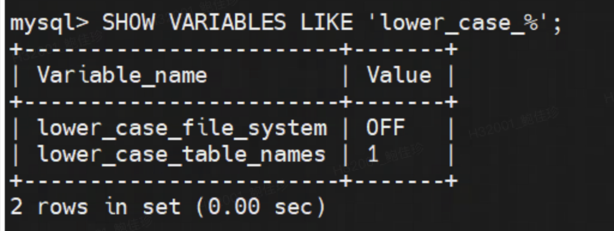
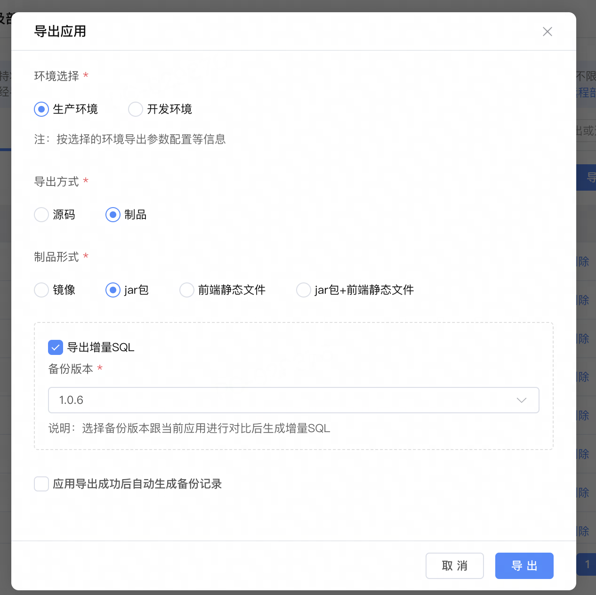
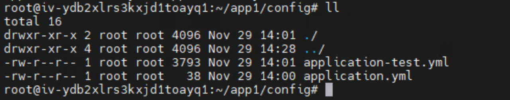
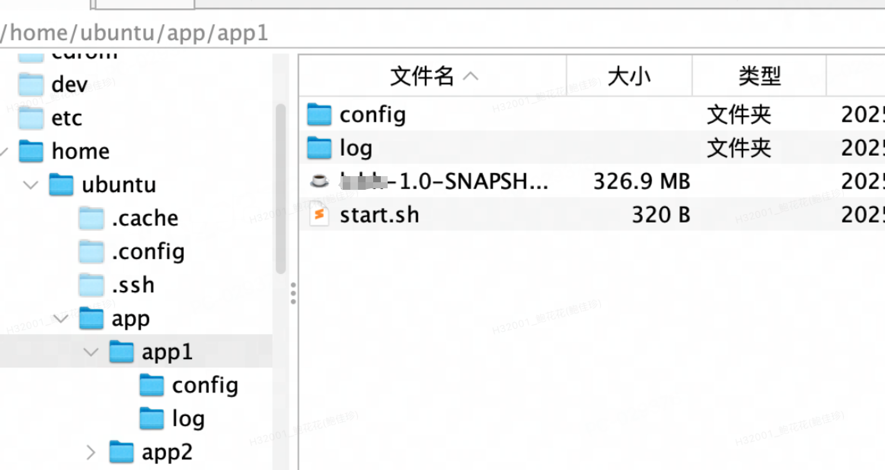
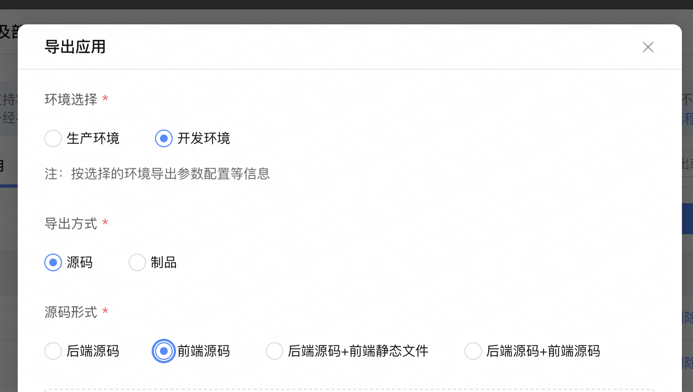
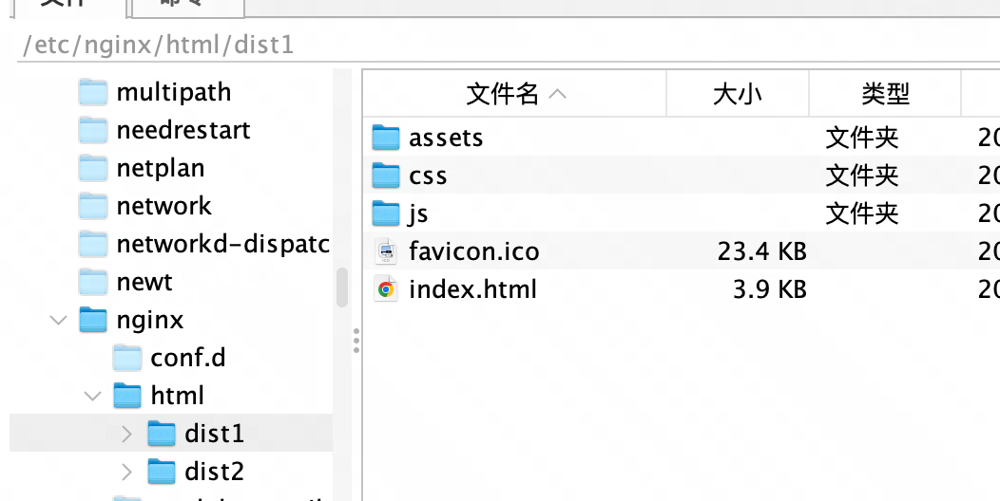
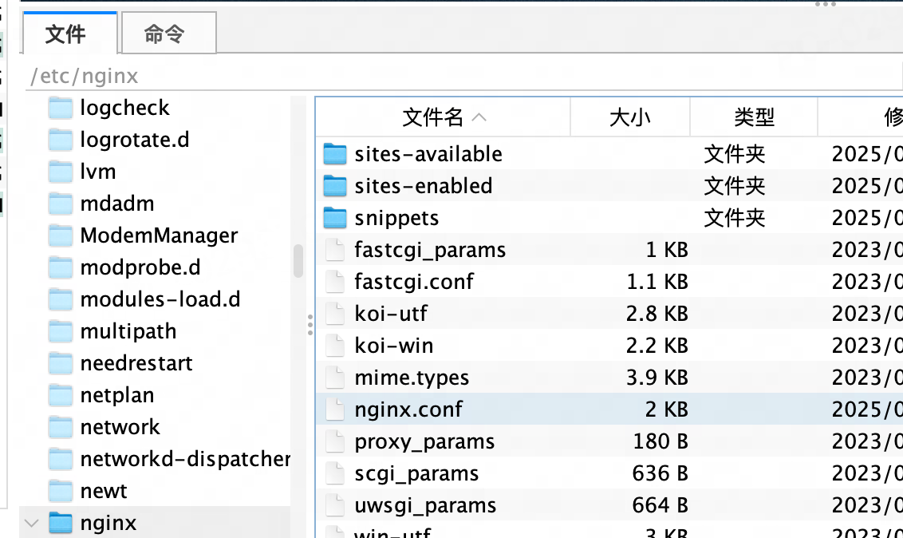
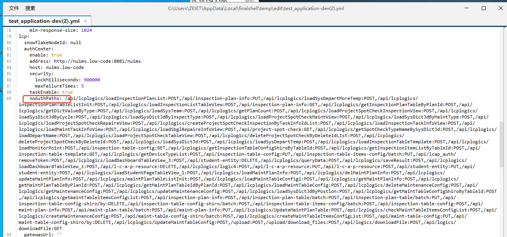

# 多应用集成独立部署
作者：李英俊

<video src="https://jdvodmrvvfqeg.vod.126.net/jdvodmrvvfqeg/76256f6d1dbd4975bd93c53bfcbc6fc3.mp4?wsSecret=b2dcd89d97557ec45111d5a12b0f09bf&wsTime=1991028695" controls="controls" style="max-width: 100%;">
</video>

大应用拆分为一主多子应用的场景下，最终部署时需要将各应用集成至同一应用中部署。最终效果用户感知为同一系统。
主子应用的前后端分离部署，使用微前端做前端集成，使用ng做请求转发。

## 环境准备
1. 制品所在的服务器安装redis，jdk和nginx。
2. 数据库所在的服务器安装mysql。
3. mysql需要设置大小写不敏感。

4. mysql设置允许非本地ip访问，并且限制vpn ip和制品所在服务器ip。
## 制品部署
### 后端
#### 1. 导出jar包

解压jar包，在文件夹（如testapplication1-1.0-SNAPSHOT\BOOT-INF\classes）中拿到 application.yml、application-online.yml。
#### 2. 上传配置文件
1. 创建应用运行目录，例如：xx/app1，该目录作为应用app1的运行目录；
2. 创建配置目录，xx/app1/config，将application.yml、application-online.yml拷贝到xx/app1/config目录下。

3. 修改application-online.yml，可以修改应用端口号以及其他一些配置。
```yml
   management:
   server:
   port: 9091 # 修改点：端口
   metrics:
   export:
   prometheus:
   enabled: true
   tags:
   application: ${spring.application.id}
   endpoints:
   web:
   base-path: /management
   exposure:
   include:
   - health
   - prometheus
   logging:
   file:
   path: ${user.home}
   path: ${logging.file.path}
   spring:
   mvc:
   static-path-pattern: /**
   resources:
   static-locations[0]: classpath:/static/
   static-locations[1]: classpath:/static/assets/
   static-locations[2]: classpath:/static/packages/
   main:
   lazy-initialization: false
   application:
   name: lcbh
   id: xx
   liquibase:
   enabled: false
   initDatabase:
   enabled: false
   quartz:
   enabled: true
   devtools:
   restart:
   enabled: false
   livereload:
   enabled: false
   datasource:
   type: com.zaxxer.hikari.HikariDataSource
   driver-class-name: com.mysql.cj.jdbc.Driver
   # 修改点：数据库配置
   url: jdbc:mysql://xxx:3306/xx?useUnicode=true&characterEncoding=utf8&useSSL=false&useLegacyDatetimeCode=false&serverTimezone=Asia/Shanghai&nullCatalogMeansCurrent=true&zeroDateTimeBehavior=CONVERT_TO_NULL
   username: xxx
   password: xxx
   connection-timeout: 3000
   hikari:
   poolName: Hikari
   auto-commit: false
   data-source-properties:
   cachePrepStmts: true
   prepStmtCacheSize: 250
   prepStmtCacheSqlLimit: 2048
   useServerPrepStmts: true
   servlet:
   multipart:
   max-file-size: 50MB
   max-request-size: 50MB
   messages:
   basename: i18n/messages
   mybatis:
   mapper-locations: classpath*:mappings/**/*Mapper.xml
   type-handlers-package: com.xx.xx.repository.handler
   configuration:
   database-id: mysql
   default-enum-type-handler: com.xx.xx.repository.handler.AutoEnumTypeHandler
   call-setters-on-nulls: true
   server:
   port: 8081  # 修改点：端口
   compression:
   enabled: true
   mime-types: text/html,text/xml,text/plain,text/css, application/javascript, application/json
   min-response-size: 1024
   lcp:
   snowflakeNodeId: null
   authCenter:
   enable: true
   address: http://nuims.low-code:8081/nuims
   host: nuims.low-code
   security:
   lockMilliseconds: 900000
   maxFailureTimes: 5
   taskEnable: true
   # 修改点：权限配置
   noAuthPaths: /api/lcplogics/customSequenceLogic:POST,/api/lcplogics/getUserInfoByName:POST,/api/lcplogics/setVerificationCode:POST,/api/lcplogics/LCAPLoginNormal:POST,/api/lcplogics/verifyVenCode:POST,/api/lcplogics/getMyDepartInfo:POST,/api/lcplogics/javalogic1:POST,/api/lcplogics/LCAPUpdateNormalUser:POST,/api/lcplogics/verifyPassword:POST,/api/lcplogics/getdeptId:POST,/api/lcplogics/switchUser:POST,/api/lcplogics/showSysMsg:POST,/api/lcplogics/getRoleByuserId:POST,/api/lcplogics/getUserList:POST,/api/lcplogics/LCAPCreateRootDept:POST,/api/lcplogics/LCAPCreateIdeRoleDataPermission:POST,/api/lcplogics/LCAPGetDeptList:POST,/api/lcplogics/loadDIctItemListById:POST,/api/lcplogics/getunit:POST,/api/lcplogics/selectTableInfo:POST,/api/lcplogics/loadFacilityManageTableView_1:POST,/api/facility:PUT,/api/facility:DELETE,/api/facility:POST,/api/lcplogics/loadSysDictTableView_2:POST,/api/lcplogics/findAllRoads:POST,/api/lcplogics/findAllLocationTypes:POST,/api/lcplogics/loadRoadManageTableView_1:POST,/api/lcplogics/loadRoadManageTableView_6:POST,/api/road:PUT,/api/road:DELETE,/api/road:POST,/api/direction:PUT,/api/direction:DELETE,/api/direction:POST,/api/lcplogics/loadFileTemplate:POST,/api/file-template/createOrUpdate:POST,/api/lcplogics/loadOperationLog:POST,/api/lcplogics/getDictParentByItemValue:POST,/api/highway-properties-price:PUT,/api/highway-properties-price:POST,/api/lcplogics/getDictItemByClassCode:POST,/api/highway-properties-price:GET,/api/lcplogics/loadNewmergencyResponseSelect_5:POST,/api/claims-event:PUT,/api/lcplogics/getEventTypeItemList:POST,/api/lcplogics/getEventType:POST,/api/lcplogics/loadAllDisplayName:POST,/api/lcplogics/loadSysEventHandleTimeMgrTableView_1:POST,/api/sys-event-handle-info-standard-time-mgr:DELETE,/api/sys-event-handle-info-standard-time-mgr:PUT,/api/sys-event-handle-info-standard-time-mgr:POST,/api/lcplogics/loadCodeRuleMTableView_1:POST,/api/sys-code-rule-mgr:DELETE,/api/sys-code-rule-mgr:PUT,/api/sys-code-rule-mgr:POST,/api/common-events-docs:GET,/api/common-accident-offender:GET,/api/common-event:GET,/api/lcplogics/getDocContentByType:POST,/api/lcplogics/loadElectronicSignatureListByCommonId:POST,/api/lcplogics/saveInformedBookNo:POST,/api/lcplogics/selectOrderListByOffendId:POST,/api/lcplogics/loadEscapeOffenderOrderList:POST,/api/currency_convert/rmbToBig:POST,/api/lcplogics/loadDocTempTableView_2:POST,/api/sys-doc-temp:PUT,/api/sys-doc-temp:POST,/api/lcplogics/LCAPGetDeptIdByUserId:POST,/api/spot-check-quetions:POST,/api/lcplogics/sendMsg:POST,/api/lcplogics/loadEditmergencyResponseTableView_1:POST,/api/spot-check-quetions:DELETE,/api/event-handle-info:GET,/api/lcplogics/getEventHandleInfoRecords:POST,/api/event-info:GET,/api/lcplogics/getEventTypeSelectedList:POST,/api/lcplogics/loadNotice:POST,/api/sys-notice:PUT,/api/lcplogics/findAllDirectionByRoadId:POST,/api/lcplogics/selectFaciltyByRoad:POST,/api/common-accident-offender:POST,/api/lcplogics/getDepartAndParentById:POST,/api/lcplogics/getDisplayNameByUserName:POST,/api/freemarker_tool/createFile:POST,/api/common-events-docs:POST,/api/common-pay-way:POST,/api/common-payment-record:GET,/api/spot-check-quetions:PUT,/api/common-event:PUT,/api/lcplogics/getPriceLibBigClass:POST,/api/lcplogics/getRoadLossOrderList:POST,/api/lcplogics/selectCommonOrderList:POST,/api/lcplogics/findAllSysEventTypeItem:POST,/api/lcplogics/getHightwaySmallClassDet:POST,/api/home-background-conf:PUT,/api/lcplogics/saveHomeBackgroundConf:POST,/api/home-background-conf:GET,/api/lcplogics/AllCar:POST,/api/lcplogics/loadResponseEventFormSelect_1:POST,/api/highway-property-loss-order:DELETE,/api/joint-loss-order/batch:DELETE,/api/highway-property-loss-order/createOrUpdate:POST,/api/joint-loss-order/createOrUpdate:POST,/api/event-handle-info:PUT,/api/highway-property-loss-order/batch:DELETE,/api/lcplogics/getEventHandleById:POST,/api/lcplogics/selectEscapeOrderLisr:POST,/api/lcplogics/getEventHandleTimeMgr:POST,/api/lcplogics/getRoadLossOrderListNotCoalition:POST,/api/lcplogics/getJointLossOrder:POST,/api/lcplogics/getJointAssessLossOrderList1:POST,/api/lcplogics/getJointAssessLossOrderList2:POST,/api/lcplogics/getJointList:POST,/api/lcplogics/getJointAssessLossOrderDetailList:POST,/api/lcplogics/loadCarsManageTableView_1:POST,/api/vehicle-management:PUT,/api/vehicle-management:POST,/api/lcplogics/LCAPGetDept:POST,/api/lcplogics/getEventTypeList:POST,/api/lcplogics/loadSysDictTableView_1:POST,/api/sys-dict-item:DELETE,/api/sys-dict-class:PUT,/api/sys-dict-item/createOrUpdate:POST,/api/sys-dict-class:POST,/api/sys-dict-item:POST,/api/lcplogics/getPriceLibCommonClass:POST,/api/lcplogics/loadHightwayPropertiesPriceTableView_1:POST,/api/lcplogics/getHighwayProperties:POST,/api/highway-properties-price/batch:PUT,/api/lcplogics/LCAPGetChildDepts:POST,/api/lcplogics/LCAPGetDeptUsers:POST,/api/lcplogics/LCAPSetDeptLeader:POST,/api/lcplogics/LCAPLoadDeptSetLeaderSelect:POST,/api/lcplogics/LCAPBatchAddDeptUser:POST,/api/lcplogics/LCAPLoadDeptAddUserSelect:POST,/api/lcplogics/LCAPCancelDeptLeader:POST,/api/lcplogics/LCAPBatchUpdateDeptUser:POST,/api/lcplogics/LCAPBatchDeleteDepartment:POST,/api/lcplogics/LCAPSearchDepts:POST,/api/lcplogics/LCAPBatchRemoveDeptUser:POST,/api/lcplogics/LCAPLoadRoleManagementTableView:POST,/api/l-c-a-p-role:GET,/api/l-c-a-p-data-permission:PUT,/api/l-c-a-p-data-permission:POST,/api/l-c-a-p-column-rule/batch:PUT,/api/l-c-a-p-column-rule/batch:POST,/api/l-c-a-p-row-rule-item/by:DELETE,/api/l-c-a-p-row-rule-item/batch:POST,/api/lcplogics/LCAPGetUserByUserIds:POST,/api/l-c-a-p-user-role-mapping/batch:POST,/api/l-c-a-p-user-role-mapping:DELETE,/api/lcplogics/LCAPGetMappingDeleteByRoleIdAndPermissionId:POST,/api/l-c-a-p-role-per-mapping/batch:POST,/api/l-c-a-p-role:POST,/api/l-c-a-p-role:PUT,/api/l-c-a-p-role:DELETE,/api/lcplogics/LCAPGetUserTableView:POST,/api/l-c-a-p-user:PUT,/api/lcplogics/LCAPLoadUserManagementSelect:POST,/api/l-c-a-p-user:DELETE,/api/l-c-a-p-user-dept-mapping/by:DELETE,/api/lcplogics/selectEventList:POST,/api/lcplogics/LCAPGetPermissionResourseNotRelated:POST,/api/lcplogics/LCAPLoadPermissionManagementTableView:POST,/api/lcplogics/LCAPGetPermissionResourceRelated:POST,/api/lcplogics/LCAPGetPerResMappingByPermissionId:POST,/api/l-c-a-p-permission:PUT,/api/l-c-a-p-per-res-mapping/batch:POST,/api/l-c-a-p-per-res-mapping/batch:DELETE,/api/l-c-a-p-permission:POST,/api/l-c-a-p-permission:DELETE,/api/common-event/batch:PUT,/api/sys-notice:POST,/api/sys-notice:GET,/api/lcplogics/getUserInfoByUserId:POST,/api/claims-event:GET,/api/lcplogics/loadAccidentOrderPayWayList:POST,/api/common-payment-record:POST,/api/common-pay-way:PUT,/api/common-accident-offender:DELETE,/api/common-pay-way/createOrUpdate:POST,/api/common-pay-way:DELETE,/api/common-payment-record:DELETE,/api/lcplogics/selectEscapeOrderLisrPC:POST,/api/lcplogics/loadAllOrderByCommonId:POST,/api/lcplogics/getProcessNodeList:POST,/api/lcplogics/getProcessRecordList:POST,/api/lcplogics/getLitigationInfo:POST,/api/lcplogics/getAllGeneralCaseList:POST,/api/lcplogics/getPriceLibSmallClass:POST,/api/lcplogics/filterSelectHighWayPriceList:POST,/api/common-events-docs/createOrUpdate:POST,/api/common-accident-offender:PUT,/api/electronic-signature/batch:PUT,/api/test/createOrUpdate:POST,/api/lcplogics/getTaskIdByProcInstId:POST,/api/lcplogics/getUserNameByDeptIdAndRoleName:POST,/api/lcplogics/getCurrentDeptDutyUser:POST,/api/lcplogics/getUserInfo:POST,/api/lcplogics/getUserInfoByid:POST,/api/lcplogics/getPersonnelSchedulingList:POST,/api/lcplogics/findAllSchedulingRecords:POST,/api/lcplogics/getCurrentAllRole:POST,/api/lcplogics/findAllDeptByParentId:POST,/api/lcplogics/findAllDeptByDeptId:POST,/api/lcplogics/getPersonnelSchedulingListByDate:POST,/api/personnel-scheduling/batch:POST,/api/lcplogics/selectApplicationRecord:POST,/api/lcplogics/getClaimsNumByEventId:POST,/api/claims-event:POST,/api/lcplogics/updateLitigationPaidAmount:POST,/api/lcplogics/launchOrSubmitProcess:POST,/api/lcplogics/loadLawsuitClaimsEventPayWayList:POST,/api/lcplogics/getDisplayNamesByUserName:POST,/api/common-events-docs:PUT,/api/common-union-evidentiary-material/createOrUpdate:POST,/api/common-union-evidentiary-material:PUT,/api/lcplogics/withdrawMyLossProcess:POST,/api/lcplogics/createProcessNodeAndRecord:POST,/api/lcplogics/getOffCompensationAmount:POST,/api/lcplogics/getCompensationAmount:POST,/api/claims-event/batch:POST,/api/claims-event/batch:PUT,/api/lcplogics/terminateClaims:POST,/api/lcplogics/loadClaimsEventListByEventId:POST,/api/direction:GET,/api/lcplogics/getEventInfoByEventHandId:POST,/api/lcplogics/selectAllHighwayPropertyLossOrder:POST,/api/lcplogics/getOffByCommonId:POST,/api/lcplogics/getEventInfosCars:POST,/api/lcplogics/getCarsList:POST,/api/lcplogics/createEventHandleRecords:POST,/api/lcplogics/loadResponseHandleProcess:POST,/api/lcplogics/getMaxNumByEventHandleRecords:POST,/api/joint-loss-order:DELETE,/api/joint-loss-order:GET,/api/lcplogics/getAllCaseListByEventHandleId:POST,/api/lcplogics/createCommonEvent:POST,/api/lcplogics/getHandOverUserList:POST,/api/continue-reports:POST,/api/lcplogics/getReachOnRecords:POST,/api/event-handle-record:PUT,/api/lcplogics/loadCommonlyUsedOrderList:POST,/api/lcplogics/getPirceLibByLikeName:POST,/api/joint-loss-order:PUT,/api/lcplogics/getMyEventHandleInfos:POST,/api/lcplogics/getStandardTimeLenHandleNode:POST,/api/personnel-scheduling-rule:DELETE,/api/lcplogics/PersonnelSchedulingRuleList:POST,/api/lcplogics/getDeptListByParentId:POST,/api/lcplogics/personnelSchedulingRuleUpdate:POST,/api/lcplogics/PersonnelSchedulingRuleSave:POST,/api/lcplogics/personnelSchedulingRuleUpdateDefault:POST,/api/personnel-scheduling-rule:GET,/api/lcplogics/getPersonnelSchedulingRuleDetailByRuleId:POST,/api/lcplogics/loadCommonOrderByOffId:POST,/api/lcplogics/loadEscapeLawsuitClaimsOrderList:POST,/api/lcplogics/selectOrCreateLitigationInfoByClaimsEventId:POST,/api/lcplogics/loadCommonOrderByEventId:POST,/api/lcplogics/loadEvidence:POST,/api/lcplogics/examineProcess:POST,/api/lcplogics/examineHandProcess:POST,/api/process-node:PUT,/api/lcplogics/selectOffenderPayWayList:POST,/api/common-event:DELETE,/api/lcplogics/loadDisplayNameByName:POST,/api/lcplogics/loadHandleEventInfo:POST,/api/lcplogics/getToDoGeneralEventList:POST,/api/lcplogics/getToDoEscapeEventList:POST,/api/lcplogics/getAllLitigationClaimsCaseListH5:POST,/api/lcplogics/getAllSpecialClaimsCaseListH5:POST,/api/lcplogics/getAllCommonClaimsCaseListH5:POST,/api/lcplogics/loadHandleOverExamineData:POST,/api/lcplogics/loadLossExamineData:POST,/api/lcplogics/loadWindUpExamineData:POST,/api/lcplogics/loadRegisterExamineData:POST,/api/sys-msg-reading-record:PUT,/api/lcplogics/getToDoResponseEvents:POST,/api/lcplogics/getEventInfosCarsAll:POST,/api/lcplogics/logic1:POST,/api/lcplogics/getQuestionList:POST,/api/common-order/batch:PUT,/api/sys-operation-log/batch:POST,/api/lcplogics/getAllCommonClaimsCaseList:POST,/api/common-order/createOrUpdate:POST,/api/common-order:PUT,/api/common-accident-offender/createOrUpdate:POST,/api/common-accident-offender/batch:PUT,/api/common-union-evidentiary-material/batch:POST,/api/lcplogics/createOrderNo:POST,/api/lcplogics/LCAPSearchDeptUsers:POST,/api/lcplogics/LCAPUpdateDepartment:POST,/api/lcplogics/LCAPCreateDepartment:POST,/api/lcplogics/LCAPGetRoleNameList:POST,/api/lcplogics/LCAPLoadUserRoleMappingTableView1:POST,/api/lcplogics/LCAPGetUserNameList:POST,/api/lcplogics/LCAPLoadUserRoleMappingTableView:POST,/api/lcplogics/LCAPGetPermissionByRoleId:POST,/api/lcplogics/LCAPLoadDataMetaManagement:POST,/api/lcplogics/LCAPGetEntityMetaById:POST,/api/lcplogics/LCAPGetDataPermissionByResourceName:POST,/api/lcplogics/LCAPGetColumnRuleByDataPermissionId:POST,/api/lcplogics/LCAPGetLogicMetaById:POST,/api/lcplogics/LCAPGetRowRuleByDataPermissionId:POST,/api/lcplogics/LCAPLoadAddRoleUserTableView:POST,/api/lcplogics/LCAPLoadAddRolePermissionTableView:POST,/api/lcplogics/LCAPCreateDataPermission:POST,/api/lcplogics/LCAPGetDataPermissionIdByRoleId:POST,/api/l-c-a-p-data-permission/batch:DELETE,/api/l-c-a-p-column-rule/by:DELETE,/api/lcplogics/LCAPGetUserNameByUserId:POST,/api/lcplogics/LCAPCreateNormalUser:POST,/api/lcplogics/LCAPGetPermissionNameList:POST,/api/lcplogics/getAllLitigationClaimsCaseList:POST,/api/lcplogics/getAllSpecialClaimsCaseList:POST,/api/escape-offender-order/batch:DELETE,/api/common-order/batch:DELETE,/api/common-order/batch:POST,/api/escape-offender-order/batch:POST,/api/electronic-signature/batch:DELETE,/api/electronic-signature/batch:POST,/api/litigation-info/createOrUpdate:POST,/api/lcplogics/getAllEscapeCaseList:POST,/api/lcplogics/test2:POST,/api/litigation-info:PUT,/api/common-pay-way/batch:PUT,/api/lcplogics/createElectronicSignatureByEventHandleID:POST,/api/lcplogics/createOrUpdateEscapeOrder:POST,/api/common-accident-offender/batch:DELETE,/api/lcplogics/updateAccidentOrderPaidAmount:POST,/api/common-accident-offender/batch:POST,/api/escape-offender-order/batch:PUT,/api/common-pay-way/batch:POST,/api/joint-loss-order:POST,/api/highway-property-loss-order:POST,/api/hand-over-record:POST,/api/lcplogics/launchHandOverProcess:POST,/api/lcplogics/getHandleOverDataByHandleRecordId:POST,/api/hand-over-record:GET,/api/lcplogics/loadLossExamineHistoryData:POST,/api/lcplogics/loadWindUpExamineHistoryData:POST,/api/lcplogics/loadRegisterExamineHistoryData:POST,/api/lcplogics/loadHandleOverHistoryData:POST,/upload:POST,/upload/download_files:POST,/api/logics/downloadFile:POST,/api/logics/downloadFile:GET
   gatewayUrl: ''
   uiResourceAddress: /client.js
   gatewayType: light
   upload:
   sinkType: s3
   sinkPath: /app
   s3Address: http://minio-api.xx.xx.com
   s3AccessKey: ''
   s3SecretKey: ''
   s3Bucket: lowcode-static
   access: public
   ttl: -1.0
   cdnAddress: ''
   logResponse: false
   logRequest: true
   report:
   host: ''
   tokenKey: ''
   domainId: null
   projectId: null
   reportIdMap: {}
   componentIdMap: {}
   nuims: http://nuims.low-code:8081
   private: null
   process:
   database:
   schema: ''
   table:
   prefix: P416E03F_
   isPlugin: false
   frontends:
   pc:
   name: pc
   path: /
   title: PC端
   type: pc
   m:
   name: m
   path: /m
   title: H5端
   type: h5
   quartzTables:
   SIMPROP_TRIGGERS: XXXXXXX_SIMPROP_TRIGGERS
   BLOB_TRIGGERS: XXXXXXX_BLOB_TRIGGERS
   TRIGGERS: XXXXXXX_TRIGGERS
   SIMPLE_TRIGGERS: XXXXXXX_SIMPLE_TRIGGERS
   LOCKS: XXXXXXX_LOCKS
   CRON_TRIGGERS: XXXXXXX_CRON_TRIGGERS
   FIRED_TRIGGERS: XXXXXXX_FIRED_TRIGGERS
   CALENDARS: XXXXXXX_CALENDARS
   JOB_DETAILS: XXXXXXX_JOB_DETAILS
   SCHEDULER_STATE: XXXXXXX_SCHEDULER_STATE
   PAUSED_TRIGGER_GRPS: XXXXXXX_PAUSED_TRIGGER_GRPS
   upload:
   base-path: app
   file:
   types: text/plain;text/html;text/css;application/javascript
   extensions:
   # 修改点：依赖库配置，对应平台ide的应用配置-自定义参数配置
lcap_annotation_data_permission:
custom:
dataPermissionCacheExpireSeconds: '60'
dataPermissionCacheMaximumSize: '60'
skipLCAPEntity: 'true'
enableLog: 'true'
auth_library_template:
custom:
workWechatFileName: WW_verify_xxxxxxxxx.txt
workWechatFileSecret: 'xx'
es_search_tool:
custom:
EsClientHost: ''
EsClientPort: ''
EsClientUsername: ''
EsClientPassword: ''
cw_amap:
custom:
APP_SECERT_KEY: xx
APP_KEY: xx
logicAuthFlag: true
auth:
token:
secret: xx
expire: 86400
plugin:
list:
Normal:
category: main
types: Normal
Normal: '{"category":"main"}'
connector:
# 修改点：连接器配置
default_fileStorage_connection: # 修改点：minio存储文件连接器
accessKey: ''
secretKey: ''
bucket: lowcode-static
privateBucket: 'false'
endpoint: http://minio-api.xx.xx.com
pathStyleAccessEnabled: 'true'
cdnAddress: null
sinkPath: /app
Lc:# 修改点：redis连接器
address: xx
port: '6379'
password: xx
database: '0'
本地存储: # 修改点：本地存储文件连接器
accessKey: aaa
secretKey: a
bucket: a
privateBucket: 'false'    
endpoint: a
pathStyleAccessEnabled: 'false'
cdnAddress: null
sinkPath: local;/home/ubuntu/localfile
gw:
app:
addr:
# 修改点：api接口地址
# jdsystem: http://xx
#jdsystem-OpenSSL: false
lowcode: http://lcap.low-code:22988
LcApplication-OpenSSL: true
emergencyResponse-OpenSSL: true
emergencyResponse: http://xx
# jdoperation-OpenSSL: false
nuims: http://nuims.low-code:8081
lcbh: http://xx
# jdyth_device-OpenSSL: true
# jdoperation: http://xx
#jdyth_device: http://xx
lctasktimed-OpenSSL: false
lctasktimed: http://xx
getAddress-OpenSSL: true
getAddress: https://xx
lcbh-OpenSSL: false
LcApplication: http://xx
# 修改点：应用配置-自定义配置-手动添加
url: http://xx/m
filePath: xx
baseUrl: http://xx
api:
context-path: /
system:
time-zone: user
fileStorage:
lcap_default_connection: '{"refConnection":"","defaultConnection":false,"title":"系统文件存储"}'
lcap_file_group_0: '{"refConnection":"app.connections.本地存储","defaultConnection":true,"title":"本地"}'
```
#### 3. 上传后端jar
   将jar包上传到xx/app1/目录下。
#### 4. 初始化数据库
   jar包中testapplication1-1.0-SNAPSHOT\BOOT-INF\classes\db的mysql ddl文件，上传至数据库所在服务器。mysql -u root -p登录时服务器后，source xxx/xx.sql执行ddl内容。
#### 5. 创建启动脚本
   在xxx/app1/目录下新建脚本文件start.sh，内容如下
```
   #!/bin/bash
   cmd="java -jar -Xmx1g jar包名称xxx.jar"
   pid=$(ps aux | grep "$cmd" | grep -v grep | awk '{print $2}')
   if [ -n "$pid" ]; then
   echo "stopping the [$pid]"
   kill -9 $pid
   fie


cho "starting app..."
nohup $cmd > ./log/应用名称xxx.log 2>&1 &
```
给脚本设置执行权限
```
chmod +x start.sh
```
#### 6. 创建日志目录
   创建xxx/app1/log目录作为日志保存的目录。
#### 7. 启动应用
   上述步骤执行后，最终的目录结构如下：

执行脚本./start.sh

在log目录下可看到日志文件。
#### 8. 查看日志
   tail -f /home/ubuntu/app/app1/log/xx.log
### 前端
#### 1. 导出源码

#### 2. build
   node版本16。
   分别对m和pc 进行npm i --force 和 npm run build
#### 3. 迁移至服务器
   dist1为pc页面，dist2为h5页面。

### ng配置

微前端需要前后端分离部署。外部访问前端地址，在ng中做转发。ng配置如下：
```
worker_processes  1;

events {
worker_connections  1024;
}


http {
log_format custom '$remote_addr - $remote_user [$time_local] "$request" '
'$status $body_bytes_sent "$http_referer" '
'"$http_user_agent" "$proxy_host$request_uri"';

    access_log /var/log/nginx/access.log custom;


    include       mime.types;
    default_type  application/octet-stream;

    sendfile        on;
    keepalive_timeout  65;

# 主应用前端
server {
listen 2080;
server_name  localhost;
client_max_body_size 50M;

           proxy_connect_timeout 180s;
        proxy_send_timeout 180s;
        proxy_read_timeout 180s;
         
        location / {
              expires 1d;
            root /etc/nginx/html/dist1;
            index index.html index.htm;
            try_files $uri $uri/ /index.html;
        }
        # 后端
        location /api {
            proxy_pass http://localhost:8081;
            proxy_set_header Host $host:$server_port;  # 添加端口信息
            proxy_set_header X-Real-IP $remote_addr;
            proxy_set_header X-Forwarded-For $proxy_add_x_forwarded_for;
            proxy_set_header X-Forwarded-Proto $scheme;
            
        }
         location /upload {
          proxy_pass http://localhost:8081;
            proxy_set_header Host $host:$server_port;  # 添加端口信息
            proxy_set_header X-Real-IP $remote_addr;
            proxy_set_header X-Forwarded-For $proxy_add_x_forwarded_for;
            proxy_set_header X-Forwarded-Proto $scheme;
       }
       location /rest {
           proxy_pass http://localhost:8081;
            proxy_set_header Host $host:$server_port;  # 添加端口信息
            proxy_set_header X-Real-IP $remote_addr;
            proxy_set_header X-Forwarded-For $proxy_add_x_forwarded_for;
            proxy_set_header X-Forwarded-Proto $scheme;
       }
       location /gw {
           proxy_pass http://localhost:8081;
            proxy_set_header Host $host:$server_port;  # 添加端口信息
            proxy_set_header X-Real-IP $remote_addr;
            proxy_set_header X-Forwarded-For $proxy_add_x_forwarded_for;
            proxy_set_header X-Forwarded-Proto $scheme;
       }
       location /gateway {
            proxy_pass http://localhost:8081;
            proxy_set_header Host $host:$server_port;  # 添加端口信息
            proxy_set_header X-Real-IP $remote_addr;
            proxy_set_header X-Forwarded-For $proxy_add_x_forwarded_for;
            proxy_set_header X-Forwarded-Proto $scheme;
        }
}

# 子应用前端
server {
listen 3080;
server_name  localhost;
client_max_body_size 50M;

           proxy_connect_timeout 180s;
        proxy_send_timeout 180s;
        proxy_read_timeout 180s;
         
        location / {
              expires 1d;
            root /etc/nginx/html/dist2;
            index index.html index.htm;
            try_files $uri $uri/ /index.html;
        }
        # 后端
        
        location /api {
            proxy_pass http://localhost:8081;
            proxy_set_header Host $host:$server_port;  # 添加端口信息
            proxy_set_header X-Real-IP $remote_addr;
            proxy_set_header X-Forwarded-For $proxy_add_x_forwarded_for;
            proxy_set_header X-Forwarded-Proto $scheme;
        }
         location /upload {
          proxy_pass http://localhost:8081;
            proxy_set_header Host $host:$server_port;  # 添加端口信息
            proxy_set_header X-Real-IP $remote_addr;
            proxy_set_header X-Forwarded-For $proxy_add_x_forwarded_for;
            proxy_set_header X-Forwarded-Proto $scheme;
       }
       location /rest {
           proxy_pass http://localhost:8081;
            proxy_set_header Host $host:$server_port;  # 添加端口信息
            proxy_set_header X-Real-IP $remote_addr;
            proxy_set_header X-Forwarded-For $proxy_add_x_forwarded_for;
            proxy_set_header X-Forwarded-Proto $scheme;
       }
       location /gw {
           proxy_pass http://localhost:8081;
            proxy_set_header Host $host:$server_port;  # 添加端口信息
            proxy_set_header X-Real-IP $remote_addr;
            proxy_set_header X-Forwarded-For $proxy_add_x_forwarded_for;
            proxy_set_header X-Forwarded-Proto $scheme;
       }
       location /gateway {
            proxy_pass http://localhost:8081;
            proxy_set_header Host $host:$server_port;  # 添加端口信息
            proxy_set_header X-Real-IP $remote_addr;
            proxy_set_header X-Forwarded-For $proxy_add_x_forwarded_for;
            proxy_set_header X-Forwarded-Proto $scheme;
        }
        location /uploa {
            proxy_pass http://localhost:8081;
            proxy_set_header Host $host:$server_port;  # 添加端口信息
            proxy_set_header X-Real-IP $remote_addr;
            proxy_set_header X-Forwarded-For $proxy_add_x_forwarded_for;
            proxy_set_header X-Forwarded-Proto $scheme;
        }
        location /for1water2marker {
            proxy_pass http://localhost:8081;
            proxy_set_header Host $host:$server_port;  # 添加端口信息
            proxy_set_header X-Real-IP $remote_addr;
            proxy_set_header X-Forwarded-For $proxy_add_x_forwarded_for;
            proxy_set_header X-Forwarded-Proto $scheme;
        }
}

}
```
## 后续部署修改内容
1. jar包重新上传 
2. 执行jar包中testapplication1-1.0-SNAPSHOT\BOOT-INF\classes\db的mysql语句，执行相应的数据库更改。 
3. 按须修改application-online.yml。
注意！noAuthPaths为不鉴权url的配置，在页面中做开关权限时会修改这个值。建议每次部署时重新覆盖。
   
4. 执行对应的start.sh
5. 查看log文件情况 
6. 前端重新build并且替换文件
