# 组件样式定制

## 一、前置准备

### 目的
我们在使用低代码进行开发的时候，大多数场景下，我们都是基于丰富的物料来像“砌房子”一样来进行进行页面的搭建。这些物料相较之传统高代码开发的组件库有一个比较明显的特点，那就是**样式的自由度比较低**，使用者只能通过修改组件开放的属性来做部分的样式调整。

在对**主题样式需要定制**或者在**业务开发中需要快速适配某一设计需求**的场景下，针对单个组件开放的属性配置可能就显得捉襟见肘了。为此，我们需要对组件的样式进行定制。

### 场景
为此我们可以将组件样式定制分为以下两种场景：
1. 主题样式定制
2. 组件样式快速修改

## 二、使用场景
一般的，我们在分析组件样式定制需求时，一般按照下面流程来进行分析：
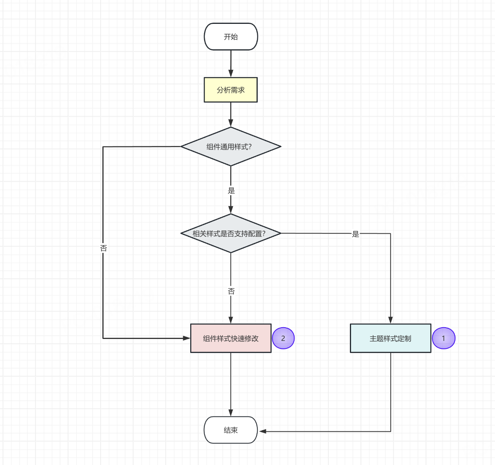

针对上述流程中提到的两个场景，我们将分开进行讨论。

### 场景一、 主题样式定制
目前我们的`ide平台`已经支持对主题样式进行定制，可以通过如下步骤来进行主题样式的配置。

打开某一个具体的ide项目，在右上角更多中点击进入**自定义主题样式**
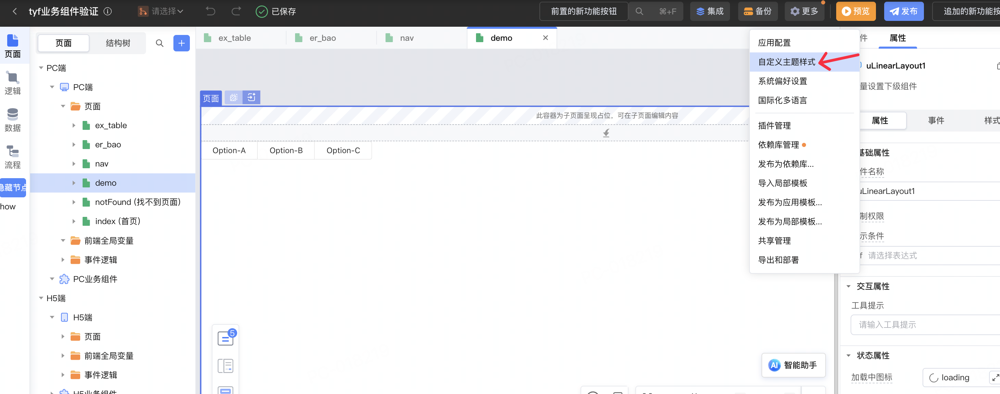

**通过主题配置文件进行调整**

通过主题配置页面右上角的**导出/导入**按钮我们可以快速的下载当前项目的主题样式配置并对其进行修改，并进行覆盖。
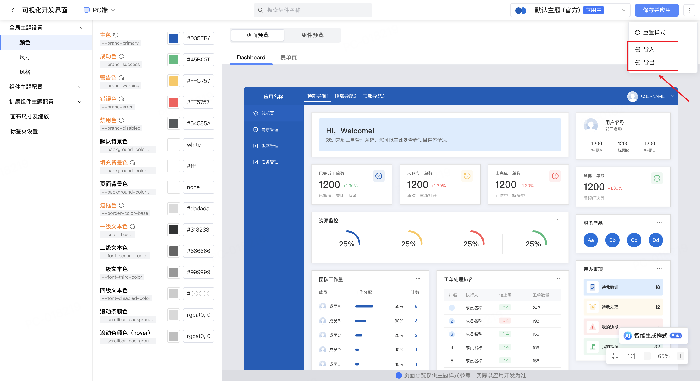

观察我们导出的主题样式文件（`主题配置_xxx.json`），我们可以看到如下的类似配置：
```json
{
    "frontendTypes": [
        {
            "concept": "FrontendType",
            "frameworkKind": "vue2",
            "frameworkUI": "",
            "kind": "pc",
            "name": "pc",
            "frontends": [
                {
                    "concept": "Frontend",
                    "title": "PC端",
                    "name": "pc",
                    "theme": {
                        "concept": "Theme",
                        "name": "深色主题 (非官方)",
                        "title": "深色主题 (非官方)",
                        "scopeVariableMap": {
                            ":root": {
                                "--brand-primary-lightest": "#e3f5ff",
                                "--brand-primary-lighter": "#aae2ff",
                                "--brand-primary-light": "#1cb2ff",
                                "--brand-primary": "#00A8FF",
                                // 其他主题变量...
                            }
                        },
                        "cssRules": [
                            {
                                "selector": "[class^=u-button][color=primary]",
                                "declarations": {
                                    "color": "#1677ff",
                                    "background-color": "transparent",
                                    "border-color": "#1677ff",
                                    "box-shadow": "none"
                                }
                            },
                            {
                                "selector": "[class^=u-button][color=primary]:hover",
                                "declarations": {
                                    "color": "#4096ff",
                                    "background-color": "transparent",
                                    "border-color": "#4096ff"
                                }
                            },
                            // 其他样式规则...
                        ]
                    }
                }
            ]
        }
    ]
}
```
分析json文件我们可以简单的知道当前配置是作用于什么版本框架、端、主题等关键属性。其中我们将着重分析**theme**属性下面的`scopeVariableMap`和`cssRules`属性。
1. `scopeVariableMap`： 通过定义[css样式变量](https://developer.mozilla.org/zh-CN/docs/Web/CSS/CSS_cascading_variables/Using_CSS_custom_properties)
，用于配置通用的主题，如：字体大小、颜色、背景色等
2. `cssRules`： 通过`selector`和`declarations`组合来配置符合 `selector`[选择器](https://developer.mozilla.org/zh-CN/docs/Web/CSS/CSS_selectors)的样式属性。用于定义特定的组件样式。


**通过页面快速修改**
1. 应用主题样式修改

除了使用主题样式文件来进行主题样式的定制外，我们还可以**通过直接在页面上进行快速的样式修改**。
> 注意：
> - 我们并没有强行约定**文件配置**和**页面上修改**的优先级，在遇到冲突样式时，后修改的会覆盖先修改的。
为此我们建议在配置过程中尽量使用一种方法，避免两种方法的混合使用。或者在使用**文件配置**方式时，保证你是基于最新的样式来进行修改的

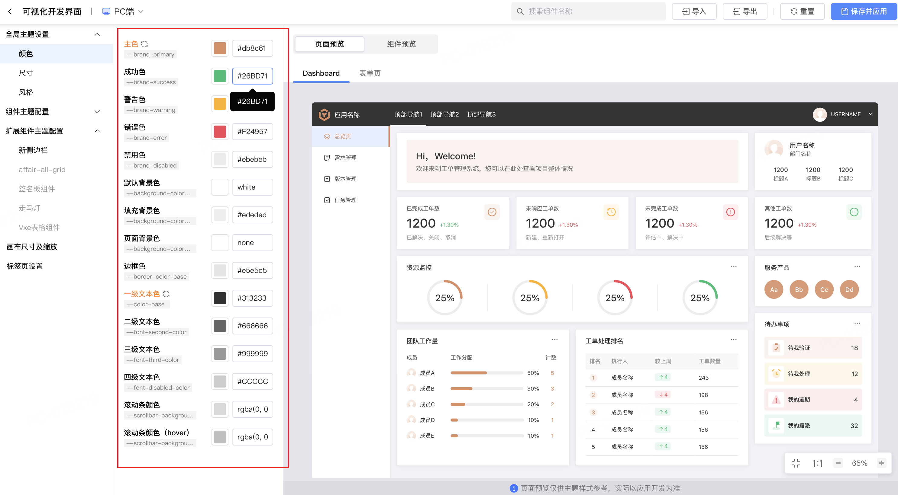

2. 组件样式修改

在组件开发时，我们可以在组件目录下创建文件夹 `theme`，`theme`文件夹下创建文件 `index.vue / index.jsx` 和 `vars.css` ，供我们在当前页面上进行配置。具体组件开发方式请参考[主题样式配置](https://netease-lcap.github.io/extension/frontend/component/theme.html)

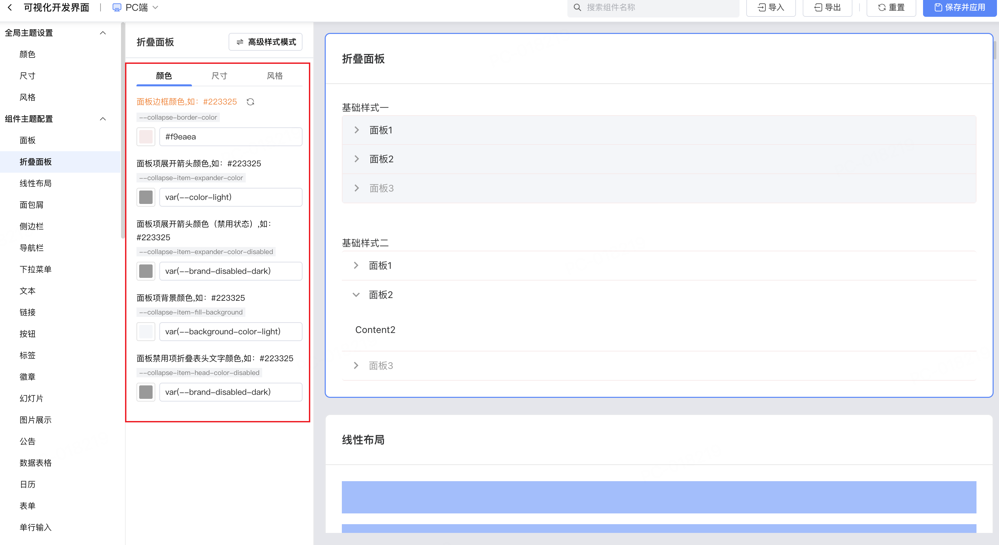

当然我们也可以通过切换当前组件样式模式来进行更加灵活的配置。

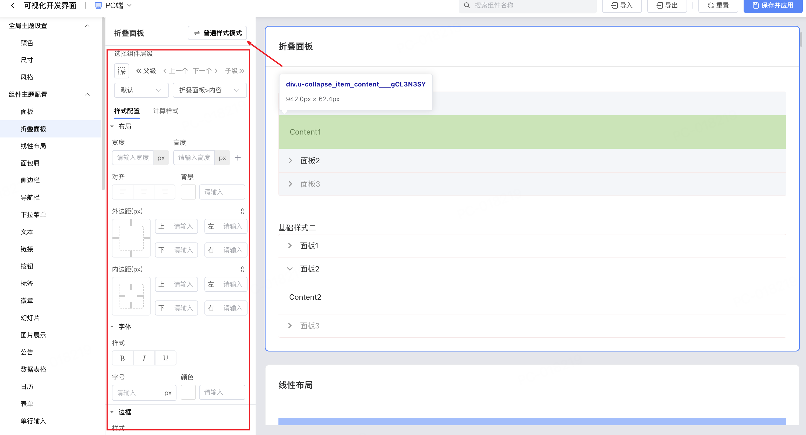

#### 案例演示
----
##### 案例一、 将ide 主题样式设置为深色主题并适配Button组件
- step1： 打开需要适配的应用，导出当前应用对应的主题样式文件
- step2: 修改主题样式文件中的`scopeVariableMap`和`cssRules`属性，将主题样式设置为深色主题。[完整主题demo](assets/themeDemo.json)
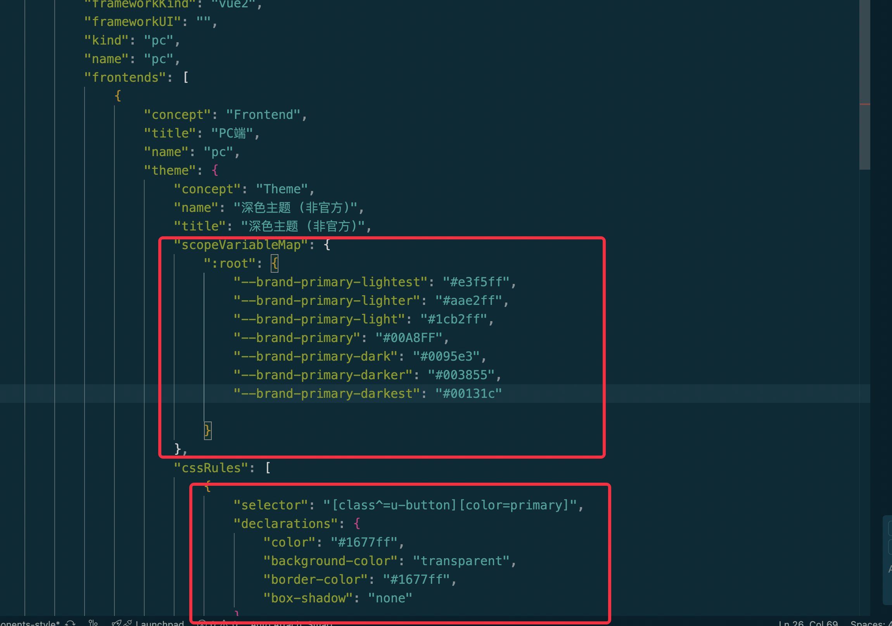
- step3: 将设置好的主题样式文件导入到ide中
- step4: 保存并应用主题样式，预览发布

<video src="./assets/custom_theme.mov" controls="controls" width="100%"></video>

##### 案例二、实现一个卡片组件，并支持简单的主题样式适配
> 环境准备
> node >= 18.0

> pnpm >= 8.0

> lcap

- step1: 通过 `lcap init` 初始化一个名为`learn_demo`的组件的组件库
```shell
lcap init
```
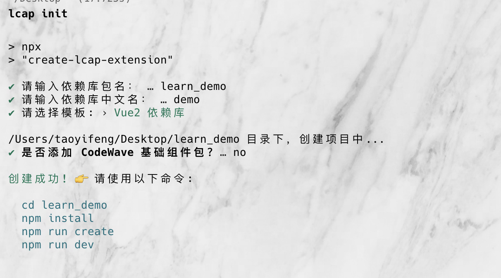
- step2: 进入组件仓库，安装依赖，并创建一个`MyCard`组件
```shell
pnpm install
# 初始化组件
pnpm create
pnpm dev
```
我们可以得到如下的文件结构
```
.
├── components.d.ts
├── manifest
├── nasl.extension.d.ts
├── nasl.extension.json
├── package.json
├── pnpm-lock.yaml
├── postcss.config.js
├── README.md
├── src
│   ├── components
│   │   ├── index.ts
│   │   └── my-card
│   │       ├── api.ts
│   │       ├── index.ts
│   │       ├── index.vue
│   │       ├── stories
│   │       ├── theme
│   │       └── theme.stories.js
│   ├── index.ts
│   ├── logics
│   │   └── index.ts
│   └── typings.d.ts
├── tsconfig.api.json
├── tsconfig.json
└── vite.config.js
```
并在index.vue 中增加如下代码
```vue
<!-- index.vue -->
<template>
  <div :class="$style.myCard">
    <div :class="$style.header" v-if="title || $slots.extra">
      <span :class="$style.title">{{ title }}</span>
      <span :class="$style.extra">
        <slot name="extra"></slot>
      </span>
    </div>
    <div :class="$style.body">
      <slot></slot>
    </div>
  </div>
</template>

<script>
export default {
  name: 'my-card',
  props: {
    title: {
      type: String,
      default: 'MyCard'
    }
  }
};
</script>

<style module>
@import url('./theme/vars.css');
.myCard {
  background: var(--my-card-background-color);
  border: var(--my-card-border);
  border-radius: 6px;
  box-shadow: 0 1px 2px rgba(0,0,0,0.03);
  padding: 0;
  transition: box-shadow 0.3s;
  margin: 16px 0;
}
.myCard:hover {
  box-shadow: var(--my-card-hover-shadow);
}
.header {
  display: flex;
  justify-content: space-between;
  align-items: center;
  padding: 16px 24px 0 24px;
  font-size: 16px;
  font-weight: 500;
  border-bottom: var(--my-card-border);
  min-height: 48px;
}
.title {
  color: var(--my-card-title-color);
}
.extra {
  font-size: 14px;
  color: var(--my-card-extra-color);
  cursor: pointer;
}
.body {
  padding: 16px 24px;
}
</style>

```
- step3: 在组件目录下创建文件夹 theme，theme文件夹下创建文件 index.vue 和 vars.css，并增加如下代码
```vue
<!-- theme/index.vue -->
<template>
    <my-card />
</template>
<script>
// 默认可使用组件区块实例作为主题配置预览
import createStoriesPreview from '@lcap/builder/input/vue2/stories-preview';
import * as stories from '../stories/block.stories';

const MyCard = createStoriesPreview(stories);

export default {
  components: {
    MyCard,
  },
};
</script>
```
```css
/* theme/vars.css */

/**
* @component myCard
*/
:root {
  /**
  * @desc 背景颜色
  * @type color
  */
  --my-card-background-color: #fff;

  /**
  * @desc 边框颜色
  * @type input
  */
  --my-card-border: 1px solid #f0f0f0;

  /**
  * @desc 背景阴影(选中态)
  * @type input
  */
  --my-card-hover-shadow: 0 2px 4px rgba(0,0,0,0.05);

  /**
  * @desc title 字体颜色
  * @type color
  */
  --my-card-title-color: #262626;

  /**
  * @desc extra 字体颜色
  * @type color
  */
  --my-card-extra-color: #1890ff;

  /**
  * @desc 字体颜色
  * @type color
  */
  --my-card-color: #666;

  /**
  * @desc 字体颜色(选中态)
  * @type color
  */
  --my-card-color-active: #333;

  /**
  * @desc 字体大小
  * @type input
  */
  --my-card-font-size: 14px;
}
```
- step4: 通过`pnpm build` 打包组件，并上传至资产中心
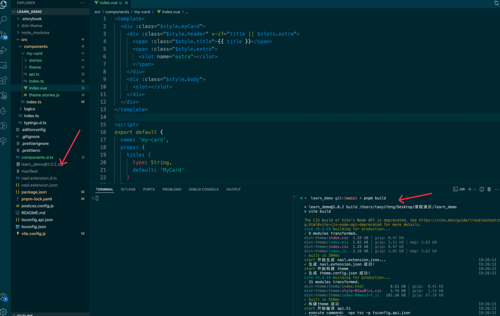
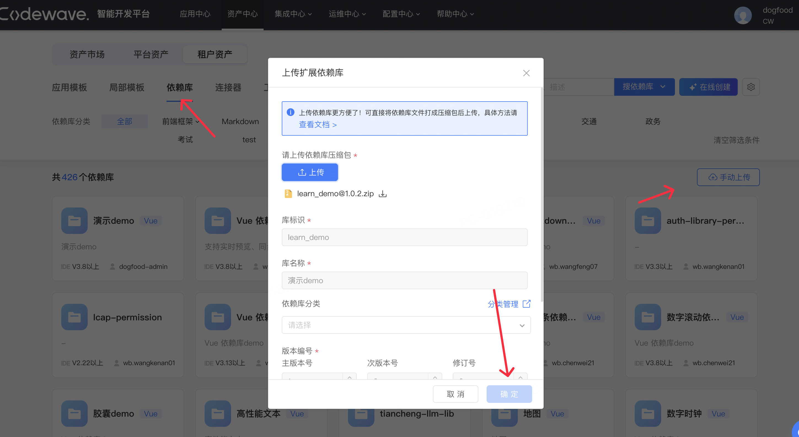
- step5: 在ide中新建一个页面，在页面中引入刚刚上传的组件，并进行样式配置
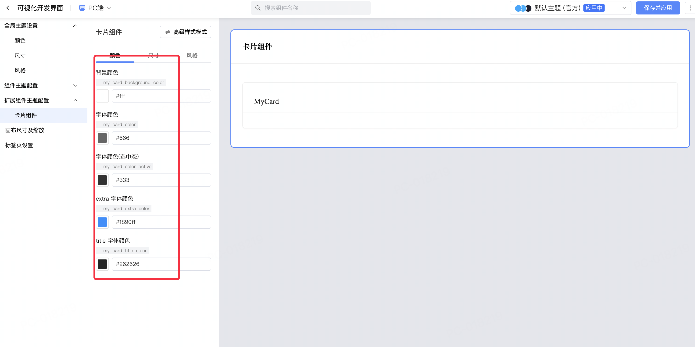

[完整demo](https://github.com/yeyujingren/lcap_learn_demo)


### 场景二、 组件样式快速修改
在日常的业务开发过程中，我们经常会遇到需要给某一组件增加定制化的视觉、交互需求。相对应的我们一般会使用以下两种解决方案：
1. 组件二开
2. css样式注入

对于第一种方案，我们已经在[前端扩展](./frontend.md)章节中进行了详细的介绍，在此不再赘述。

所谓**css样式注入**：即使用`js`代码在运行时通过**行内样式**，或者**内联样式**的方式来实现样式的定制。
分别的，我们将通过下文的案例[胶囊组件样式快速修改](#案例：-胶囊组件样式快速修改)、[日历表头增加背景色](#案例-日历表头增加背景色)来进行介绍。

#### 案例演示

----

##### 案例一、胶囊组件样式快速修改

考虑下面的一个需求：
> 需求： 将目前的胶囊组件（左侧），变更样式为（右侧）
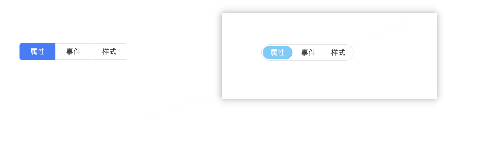

分析需求
1. 找到各个胶囊项对应的公共根节点，为其添加一个符合我们业务需求的类名： `buttons_capsules__round`；
2. 为 `my_capsules` 节点及其子节点增加符合业务需求的样式；
3. 将样式注入上下文

具体实现如下：

一、**设置公共类名**：
> 注意：
> - 由于目前采取的方案是直接注入将样式注入到全局，需要开发人员自行维护类名的唯一性。
> - 为了方便开发人员进行样式的管理，我们建议在开发过程中，将类名按照 `页面-组件名__具体业务场景` 格式进行命名。
> - 平台针对每一个组件都设置一个和当前组件同名的ref属性，我们可以通过该属性来获取到当前组件的根节点。

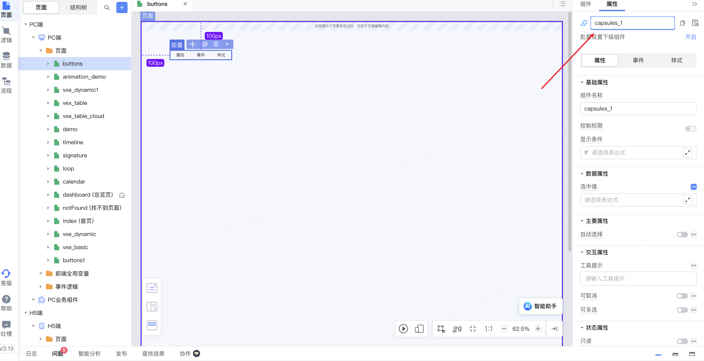

选择一个合适注入类名时机（这里我们选择当前组件进入后进行相关类名的设置）

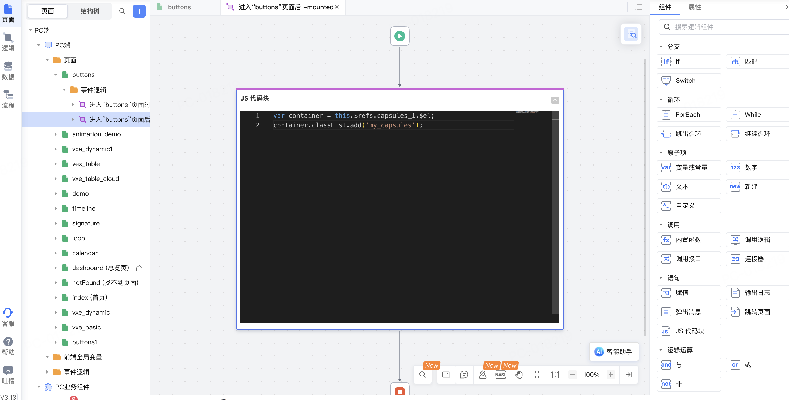
我们在js代码中写入如下代码，用于在运行时中为当前的组件根节点添加 `my_capsules` 类名。

```js
// 给当前组件根节点添加 my_animation 类名
var container = this.$refs.capsules_1.$el;
container.classList.add('my_capsules');
```

二、**设置样式**

根据第一步约定的类名，得到以下符合业务需求的样式块
```js
var style = document.createElement('style');
style.type = 'text/css';
style.innerHTML = `
.my_capsules {
  display: inline-block;
  border: 1px solid #e5e5e5;
  border-radius: 16px;
  width: auto !important;
}
.my_capsules [class^=u-capsules_capsule] {
  padding: 2px 0px;
  border: 0px;
  border-radius: 16px;
}

.my_capsules [class^=u-capsules_capsule][selected=selected] {
  background: #fff;
  padding: 2px;
  border-color: #fff;
}

.my_capsules [class^=u-capsules_capsule]:hover {
  color: #333;
}

.my_capsules [class^=u-capsules_capsule][selected=selected]:hover {
  color: #fff;
  background: #fff;
}

.my_capsules [class^=u-capsules_capsule][selected=selected]:hover {
  background: #fff;
}

.my_capsules [class^=u-capsules_capsule][selected=selected] span {
  background: rgb(102, 204, 255);
}

.my_capsules [class^=u-capsules_capsule] span {
  display: inline-block;
  padding: 2px 15px;
  border: 0px;
  border-radius: 16px;
}
`;
document.head.appendChild(style);
```
三、**将样式注入目标组件**

通过上面的第二步，我们已经得到了符合业务需求的样式块，接下来我们需要将其注入到目标组件中。考虑到后置注入可能会导致浏览器回流，建议将相关的样式注入时机前置，比如放在**整个应用加载的时机**。
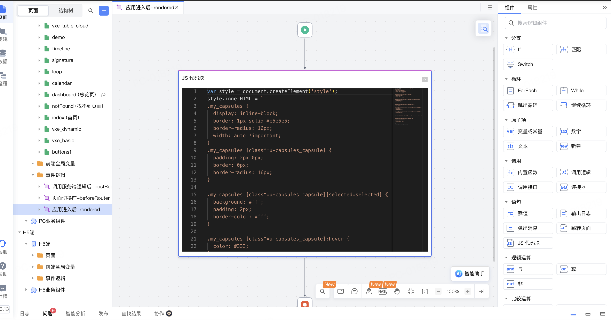

至此我们的整个业务需求就已经完成了。

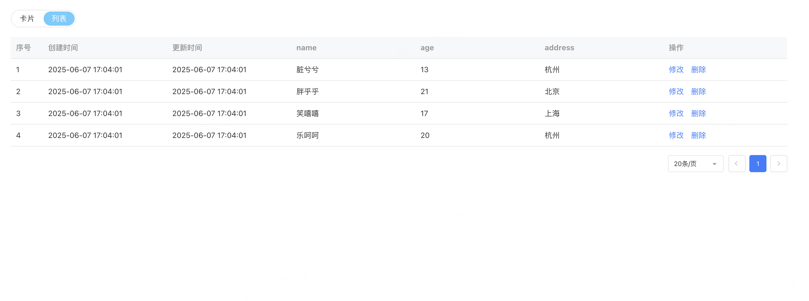

##### 案例二、日历表头增加背景色

考虑下面的一个需求：
> 需求： 将日历表头的背景色修改为`#7497f2`

观察生成的制品，我们可以发现日历表头的公共父节点为`thead`，为此我们只需要给`thead`节点设置对应的样式即可。
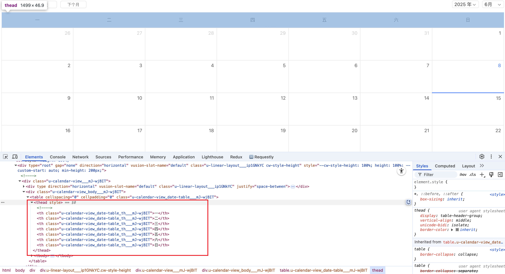

为此我们可以得出如下的步骤：
1. 通过组件refs找到真实的dom节点记为：`calendar`
2. 在`calendar`节点下找到`thead`节点
3. 为`thead`节点设置样式

具体实现如下：

**获取真实dom节点**

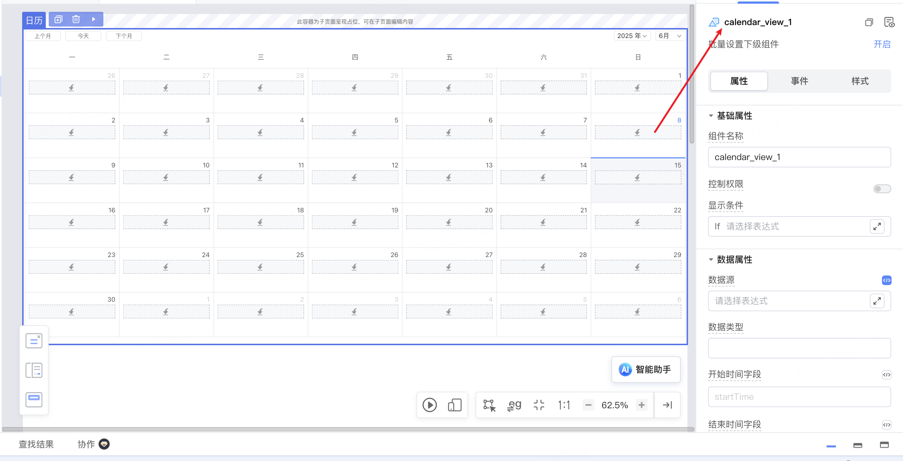

**设置样式**

```js
// 给当前组件根节点添加 my_animation 类名
var container = this.$refs.calendar_view_1.$el;
var thead = container.querySelector('thead');
thead.style.backgroundColor = '#7497f2';
```
至此我们的整个业务需求就已经完成了。
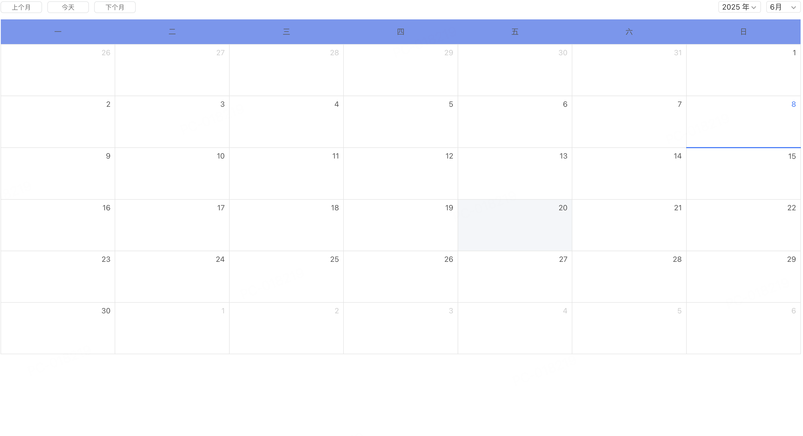

