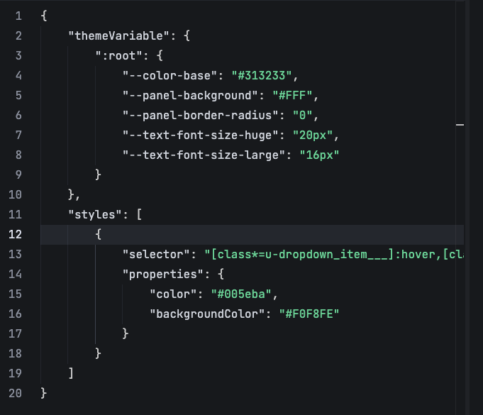

# 组件样式定制
## 一、引言
### 目的
我们在使用低代码进行开发的时候，大多数场景下，我们都是基于丰富的物料来像“砌房子”一样来进行进行页面的搭建。这些物料相较之传统高代码开发的组件库有一个比较明显的特点，那就是**样式的自由度比较低**，使用者只能通过修改组件开放的属性来做部分的样式调整。

在对主题样式需要定制或者UI还原度要求高的场景下，针对单个组件开放的属性配置可能就显得捉襟见肘了。为此，我们需要对组件的样式进行定制。

### 适用人群
- 对CSS样式有一定的熟悉度
- 对Javascript有一定的熟悉度

## 二、案例展示
针对上面提到的两种场景，我们将分开进行讨论。
### 场景一：主题样式定制
目前我们的`ide平台`已经支持对主题样式进行定制：

**平台主题样式定制**
在对平台主题样式定制时，我们更多的是通过覆盖平台的默认[css样式变量](https://developer.mozilla.org/zh-CN/docs/Web/CSS/CSS_cascading_variables/Using_CSS_custom_properties)来实现。

**组件主题样式定制**
### 场景二：UI还原度要求高
## 三、实操演示