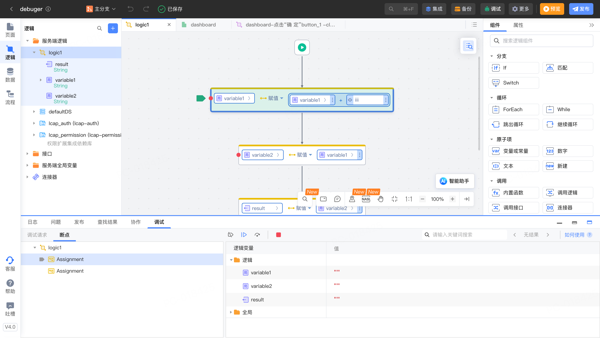
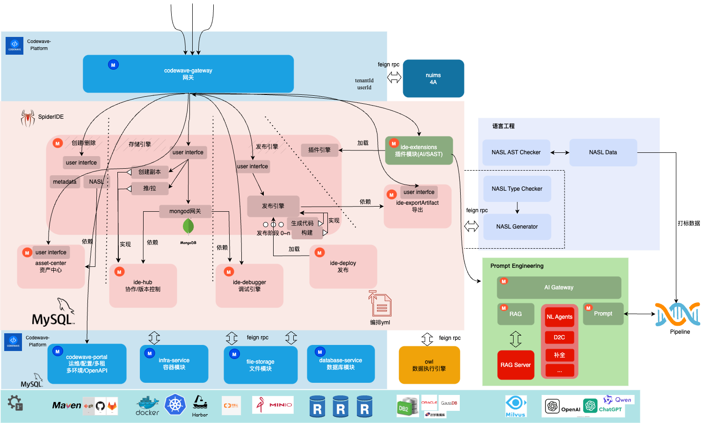
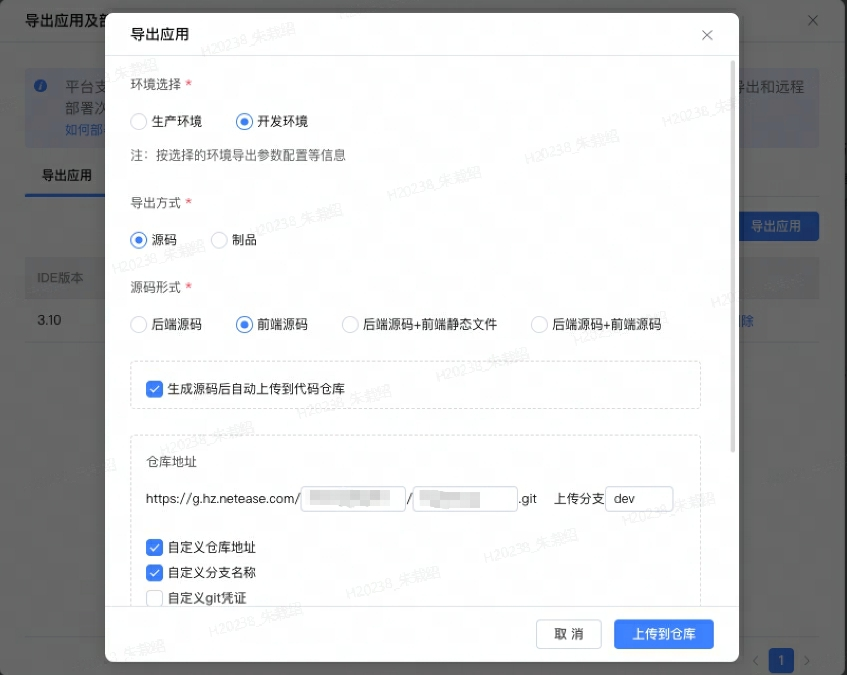
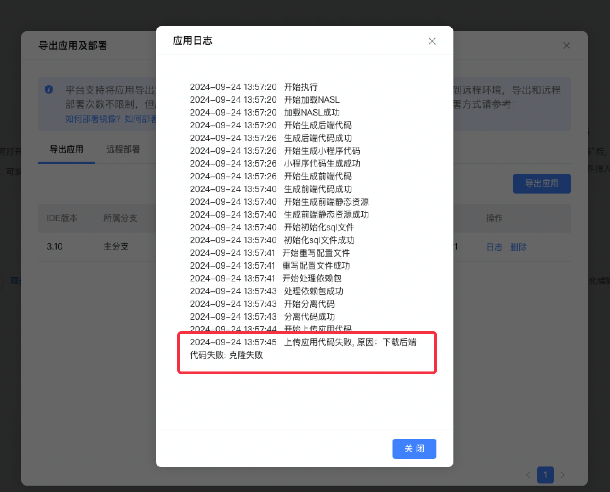
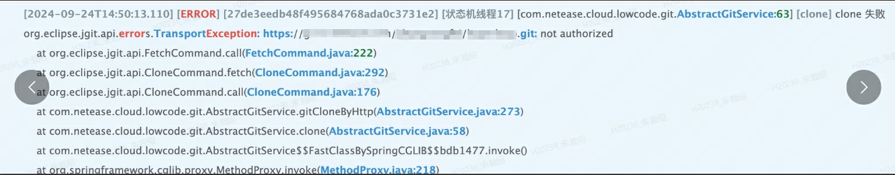

# 开发排障
作者：李英俊

<video src="https://jdvodmrvvfqeg.vod.126.net/jdvodmrvvfqeg/6dcf8aa758c44a13a4581a088870ce3f.mp4?wsSecret=cd18f38cd02c9cf49613659173988d78&wsTime=1991028695" controls="controls" style="max-width: 100%;">
</video>

## 一、调试

调试（debug）是传统开发过程中常见的排障手段，通过设置断点，可以观测每一步程序的运行结果。在CodeWave 3.0以上版本中增加了全栈逻辑调试能力，为开发者排查逻辑故障提供简单、高效的工具

调试的基本概念

- 调试：应用的某个功能搭建完成，对可能存在的逻辑错误、数据问题进行排查定位的过程。传统开发中的debug，就是其中的一种方法。

- 断点：在逻辑块上可以设置一个断点，当调试模式启动后，应用一旦执行到这个逻辑块，就会停在这里，等待下一步调试操作。

- 调试模式（调试发布）：同一般的预览发布过程，让应用在开发环境中运行起来，同时IDE进入调试模式，当应用执行到断点时会在IDE中显示断点位置和可见范围内的变量取值。

- 执行：调试模式下，可进行的调试操作，点击后，逻辑执行到下一个断点处。

- 下一步：调试模式下，可进行的调试操作，点击后，逻辑执行到下一个逻辑块，无论其是否设置了断点。

- 断点失效/生效：点击后，可以使所有断点失效或者生效，失效的断点变为灰色，执行到时，不再会停住。

- 调试请求：当IDE处于调试模式时，可能会接到多个调试请求，如应用页面某个按钮触发的调试请求，或者定时任务触发的调试请求，或者导出的接口被调用触发的请求，点击调试请求，可以切换到当前请求正在执行的断点。

- 停止调试：退出调试模式，如果需要重新走断点调试，则需要再次进行调试发布。

## 二、操作

详见[https://community.codewave.163.com/CommunityParent/fileIndex?filePath=20.%E5%BA%94%E7%94%A8%E5%BC%80%E5%8F%91%2F60.%E5%8F%AF%E8%A7%86%E5%8C%96%E5%BC%80%E5%8F%91%E7%95%8C%E9%9D%A2%2F050.%E8%B0%83%E8%AF%95.md&version=4.0&selectType=codewave&title=\_1-%E5%8A%9F%E8%83%BD%E6%A6%82%E8%BF%B0](https://community.codewave.163.com/CommunityParent/fileIndex?filePath=20.%E5%BA%94%E7%94%A8%E5%BC%80%E5%8F%91%2F60.%E5%8F%AF%E8%A7%86%E5%8C%96%E5%BC%80%E5%8F%91%E7%95%8C%E9%9D%A2%2F050.%E8%B0%83%E8%AF%95.md&version=4.0&selectType=codewave&title=_1-%E5%8A%9F%E8%83%BD%E6%A6%82%E8%BF%B0)

## 三、平台架构介绍

## 四、NASL

[https://nasl.codewave.163.com/](https://nasl.codewave.163.com/)

## 五、排障

应用创建，应用开发，应用发布，应用导出

### 1. 应用发布

排查问题操作：取标注后的nasl

ide地址后加参数: &debug=true，刷新页面，浏览器控制台将打印标注后的nasl，右键赋值object可以复制出来

### 2. 应用导出

- 导出应用——生成源码后自动上传到代码仓库"执行失败

定位步骤: 报错提示为上传应用代码失败，说明代码已经生成完毕，准备上传到代码仓库。但是此时却提示克隆失败，说明执行git clone失败了

供参考的原因：

原因远程仓库地址配置是否正确凭证配置是否正确

如下面这种情况，大概率是因为配置不对导致的问题

   

决方法： 在【源码配置-> 应用导出源码配置】中重新配置Git凭证

- 应用导出源码，规律性的一次成功，一次失败问题

定位步骤：1、参考第2条的内容，先排查资源限制大小的问题2、排查应用error日志，看看是否有s3关键字的相关的错误信息，可能存在对象存储容量不足的问题