# 前端扩展

## 一、概念原理

### 前端扩展的概念

前端依赖库是指**开发者自行开发或引入的组件、逻辑，用于满足定制化需求和功能扩展**。这些库可被用于自定义界面样式、交互效果、组件功能，或者整合特定的第三方服务（例如微信SDK、钉钉SDK），并且能够被导入到IDE平台中供开发使用。

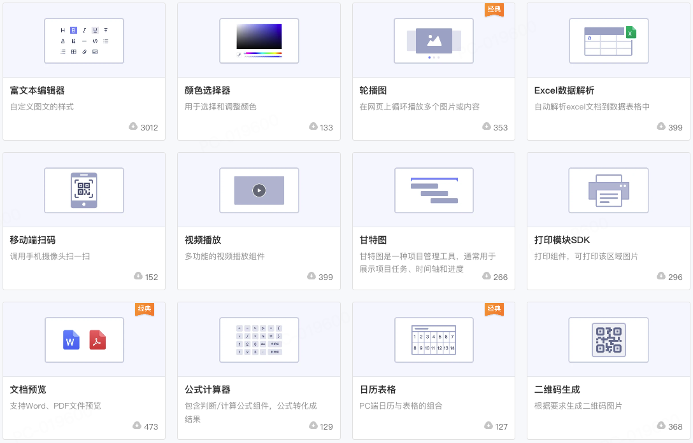                


### 前端扩展开发流程

前端扩展开发通常包括以下几个步骤：

1. 通过脚手架工具lcap创建项目
2. 创建全局逻辑或组件并完成开发
3. 发布到目标CodeWave平台
4. 在CodeWave项目中导入依赖库并使用它们


### 前端扩展API与元数据

与传统前端开发中直接引入第三方依赖库不同，CodeWave开发平台中通过前端扩展的方式引入第三方依赖库：

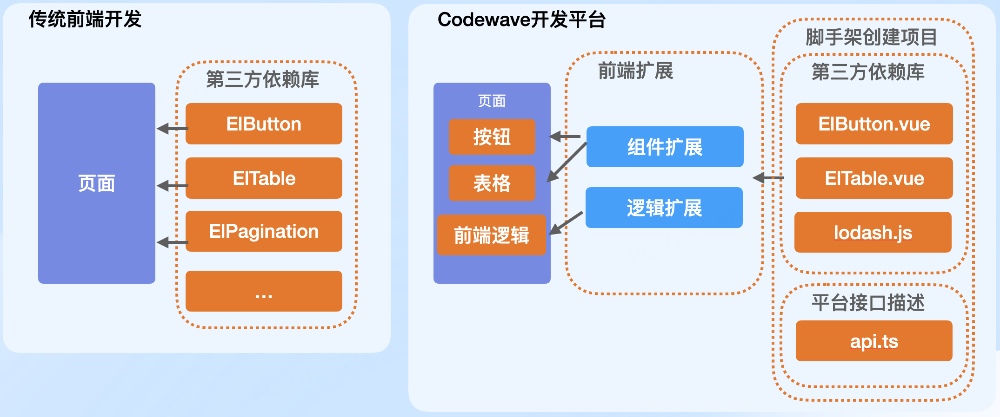

在开发扩展组件时，除了组件代码之外，我们还需要编写一个api.ts文件，该文件为CodeWave平台提供组件API描述：

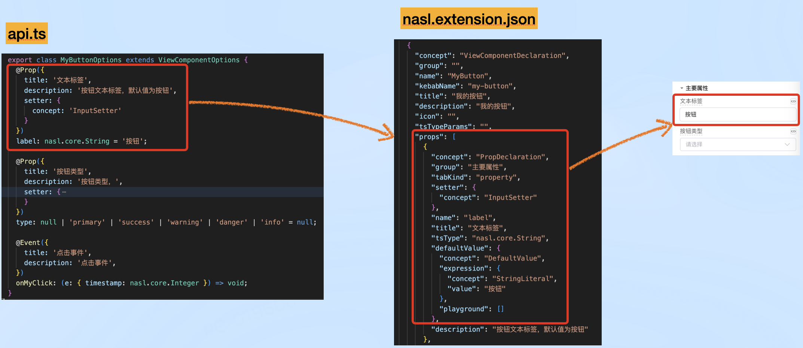

例如下面示例为MyButton组件声明了两个属性label和type，一个事件my-click：

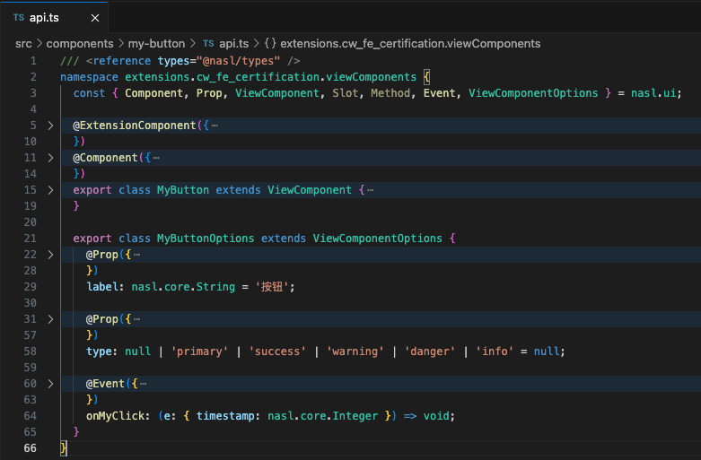

执行创建步骤时，编译器会转换api.ts为nasl.extention.json，该文件是为CodeWave平台准备的声明文件：

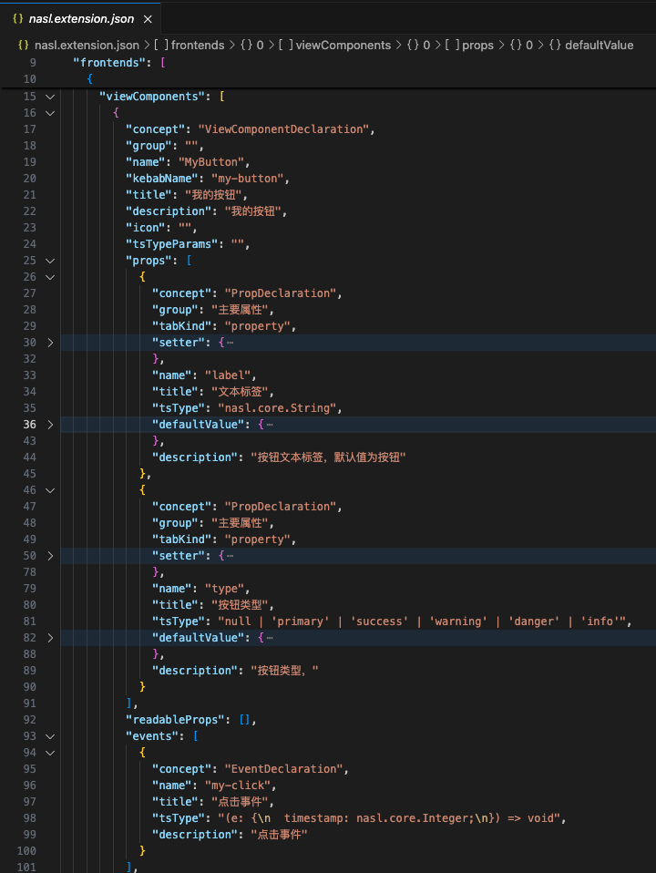

这样用户就可以通过可视化方式与组件交互了：

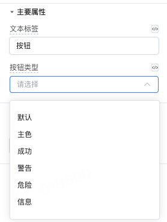


## 二、使用场景

### 开发扩展组件

如果自带组件不能满足需求，或者希望封装业务组件提效，都可以通过开发扩展组件的方式提升平台能力边界。


#### 案例1：封装echarts

ECharts是开源的一个数据可视化库，它可以通过简单的配置实现各种图表的绘制，包括折线图、柱状图、饼图、雷达图等。

我们可以通过封装echarts定制开发特定的图表组件：

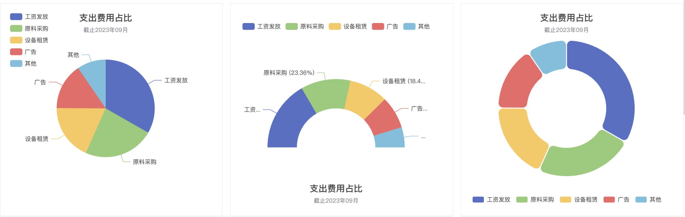


#### 案例2：封装动态表单

在数据录入、调查问卷、业务流程等特殊场景下，我们通常需要动态定制表单，此时封装一个动态表单组件会变得相当有用：

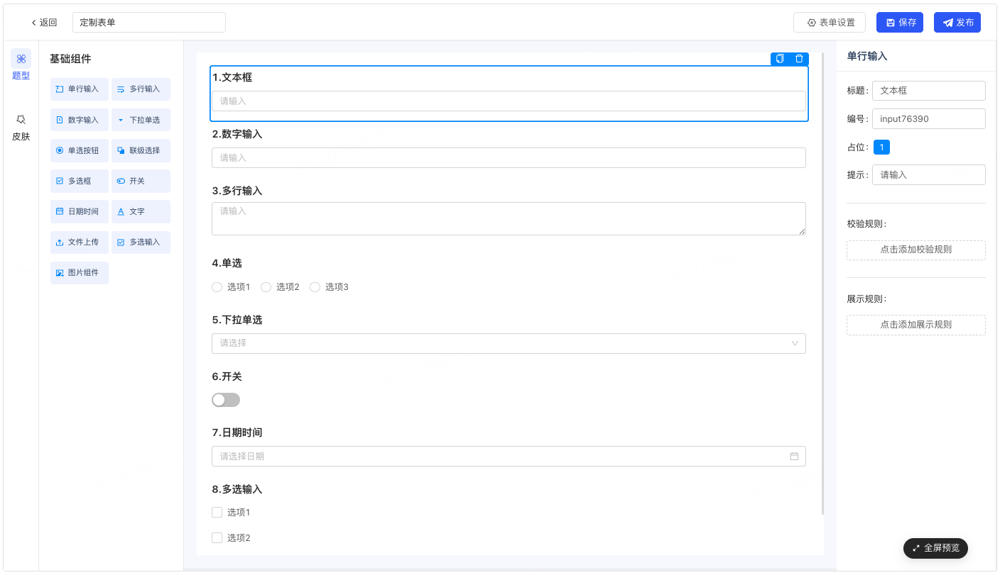

[体验地址](https://community.codewave.163.com/CommunityParent/CodeWaveMarket?navia=&currentType=%E6%90%9C%E6%A8%A1%E6%9D%BF&userId=&tenantPhone=&templateIdFormSaas=0&tenantName=&tId=&token=&platformUserId=)


### 封装三方组件

组织内部通常有常用的组件或组件库，通过封装这些组件并适当编写平台接口即可将三方组件引入平台使用，从而提升开发效率和体验。


#### 案例1：封装element-ui组件

平台已经封装了大量element-ui组件共用户直接使用，我们同样可以参照这些组件继续封装其他组件以丰富团队资产，提升开发效率。

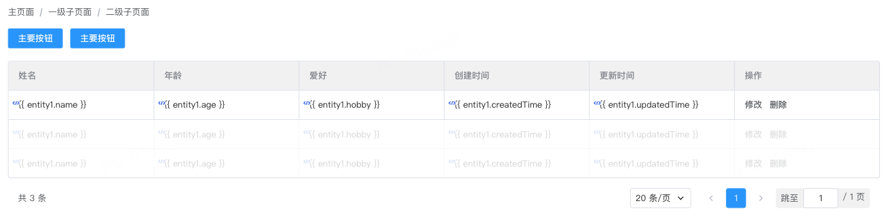

#### 案例2：封装bytemd

下面案例展示了封装三方组件bytemd实现平台内编辑、预览markdown内容：

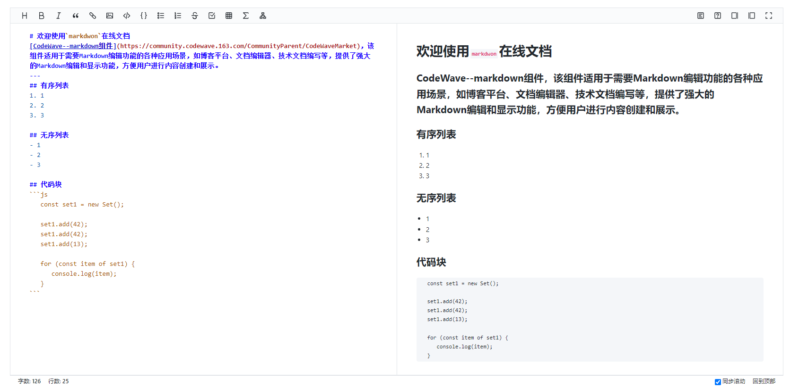

#### 案例3：封装fullcalendar

下面案例展示了通过封装三方库fullcalendar实现个人日程管理功能：


### 开发前端扩展逻辑

当我们需要编写一些前端可复用逻辑或封装JS-SDK时，例如引入lodash或封装钉钉JS-SDK时，可以通过开发前端扩展逻辑的方式实现。

#### 案例：封装钉钉JS-SDK

下面案例通过封装JS-SDK为前端扩展逻辑，从而可以便捷的调用这些钉钉开放出来的能力：

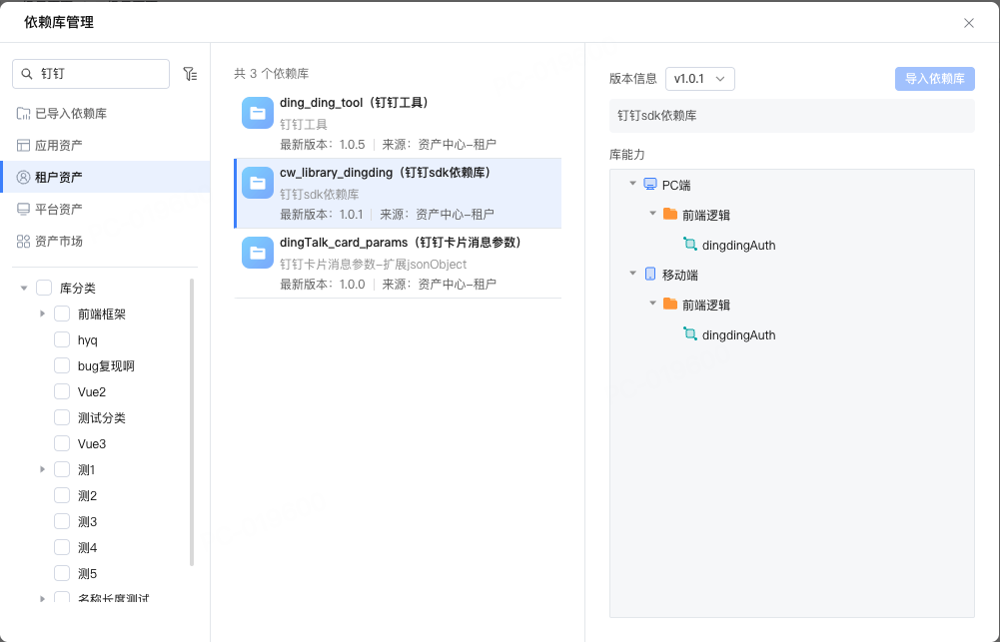

通过“调用逻辑”组件调用扩展逻辑，它们被分类在“系统逻辑”下：

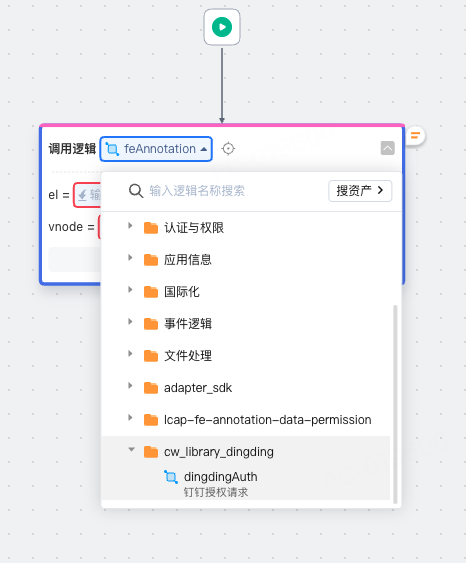


### 基础组件二开

Todo：案例待补充


### Vue3、React扩展组件支持

#### 平台当前组件支持情况

- Vue2：Cloud UI（pc, h5）、element-ui（pc, h5）
- Vue3：element-plus（pc, h5)
- React：antd（pc）

Todo：案例待补充


## 三、实操演示

### 开发环境准备

在开始扩展组件或逻辑开发之前，首先需要安装脚手架工具lcap，安装步骤如下：

1. 安装脚手架工具：`pnpm i -g lcap`
2. 创建项目：`lcap init`
3. 安装依赖：`pnpm i`
4. 创建组件：`lcap create component`
5. 启动项目：`pnpm dev`

> 当前演示的lcap版本为v0.5.4，要求提前安装Node.js v18+和pnpm

### 依赖库发布

前面创建的组件可以尝试发布到CodeWave平台测试，步骤如下：

1. 设置目标平台地址：`lcap config set platform xxx`

   > xxx替换为目标平台地址，例如https://cunzhang.codewave.163.com

2. 设置认证信息：

   1. 设置授权令牌：`lcap config set authorization xxx`

      > authorization为管理员登录成功之后授权令牌，可以通过浏览器“应用程序”面板“Cookie”下获取：
      >
      > 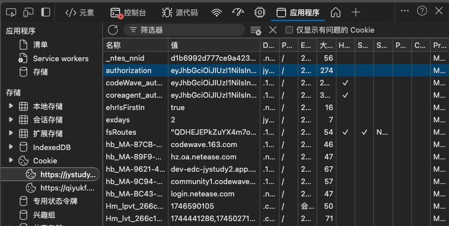

   2. 设置组件版本号：`pnpm version 1.0.0`

3. 发布组件：`pnpm release`

4. 引入组件：在CodeWave平台“更多配置 - 依赖库管理”导入已发布组件


### 调试技巧

如果每次更新组件后都需要执行前面发布、导入步骤会非常繁琐，下面介绍利用Chrome插件XSwitch简化调试过程，它会拦截组件资源的http请求到本地开发服务器，从而简化掉以上步骤。具体操作如下：

1. 检查构建器版本`pnpm list @lcap/builder`要求最低版本**1.40**

   > 如果低于1.4.0则需要先升级构建器，升级方式为：`pnpm add @lcap/builder@latest -D`

2. 添加脚本到`package.json`并执行（如果已经有了可忽略此步骤）：

```json
{
  "scripts": {
      "watch": "lcap-scripts watch"
  }
}
```

3. 安装Chrome浏览器代理插件[XSwitch](https://chromewebstore.google.com/detail/xswitch/idkjhjggpffolpidfkikidcokdkdaogg?hl=zh-CN&utm_source=ext_sidebar)，然后修改插件配置：

```json
{
  "proxy": [
    [
      "[PLATFORM_URL]/api/v1/asset-center/library/[name]/version/[version]",
      "http://127.0.0.1:8080/api/library/schema"
    ],
    [
      "[STATIC_URL]/packages/extension/[name]@[version]",
      "http://127.0.0.1:8080"
    ],
  ],
}
```

> 各参数含义如下：
>
> - PLATFORM_URL替换为IDE地址
> - name替换为依赖库的名称
> - version替换为依赖库版本号
> - STATIC_URL可通过浏览器控制台输入`window.appInfo.STATIC_URL`在浏览器控制台查看

下面是一个实际用例：

```json
{
  "proxy": [
    [
      "https://cunzhang.codewave.163.com/api/v1/asset-center/library/my_full_calendar/version/1.0.0",
      "http://127.0.0.1:8080/api/library/schema"
    ],
    [
      "https://lcap-official-bucket.codewave.163.com/packages/extension/my_full_calendar@1.0.0",
      "http://127.0.0.1:8080"
    ]
  ]
}
```


完成以上配置后每次修改组件代码后刷新浏览器即可查看最新的修改

​     ❌ 注意：调试过程中请勾选“绕过以转到网络”，以避免Chrome浏览器的Service workers缓存，导致刷新之后不更新最新组件代码

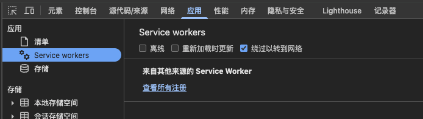


### 基础知识储备

#### 概述：View Component API

用户开发的组件可通过View Component API描述其API或适配平台的各种能力，主要包括：

- 组件描述：@Component用于组件面板识别排列
- 扩展组件：@ExtensionComponent用于描述扩展组件类型、IDE用途等
- 组件属性：@Prop即组件参数
- 组件事件：@Event标注组件支持的事件
- 组件插槽：@Slot描述组件插槽
- 组件实例方法：@Method描述组件提供的方法
- 组件实例属性：@Prop描述组件提供的可访问属性

整体配置如下：api.ts

```typescript
/// <reference types="@nasl/types" />
namespace nasl.ui {
  /* 组件描述 */
  @ExtensionComponent({})
  @Component({})
  export class ElButton extends ViewComponent {
    constructor(options?: Partial<ElButtonOptions>) {
      super();
    }
    /* 组件实例方法 */
    @Method({})
    startLoading(): void {}
    /* 组件实例属性 */
    @Prop({})
    disabled: nasl.core.Boolean;
  }

  export class ElButtonOptions extends ViewComponentOptions {
    /* 组件属性 */
    @Prop({})
    size: nasl.core.String;

    /* 组件事件 */
    @Event({})
    onClick: (event: {}) => any;

    /* 组件插槽 */
    @Slot({})
    slotDefault: () => Array<ViewComponent>;
  }
}
```


#### 组件定义@Component

使用@Component来标注，用于组件面板识别排列。效果如下：

​                    

##### 接口配置：api.ts

依赖库中的组件无需定义 group ，默认将依赖库名称作为其分组。

```typescript
@Component({
  title: '按钮',                         // 组件显示名称
  icon: 'button',                       // 组件显示图标 （平台内置）
  description: '常用的操作按钮。',         // 组件描述
  /**
   * 组件分组，目前有
   * Display 展示 Form 表单 Selector 选择器 Layout 布局
   * Container 容器 Navigation 导航 Table 表格
   */
  group: 'Display',          // 依赖库使用 依赖库名称作为分组名称           
})	
```

> 自定义 icon 请参考文档[自定义组件面板图标](https://netease-lcap.github.io/extension/frontend/component/icon.html)


#### 扩展组件定义@ExtensionComponent

使用@ExtensionComponent来标注扩展组件类型和IDE用途等。例如：

- 定义type为h5、pc、both之一，可以组件应用于指定环境
- 定义ideusage可以指定组件用途为元素、容器或弹出类型

##### 接口配置：api.ts

依赖库中的组件无需定义 group ，默认将依赖库名称作为其分组。

```typescript
@ExtensionComponent({
  type: 'both', // h5|pc|both
  ideusage: {
    idetype: 'container', // element|container|modal|drawer|messager|popover
  },
})
```

自定义 icon 请参考文档[自定义组件面板图标](https://netease-lcap.github.io/extension/frontend/component/icon.html)


#### 组件属性@Prop

可以使用`@Prop`来描述组件在平台中可配置参数的表单。

​                    

配置示例如下：

```typescript
@Prop({
    // 分组，目前支持 '数据属性' | '主要属性' | '交互属性' | '状态属性' | '样式属性' | '工具属性'
    group: '主要属性',
    // 属性配置面板显示名称
    title: '尺寸',
    // hover 到名称上显示具体描述
    description: '尺寸',
    // 属性设置器，支持参数设置器，请查看 “属性设置器”
    setter: { },
})
size: nasl.core.String = 'small';  // small默认值 'small', nasl.core.String 参数类型，
```


##### **示例：按钮label属性**

下面以按钮组件label属性为例演示扩展组件属性的声明

​            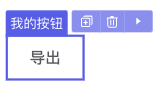        

​            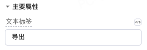        

##### **接口配置：api.ts**

```typescript
/// <reference types="@nasl/types" />
namespace nasl.ui {
  /* 省略其他部分 */
  /* 组件选项声明 */
  export class ElButtonOptions extends ViewComponentOptions {
    /* label属性声明 */
    @Prop({
      title: '文本标签',
      description: '按钮文本标签，默认值为按钮',
      setter: {
        concept: 'InputSetter'
      }
    })
    label: nasl.core.String = '按钮';
  }
}
```

##### **扩展知识**

属性输入设置setter可以控制平台收集用户输入的方式。

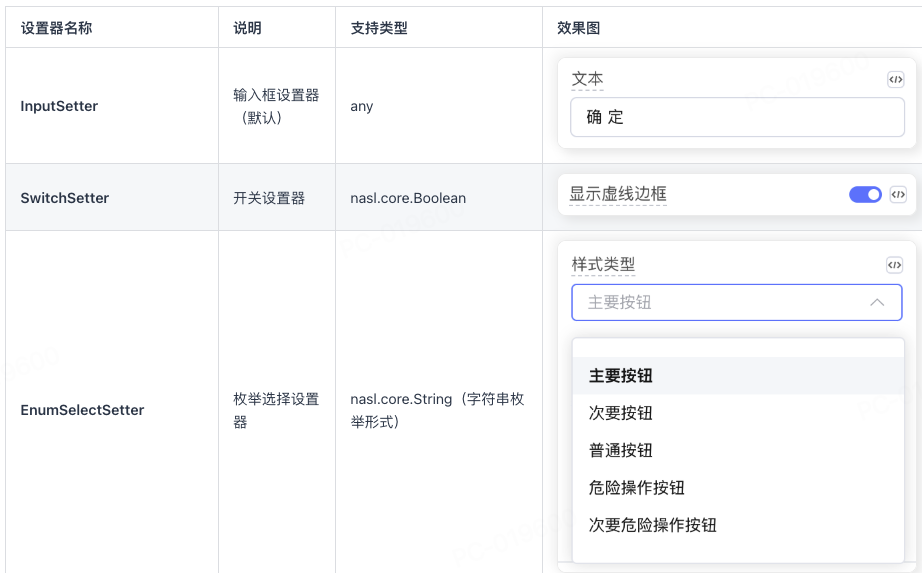

目前可用的设置器有：[设置器使用文档](https://community.codewave.163.com/CommunityParent/fileIndex?filePath=40.%E6%89%A9%E5%B1%95%E4%B8%8E%E9%9B%86%E6%88%90%2F10.%E6%89%A9%E5%B1%95%E5%BC%80%E5%8F%91%E6%96%B9%E5%BC%8F%2F20.%E5%89%8D%E7%AB%AF%E6%89%A9%E5%B1%95%E5%BC%80%E5%8F%91%2F30.%E7%BB%84%E4%BB%B6%E5%BC%80%E5%8F%91%2F15.%E7%BB%84%E4%BB%B6%E9%85%8D%E7%BD%AE%E7%BC%96%E5%86%99%E8%AF%B4%E6%98%8E.md&version=3.13&selectType=codewave&title=%E5%B1%9E%E6%80%A7%E8%AE%BE%E7%BD%AE%E5%99%A8)

- InputSetter：输入框设置器（默认）
- SwitchSetter：开关设置器
- EnumSlectSetter：下拉选项设置器
- CapsulesSetter：胶囊设置器
- NumberInputSetter：数字设置器
- IconSetter：图标设置器
- ImageSetter：图片设置器
- PropertySelectSetter：属性选择设置器
- AnonymousFunctionSetter：匿名函数设置器


**示例：下拉选项设置属性**

某些属性在静态绑定时，想要快速的选择效果，这时可以用 TS 的字符串枚举表示选项值，并配合枚举型 Setter 使用。但对应的 NASL 类型仍为`nasl.core.String`。

```typescript
@Prop({
    title: '样式类型'
    setter: {
        concept: 'EnumSelectSetter',
        options: [{ title: '默认' }, { title: '浅色' }, { title: '成功色' }, { title: '警告色' }, { title: '危险色' }],
    },
    ...
})
color: 'default' | 'light' | 'success' | 'warning' | 'danger' = 'default';

```

目前枚举型的 Setter 主要有两种：**EnumSelectSetter**、**CapsulesSetter**


**其他设计器用例**

​                        

​                        

```typescript
Prop({
  group: '主要属性',
  title: '文本',
  description: '按钮内容',
  setter: { concept: 'InputSetter' },
})
text: nasl.core.String = '';

@Prop({
  group: '状态属性',
  title: 'Disabled',
  description: '是否禁用状态',
  setter: { concept: 'SwitchSetter' },
})
disabled: nasl.core.Boolean = false;

@Prop({
  group: '主要属性',
  title: '图标',
  description: '图标类名',
  setter: { concept: 'IconSetter' },
})
icon: nasl.core.String;

@Prop({
  title: '图标位置',
  description: '设置图标居左或居右显示',
  setter: {
    concept: 'EnumSelectSetter',
    options: [{ title: '左' }, { title: '右' }],
  },
})
iconPosition: 'left' | 'right' = 'left';
```


#### 组件事件 @event

扩展组件事件可以通过@event定义给平台使用，用户可以通过“事件”面板定义特定事件的响应。

##### **示例：按钮自定义点击事件**

下面以按钮组件点击事件为例演示扩展组件事件的声明

​            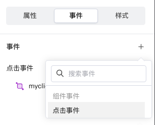        

##### **接口配置：api.ts**

```typescript
/// <reference types="@nasl/types" />
namespace nasl.ui {
  /* 省略其他部分 */
  /* 组件选项声明 */
  export class ElButtonOptions extends ViewComponentOptions {
    /* 点击事件声明 */
    @Event({
      title: '点击事件',
      description: '点击事件',
    })
    onMyClick: (e: { timestamp: nasl.core.Integer }) => void; // my-click
  }
}
```


##### **扩展知识**

1. 事件名称关键点：on开头，小驼峰命名，组件内事件名为肉串命名，例如onMyClick事件，组件内对应my-click事件，即this.$emit("my-click")

2. 参数类型：

3. 1. api.ts中声明类型可以使用nasl.core包中的7种原始类型或nasl.collection包中的两种集合类型

​            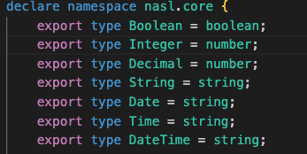        

​            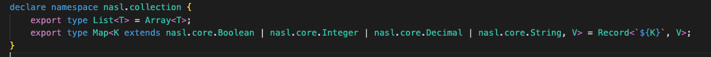        

- 1. 参数传一个，需要多个参数可以用对象形式：

​            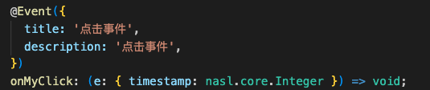        


#### 组件插槽 @slot

通过@slot装饰器定义组件插槽，平台会识别并显示槽位，以便用户向组件添加自定义内容。

##### **示例：面板插槽**

下面以面板组件内容和标题插槽为例演示扩展组件插槽的声明，定义了两个插槽：

- 标题插槽slotTitle
- 内容插槽slotDefault

​            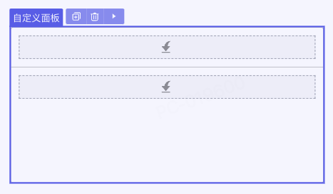        

**接口配置：api.ts**

```typescript
/// <reference types="@nasl/types" />
namespace nasl.ui {
  /* 省略其他部分 */
  /* 组件选项声明 */
  export class MyPanelOptions extends ViewComponentOptions {
    @Slot({
      title: '内容定制',
      description: 'xxxx'
    })
    slotDefault: () => Array<nasl.ui.ViewComponent>;// 需要写成nasl.ui.ViewComponent

    @Slot({
      title: '标题定制'
    })
    slotHeader: () => Array<nasl.ui.ViewComponent>;// 需要写成nasl.ui.ViewComponent
  }
}
```

**扩展知识**

- idetype为 container的组件才可以配合slot插入子节点；

```typescript
// 在 @Component 上增加ide 配置
@ExtensionComponent({
  // ...
  ideusage: {
    idetype: 'container',
  }
})
```


- 插槽中定义snippets可以让用户向插槽中添加预设的模板代码

```typescript
@ExtensionComponent({
  // ...
  ideusage: {
    idetype: 'container',
    structured: true, // 必须设置为 true 才会出现 + 按钮
  }
})
export class ElMenuOptions extends ViewComponentOptions {
  // ...
  @Slot({
    title: 'Default',  
    description: '内容', 
    snippets: [ // ide 点击 “+” 后的提示，title提示描述，code点击后默认添加代码
      {
        title: '添加下拉菜单分组',
        code: '<el-menu-item-group></el-menu-item-group>',
      },
      { title: '菜单项', code: '<el-menu-item></el-menu-item>' },
    ],
  })
  slotDefault: () => Array<nasl.ui.ViewComponent>;
}
```


#### **组件实例方法 @Method**

使用@Method来描述组件提供的方法:

​                    

**接口配置：api.ts**

```typescript
namespace nasl.ui {
  // 实例方法定义在组件类中
  @Component({})
  @ExtensionComponent({})
  export class MyTable extends ViewComponent {
    @Method({
        title: '导出',
        description: '导出 excel 文件',
    })
    exportExcel(
        // 如果有参数则需要@Param对参数进行描述
        // 参数描述中的 title 和 description 在IDE中不可见，但仍然建议将其作为标识为参数补全。
        @Param({
            title: '当前页码',
            description: '当前页码',
        })
        page: nasl.core.Integer = 1,
        @Param({
            title: '每页条数',
            description: '每页条数',
        })
        size: nasl.core.Integer = 2000,
        // ... 
    ): void {}
  }
}
```


#### **组件实例属性 @Prop**

组件的[可访问属性](https://community.codewave.163.com/CommunityParent/fileIndex?filePath=20.应用开发%2F10.页面设计%2F19.组件可访问属性.md&version=3.13)是指在逻辑或表达式的可视化编辑面板中能够直接被访问和操作的组件属性。

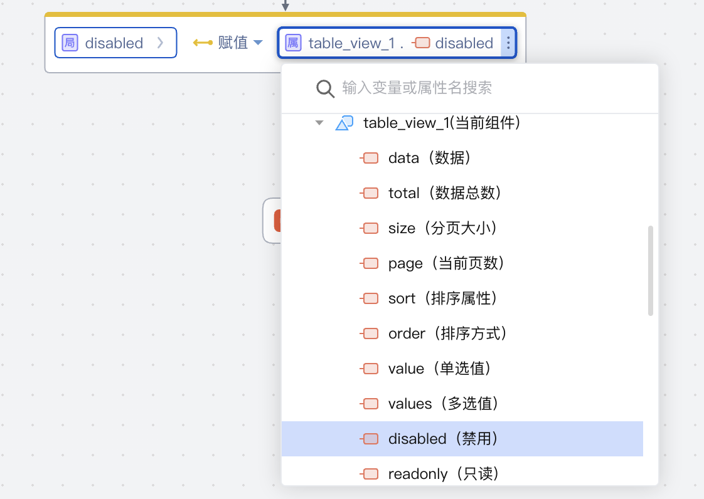        

**功能实现**

通过组件同步sync:state事件来同步内部状态。

```typescript
// sync.ts
// 用于动态生成watch和computed配置项
import type { ComponentOptions, WatchOptionsWithHandler } from 'vue';

export type SyncOption = string | { [name: string]: string | (() => any) };
export interface SyncOptionItem {
    name: string;
    stateKey: string;
    computed?: () => any;
}

function createWatch(name: string): WatchOptionsWithHandler<any> {
    return {
        handler(val, oldVal) {
            if (val === oldVal) {
                return;
            }
            this.$emit('sync:state', name, val);
        },
        immediate: true,
    };
}

function normalizeSyncOptions(options: SyncOption[]) {
    const syncMap: { [key: string]: SyncOptionItem } = {};
    const computedMap: { [key: string]: () => any } = {};
    const watchMap: Record<string, WatchOptionsWithHandler<any>> = {};
    
    options.forEach((option) => {
        if (typeof option === 'string') {
            syncMap[option] = {
                name: option,
                stateKey: option,
            };
            watchMap[option] = createWatch(option);
            return;
        }
    
        Object.keys(option).forEach((name) => {
            const val = option[name];
    
            if (typeof val === 'function') {
                const stateKey = [name, 'sync'].join('__');
                syncMap[name] = {
                    name,
                    stateKey,
                };
        
                watchMap[stateKey] = createWatch(name);
                computedMap[stateKey] = val;
                return;
            }
        
            syncMap[name] = {
                name,
                stateKey: val,
            };
            watchMap[val] = createWatch(name);
        });
    });
    
    return {
        syncMap,
        computedMap,
        watchMap,
    };
}

export default (...options: SyncOption[]) => {
    const {
        syncMap,
        watchMap,
        computedMap,
    } = normalizeSyncOptions(options);
    return {
        watch: {
        ...watchMap,
        },
        computed: {
        ...computedMap,
        },
    } as ComponentOptions<any>;
};
```

组件内部引入并设置

```typescript
// comp.vue
import sync from './sync';

export default {
    mixins: [
        sync({
            disabled: 'disabled',
        }),
    ],
}
```

可选项：在 api.ts文件中通过为相关属性设置settable: true可开启属性可赋值

```typescript
@Prop({·
  //...
  settable: true,
})
```


### 开发案例

#### 案例1：封装echarts

##### 效果演示


##### 组件开发

##### 接口声明

#### 案例2：封装fullcalendar

#### 案例3：封装动态表单

#### 案例4：封装钉钉JS-SDK

#### 案例5：基础组件二开
