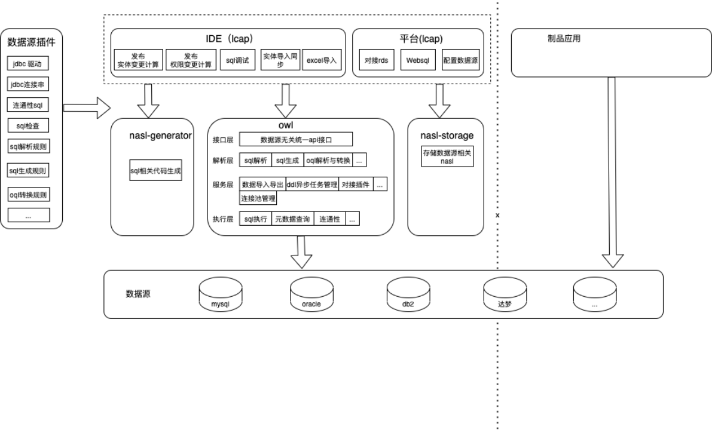
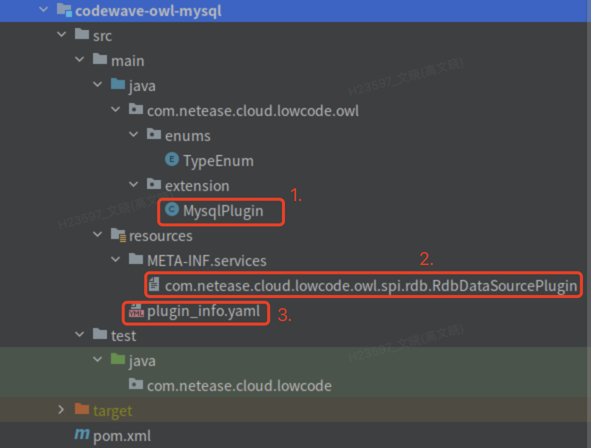
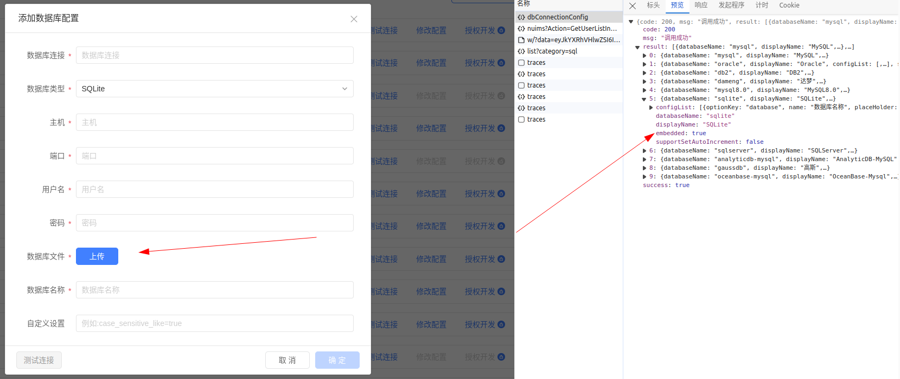
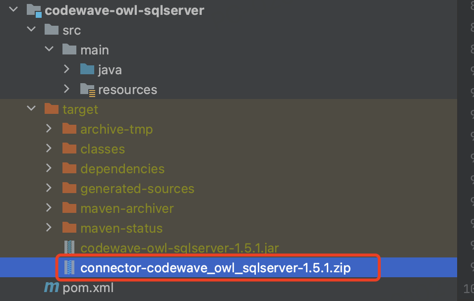
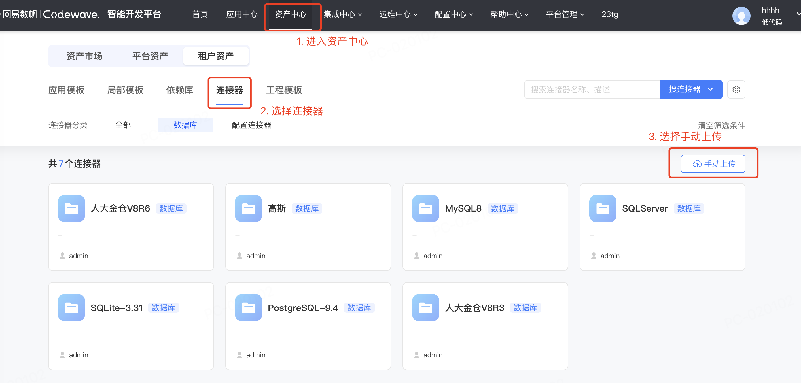
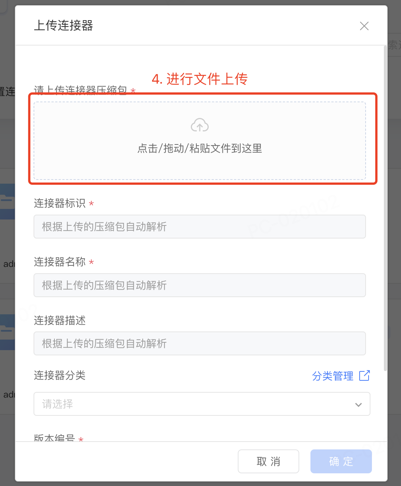
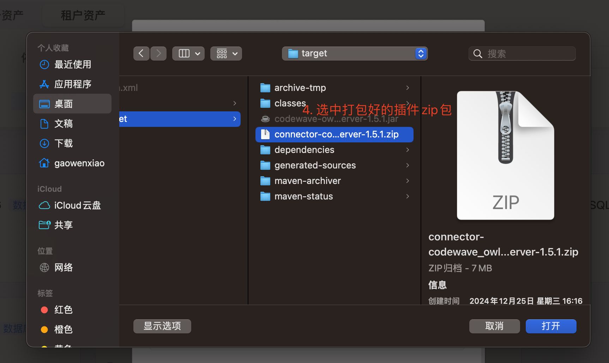
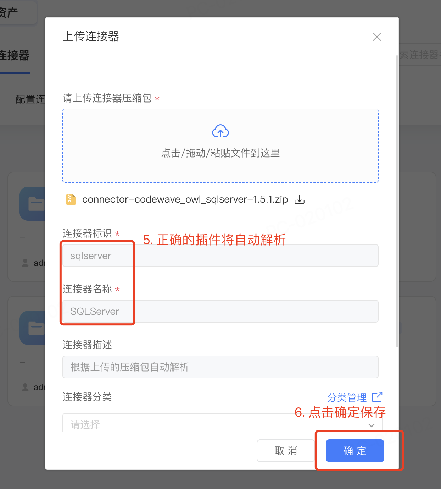
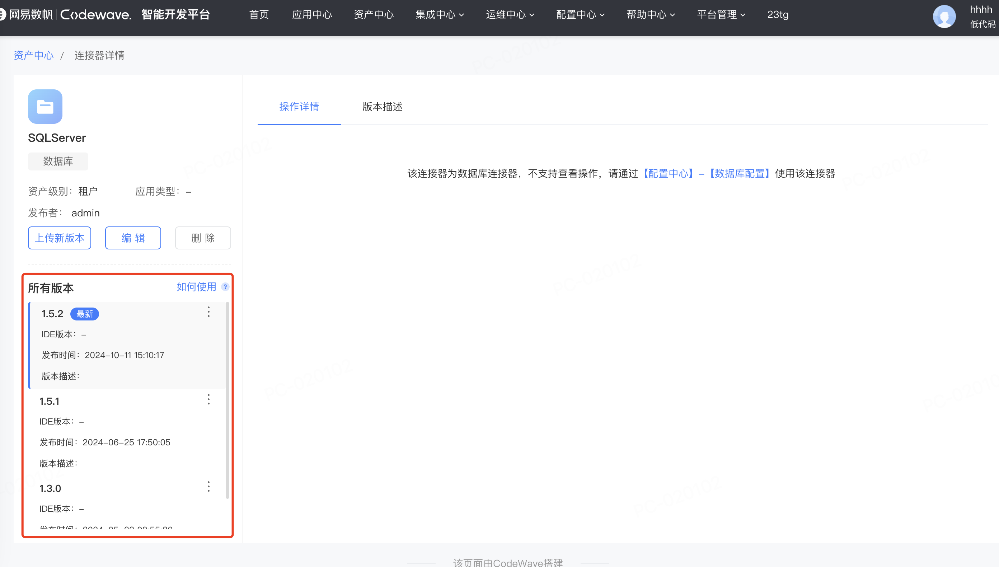

# 数据库插件开发指南
作者：刘宇奇

## 概览(Overview)
数据库插件是 CodeWave 低代码平台提供的快速集成新关系型数据库品牌的解决方案，本指南旨在指导开发者实现一个 CodeWave 低代码数据库连接器，并集成到平台上进行使用。

​            

**图 1 数据库插件化架构图**

## 快速开始(Quick Start)
### 1. 引入数据库插件化 sdk
当前最新版本为 1.5.2，具体可能需要根据开发时的实际版本进行修改。
```xml
<dependency>
    <groupId>com.netease.cloud.lowcode</groupId>
    <artifactId>codewave-owl-plugin</artifactId>
    <version>1.5.2</version>
</dependency>
```

### 2. 实现接口或继承抽象类
实现接口 `com.netease.cloud.lowcode.owl.spi.rdb.RdbDataSourcePlugin`，或继承 `com.netease.cloud.lowcode.owl.spi.rdb.AbstractRdbDataSourcePlugin`（推荐），其中 `AbstractRdbDataSourcePlugin` 基于模板模式实现了大部分通用功能。
```java
public class MysqlPlugin extends AbstractRdbDataSourcePlugin {
    @Override
    public String dbType() {
        return "mysql";
    }
    ...
}
```

### 3. 完成插件配置并注册
在插件工程中完成插件配置 `plugin_info.yaml`，并进行插件注册 `META-INF/services/com.netease.cloud.lowcode.owl.spi.rdb.RdbDataSourcePlugin`。

`plugin_info.yaml` 基本内容

```yaml
# 类型映射，其中 key 为 nasl 基础类型简写，value 可一个列表表示可映射的数据库存储类型集合
columnTypeMappings:
    Double:
        - columnType: float
          defaultMapping: false
          options: { }
          alias: [ 'float' ]
        - columnType: double
          defaultMapping: true
          options: { }
          alias: [ 'double', 'real' ]
    ...
# 插件基础信息，包括插件数据库类型定义(需要全局唯一)、插件展示的数据库名称以及连接串选项定义
jdbcConnectionConfigInfo:
    databaseName: mysql
    displayName: MySQL5.7
    configList:
        - inputType: text
          name: 主机
          optionKey: host
          placeHolder: 请输入数据库主机地址
          required: true
          bind: { }
        - inputType: text
```

`META-INF/services/com.netease.cloud.lowcode.owl.spi.rdb.RdbDataSourcePlugin` 内容

```plaintext
com.netease.cloud.lowcode.owl.extension.MysqlPlugin
```

## 实现指南(User Implementation Guide)
### 环境准备
插件开发前，请确认下述环境是否已准备好：
1. JDK1.8
2. Maven
3. `com.netease.cloud.lowcode:codewave-owl-plugin` 插件 spi 依赖（https://github.com/netease-lcap/codewave-architect-course/tree/main/example/owl/codewave-owl-mysql-8.0/jar/codewave-owl-plugin-1.5.2-SNAPSHOT.jar）

**PS：这里的版本最好以开发时最新版本为准，可以二次确认下，例如 1.5.2**
```xml
<dependency>
    <groupId>com.netease.cloud.lowcode</groupId>
    <artifactId>codewave-owl-plugin</artifactId>
    <version>1.5.2</version>
    <scope>compile</scope>
</dependency>
```

### 可选步骤
#### 引入平台连接器打包插件
平台 v3.6 版本之后通过下述插件打的 zip 包可直接通过资产中心上传。
```xml
<plugin>
    <groupId>com.netease.lowcode</groupId>
    <artifactId>connector-package-maven-plugin</artifactId>
    <version>1.0.0</version>
    <executions>
        <execution>
            <goals>
                <goal>archive</goal>
            </goals>
        </execution>
    </executions>
    <configuration>
        <!-- 这里是需要一起打包的依赖，正常 jdbc 驱动需要一起打包 -->
        <includeGroupIds>com.microsoft.sqlserver</includeGroupIds>
    </configuration>
</plugin>
```

#### 开发工具推荐
推荐使用 IntelliJ IDEA，社区版即可。

### 插件开发
#### 工程结构
​            

1. 如上图所示，第一部分是插件类实现部分，必须实现 `RdbDataSourcePlugin` 接口，不过开发时我们建议继承虚类 `AbstractRdbDataSourcePlugin`，该虚类实现了大部分通用实现，可以简化开发难度。
2. 第二部分是 spi 注册文件，该文件固定为 `/META-INF/services/com.netease.cloud.lowcode.owl.spi.rdb.RdbDataSourcePlugin`，文件内容为插件实现类全限定名，如上图所示为 `"com.netease.cloud.lowcode.owl.extension.MysqlPlugin"`。该规范是 Java spi 机制。
3. 第三部分为插件定义文件 `plugin_info.yaml`，该文件主要包括两部分内容：
    - 类型系统映射
    - 插件定义，包括插件 id（`databaseName`）、连接选项定义等
4. 【可选】从 v3.13 版本开始平台支持插件自定义 sql 函数，所以对于平台版本 >= 3.13 的环境插件里还可能包括第四部分 `function_definition.json` 文件，该文件用来定义本插件对应的数据库支持的 sql 函数列表。

#### 插件实现类
插件实现类主要需要实现包括：
1. 插件基本信息（插件数据库类型、驱动类、jdbc 连接串生成等）
2. 元数据查询（连通性测试、数据表集合、表结构查询等）
3. sql 生成（ddl、dml）、sql 解析（主要为 create table）
4. 方言处理（关键字包装、常量格式等）

#### 插件方法说明
下面是插件方法的详细说明，以 Mysql8.0 (https://github.com/netease-lcap/codewave-architect-course/tree/main/example/owl/codewave-owl-mysql-8.0)插件为例。

##### `getPluginJdbcInfo`
非必须实现，抽象类已经实现统一的方法。

##### `dbType`
非必须实现，抽象类已经实现统一的方法。默认读取插件定义文件中的 `databaseName`。

##### `getJdbcUrl`
必须实现。
jdbc 的连接串一般有单节点和多节点两种模式，多节点一般为 `"jdbc:mysql://host1:port1,host2,port2/database?option1=value1&option2=value2"`，入参为 `RdbDataSource`，值得注意的是 host 的格式，多节点情况下 host 格式分两种，一种是 `host1+port1,host2+port2`，一种是 `host1,host2`，port 放在 port 参数中，两种方式都需要兼容。
```java
public String getJdbcUrl(RdbDataSource dataSourceParam) {
    StringBuilder jdbcBuilder = new StringBuilder(JDBC_PREFIX);
    String[] hosts = dataSourceParam.getHost().split(",");
    String hyper = "";
    for (String host : hosts) {
        jdbcBuilder.append(hyper).append(host.contains(":") ? host : host + ":" + dataSourceParam.getPort());
        hyper = ",";
    }
    if (!PluginUtils.isEmpty(dataSourceParam.getDbname())) {
        jdbcBuilder.append("/").append(dataSourceParam.getDbname());
    }
    hyper = "?";
    Map<String, String> options = dataSourceParam.getOptions();
    if (!PluginUtils.isEmpty(options)) {
        for (Map.Entry<String, String> entry : options.entrySet()) {
            jdbcBuilder.append(hyper).append(entry.getKey()).append("=").append(entry.getValue());
            hyper = "&";
        }
    }
    jdbcBuilder.append(hyper).append(JDBC_SUFFIX);
    return jdbcBuilder.toString();
}
```

##### `getJdbcDriver`
必须实现。
该方法会用于获取 `Connection`，必须实现。方法入参和获取 jdbc 的完全一致，注意先手动加载驱动类。
```java
try {
    return new com.mysql.cj.jdbc.Driver();
} catch (Exception e) {
    throw new LcapRdbPluginException("Get jdbc driver error", e);
}
```

##### `mavenDependence`
必须实现。
数据源 JDBC 驱动对应的 maven 坐标，例如 mysql 则需要根据引入的驱动版本。
```java
public class MavenDependence {
    private String groupId;
    private String artifactId;
    private String version;
}
```
```xml
<dependency>
    <groupId>mysql</groupId>
    <artifactId>mysql-connector-java</artifactId>
    <version>8.0.20</version>
</dependency>
```

##### `showDatabases`
必须实现。
展示数据库列表，数据源的 ping 方法依赖该方法的实现。
mysql 支持语法 `"SHOW DATABASES"`，但是其他数据源未必支持这类语法，则需要了解对应数据源如何获取数据库列表，注意对返回结果进行排序。
```java
@Override
public List<String> showDatabases(Connection connection) {
    List<String> databaseNames = new ArrayList<>();
    String sql = "SHOW DATABASES";
    try (Statement stmt = connection.createStatement();
         ResultSet rs = stmt.executeQuery(sql)) {
        while (rs.next()) {
            String dbName = rs.getString(1);
            databaseNames.add(dbName);
        }
    } catch (Exception e) {
        throw new LcapRdbPluginException("Show databases error", e);
    }
    return databaseNames.stream().sorted(String::compareToIgnoreCase).collect(Collectors.toList());
}
```

##### `showTables`
必须实现。
展示数据表的列表，websql 界面的数据表列表依赖该方法。
入参多了一个 `schemaName`，因为有些数据源需要模式名，另外注意返回结果排序。
```java
@Override
public List<String> showTables(Connection connection, String schemaName) {
    List<String> tableNames = new ArrayList<>();
    String sql = "SHOW TABLES";
    try (Statement stmt = connection.createStatement();
         ResultSet rs = stmt.executeQuery(sql)) {
        while (rs.next()) {
            String tableName = rs.getString(1);
            tableNames.add(tableName);
        }
    } catch (Exception e) {
        throw new LcapRdbPluginException("Show tables error", e);
    }
    return tableNames.stream().sorted(String::compareToIgnoreCase).collect(Collectors.toList());
}
```

##### `showIndexes`
必须实现。
查询出 `tableName` 对应的表的索引信息并按格式返回即可，返回格式为索引列表，元素对应 `RdbIndexInfo`。
以 Mysql 为例，可以使用 “SHOW INDEXES FROM table_name” 获取索引相关信息，其他数据源如不支持此语法则需要使用其他查询方案。
注意：因为查询结果一般是以列为单位，但是返回结果是以索引为单位，需要进行聚合处理，例如索引 A 包含列 a 和列 b，则上述查询语句可能是索引 A、列 a 和索引 A、列 b 两行数据，因此需要合并列。
```java
@Override
public List<RdbIndexInfo> showIndexes(Connection connection, String schemaName, String tableName) {
    String sql = "SHOW INDEXES FROM " + wrapKeyword(tableName);
    Map<String, RdbIndexInfo> indexMap = new HashMap<>();
    try (Statement stmt = connection.createStatement();
         ResultSet rs = stmt.executeQuery(sql)) {
        while (rs.next()) {
            String indexName = rs.getString("Key_name");
            String columnName = rs.getString("Column_name");
            RdbIndexInfo index;
            if (indexMap.containsKey(indexName)) {
                index = indexMap.get(indexName);
                List<String> columnNames = index.getColumnNames();
                columnNames.add(columnName);
                index.setColumnNames(columnNames);
            } else {
                index = new RdbIndexInfo();
                index.setIndexName(indexName);
                List<String> columnNames = new ArrayList<>();
                columnNames.add(columnName);
                index.setColumnNames(columnNames);
                index.setPrimary(indexName.equalsIgnoreCase("PRIMARY"));
                index.setUnique(rs.getString("Non_unique").equalsIgnoreCase("0"));
                index.setComment(rs.getString("Index_comment"));
            }
            indexMap.put(indexName, index);
        }
    } catch (Exception e) {
        throw new LcapRdbPluginException("Show indexes error", e);
    }
    return new ArrayList<>(indexMap.values());
}
```

##### `describeTable`
必须实现。
查询出 `tableName` 对应的表并返回对应的列信息、索引信息和表信息即可，返回格式为表信息，对应 `RdbTableInfo`。
以 Mysql 为例，可以使用 “SHOW TABLE STATUS WHERE Name = 'table_name'” 获取表相关信息，其他数据源如不支持此语法则需要使用其他查询方案。
```java
@Override
public RdbTableInfo describeTable(Connection connection, String schemaName, String tableName) {
    RdbTableInfo tableInfo = new RdbTableInfo();
    String sql = "SHOW TABLE STATUS WHERE Name = '" + tableName + "'";
    try (Statement stmt = connection.createStatement();
         ResultSet rs = stmt.executeQuery(sql)) {
        while (rs.next()) {
            tableInfo.setTableName(rs.getString("Name"));
            tableInfo.setComment(rs.getString("Comment"));
            tableInfo.setColumns(showColumns(connection, tableName));
            tableInfo.setIndexes(showIndexes(connection, schemaName, tableName));
        }
    } catch (Exception e) {
        throw new LcapRdbPluginException("Describe table error", e);
    }
    return tableInfo;
}

private List<RdbColumnInfo> showColumns(Connection connection, String tableName) {
    List<RdbColumnInfo> columnInfoList = new ArrayList<>();
    String sql = "SHOW FULL COLUMNS FROM " + wrapKeyword(tableName);
    try (Statement stmt = connection.createStatement();
         ResultSet rs = stmt.executeQuery(sql)) {
        while (rs.next()) {
            RdbColumnInfo columnInfo = new RdbColumnInfo();
            columnInfo.setColumnName(rs.getString("Field"));
            String columnType = rs.getString("Type");
            columnInfo.setColumnType(columnType);
            columnInfo.setDefaultValue(rs.getString("Default"));
            columnInfo.setComment(rs.getString("Comment"));
            columnInfo.setPrimaryKey(rs.getString("Key").equalsIgnoreCase("PRI"));
            columnInfo.setNotNull(rs.getString("Null").equalsIgnoreCase("NO"));
            columnInfo.setAutoIncrement(rs.getString("Extra").contains("auto_increment"));
            columnInfoList.add(columnInfo);
        }
    } catch (Exception e) {
        throw new LcapRdbPluginException("Show columns error", e);
    }
    return columnInfoList;
}
```

##### `showSequences`
非必须实现。
在 owl 中，sequence 是和自增息息相关的，如果数据源本身支持自增，比如 mysql 既可以通过建表指定，又可以通过新增/变更列的时候指定自增，是没必要实现该方法的。
mysql 不支持序列，不过整体上查询思路和索引类似，入参和索引相同，返回结果为序列列表，序列类 `RdbSequenceInfo`。

##### `toCreateDatabaseSql`
目前仅 mysql 使用，可以不实现。
参考各自数据源的写法拼接 SQL 语句即可，例如 mysql，则是：
```sql
CREATE DATABASE `database_name`;
```

##### `toDeleteDatabaseSql`
目前仅 mysql 使用，可以不实现。
参考各自数据源的写法拼接 SQL 语句即可，例如 mysql，则是：
```sql
DROP DATABASE IF EXISTS `database_name`;
```

##### `toCreateDbAccountSql`
目前仅 mysql 使用，可以不实现。
参考各自数据源的写法拼接 SQL 语句即可，例如 mysql，则是：
```sql
CREATE USER IF NOT EXISTS 'root'@'%' IDENTIFIED BY 'root';
```

##### `toDeleteDbAccountSql`
目前仅 mysql 使用，可以不实现。
参考各自数据源的写法拼接 SQL 语句即可，例如 mysql，则是：
```sql
DROP USER IF EXISTS 'root'@'%';
```

##### `toGrantPrivilegeSql`
目前仅 mysql 使用，可以不实现。
参考各自数据源的写法拼接 SQL 语句即可，例如 mysql，则是：
```sql
GRANT xxxx ON *.* TO 'root'@'%'; FLUSH PRIVILEGES;
```

##### `toTruncateTableSql`
必须实现。
导入导出时有 truncate 选项，因此该方法必须实现。
参考各自数据源的写法拼接 SQL 语句即可，例如 mysql，则是：
```sql
TRUNCATE TABLE `table_name`;
```

##### `toCreateTableSql`
必须实现：发布应用时会建表，不实现则无法发布。
根据传入的表信息进行拼接建表语句，入参为 `RdbTableInfo`。
以 Mysql 为例，建表语句类似于下边的 sql，根据入参的信息，补充上表名，表 comment，列信息（包括列名，列类型，是否自增，是否为空，是否是主键，默认值，comment）等。值得注意的是建表信息会和建索引信息作为一个整体下发，因此需要加上建索引的语句。
PS：执行时会按照分号 ';' 分割 SQL 执行，因此多条 SQL 间需要加分号。
```sql
CREATE TABLE orders (
    order_id INT NOT NULL AUTO_INCREMENT,
    customer_id INT NOT NULL DEFAULT 1,
    order_date DATE COMMENT '订单日期',
    PRIMARY KEY (customer_id)
) COMMENT '订单表';
ALTER TABLE orders ADD INDEX idx_customer_id (customer_id) COMMENT '索引：客户 ID';
```
建表语句方法示例：
```java
@Override
public String toCreateTableSql(RdbTableInfo tableMetaInfo) {
    StringBuilder sqlBuilder = new StringBuilder("CREATE TABLE ");
    sqlBuilder.append(wrapKeyword(tableMetaInfo.getTableName())).append(" (\n");
    String hyper = "";
    // 添加列
    List<RdbColumnInfo> columns = tableMetaInfo.getColumns();
    for (RdbColumnInfo column : columns) {
        sqlBuilder.append(hyper).append(wrapKeyword(column.getColumnName())).append(" ")
               .append(column.getColumnType(this))
               .append(Boolean.TRUE.equals(column.getNotNull()) ? " NOT NULL" : "");
        if (Boolean.TRUE.equals(column.getPrimaryKey()) && Boolean.TRUE.equals(column.getAutoIncrement())) {
            sqlBuilder.append(" AUTO_INCREMENT");
        } else {
            // 处理默认值，例如字符类型需要加引号，数字类型则不需要加引号等
            sqlBuilder.append(toColumnDefaultValue(tableMetaInfo.getTableName(), column));
        }
        sqlBuilder.append(!PluginUtils.isEmpty(column.getComment()) ? " COMMENT '" + dealWithSpecialChar(column.getComment()) + "'" : "");
        hyper = ",\n";
    }
    // 添加主键
    Set<String> primaryKeys = columns.stream()
           .filter(rdbColumnInfo -> Boolean.TRUE.equals(rdbColumnInfo.getPrimaryKey())).map(RdbColumnInfo::getColumnName).collect(Collectors.toSet());
    if (!PluginUtils.isEmpty(primaryKeys)) {
        sqlBuilder.append(hyper).append("PRIMARY KEY (").append(primaryKeys
               .stream().map(this::wrapKeyword)
               .collect(Collectors.joining(","))).append(")");
    }
    // 添加表 comment
    sqlBuilder.append("\n)")
           .append(PluginUtils.isEmpty(tableMetaInfo.getComment()) ? ";\n" : " COMMENT='" + dealWithSpecialChar(tableMetaInfo.getComment()) + "';\n");
    // 添加索引
    List<RdbIndexInfo> indexes = Optional.ofNullable(tableMetaInfo.getIndexes()).orElseGet(ArrayList::new);
    for (RdbIndexInfo index : indexes) {
        List<String> columnsName = index.getColumnNames();
        // 和主键相同的索引不需要添加，会自动创建
        if (!PluginUtils.isEmpty(columnsName) && columnsName.size() == primaryKeys.size() && primaryKeys.containsAll(columnsName)) {
            continue;
        }
        sqlBuilder.append(toAddTableIndexSql(tableMetaInfo, index));
    }
    return sqlBuilder.toString();
}
```
重点：此处有一个非常重要的点，列类型如何获取，上述方法中用到了 `"column.getColumnType(this)"` 获取列类型。在实际插件开发中无需关心实现，只需要知道使用这种方式获取类型即可。

追根溯源，简单讲一下为什么需要这样引用，而不是直接 `"column.getColumnType()"`。
在 `RdbColumnInfo` 中有一个 `NaslType` 的参数，`NaslType` 只有固定的几类，和具体的数据源无关，但是不同的数据源其数据类型名称不尽相同，所以需要根据不同数据源插件的配置文件来获取字段在对应数据源下的实际数据类型。
```java
public String getColumnType(RdbDataSourcePlugin plugin) {
    if (null == plugin) {
        throw new LcapRdbPluginException("数据源插件不能为空");
    }
    return getColumnType(plugin.getDbColumnTypeMappings());
}

// 解析 yaml 文件得到 columnMappings，和配置文件内信息一致
public String getColumnType(Map<String, List<RdbColumnMapping>> columnMappings) {
    if (!PluginUtils.isEmpty(columnType) || null == naslType) {
        return columnType;
    }
    if (columnMappings.isEmpty()) {
        throw new LcapRdbPluginException("非法数据源插件");
    }
    List<RdbColumnMapping> rdbColumnMappings = columnMappings.get(naslType.getName());
    String sourceColumnType = naslType.getStorageType();
    if (!PluginUtils.isEmpty(rdbColumnMappings)) {
        RdbColumnMapping defaultColumnMapping = rdbColumnMappings.get(0);
        if(PluginUtils.isEmpty(sourceColumnType)) {
            sourceColumnType = defaultColumnMapping.getColumnType() + StorageTypeOptionEnum.appendOptions(naslType.getStorageOptions(), defaultColumnMapping);
        } else {
            // 优先匹配定义类型
            for (RdbColumnMapping rdbColumnMapping : rdbColumnMappings) {
                // 匹配定义类型名或别名
                if (rdbColumnMapping.getColumnType().equalsIgnoreCase(sourceColumnType) || rdbColumnMapping.getAlias().contains(sourceColumnType)) {
                    sourceColumnType = rdbColumnMapping.getColumnType() + StorageTypeOptionEnum.appendOptions(naslType.getStorageOptions(), rdbColumnMapping);
                    return sourceColumnType;
                }
            }
            // 匹配合并类型
            List<RdbColumnMapping> mergeRdbColumnMappings = new ArrayList<>();
            if (NaslTypeEnum.LONG.code.equalsIgnoreCase(naslType.getName())) {
                mergeRdbColumnMappings = columnMappings.get(NaslTypeEnum.INTEGER.code);
            } else if(NaslTypeEnum.DECIMAL.code.equalsIgnoreCase(naslType.getName())) {
                mergeRdbColumnMappings = columnMappings.get(NaslTypeEnum.DOUBLE.code);
            } else if(NaslTypeEnum.STRING.code.equalsIgnoreCase(naslType.getName())) {
                mergeRdbColumnMappings = columnMappings.get(NaslTypeEnum.TEXT.code);
            }
            for (RdbColumnMapping rdbColumnMapping : mergeRdbColumnMappings) {
                if (rdbColumnMapping.getColumnType().equalsIgnoreCase(sourceColumnType) || rdbColumnMapping.getAlias().contains(sourceColumnType)) {
                    sourceColumnType = rdbColumnMapping.getColumnType() + StorageTypeOptionEnum.appendOptions(naslType.getStorageOptions(), rdbColumnMapping);
                    return sourceColumnType;
                }
            }
        }
    }
    return sourceColumnType;
}
```

##### `toDropTableSql`
必须实现：发布应用时有些实体会发生变更，有些会被清理，所以有些表需要删除。
参考各自数据源的写法拼接 SQL 语句即可，例如 mysql，则是：
```sql
DROP TABLE IF EXISTS `table_name`;
```

##### `toRenameTableSql`
必须实现：实体可能被重命名。
参考各自数据源的写法拼接 SQL 语句即可，例如 mysql，则是：
```sql
ALTER TABLE `table_name_a` RENAME TO `table_name_b`;
```

##### `toAddTableColumnSql`
必须实现：发布应用时可能新增列。
参考各自数据源的写法拼接 SQL 语句即可，例如 mysql，则是：
```sql
ALTER TABLE `table_name` ADD COLUMN `column_type` NOT NULL DEFAULT 'xxx' COMMENT 'xxx';
```

##### `toDropTableColumnSql`
必须实现：发布应用时可能删除列。
参考各自数据源的写法拼接 SQL 语句即可，例如 mysql，则是：
```sql
ALTER TABLE `table_name` DROP COLUMN `column_name`;
```

##### `toAlterTableColumnSql`
必须实现：发布应用时可能变更列，包括重命名列、变更列类型等。
参考各自数据源的写法拼接 SQL 语句即可，有些数据源可能不支持多个操作放在一起，此时需要拼接多个 SQL，分别将重命名，变更列的类型等操作拼接成 SQL，例如 postgresql，可能多条 SQL：
```sql
ALTER TABLE "xxxx" RENAME COLUMN "xxxx" TO "xxxx";
ALTER TABLE "xxxx" ALTER COLUMN "xxxx" TYPE "xxxx";
ALTER TABLE "xxxx" ALTER COLUMN "xxxx" SET NOT NULL;
COMMENT ON COLUMN "xxxx" IS "xxxx";
ALTER TABLE "xxxx" ALTER COLUMN "xxxx" SET  DEFAULT xxxx;
```

##### `toAddTableIndexSql`
必须实现：实体可能会新建索引，包括列，comment，是否为 UNIQUE 等。
参考各自数据源的写法拼接 SQL 语句即可，例如 mysql，则是：
```sql
CREATE UNIQUE INDEX `index_name` ON `table_name`(`column_name_a`,`column_name_b`) COMMENT 'xxx';
```

##### `toDropTableIndexSql`
必须实现：有些索引不合适可能会被清理掉。
参考各自数据源的写法拼接 SQL 语句即可，例如 mysql，则是：
```sql
DROP INDEX `index_name` ON `table_name`;
```

##### `toRenameTableIndexSql`
必须实现：重命名索引，这里有两种策略，一种是支持 rename 语法，一种是先删除旧索引，再新增索引。
参考各自数据源的写法拼接 SQL 语句即可，例如 mysql 支持 rename 语法，则是：
```sql
ALTER TABLE `table_name` RENAME INDEX `index_name_a` TO `index_name_b`;
```

##### `toSetAutoIncrement`
必须实现：主键列可能从非自增设置为自增类型。
参考各自数据源的写法拼接 SQL 语句即可，例如 mysql，则是：
```sql
ALTER TABLE `table_name_a` MODIFY COLUMN `column_name` column_type AUTO_INCREMENT;
```
- 列必须是主键，必须是整数才能构造自增主键 SQL，如果列已经自增，则不需要拼接，直接返回即可。
- 如果是通过序列的方式实现自增，必须注意自增的起始值和列类型的最大值满足条件，例如列最大值为 100，则下一个自增值需要从 101 开始，需要根据入参 `startValue` 设置起始值；`exists` 这个参数是标志是否已经存在同名的序列，如果通过序列实现，则需要调整序列的下一个值为 `startValue`。

这里以 Oracle 为例：
```java
@Override
public String toSetAutoIncrement(RdbTableInfo tableMetaInfo, RdbColumnInfo columnMetaInfo, long startValue, boolean exists) {
    String sequenceName = columnMetaInfo.getSequenceName();
    StringBuilder sqlBuilder = new StringBuilder();
    // exists 代表当前数据库或模式下的同名序列是否存在
    // 存在则需要变更序列起始值，不存在则需要新建序列并初始化起始值
    if(!exists) {
        sqlBuilder.append("CREATE SEQUENCE ")
               .append(wrapKeyword(sequenceName)).append(" INCREMENT BY 1 START WITH ").append(startValue)
               .append(" MAXVALUE 999999999999999999 NOCYCLE NOCACHE;\n");
    } else {
        sqlBuilder.append("ALTER SEQUENCE ").append(wrapKeyword(sequenceName)).append(" INCREMENT BY ").append(startValue).append(";\n");
    }
    return sqlBuilder.toString();
}
```

##### `wrapSelectKey`
非必须实现：若当前数据源不支持像 Mysql 一样的 auto increment，必须通过序列实现自增，则需要实现。
以 Oracle 为例，必须通过序列实现自增，需要实现该方法。方法比较简单，查询对应序列的下一个值即可，注意这里需要返回指定别名 `propertyName`。
```java
@Override
public String wrapSelectKey(String schema, String tableName, String sequence, String primaryKey, String propertyName) {
    return "SELECT " + wrapKeyword(sequence) + ".NEXTVAL as " + wrapKeyword(propertyName) + " from dual";
}
```

##### `toInsertSql`
必须实现。
参考各自数据源的写法拼接 SQL 语句即可，例如 mysql，则是：
```sql
INSERT INTO `table_name`(`column_name_a`,`column_name_b`,`column_name_c`,...) VALUES ('1',2,true,...);
```
`RdbDmlColumnInfo` 同样有 `columnType` 和 `naslType`，同样根据 `column.getColumnType(this)` 获取类型。
拼接插入 SQL 方法示例：
```java
@Override
public RdbDmlPrepareSql toInsertSql(RdbInsertParam insertData) {
    // 自定义的 sql 不作处理
    if (!PluginUtils.isEmpty(insertData.getSql())) {
        return new RdbDmlPrepareSql(insertData.getSql(), null);
    }
    StringBuilder sqlBuilder = new StringBuilder("INSERT INTO ");
    sqlBuilder.append(wrapKeyword(insertData.getTableName()));
    sqlBuilder.append(" (");
    String hyper = "";
    StringBuilder valuesPlacesHolderBuilder = new StringBuilder();
    List<Object> values = new ArrayList<>(insertData.getColumns().size());
    for (RdbDmlColumnInfo rdbDmlColumnInfo : insertData.getColumns()) {
        // 列名
        sqlBuilder.append(hyper).append(wrapKeyword(rdbDmlColumnInfo.getColumnName()));
        // 处理列值，wrapValueByType 方法根据列的类型处理列的值，例如字符类型添加单引号，数字类型则不需要加单引号
        valuesPlacesHolderBuilder.append(hyper).append(wrapValueByType(rdbDmlColumnInfo.getColumnType(this), rdbDmlColumnInfo.getColumnValue()));
        hyper = ",";
    }
    sqlBuilder.append(") VALUES (");
    // 将列值拼到 sql 中
    sqlBuilder.append(valuesPlacesHolderBuilder);
    sqlBuilder.append(")");
    return new RdbDmlPrepareSql(sqlBuilder.toString(), values);
}

private String wrapValueByType(String columnType, Object columnValue) {
    if (columnValue == null) {
        return "null";
    }
    String valueStr = String.valueOf(columnValue);
    switch (TypeEnum.getTypeEnum(columnType)) {
        case VARCHAR:
        case TEXT:
        case CHAR:
            // 处理特殊字符，可以参考下边的方法
            return wrapValueString(dealWithSpecialChar(valueStr));
        case UNKNOWN:
        case DATE:
        case TIME:
        case DATETIME:
        case TIMESTAMP:
            return wrapValueString(valueStr);
        case TINYINT:
            // 这里会返回 0/1
            return wrapBooleanValue(Boolean.valueOf(valueStr));
        case BLOB:
            // 二进制可能会乱码，需要简单处理下
            return wrapBinaryValue(valueStr);
        default:
            return valueStr;
    }
}
```

##### `toBatchInsertSql`
必须实现。
参考各自数据源的写法拼接 SQL 语句即可，这里有一个额外的参数 `isReplace`，代表是否需要替换参数，如果不需要替换，则直接使用 “?” 替换即可，替换操作在外部执行。
```sql
INSERT INTO `table_name`(`column_name_a`,`column_name_b`,`column_name_c`,...) VALUES ('1',2,true,...),('2',3,false,...);
INSERT INTO `table_name`(`column_name_a`,`column_name_b`,`column_name_c`,...) VALUES (?,?,?,...);
```
实现示例：
```java
@Override
public RdbDmlPrepareSql toBatchInsertSql(RdbBatchInsertParam insertData, boolean isReplace) {
    // 自定义的 sql 不作处理
    if (!PluginUtils.isEmpty(insertData.getSql())) {
        return new RdbDmlPrepareSql(insertData.getSql(), null);
    }
    StringBuilder sqlBuilder = new StringBuilder("INSERT INTO ");
    sqlBuilder.append(wrapKeyword(insertData.getTableName()));
    sqlBuilder.append(" (");
    String hyper = "";
    StringBuilder valuesPlacesHolderBuilder = new StringBuilder();
    List<RdbDmlColumnInfo> rdbColumnInfoList = insertData.getColumns().get(0);
    for (RdbDmlColumnInfo rdbDmlColumnInfo : rdbColumnInfoList) {
        sqlBuilder.append(hyper).append(wrapKeyword(rdbDmlColumnInfo.getColumnName()));
        hyper = ",";
    }
    hyper = "";
    for (List<RdbDmlColumnInfo> columns : insertData.getColumns()) {
        for (RdbDmlColumnInfo column : columns) {
            valuesPlacesHolderBuilder.append(hyper);
            if (isReplace) {
                valuesPlacesHolderBuilder.append(wrapValueByType(column.getColumnType(this), column.getColumnValue()));
            } else {
                valuesPlacesHolderBuilder.append("?");
            }
            hyper = ",";
        }
        hyper = "),(";
    }
    sqlBuilder.append(") VALUES (");
    sqlBuilder.append(valuesPlacesHolderBuilder);
    sqlBuilder.append(")");
    return new RdbDmlPrepareSql(sqlBuilder.toString(), null);
}
```

##### `toUpdateSql`
必须实现。
参考各自数据源的写法拼接 SQL 语句即可，例如 mysql，则是：
```sql
UPDATE `table_name` SET `column_name_a`='1',`column_namne_b`=2 WHERE xxx;
```
这里着重介绍一下 `DmlWhereCondition` 类，根据目前平台支持的情况，where 条件目前有 6 种子类实现，包括四种操作符，=、and、or、in 和操作符两边的参数，即列信息和值信息，这个 `wheres` 是一颗二叉树，通过递归构造出 where 条件。
```java
@JsonTypeInfo(
    use = JsonTypeInfo.Id.NAME,
    property = "operator",
    visible = true
)
@JsonSubTypes({
    @JsonSubTypes.Type(value = DmlAndCondition.class, name = "and"),
    @JsonSubTypes.Type(value = DmlColumnCondition.class, name = "column"),
    @JsonSubTypes.Type(value = DmlEqualsCondition.class, name = "="),
    @JsonSubTypes.Type(value = DmlInCondition.class, name = "in"),
    @JsonSubTypes.Type(value = DmlOrCondition.class, name = "or"),
    @JsonSubTypes.Type(value = DmlValueCondition.class, name = "value"),
})
@Data
public class DmlWhereCondition {
    private String operator;
}

@Data
public class DmlAndCondition extends DmlWhereCondition {
    private DmlWhereCondition left;
    private DmlWhereCondition right;
}

@Data
public class DmlEqualsCondition extends DmlWhereCondition {
    private DmlWhereCondition left;
    private DmlWhereCondition right;
}

@Data
public class DmlInCondition extends DmlWhereCondition {
    private DmlWhereCondition left;
    private DmlWhereCondition right;
}

@Data
public class DmlOrCondition extends DmlWhereCondition {
    private DmlWhereCondition left;
    private DmlWhereCondition right;
}

@Data
public class DmlColumnCondition extends DmlWhereCondition {
    private String columnName;
    private String columnType;
    private NaslType naslType;
}

@Data
public class DmlValueCondition extends DmlWhereCondition {
    private Object value;
    private String columnType;
    private NaslType naslType;
}
```
处理 WHERE 条件，递归构造 where 子句的方法示例：
```java
@Override
public String handleWhereCondition(DmlWhereCondition wheres, List<Object> placeHolderValues) {
    if (null == wheres) {
        return "";
    }
    StringBuilder sqlBuilder = new StringBuilder();
    if (wheres instanceof DmlAndCondition) {
        sqlBuilder.append("(").append(handleWhereCondition(((DmlAndCondition) wheres).getLeft(), placeHolderValues)).append(")");
        sqlBuilder.append(" AND ");
        sqlBuilder.append("(").append(handleWhereCondition(((DmlAndCondition) wheres).getRight(), placeHolderValues)).append(")");
    } else if (wheres instanceof DmlOrCondition) {
        sqlBuilder.append("(").append(handleWhereCondition(((DmlOrCondition) wheres).getLeft(), placeHolderValues)).append(")");
        sqlBuilder.append(" OR ");
        sqlBuilder.append("(").append(handleWhereCondition(((DmlOrCondition) wheres).getRight(), placeHolderValues)).append(")");
    } else if (wheres instanceof DmlEqualsCondition) {
        sqlBuilder.append(handleWhereCondition(((DmlEqualsCondition) wheres).getLeft(), placeHolderValues));
        sqlBuilder.append(" = ");
        sqlBuilder.append(handleWhereCondition(((DmlEqualsCondition) wheres).getRight(), placeHolderValues));
    } else if (wheres instanceof DmlInCondition) {
        DmlInCondition dmlInCondition = (DmlInCondition) wheres;
        sqlBuilder.append(handleWhereCondition(dmlInCondition.getLeft(), placeHolderValues));
        sqlBuilder.append(" IN ");
        if (dmlInCondition.getRight() instanceof DmlValueCondition) {
            DmlValueCondition valueCondition = (DmlValueCondition) dmlInCondition.getRight();
            PluginUtils.precondition(valueCondition.getValue() instanceof List, "in 条件右边需要是个 list");
            List valueList = (List) valueCondition.getValue();
            sqlBuilder.append("(");
            String hyper = "";
            for (Object value : valueList) {
                sqlBuilder.append(hyper).append(wrapValueByType(valueCondition.getColumnType(this), value));
                hyper = ",";
            }
            sqlBuilder.append(")");
        } else {
            sqlBuilder.append(handleWhereCondition(((DmlEqualsCondition) wheres).getRight(), placeHolderValues));
        }
    } else if (wheres instanceof DmlColumnCondition) {
        sqlBuilder.append(wrapKeyword(((DmlColumnCondition) wheres).getColumnName()));
    } else if (wheres instanceof DmlValueCondition) {
        DmlValueCondition valueCondition = (DmlValueCondition) wheres;
        sqlBuilder.append(wrapValueByType(valueCondition.getColumnType(this), valueCondition.getValue()));
    }
    return sqlBuilder.toString();
}
```
Update 方法示例：
```java
@Override
public RdbDmlPrepareSql toUpdateSql(RdbUpdateParam updateData) {
    // 自定义的 sql 不作处理
    if (!PluginUtils.isEmpty(updateData.getSql())) {
        return new RdbDmlPrepareSql(updateData.getSql(), null);
    }
    StringBuilder sqlBuilder = new StringBuilder("UPDATE ");
    sqlBuilder.append(wrapKeyword(updateData.getTableName()));
    sqlBuilder.append(" SET ");
    String hyper = "";
    List<Object> values = new ArrayList<>();
    for (RdbDmlColumnInfo columnInfo : updateData.getColumns()) {
        sqlBuilder.append(hyper).append(wrapKeyword(columnInfo.getColumnName())).append(" = ");
        sqlBuilder.append(wrapValueByType(columnInfo.getColumnType(this), columnInfo.getColumnValue()));
        hyper = ",";
    }
    // 处理条件
    if (null != updateData.getWheres()) {
        sqlBuilder.append(" WHERE ").append(handleWhereCondition(updateData.getWheres(), values));
    }
    return new RdbDmlPrepareSql(sqlBuilder.toString(), values);
}
```


##### toDeleteSql
参考各自数据源的写法拼接 SQL 语句即可，例如 mysql，则是：
```sql
DELETE FROM `table_name` WHERE xxxx;
```

delete 方法示例：
```java
@Override 
public RdbDmlPrepareSql toDeleteSql(RdbDeleteParam deleteData) {
    // 自定义的 sql 不作处理
    if (!PluginUtils.isEmpty(deleteData.getSql())) {
        return new RdbDmlPrepareSql(deleteData.getSql(), null);
    }
    StringBuilder sqlBuilder = new StringBuilder("DELETE FROM ");
    sqlBuilder.append(wrapKeyword(deleteData.getTableName()));
    // 处理条件
    List<Object> values = new ArrayList<>();
    if (null != deleteData.getWheres()) {
        sqlBuilder.append(" WHERE ").append(handleWhereCondition(deleteData.getWheres(), values));
    }
    return new RdbDmlPrepareSql(sqlBuilder.toString(), values);
}
```

##### toSelectSql
**必须实现**

查询语句是数据库中最常用，也是变种最多的方法，入参比较简单，参考实体类 `RdbSelectParam`。

查询语句有以下情况：
- 查询聚合函数。聚合函数目前支持以下几类：均值，数量，去重数量，最大值，最小值，求和。
  **在有聚合函数的情况下需要拼接别名，和其他模块约定的别名已经定义在下边枚举类中，注意不要自行定义或者忘记别名。**
```java
public enum AggregationEnum {
    AVG("avg", "average"),
    COUNT("count", "count"),
    COUNT_DISTINCT("countDistinct", "countDistinct"),
    MAX("max", "maximum"),
    MIN("min", "minimum"),
    SUM("sum", "summary"),
    UNKNOWN("unknown", "unknown");

    private final String aggregation;
    private final String alias;

    AggregationEnum(String aggregation, String alias) {
        this.aggregation = aggregation;
        this.alias = alias;
    }
}
```
- 直接查询表信息
- 自定义的 SQL 作为子查询，即 `SELECT * FROM (SELECT xxx FROM xxx WHERE xxx)`；括号内为子查询语句
- order by 排序子句
- limit 子句

方法示例：
```java
@Override 
public RdbDmlPrepareSql toSelectSql(RdbSelectParam selectData) {
    StringBuilder sqlBuilder = new StringBuilder("SELECT ");
    List<Object> values = new ArrayList<>();
    // 处理聚合函数
    if (!PluginUtils.isEmpty(selectData.getAggregation())) {
        AggregationEnum aggregationEnum = AggregationEnum.getAggregationEnum(selectData.getAggregation());
        switch (aggregationEnum) {
            case COUNT:
                sqlBuilder.append(selectData.getAggregation()).append("( ");
                break;
            case AVG:
            case MAX:
            case MIN:
            case SUM:
                PluginUtils.precondition(!PluginUtils.isEmpty(selectData.getColumns()) && selectData.getColumns().size() == 1,
                        "聚合函数'" + aggregationEnum.getAggregation() + "'只能指定单列");
                sqlBuilder.append(selectData.getAggregation()).append("( ");
                break;
            case COUNT_DISTINCT:
                PluginUtils.precondition(!PluginUtils.isEmpty(selectData.getColumns()),
                        "聚合函数'" + aggregationEnum.getAggregation() + "'必须指定列");
                sqlBuilder.append("COUNT( DISTINCT ");
                break;
            case UNKNOWN:
            default:
                throw new LcapRdbPluginException("不支持的聚合函数类型");
        }
    }
    // 处理列
    if (PluginUtils.isEmpty(selectData.getColumns())) {
        sqlBuilder.append("*");
    } else {
        String hyper = "";
        for (RdbDmlColumnInfo columnInfo : selectData.getColumns()) {
            sqlBuilder.append(hyper).append(wrapKeyword(columnInfo.getColumnName()));
            hyper = ",";
        }
    }
    // 聚合函数别名
    if (!PluginUtils.isEmpty(selectData.getAggregation())) {
        AggregationEnum aggregationEnum = AggregationEnum.getAggregationEnum(selectData.getAggregation());
        sqlBuilder.append(" ) AS ").append(aggregationEnum.getAlias());
    }
    sqlBuilder.append(" FROM ");
    // 子查询语句
    if (!PluginUtils.isEmpty(selectData.getSql())) {
        sqlBuilder.append("(").append(selectData.getSql()).append(")").append(" AS ").append("table_").append(RandomUtils.generateStr(10));
        if (!PluginUtils.isEmpty(selectData.getVariables())) {
            values.addAll(selectData.getVariables());
        }
    } else {
        sqlBuilder.append(wrapKeyword(selectData.getTableName()));
    }
    // 处理 WHERE 条件
    if (selectData.getWheres() != null) {
        sqlBuilder.append(" WHERE ").append(handleWhereCondition(selectData.getWheres(), values));
    }
    // 添加 ORDER BY 子句
    sqlBuilder.append(wrapOrderBy(selectData.getOrderBys()));
    // 添加 LIMIT 子句
    String resultSql = wrapLimitClause(sqlBuilder.toString(), selectData.getOffset(), selectData.getLimit());
    return new RdbDmlPrepareSql(resultSql, values);
}
```

##### wrapKeyword
**必须实现**

处理表名，列名，模式名，索引名等信息，可以用于区分大小写，比如 postgresql 是双引号，mysql 是反引号，这样其他方法使用到表名时可以直接调用该方法，省去重复代码。
```java
@Override 
public String wrapKeyword(String str) {
    return "`" + str + "`";
}
```

##### wrapLimitClause
**必须实现**

处理翻页语句，比如 mysql 是 `xxxx limit x, y`;oracle 需要根据 rownum 过滤。
- 这个方法比较特殊，因为是直接对 sql 进行修改，所以需要考虑到 sql 可能已经包括了分页关键字，这样需要将原本 sql 变成子查询；
- 入参 limit 和 offset 都可能为空，所以需要做一定处理；

```java
// Mysql 方法示例
@Override 
public String wrapLimitClause(String sql, String offset, String size, String end) {
    // 有些分页做的比较完善，用不到 end 关键字，无需关心
    if(sql.contains("LIMIT") || sql.contains("limit") || sql.contains("OFFSET") || sql.contains("offset")) {
        sql = "SELECT * FROM (" + sql + ") AS alias001";
    }
    return sql + (size == null ? "" : " LIMIT " + size) + (offset == null ? "" : " OFFSET " + offset);
}

// Oracle 方法示例，因为这里的分页方法不够完善，需要处理 end 关键字，这里的 offset 和 end 分别代表分页的开始和结束
@Override 
public String wrapLimitClause(String sql, String offset, String size, String end) {
    if (PluginUtils.isEmpty(offset) && PluginUtils.isEmpty(end)) {
        return sql;
    }
    if (PluginUtils.isEmpty(sql)) {
        if((offset == null || offset.equals("")) && size.equals("1")) {
            return " AND ROWNUM = 1";
        } else {
            throw new LcapRdbPluginException("SQL语句不合法，SQL不能为空");
        }
    }
    // 因为可能拼多层 sql，防止重名，因此需要随机生成一个 rownum 的别名
    String rowNumName = "LCAP_RN_INDEX_" + RandomUtils.generateStr(3);
    String innerTableName = "alias_" + RandomUtils.generateStr(3);
    String outerTableName = "alias_" + RandomUtils.generateStr(4);
    StringBuilder sqlBuilder = new StringBuilder();
    sqlBuilder.append("select * from (select ").append(innerTableName).append(".*, ROWNUM ").append(rowNumName)
            .append(" from (").append(sql).append(") ").append(innerTableName).append(") ").append(outerTableName)
            .append(" where ").append(rowNumName).append(" > ").append(offset)
            .append(" and ").append(rowNumName).append(" <= ").append(end);
    return sqlBuilder.toString();
}
```

##### wrapBooleanValue
**必须实现**

处理 Boolean 类型，有些数据库不存在原生的布尔类型，需要特殊处理。以 Mysql 为例：
```java
@Override 
public String wrapBooleanValue(Boolean value) {
    return Boolean.TRUE.equals(value) ? "1" : "0";
}
```

##### wrapBinaryValue
**非必须实现**

二进制类型往往需要做一些特殊处理，无论是展示或者是导入导出，都需要进行兼容，这里的二进制统一会转成 16 进制，如果对应数据源有默认的**前缀处理**，则可不实现或者返回 null。
```java
@Override 
public String wrapBinaryValue(String value) {
    if (PluginUtils.isEmpty(value)) {
        return null;
    }
    // Mysql 的二进制都需要加上 0x 作为前缀
    return "0x" + value;
}
```

##### wrapConcatFunction
**必须实现**

拼接对应 sql 中的 concat 函数，因为不同数据的 concat 函数定义不太一致，所以需要插件特殊处理下，因为 concat 调用比较频繁，所以单独定义了个方法，这个是历史原因，其实应该通调用上面的方法。
```java
@Override 
public String wrapConcatFunction(String... strings) {
    if (null == strings) {
        return null;
    } else if (strings.length == 1) {
        return strings[0];
    } else {
        StringBuilder sqlBuilder = new StringBuilder();
        StringBuilder endBuilder = new StringBuilder();
        for(int i = 0; i < strings.length; ++i) {
            String str = strings[i];
            if (i < strings.length - 1) {
                sqlBuilder.append(i == 0 ? "" : ", ").append("concat(").append(str);
            } else {
                sqlBuilder.append(", ").append(str);
            }
            if (i > 0) {
                endBuilder.append(")");
            }
        }
        return sqlBuilder.append(endBuilder).toString();
    }
}
```

##### wrapCountClause
**非必须实现**

大部分数据源的自定义 SQL 都不需要做特殊处理，会直接调用抽象类的方法。
```java
/**
 * 生成 count 语句，多数数据库都是可以统一语法的，但是部分数据库可能得特殊处理
 * @param sql
 * @return
 */
public String wrapCountClause(String sql) {
    // 大部分数据源的自定义 SQL 都不需要做特殊处理
    if (sql.contains("count(") || sql.contains("COUNT(")) {
        return "select count(*) as " + AggregationEnum.COUNT.getAlias() +
            " from (" + sql + ") as realquery";
    } else {
        // 替换掉第一个 select 和 from 之间的内容
        return sql.replaceFirst("(?i)select.*?from", "select count(*) as count from");
    }
}
```

##### dealWithSpecialChar
**必须实现：数据源都需要对特殊符号进行转义**
```java
/**
 * 特殊字符处理，比如 mysql 的单引号需要转义
 *
 * @param value
 * @return
 */
@Override 
public String dealWithSpecialChar(String value) {
    if (PluginUtils.isEmpty(value)) {
        return value;
    }
    return value.replace("\\", "\\\\")
            .replace("'", "\\'")
            .replace("\"", "\\\"");
}
```

##### getValidationQuery
**必须实现**

这个函数是用于连接池连通性校验的 sql，比较固定，一般是 `select 1`，但是有些数据源不支持此类语法，可能有所改变，比如 db2，使用 `select 1 from sysibm.sysdummy1`。

##### wrapCaseWhenStatement
**非必须实现**

考虑到各个数据源对于 case when 的支持比较统一，抽象类提供了方法，可以根据自身 sql 进行调整，如下：
```java
public String wrapCaseWhenStatement(String caseExpression, String elseExpression, List<String> expressions) {
    PluginUtils.precondition(!PluginUtils.isEmpty(expressions) && expressions.size() % 2 == 0,
            "case when 表达式参数个数必须为偶数");
    StringBuilder sqlBuilder = new StringBuilder("CASE ");
    if (!PluginUtils.isEmpty(caseExpression)) {
        sqlBuilder.append(caseExpression).append(" ");
    }
    for (int i = 0; i < expressions.size(); i++) {
        if (i % 2 == 0) {
            sqlBuilder.append("WHEN ").append(expressions.get(i)).append(" THEN ");
        } else {
            sqlBuilder.append(expressions.get(i)).append(" ");
        }
    }
    if (!PluginUtils.isEmpty(elseExpression)) {
        sqlBuilder.append(" ELSE ").append(elseExpression).append(" ");
    }
    sqlBuilder.append("END");
    return sqlBuilder.toString();
}
```

##### wrapFunction
**需要平台调试 sql 功能时，必须实现，类似上边的 CONCAT 函数**

**该函数是将目前 Mysql 支持的函数翻译为参数传递给插件，插件根据自身数据源的特性转换为对应的内容。**

**比如 NOW 函数在 DB2 中就是 CURRENT_TIMESTAMP，那么返回 CURRENT_TIMESTAMP 即可**

入参介绍：
- functionName 函数名，不区分大小写，需要注意
- keywords 关键字，有些函数，比如聚合函数，可能包含 DISTINCT，ALL 等关键字
- arguments 参数列表，可能有多个函数，顺序为输入顺序，比如 SUBSTR 函数一定是三个参数，输入顺序为字符串‘abc’，子串起始下标，子串结束下标。

目前支持的函数有：
- ASCII：获取一个字符的 ASCII 码值
- GROUP_CONCAT：将多行的值连接成一个字符串
- IF：根据表达式的某个条件或值结果来执行一组 SQL 语句
- IFNULL：用于判断第一个表达式是否为 NULL，如果为 NULL 则返回第二个参数的值，如果不为 NULL 则返回第一个参数的值
- LENGTH：返回字符串的字节长度
- CHAR_LENGTH：返回字符串的实际长度
- SUBSTR：返回一个字符串的子串
- DATE：返回日期或日期/时间表达式的日期部分
- YEAR：返回 DATE 的年份
- DATE_ADD/DATE_SUB：日期或日期/时间表达式上添加指定的时间量
- TO_DAYS：返回日期和年份 0 之间的天数（日期“0000 - 00 - 00”）
- NOW：返回当前日期和时间
- TRUNCATE：将数字截断为指定的小数位数
- DAY：从日期和时间属性中提取月份中的日期值
- HOUR：从日期和时间属性中提取小时值
- MINUTE：从日期和时间属性中提取分钟值
- MONTH：从日期和时间属性中提取月份值
- YEAR：从日期和时间属性属性中提取年数
- QUARTER：提取与日期和时间属性对应的季度
- COALESCE：返回其第一个非 NULL 参数
- LOWER：将字符串转为小写
- UPPER：将字符串转为大写
- REPLACE：用另一个字符串值替换所有出现的指定字符串值
- ROUND：对给定的数值表达式进行四舍五入
- MAX：返回列中的最大值
- MIN：返回列中的最小值
- COUNT：用于计算表中满足条件的行数
- SUM：用于计算表中某个列的总和
- AVG：用于计算表中某个列的平均值
- RIGHT：RIGHT(str, n) 返回字符串 str 的右侧 n 个字符
- LEFT：LEFT(str, n) 函数返回字符串 str 的左侧 n 个字符
- DATE_FORMAT：将日期/时间数据转换为指定的格式
- STR_TO_DATE：将字符串转换为日期类型

**MYSQL 的 DATE_FORMAT 函数和 STR_TO_DATE 函数有如下格式及意义，需要转换为对应数据源的格式，不支持的格式可不处理**

| 格式 | 描述 |
| ---- | ---- |
| %a | 缩写星期名 |
| %b | 缩写月名 |
| %c | 月，数值 |
| %D | 带有英文前缀的月中的天 |
| %d | 月的天，数值(00 - 31) |
| %e | 月的天，数值(0 - 31) |
| %f | 微秒 |
| %H | 小时 (00 - 23) |
| %h | 小时 (01 - 12) |
| %I | 小时 (01 - 12) |
| %i | 分钟，数值(00 - 59) |
| %j | 年的天 (001 - 366) |
| %k | 小时 (0 - 23) |
| %l | 小时 (1 - 12) |
| %M | 月名 |
| %m | 月，数值(00 - 12) |
| %p | AM 或 PM |
| %r | 时间，12 - 小时（hh:mm:ss AM 或 PM） |
| %S | 秒(00 - 59) |
| %s | 秒(00 - 59) |
| %T | 时间, 24 - 小时 (hh:mm:ss) |
| %U | 周 (00 - 53) 星期日是一周的第一天 |
| %u | 周 (00 - 53) 星期一是一周的第一天 |
| %V | 周 (01 - 53) 星期日是一周的第一天，与 %X 使用 |
| %v | 周 (01 - 53) 星期一是一周的第一天，与 %x 使用 |
| %W | 星期名 |
| %w | 周的天 （0 = 星期日, 6 = 星期六） |
| %X | 年，其中的星期日是周的第一天，4 位，与 %V 使用 |
| %x | 年，其中的星期一是周的第一天，4 位，与 %v 使用 |
| %Y | 年，4 位 |
| %y | 年，2 位 |

##### getSupportedFunctions
返回对应插件的函数定义列表，存在默认实现，一般不需要实现

##### getFunctionDetails
根据函数名返回指定函数定义，存在默认实现，一般不需要实现

##### translateDataQueryFunction
根据输入翻译数据查询函数，存在默认实现，根据函数特性实现，例如有些函数定义难以直接翻译出对应的函数，比如复杂的函数，例如 CAST 函数等，用于数据查询组件

##### translateOqlFunction
根据输入翻译 OQL 函数，主要处理 generator 中没有定义的函数，根据函数特性实现，例如有些函数定义难以直接翻译出对应的函数，比如复杂的函数，例如 CAST 函数等，用于 SQL 查询组件

##### wrapDateValue、wrapTimeValue、wrapDatetimeValue
通过平台传入的数据一般都是经过格式处理的，在这里我们可以对输入的值进行格式化，保证数据符合格式。为了统一，我们在接口定义了默认方法，在方法内根据不同类型设定了默认格式，可以参考这些格式进行开发
- Date：yyyy - MM - dd
- Time：HH:mm:ss
- DateTime：yyyy - MM - dd HH:mm:ss z

##### tableSize
获取表的物理存储大小，非必须实现。

##### avgRowSize
查询某张表的平均行存储大小，用于文件导出时做溢出判断，非必须实现。

##### showSchemas
查询所有的 schema，如果支持多 schema，则返回多个 schema 名称，有默认实现，非必须实现，如数据源比较特殊则需要实现。

##### wrapSchemaName
处理模式名，翻译器翻译模式名时用到，默认用双引号拼接，例如 sqlserver 可能需要重写为用[]包裹。

#### 相关 Class 说明

##### RdbDataSource 数据源基础信息
```java
public class RdbDataSource {
    // 数据源类型
    private String dbType;
    // 数据库名称
    private String dbname;
    // 模式名称
    private String schemaName;
    // host
    private String host;
    // port
    private Integer port;
    // 用户名
    private String username;
    // 密码
    private String password;
    /** jdbc 连接串选项 **/
    private Map<String, String> options;
    /** 插件自定义的连接配置项 **/
    private Map<String, String> customConfigs;
}
```

##### PluginJdbcInfo 插件 Jdbc 连接信息
```java
public class PluginJdbcInfo {
    // 数据库类型名，例如 mysql，唯一标识，不同数据源则不相同
    private String databaseName;
    // 数据库类型展示名，比如达梦数据库一般展示为‘达梦’，mysql 则展示为‘MySQL’
    private String displayName;
    // 配置列表
    private List<RdbJdbcUrlOption> configList;
    // 是否支持设置自增，这里类似于 mysql 的 auto increment，如果通过序列等方式间接实现，则需要设置为 false
    private Boolean supportSetAutoIncrement = true;
    // 是否为嵌入式插件，例如 sqlite 插件，嵌入式插件需要上传文件，这里用作区分标识
    private Boolean embedded = false;
}
```

当配置了是否为嵌入式插件（比如 Sqllite），数据库连接页面会有如下上传按钮标识：

​            

##### RdbJdbcUrlOption 插件 jdbc 配置详情
```java
public class RdbJdbcUrlOption {
    /**
     * 属性名
     */
    private String optionKey;
    /**
     * 输入框名称
     */
    private String name;
    /**
     * 输入框填充信息
     */
    private String placeHolder;
    /**
     * 输入类型，这里有 text 和 selector，text 为可输入的任意文本，selector 为选择器，和 Bind 属性连用
     */
    private String inputType;
    /**
     * 是否必填
     */
    private Boolean required;
    /**
     * 绑定属性，针对下拉后需要绑定下拉属性展示的输入框的特殊情况情况
     */
    private Bind bind;
    /**
     * 校验规则，暂时没有
     */
    private String checkRule;
    /**
     * 下拉属性
     */
    private List<Option> selectOptions;

    public static class Option{
        private String name;
        private String value;
    }

    public static class Bind{
        private String key;
        private String value;
    }
}
```

##### RdbTableInfo 数据表信息
```java
public class RdbTableInfo {
    // 模式名，并不是所有的数据源都需要，不需要的情况下为 null
    private String schemaName;
    // 表名
    private String tableName;
    // 表的 comment
    private String comment;
    // 列信息
    private List<RdbColumnInfo> columns;
    // 索引信息
    private List<RdbIndexInfo> indexes;
}
```

##### RdbColumnInfo 列信息
```java
public class RdbColumnInfo {
    // 列名
    private String columnName;
    // 列类型
    private String columnType;
    // 列 comment
    private String comment;
    // 列的默认值，一般新增字段，建表时会用到，用于设置默认值
    private String defaultValue;
    // 字段是否为非空
    private Boolean notNull;
    // 字段是否自增
    private Boolean autoIncrement;
    // 字段是否为主键，默认不是主键
    private Boolean primaryKey = false;
    /** 自动推断 nasl 类型 **/
    private NaslType naslType;
    /** 自增序列名称 **/
    private String sequenceName;
    /** 约束名称，sqlserver 需要先删除约束名称，才能删除列 **/
    private List<RdbConstraintInfo> constraints;

    public class NaslType {
        /**
         * 平台类型
         */
        private String name;
        /**
         * 数据库类
         */
        private String storageType;
        /**
         * 类型扩展参数，例如 Decimal 类型，有两个扩展参数，precision 和 scale
         */
        private Map<String, String> storageOptions;
    }

    // 目前仅 sqlserver 用到，其他数据源用不到可不写
    public class RdbConstraintInfo {
        // 约束名称
        private String name;
        // 约束类型
        private String type;
    }
}
```

##### RdbIndexInfo 索引信息
```java
public class RdbIndexInfo {
    // 索引名
    private String indexName;
    // 索引包含的列
    private List<String> columnNames;
    // 索引是否为唯一索引
    private Boolean unique;
    // 索引的 comment
    private String comment;
    // 是否是主键索引
    private Boolean primary;
}
```

##### RdbSequenceInfo 序列信息，一般和自增绑定
```java
public class RdbSequenceInfo {
    // 序列名称
    private String sequenceName;
    // 序列最小值
    private String minValue;
    // 序列最大值
    private String maxValue;
    // 自增步长
    private String incrementBy;
    // 序列记录的上一次的值
    private String lastNumber;
}
```

##### RdbAccountInfo 数据库账户信息（目前仅 mysql 会用到）
```java
public class RdbAccountInfo {
    // 账户
    private String dbAccount;
    // 密码
    private String dbAccountPwd;
    // 账户权限列表，为空代表所有权限
    private List<String> privileges;
    // 账户可用于登录的 ip 列表，一般为空认为是 @
    private List<String> whiteIps;
}
```

##### RdbColumnMapping 配置文件类型映射类
**PS：这个类在前端类型添加和类型映射会用到，尽可能覆盖所有的常见类型**
```java
public class RdbColumnMapping {
    // 列类型
    private String columnType;
    // 是否为默认映射，有的 Nasl 类型包含的类型不止一个，只能有一个是默认映射类型
    private Boolean defaultMapping = false;
    // 最小值，非必须
    private String minValue;
    // 最大值，非必须
    private String maxValue;
    // 类型扩展选项
    private Map<String, RdbColumnOptions> options;
    // 别名列表，例如 integer 可能有 int，int4 等别名，统一为 integer，便于维护
    private List<String> alias;

    public static class RdbColumnOptions {
        // 扩展选项最小值
        private String min;
        // 扩展选项最大值
        private String max;
        // 扩展选项的 comment
        private String comment;
        // 扩展选项是否必须，比如 oracle 的 number 类型，可以是 number，也可以是 number(10,2)
        private Boolean require;
        // 扩展选项默认值
        private String defaultValue;
        // 扩展选项描述
        private String desc;
    }
}
```

##### RdbDdlInfo DML 操作父类及子类
ddl 的操作类型比较多，目前有 15 种 ddl 的操作类型，均继承自该类，**在相应的方法时会分别介绍各自的参数**
```java
@JsonTypeInfo(
        use = JsonTypeInfo.Id.NAME,
        property = "action",
        visible = true
)
@JsonSubTypes({
        @JsonSubTypes.Type(value = RdbAddColumnDdl.class, name = "addColumn"),
        @JsonSubTypes.Type(value = RdbAddIndexDdl.class, name = "addIndex"),
        @JsonSubTypes.Type(value = RdbAddTableDdl.class, name = "addTable"),
        @JsonSubTypes.Type(value = RdbAlterColumnDdl.class, name = "alterColumn"),
        @JsonSubTypes.Type(value = RdbAlterIndexDdl.class, name = "alterIndex"),
        @JsonSubTypes.Type(value = RdbAlterTableDdl.class, name = "alterTable"),
        @JsonSubTypes.Type(value = RdbDropColumnDdl.class, name = "dropColumn"),
        @JsonSubTypes.Type(value = RdbDropIndexDdl.class, name = "dropIndex"),
        @JsonSubTypes.Type(value = RdbDropTableDdl.class, name = "dropTable"),
        @JsonSubTypes.Type(value = RdbSetAutoIncrementDdl.class, name = "setAutoIncrement"),
        @JsonSubTypes.Type(value = RdbCreateDatabaseDdl.class, name = "createDatabase"),
        @JsonSubTypes.Type(value = RdbCreateDbAccountDdl.class, name = "createDbAccount"),
        @JsonSubTypes.Type(value = RdbDeleteDatabaseDdl.class, name = "deleteDatabase"),
        @JsonSubTypes.Type(value = RdbDeleteDbAccountDdl.class, name = "deleteDbAccount"),
        @JsonSubTypes.Type(value = RdbGrantPrivilege.class, name = "grantPrivilege"),
})
public class RdbDdlInfo {
    // add drop alter --> table、column、index
    // set auto increment
    // create drop --> account, database
    // grant privilege
    private String action;
    /** 因为表名或列表加上特殊标识字符(``或""等)在某些数据库里会存在大小写问题（比如 pg"test"和"Test"是两张表）
     ** 因为平台存在一些三方框架表比如定时任务表，而这些表在运行时的 sql 一般是框架自己实现的代码生成时会控制不到的
     ** 所以在建表时使用了特殊标识字符(``或""等)则可能会导致这些框架在运行时出现读取不到表的问题(大小写问题)
     ** 所以新增这个字段表示 ddl 的时候是否使用默认的大小写规则，这样避免一些三方框架表出现问题
     **/
    private Boolean useDefaultCase;
}
```

##### RdbDmlOrderBy Dml 语句排序字段
```java
public class RdbDmlOrderBy {
    // 列名称
    private String columnName;
    // 排序类型
    private String orderType;
}
```

##### DmlWhereCondition Dml 语句 Where 条件
为了实现可扩展性，兼容千变万化的 where 条件，这里参考二叉树，根据操作类型和列名列值实现。
```java
@JsonTypeInfo(
        use = JsonTypeInfo.Id.NAME,
        property = "operator",
        visible = true
)
@JsonSubTypes({
        @JsonSubTypes.Type(value = DmlAndCondition.class, name = "and"),
        @JsonSubTypes.Type(value = DmlColumnCondition.class, name = "column"),
        @JsonSubTypes.Type(value = DmlEqualsCondition.class, name = "="),
        @JsonSubTypes.Type(value = DmlInCondition.class, name = "in"),
        @JsonSubTypes.Type(value = DmlOrCondition.class, name = "or"),
        @JsonSubTypes.Type(value = DmlValueCondition.class, name = "value"),
})
@Data
public class DmlWhereCondition {
    private String operator;
}

// AND OR EQUALS IN 类型比较相似，由左右两棵子树构成
public class DmlAndCondition extends DmlWhereCondition {
    public DmlAndCondition() {
        setOperator("and");
    }
    private DmlWhereCondition left;
    private DmlWhereCondition right;
}

public class DmlEqualsCondition extends DmlWhereCondition {
    public DmlEqualsCondition() {
        setOperator("=");
    }
    private DmlWhereCondition left;
    private DmlWhereCondition right;
}

public class DmlInCondition extends DmlWhereCondition {
    public DmlInCondition() {
        setOperator("in");
    }
    private DmlWhereCondition left;
    private DmlWhereCondition right;
}

public class DmlOrCondition extends DmlWhereCondition {
    public DmlOrCondition() {
        setOperator("or");
    }
    private DmlWhereCondition left;
    private DmlWhereCondition right;
}

// 非操作符类型
// 列类型
public class DmlColumnCondition extends DmlWhereCondition {
    public DmlColumnCondition() {
        setOperator("column");
    }
    // 列名
    private String columnName;
    // 列类型，这里的列类型和 Nasl 类型至少要有一个值不为空
    private String columnType;
    // nasl 类型
    private NaslType naslType;
}

// 值类型
public class DmlValueCondition extends DmlWhereCondition {
    public DmlValueCondition() {
        setOperator("value");
    }
    // 值
    private Object value;
    // 列类型，这里的列类型和 Nasl 类型至少要有一个值不为空
    private String columnType;
    // nasl 类型
    private NaslType naslType;
}
```

##### RdbDmlParam dml 操作
```java
@JsonTypeInfo(
        use = JsonTypeInfo.Id.NAME,
        property = "action",
        visible = true
)
@JsonSubTypes({
        @JsonSubTypes.Type(value = RdbInsertParam.class, name = "insert"),
        @JsonSubTypes.Type(value = RdbBatchInsertParam.class, name = "batchInsert"),
        @JsonSubTypes.Type(value = RdbDeleteParam.class, name = "delete"),
        @JsonSubTypes.Type(value = RdbUpdateParam.class, name = "update"),
        @JsonSubTypes.Type(value = RdbSelectParam.class, name = "select"),
})
public class RdbDmlParam {
    private String action;
    /**
     * 有些场景下是直接传入 sql 执行，这种情况就不需要做 sql 转换了
     * 配套的 variables 是指预编译时的变量
     */
    private String sql;
    private List<Object> variables;
    // 模式名
    private String schemaName;
    // 表名
    private String tableName;
}

// 插入
public class RdbInsertParam extends RdbDmlParam {
    // 插入的列信息
    private List<RdbDmlColumnInfo> columns;
}

// 批量插入
public class RdbBatchInsertParam extends RdbDmlParam {
    // 插入的二维列信息，即插入多行
    private List<List<RdbDmlColumnInfo>> columns;
}

// 删除
public class RdbDeleteParam extends RdbDmlParam {
    // 删除数据的 where 条件
    private DmlWhereCondition wheres;
}

// 更新
public class RdbUpdateParam extends RdbDmlParam {
    // 待更新的列信息
    private List<RdbDmlColumnInfo> columns;
    // where 条件
    private DmlWhereCondition wheres;
}

// 查询
public class RdbSelectParam extends RdbDmlParam {
    // 待查询的列的信息
    private List<RdbDmlColumnInfo> columns;
    // 聚合函数，avg, count, countDistinct, max, min, sum
    private String aggregation;
    // 查询的 where 条件
    private DmlWhereCondition wheres;
    // 待排序的字段
    private List<RdbDmlOrderBy> orderBys;
    // offset，可能为空，不为空需要处理
    private String offset;
    // limit，可能为空，不为空需要处理
    private String limit;
    /** 查询结果是否同时返回总数，在插件中不必关心这个参数，该参数在统一逻辑层做处理 **/
    private Boolean returnCount;
}
```

##### RdbDmlColumnInfo dml 列信息
```java
public class RdbDmlColumnInfo {
    // 列名
    private String columnName;
    // 数据库中的列类型
    private String columnType;
    // 列的值
    private Object columnValue;
    // 平台类型
    private NaslType naslType;
}
```

#### 插件定义文件

##### 基本信息定义
包括数据库名称，展示名称，是否支持自增，是否内嵌等，具体参考 `PluginJdbcInfo` 插件 Jdbc 连接信息，给出一份示例，**另注意此处的 databaseName 和下边定义的 dbType 保持一致**：
```plaintext
databaseName: mysql8
displayName: MySQL8.0
supportSetAutoIncrement: false
embedded: false
```

插件连接所需要的参数，例如 MySQL 的 jdbc 需要 host、port、username、password、database 这些参数，插件连接器参数介绍参考实体 `RdbJdbcUrlOption`。如果需要**自定义参数**，请参考如下格式：

- inputType: 表示前端 ui 类型，目前支持 text(文本框)、password(密码框)、select(下拉框)
- name: 表示页面展示名称
- optionKey: 表示选项 key，存储到配置中的 key 名称
- placeHolder: 表示页面占位文案
- required: 表示该配置是否必填
- bind: 级联控制开关，表示 key 对应的多选项选择 value 值时才显示该配置
- selectOptions: inputType = select 下拉框类型时才生效，表示可选值
- checkRule: 表示对输入值的验证规则，比如 integer 表示输入值只能是数字、range(1,65535) 表示取值在 1~1,65535 之间

##### 参考文件
以 Mysql 为例：

https://github.com/netease-lcap/codewave-architect-course/tree/main/example/owl/codewave-owl-mysql-8.0/src/main/resources/plugin_info.yaml

##### 类型映射定义
数据库的数据类型和平台的 Nasl 类型之间的映射关系。多对多映射，一种 nasl 类型可以映射多种数据库类型，而一种数据库类型也可能映射到多种 nasl 类型，不过每种 nasl 类型应该有一种默认映射的数据库存储类型 (defaultMapping = true)。文件参数会用于解析和 Nasl 类型适配，owl 会读取 yaml 文件并解析，对应的类为 `RdbColumnMapping`，类详细信息参考入参实体类介绍。

Nasl 包含以下类型：**Double、Decimal、Integer、Long、String、Text、Boolean、Date、Time、DateTime、Binary、Enum**

注意平台侧是没有 Binary 这个类型的，所以一般把**二进制对应的类型默认为最大的类型**，比如 Mysql 的 blob 有 tinyintblob，longblob 等，就需要配置为 longblob，参考：
```plaintext
Binary:
  - columnType: blob
    defaultMapping: false
    options: { }
    alias: [ 'blob' ]
  - columnType: tinyblob
    defaultMapping: false
    options: { }
    alias: [ 'tinyblob' ]
  - columnType: mediumblob
    defaultMapping: false
    options: { }
    alias: [ 'mediumblob' ]
  - columnType: longblob
    defaultMapping: true
    options: { }
    alias: [ 'longblob' ]
```

简单的类型以 Double 为例，mysql 中的浮点数包括 float 和 double 两类，但是实际上还有一类 real，从使用上看，real 和 double 的区别不大，因此归为一类，也不再单独列一类，即 real 和 double 均是 double 的“别名”。
```plaintext
Double:
  - columnType: float
    defaultMapping: true
    options: { }
    alias: [ 'float' ]
  - columnType: double
    defaultMapping: false
    options: { }
    alias: [ 'double', 'real' ]
```

复杂的类型，以 String 类型为例，mysql 中的字符串包括 char 和 varchar 两类，char 一般有 char 和 character 两个别名，存储长度是必须的，在 1 - 255 之间，varchar 类型类似，存储长度是必须的，所以 require 为 true。
```plaintext
String:
  - columnType: char
    defaultMapping: false
    options:
      length:
        min: '1'
        max: '255'
        comment: '存储长度'
        require: true
        defaultValue: '255'
        desc: '存储长度可以定义在[1,255]之间的任意整数'
    minValue: "1"
    maxValue: "255"
    alias: [ 'char', 'character' ]
  - columnType: varchar
    defaultMapping: true
    options:
      length:
        min: '1'
        max: '4000'
        defaultValue: '256'
        comment: '存储长度'
        require: true
        desc: '若存储类型为自动，则存储长度为 256；若为非自动，则可以定义在[1,4000]之间的任意整数'
    alias: [ 'varchar', 'character varying' ]
```


### 插件打包
插件可以直接用 maven 打包命令进行打包，不过 >=3.6 版本之后我们建议使用平台提供的连接器打包插件进行打包，这样生成的 zip 包可以直接通过资产中心进行上传使用。

以下是 Maven 插件配置示例：
```xml
<plugin>
    <groupId>com.netease.lowcode</groupId>
    <artifactId>connector-package-maven-plugin</artifactId>
    <version>1.0.0</version>
    <executions>
        <execution>
            <goals>
                <goal>archive</goal>
            </goals>
        </execution>
    </executions>
    <configuration>
        <!-- 这里是需要一起打包的依赖，正常 jdbc 驱动需要一起打包 -->
        <includeGroupIds>com.microsoft.sqlserver</includeGroupIds>
    </configuration>
</plugin>
```

打包成功后，在工程的 target 目录下将生成一个 zip 包，该 zip 可以直接上传平台资产使用。

​            

### 插件验证
目前需要将插件上传到低代码平台进行相关功能测试，后续可能会推出相对应的测试框架，可在开发过程中直接进行插件功能验证。

## 插件交付方案

### 初次部署

#### v3.6 及之后版本
对于平台 v3.6 及之后版本可通过资产中心上传插件进行管理。

**注：目前数据库插件只有官方租户的管理员角色有权限上传**

​            

​            

​            

​            


### 升级
v3.6 及之后版本数据库插件通过版本化来进行升级管理，对于需要进行升级的插件只需在打包时将插件版本进行升级并上传平台后，平台默认使用该插件最新版本来运行。

​            
