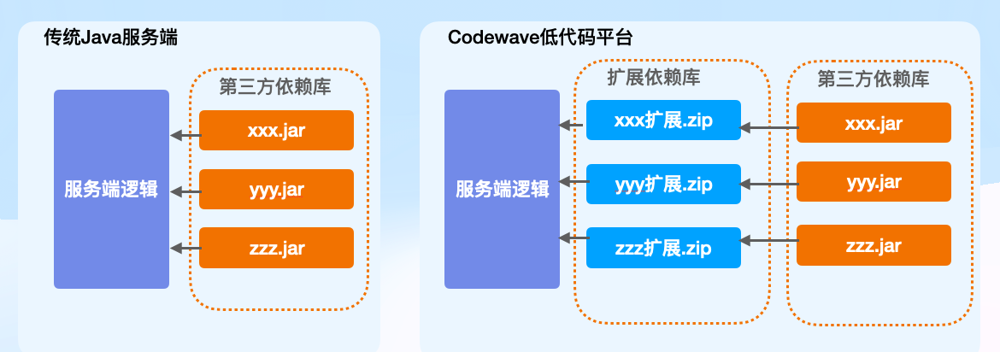
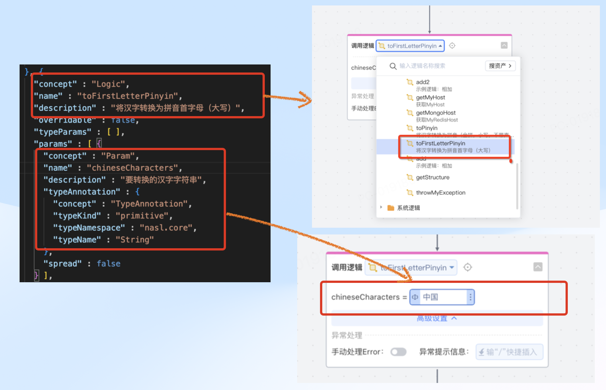
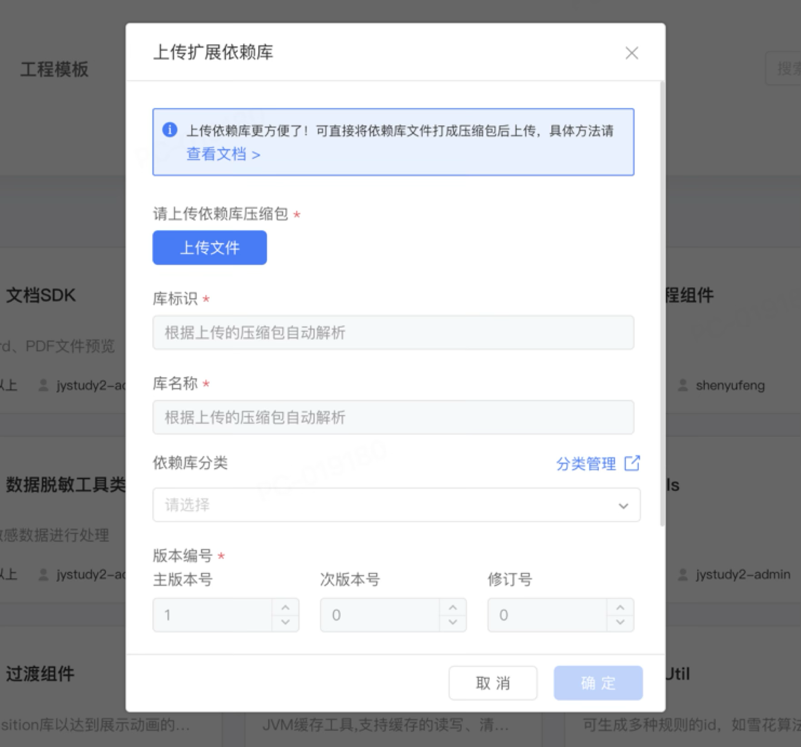

# 服务端扩展

## 一、使用场景

1.  用户需要调用第三方库pinyin4j实现汉字与拼音的转换
2. 用户需要调用redisTemplate(Spring模版)实现redis接入，连接参数要求可以在平台参数配置


## 二、概念原理


在 Java 项目里，为提升研发效率，常常会引入第三方依赖库。以汉字转拼音功能为例，只需引入一个拼音相关的第三方依赖库，就能轻松实现这一操作。
​               
CodeWave 编写的项目的服务会端编译成 Java 程序，所以也能实现通过第三方依赖库的实现逻辑扩展。区别在于需要添加元数据定义来精准描述 API 定义。

元数据的作用主要是为了描述API接口信息，比如方法名称、作用、参数类型等。低代码平台会根据元数据将API图形化的形式显示在编辑器中。




在依赖库开发过程中，可以借助专用的Maven插件生成。

比如，若要引入 `Pinyin4j.jar` 这个依赖库，可按以下步骤操作。

1. 创建一个方法，该方法的作用是封装 `Pinyin4j.jar 中的 API；
2. 使用的注解、 JavaDoc 来标注接口信息，

3. 使用 Maven 进行编译，在编译过程中元数据插件会将注解和 JavaDoc 转换为元数据（ JSON形式 ）；

4. 将元数据与编译后的字节码文件打包成扩展依赖库，（zip 格式）。
5. 将依赖库上传至CodeWave资产中心；
6. 在需要时只需要引入应用就可以在【调用逻辑】中找到并调用了。


代码实例如下：

```java
public class PinyinConverter {

    /**
     * 将汉字转换为拼音（全拼，小写，不带声调）
     *
     * @param chineseCharacters 要转换的汉字字符串
     * @return 拼音字符串
     */
    @NaslLogic
    public static String toPinyin(String chineseCharacters) {
        HanyuPinyinOutputFormat format = new HanyuPinyinOutputFormat();
        format.setCaseType(HanyuPinyinCaseType.LOWERCASE);
        format.setToneType(HanyuPinyinToneType.WITHOUT_TONE);

        StringBuilder pinyin = new StringBuilder();
        char[] charArray = chineseCharacters.toCharArray();
        for (char c : charArray) {
            try {
                if (Character.toString(c).matches("[\\u4e00-\\u9fff]")) {
                    String[] pinyinArray = PinyinHelper.toHanyuPinyinStringArray(c, format);
                    if (pinyinArray!= null && pinyinArray.length > 0) {
                        pinyin.append(pinyinArray[0]);
                    }
                } else {
                    pinyin.append(c);
                }
            } catch (BadHanyuPinyinOutputFormatCombination e) {
                e.printStackTrace();
            }
        }
        return pinyin.toString();
    }
}

```


​                    


​            


## 三、案例展示


### 1、Java静态方法型（第三方Jar封装）

第三方的API封装是最常见的一种应用场景。也就是说将API封装为服务端逻辑。

由于服务端逻辑本身是一个无状态的静态函数，所以自定义的逻辑也应该编写成java静态方法。

需要加入@NaslLogic注解表示需要导出为扩展逻辑方法。

使用JavaDoc对方法作用与参数进行描述，这些描述会直接转化为元数据。

```java
public class PinyinConverter {

    /**
     * 将汉字转换为拼音（全拼，小写，不带声调）
     *
     * @param chineseCharacters 要转换的汉字字符串
     * @return 拼音字符串
     */
    @NaslLogic
    public static String toPinyin(String chineseCharacters) {
        // 代码实现
    }
}

```


完整代码示例： 

https://github.com/netease-lcap/codewave-architect-course/tree/main/example/java_lib/src/main/java/com/codewave/pinyin


### 2、Component组件型 - Redis库

在封装redis库的时候并不能适用java静态方法类型原因有两点：

1. 希望通过注入 redisTemplate 实现，静态方法无法实现依赖注入；
2. 希望实现自定义配置，平台中的自定义配置是通过spring配置类实现的，也无法在静态方法中读取。

所以就需要采用Component组件形式进行封装。

```java
@Component
public class RedisService {

    @Autowired
    @Lazy // 延迟加载 如果不使用此依赖库时可以不配置redis连接参数
    public RedisTemplate<String, String> redisTemplate;

    public RedisService(RedisTemplate<String, String> redisTemplate) {
        this.redisTemplate = redisTemplate;
    }

    /**
     * 设置 Redis 中指定 key 的值为指定字符串
     *
     * @param key   Redis 中的键
     * @param value Redis 中的值
     */
    @NaslLogic
    public String getValue(String key) {
        return redisTemplate.opsForValue().get(key);
    }
}

```


在实例化RedisTemplate时会需要注入系统配置，可以通过如下方式定义，

```java
@Configuration
public class RedisConfig {

    /**
     * redis 地址
     */
    @NaslConfiguration(systemScope= true, alias="spring.redis.host",defaultValue = {
            @Environment(type = EnvironmentType.DEV, value = "127.0.0.1"),
            @Environment(type = EnvironmentType.ONLINE, value = "127.0.0.1")
    })
    public String redisHost;

    /**
     * redis 端口
     */
    @NaslConfiguration(systemScope= true, alias="spring.redis.port",defaultValue = {
            @Environment(type = EnvironmentType.DEV, value = "6379"),
            @Environment(type = EnvironmentType.ONLINE, value = "6379")
    })
    public String redisPort;

    /**
     * redis 密码
     */
    @NaslConfiguration(systemScope= true, alias="spring.redis.password",defaultValue = {
            @Environment(type = EnvironmentType.DEV, value = ""),
            @Environment(type = EnvironmentType.ONLINE, value = "")
    })
    public String password;
}
```


### 3、Filter组件型 

​	安全校验

### 4、Controller组件型

​	大文件文件上传、Restful接口

### 5、AOP切面型

​	数据库脱敏、接口日志

### 6、上下文调整

​	自定义应用配置

### 7、高阶函数

​	并行处理、运行时定时任务、调用低代码逻辑


### 8、 逻辑复写型


## 四、服务端扩展的本质	


## 五、实操演示

### 1、 开发环境（JDK + Maven + Idea）

Codewave版本： 3.11

运行时环境：JDK： openjdk version "1.8.0_422"

构建工具： Maven: 3.9.9

开发工具： IDEA社区版 2024.2（仅当做编辑器使用，创建测试完全依赖于Maven）

版本控制： Git 2.39.3

源码位置：https://github.com/smarty-team/codewave_course/tree/main/java_lib

 

### 2、依赖库开发

#### 2.1、Java型逻辑（Java静态方法）

##### 2.1.1、创建项目（maven archetype方式）

利用Maven项目模版功能创建项目

```bash
mvn archetype:generate -DgroupId=com.example -DartifactId=helloLib -DarchetypeArtifactId=maven-archetype-quickstart -DinteractiveMode=false
```

将相关依赖库与插件安装时本地仓库

添加执行脚本

install.sh

```bash
#!/bin/bash

if [ -d "jar" ]; then
    subfolders=$(find jar -mindepth 1 -maxdepth 1 -type d)
    for folder in $subfolders; do
        install_script="$folder/install.sh"
        if [ -f "$install_script" ]; then
            echo "Adding execute permission to $install_script..."
            chmod +x $install_script
            echo "Executing $install_script in $folder..."
            (cd "$folder" &&./install.sh)
        else
            echo "install.sh not found in $folder"
        fi
    done
else
    echo "The 'jar' folder does not exist."
fi
```


执行脚本安装依赖

```bash
chmod +x install.sh
./install.sh
```


添加依赖pom.xml

```xml
<dependencies>
    <!-- 添加 -->
    <dependency>
        <artifactId>nasl-metadata-collector</artifactId>
        <groupId>com.netease.lowcode</groupId>
        <version>0.10.1</version>
        <optional>true</optional>
    </dependency>
    <!-- 添加 -->
</dependencies>
<build>
    <plugins>
        <!-- 添加 -->
        <plugin>
            <groupId>com.netease.lowcode</groupId>
            <artifactId>nasl-metadata-maven-plugin</artifactId>
            <version>1.4.3</version>
            <configuration>
                <jarWithDependencies>false</jarWithDependencies>
            </configuration>
            <executions>
                <execution>
                    <goals>
                        <goal>archive</goal>
                    </goals>
                </execution>
            </executions>
        </plugin>
        <!-- 添加 --->
    </plugins>
</build>
```

##### 2.1.2、  创建项目（脚手架方式）

 

创建依赖库初始工程：https://libraryinitializr-community1.app.codewave.163.com/init

 

##### 2.1.3、创建扩展逻辑

 


```java
// src/main/java/codewave/logic/MyLogic.java
package com.example;

import com.netease.lowcode.core.annotation.NaslLogic;

/**
 * Hello world!
 *
 */
public class App {

    /**
     * 示例逻辑：相加
     * 
     * @param a
     * @param b
     * @return
     */
    @NaslLogic
    public static Integer add(Integer a, Integer b) {
        return a + b;
    }
}

```


 

 

##### 2.1.4、单元测试

添加测试用例pom.xml

```xml
  <dependency>
      <groupId>org.testng</groupId>
      <artifactId>testng</artifactId>
      <version>RELEASE</version>
      <scope>test</scope>
  </dependency>
```


```java
package com.codewave.logic;

import org.testng.annotations.Test;

import static org.testng.Assert.*;

public class MyLogicTest {

    @Test
    public void testAdd() {
        assert  MyLogic.add(1,2) == 3;
     }
}
```


##### 2.1.5、执行测试

```bash
mvn clean test
```

 

##### 2.1.7、打包

 ```bash
 mvn clean package
 ```


##### 2.1.8、 提交至私有仓库（规划中）

配置pom.xml

```xml
   <project>
    ...
     <distributionManagement>
       <repository>
         <id>private - repo - releases</id>
         <name>Private Repository - Releases</name>
         <url>http://your - private - repo - url/repository/maven - releases/</url>
       </repository>
       <snapshotRepository>
         <id>private - repo - snapshots</id>
         <name>Private Repository - Snapshots</name>
         <url>http://your - private - repo - url/repository/maven - snapshots/</url>
       </snapshotRepository>
     </distributionManagement>
    ...
   </project>
```


```bash
mvn deploy
```


 

##### 2.1.9、创建结构体

com.codewave.logic.MyStructure.java

```java
package com.codewave.logic;

import com.netease.lowcode.core.annotation.NaslStructure;

@NaslStructure
public class MyStructure {

    /**
     * 数字参数
     */
    public Integer num;

    /**
     * 结果参数
     */
    public String name;
}
```


在MyLogic.java中添加

```java
@NaslLogic
public static MyStructure getStructure(MyStructure myStructure) {
    return myStructure;
}
```

在MyLogicTest.java中添加


```java
@Test
public void testGetStructure() {
    MyStructure myStructure = new MyStructure();
    myStructure.name = "myName";
    myStructure.num = 666;
    MyStructure result = MyLogic.getStructure(myStructure);
    assert result.name == "myName";
    assert result.num == 666;
}
```

##### 2.1.10、创建自定义异常

创建MyException.java
```java

package com.codewave.logic;

public class MyException extends RuntimeException {

    public MyException(String message) {
        super(message);
    }
}

```


在MyLogic.java中
```java

@NaslLogic
public static MyStructure getStructure(MyStructure myStructure) {
    return myStructure;
}
```

在MyLogicTest.java中
```java
@Test
public void testGetStructure() {
    MyStructure myStructure = new MyStructure();
    myStructure.name = "myName";
    myStructure.num = 666;
    MyStructure result = MyLogic.getStructure(myStructure);
    assert result.name == "myName";
    assert result.num == 666;
}
```


##### 2.1.11、添加系统日志

pom.xml

```xml
<dependency>
    <groupId>org.slf4j</groupId>
    <artifactId>slf4j-api</artifactId>
    <scope>provided</scope>
     <version>1.7.30</version>
</dependency>
```


logic.java

```java
private static final Logger log = LoggerFactory.getLogger("LCAP_EXTENSION_LOGGER");
```


 

#### 2.2、Java型逻辑案例（Pinyin转换器）

pom.xml

```xml
<dependency>
  <groupId>com.belerweb</groupId>
  <artifactId>pinyin4j</artifactId>
  <version>2.5.1</version>
</dependency>
```


PinyinConverter.java

```java 

package com.codewave.pinyin;

import com.netease.lowcode.core.annotation.NaslLogic;
import net.sourceforge.pinyin4j.PinyinHelper;
import net.sourceforge.pinyin4j.format.HanyuPinyinCaseType;
import net.sourceforge.pinyin4j.format.HanyuPinyinOutputFormat;
import net.sourceforge.pinyin4j.format.HanyuPinyinToneType;
import net.sourceforge.pinyin4j.format.exception.BadHanyuPinyinOutputFormatCombination;


public class PinyinConverter {

    /**
     * 将汉字转换为拼音（全拼，小写，不带声调）
     *
     * @param chineseCharacters 要转换的汉字字符串
     * @return 拼音字符串
     */
    @NaslLogic
    public static String toPinyin(String chineseCharacters) {
        HanyuPinyinOutputFormat format = new HanyuPinyinOutputFormat();
        format.setCaseType(HanyuPinyinCaseType.LOWERCASE);
        format.setToneType(HanyuPinyinToneType.WITHOUT_TONE);

        StringBuilder pinyin = new StringBuilder();
        char[] charArray = chineseCharacters.toCharArray();
        for (char c : charArray) {
            try {
                if (Character.toString(c).matches("[\\u4e00-\\u9fff]")) {
                    String[] pinyinArray = PinyinHelper.toHanyuPinyinStringArray(c, format);
                    if (pinyinArray!= null && pinyinArray.length > 0) {
                        pinyin.append(pinyinArray[0]);
                    }
                } else {
                    pinyin.append(c);
                }
            } catch (BadHanyuPinyinOutputFormatCombination e) {
                e.printStackTrace();
            }
        }
        return pinyin.toString();
    }

    /**
     * 将汉字转换为拼音首字母（大写）
     *
     * @param chineseCharacters 要转换的汉字字符串
     * @return 拼音首字母字符串
     */
    @NaslLogic
    public static String toFirstLetterPinyin(String chineseCharacters) {
        HanyuPinyinOutputFormat format = new HanyuPinyinOutputFormat();
        format.setCaseType(HanyuPinyinCaseType.UPPERCASE);
        format.setToneType(HanyuPinyinToneType.WITHOUT_TONE);

        StringBuilder firstLetterPinyin = new StringBuilder();
        char[] charArray = chineseCharacters.toCharArray();
        for (char c : charArray) {
            try {
                if (Character.toString(c).matches("[\\u4e00-\\u9fff]")) {
                    String[] pinyinArray = PinyinHelper.toHanyuPinyinStringArray(c, format);
                    if (pinyinArray!= null && pinyinArray.length > 0) {
                        firstLetterPinyin.append(pinyinArray[0].charAt(0));
                    }
                } else {
                    firstLetterPinyin.append(c);
                }
            } catch (BadHanyuPinyinOutputFormatCombination e) {
                e.printStackTrace();
            }
        }
        return firstLetterPinyin.toString();
    }
}
```


 

 

#### 2.3、SpringBean型逻辑

##### 4.1、升级为Spring项目

更改将项目的父项目改为

在 pom.xml 中

```xml
    <parent>
        <groupId>org.springframework.boot</groupId>
        <artifactId>spring-boot-starter-parent</artifactId>
        <version>2.2.9.RELEASE</version><!--与当前制品应用默认版本统一-->
    </parent>

     <dependencies>
        <dependency>
            <groupId>org.springframework.boot</groupId>
            <artifactId>spring-boot-starter</artifactId>
        </dependency>
       <dependency>
            <groupId>org.springframework.boot</groupId>
            <artifactId>spring-boot-starter-data-redis</artifactId>
        </dependency>
        <dependency>
            <groupId>org.springframework.boot</groupId>
            <artifactId>spring-boot-starter-test</artifactId>
            <scope>test</scope>
        </dependency>
        
      </dependencies>
```


##### 4.2、创建Componet型逻辑

在 src/main/java/com/codewave/spring 中创建MyComponet.java

```java
package com.codewave.spring;

import org.springframework.beans.factory.annotation.Value;
import org.springframework.stereotype.Component;

import com.netease.lowcode.core.annotation.NaslLogic;

/**
 * Hello world!
 *
 */
@Component
public class MyComponent {

    @Value("${myHost}")
    private String myHost;


    @Value("${spring.mongo.host}")
    private  String mongoHost;

    /**
     * 示例逻辑：相加
     * 
     * @param a
     * @param b
     * @return
     */
    @NaslLogic
    public Integer add2(Integer a, Integer b) {
        return a + b;
    }
}

```


测试用例

在 test/main/java/com/codewave/spring 中创建MyComponetTest.java

```java
package com.codewave.spring;

import org.junit.jupiter.api.BeforeAll;
import org.junit.jupiter.api.Test;
import org.junit.jupiter.api.extension.ExtendWith;
import org.slf4j.LoggerFactory;
import org.springframework.beans.factory.annotation.Autowired;
import org.springframework.test.context.ContextConfiguration;
import org.springframework.test.context.TestPropertySource;
import org.springframework.test.context.junit.jupiter.SpringExtension;

import ch.qos.logback.classic.LoggerContext;

import java.util.Objects;

@ExtendWith(SpringExtension.class)
@ContextConfiguration(classes = MyComponent.class)
@TestPropertySource(properties = { "extensions.helloLib.custom.myHost = 123.0.0.1" })
@TestPropertySource(properties = { "spring.mongo.host = 456.0.0.1" })
public class MyComponetTest {

    @Autowired
    private MyComponent myComponent;

    @BeforeAll
    public static void setup() {
        LoggerContext loggerContext = (LoggerContext) LoggerFactory.getILoggerFactory();
        loggerContext.getLogger("ROOT").setLevel(ch.qos.logback.classic.Level.OFF);
    }

    @Test
    public void testAdd() {
        int result = myComponent.add2(5, 3);
        assert result == 8;
    }

    @Test
    public void testGetMyConfig() {
        String myHost = myComponent.getMyHost();
        // assert Objects.equals(myHost, "123.0.0.1");

        String redisHost = myComponent.getMongoHost();
        assert Objects.equals(redisHost, "456.0.0.1");
    }
}

```


 

#### 2.4、自定义配置

```java

package com.codewave.spring;

import com.netease.lowcode.core.annotation.Environment;
import org.springframework.context.annotation.Configuration;

import com.netease.lowcode.core.annotation.NaslConfiguration;
import com.netease.lowcode.core.EnvironmentType;

@Configuration
public class MyConfig {

    /**
     * 我的主机Host
     */
    @NaslConfiguration(defaultValue = @Environment(type = EnvironmentType.DEV, value = "我的主机"))
    public String myHost;

    /**
     * MongoDB地址
     */
    @NaslConfiguration(systemScope = true, alias = "spring.mongo.host")
    public String mongoHost;

}

```


 

#### 2.4、SpringBean型逻辑案例（Redis库）

pom.xml

```xml
<dependency>
    <groupId>org.springframework.boot</groupId>
    <artifactId>spring-boot-starter-data-redis</artifactId>
</dependency>

<dependency>
    <groupId>org.mockito</groupId>
    <artifactId>mockito-core</artifactId>
    <version>4.10.0</version>
    <scope>test</scope>
</dependency>
```


测试库

```
  host: 'redis-14018.c92.us-east-1-3.ec2.redns.redis-cloud.com',
  port: 14018,
  // username: 'default',
  // database: "Free-db",
  password: 'x15aid7gDK8HqtM4ipKn13oFzTOJTQE7'
```


 

### 3、连接器开发

 

 

 