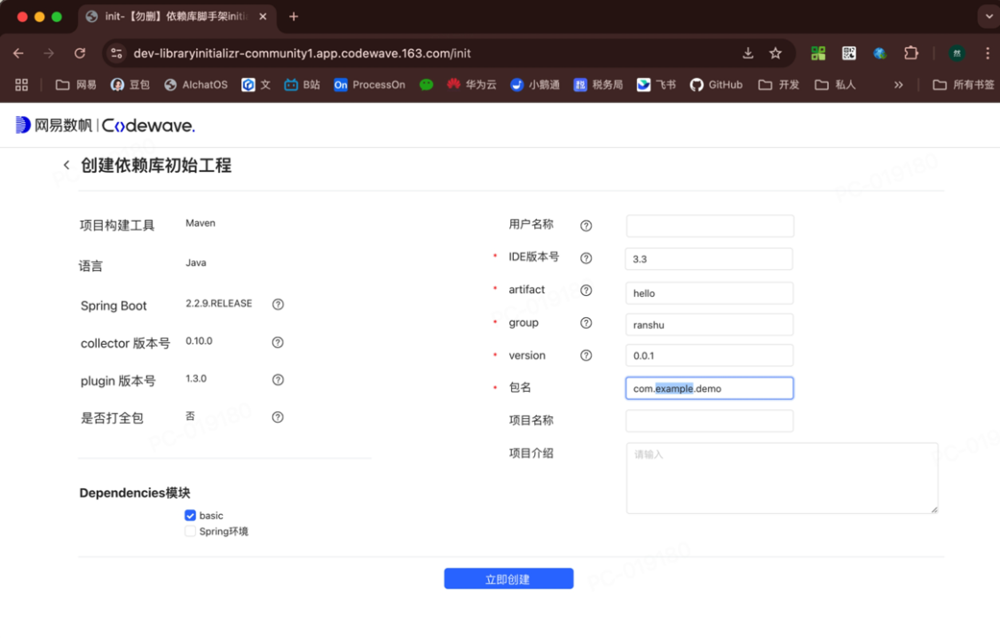
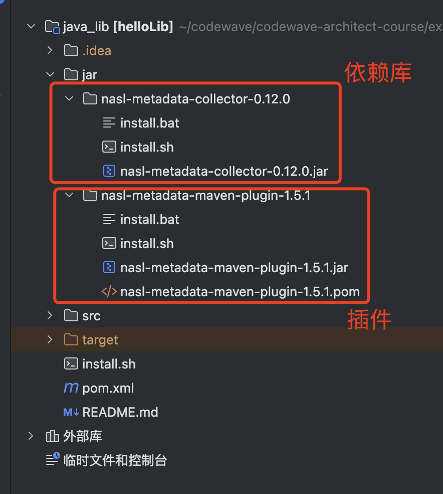
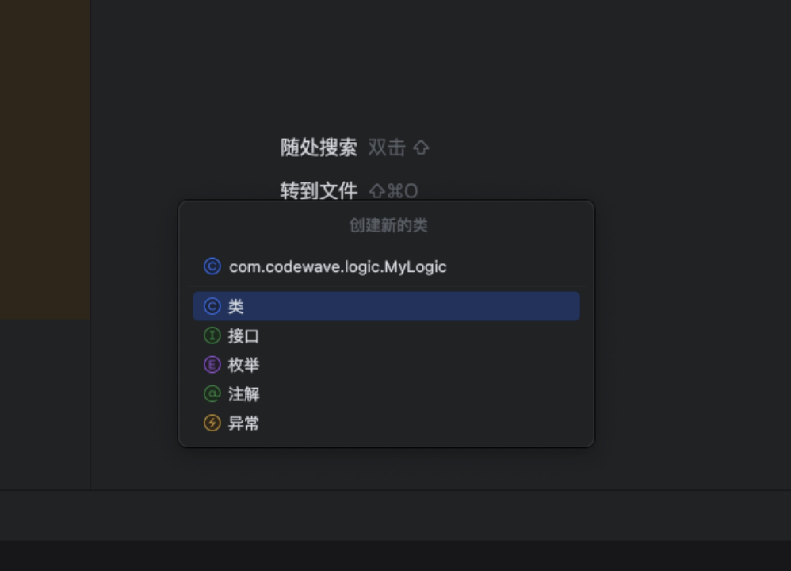
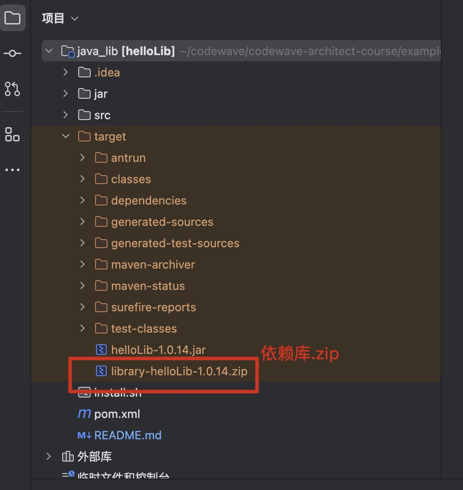
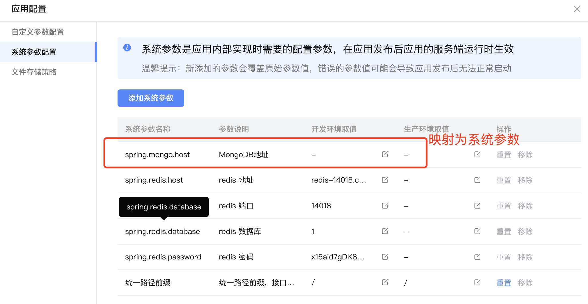
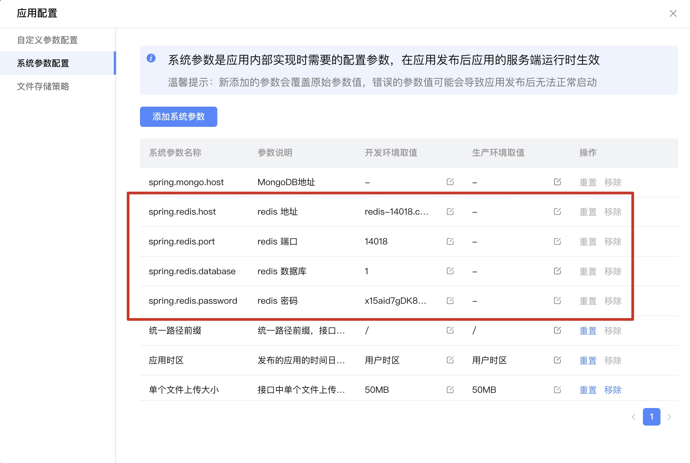

# 服务端扩展


## 一、概念原理


在 Java 项目里，为提升研发效率，常常会引入第三方依赖库。以汉字转拼音功能为例，只需引入一个拼音相关的第三方依赖库，就能轻松实现。
​               
CodeWave 编写的项目运行时会将服务端逻辑编译为 Java代码。所以与普通的Java项目相似，可以引入第三方java依赖库实现逻辑扩展。区别在于需要添加元数据定义来精准描述 API 定义。元数据的作用主要是为了描述API接口信息，比如方法名称、作用、参数类型等。低代码平台会根据元数据将API图形化的形式显示在编辑器中。


在依赖库开发过程中，可以借助专用的Maven插件生成。

比如，若要引入 `Pinyin4j.jar` 这个依赖库，可按以下步骤操作。

1. 创建一个方法，该方法的作用是封装 `Pinyin4j.jar 中的 API；
2. 使用的注解、 JavaDoc 来标注接口信息

3. 使用 Maven 进行编译，在编译过程中元数据插件会将注解和 JavaDoc 转换为元数据（ JSON形式 ）

4. 将元数据与编译后的字节码文件打包成扩展依赖库，（zip 格式）
5. 将依赖库上传至CodeWave资产中心；
6. 在需要时只需要引入应用就可以在【调用逻辑】中找到并调用了。


代码实例如下：

```java
public class PinyinConverter {

    /**
     * 将汉字转换为拼音（全拼，小写，不带声调）
     *
     * @param chineseCharacters 要转换的汉字字符串
     * @return 拼音字符串
     */
    @NaslLogic
    public static String toPinyin(String chineseCharacters) {
        HanyuPinyinOutputFormat format = new HanyuPinyinOutputFormat();
        format.setCaseType(HanyuPinyinCaseType.LOWERCASE);
        format.setToneType(HanyuPinyinToneType.WITHOUT_TONE);

        StringBuilder pinyin = new StringBuilder();
        char[] charArray = chineseCharacters.toCharArray();
        for (char c : charArray) {
            try {
                if (Character.toString(c).matches("[\\u4e00-\\u9fff]")) {
                    String[] pinyinArray = PinyinHelper.toHanyuPinyinStringArray(c, format);
                    if (pinyinArray!= null && pinyinArray.length > 0) {
                        pinyin.append(pinyinArray[0]);
                    }
                } else {
                    pinyin.append(c);
                }
            } catch (BadHanyuPinyinOutputFormatCombination e) {
                e.printStackTrace();
            }
        }
        return pinyin.toString();
    }
}

```


​                    


​            


## 二、使用场景


### 案例1：Java静态方法型（第三方Jar封装）

第三方的API封装是最常见的一种应用场景。也就是说将API封装为服务端逻辑。

由于服务端逻辑本身是一个无状态的静态函数，所以自定义的逻辑也应该编写成java静态方法。

需要加入@NaslLogic注解表示需要导出为扩展逻辑方法。

使用JavaDoc对方法作用与参数进行描述，这些描述会直接转化为元数据。

```java
public class PinyinConverter {

    /**
     * 将汉字转换为拼音（全拼，小写，不带声调）
     *
     * @param chineseCharacters 要转换的汉字字符串
     * @return 拼音字符串
     */
    @NaslLogic
    public static String toPinyin(String chineseCharacters) {
        HanyuPinyinOutputFormat format = new HanyuPinyinOutputFormat();
        format.setCaseType(HanyuPinyinCaseType.LOWERCASE);
        format.setToneType(HanyuPinyinToneType.WITHOUT_TONE);

        StringBuilder pinyin = new StringBuilder();
        char[] charArray = chineseCharacters.toCharArray();
        for (char c : charArray) {
            try {
                if (Character.toString(c).matches("[\\u4e00-\\u9fff]")) {
                    String[] pinyinArray = PinyinHelper.toHanyuPinyinStringArray(c, format);
                    if (pinyinArray!= null && pinyinArray.length > 0) {
                        pinyin.append(pinyinArray[0]);
                    }
                } else {
                    pinyin.append(c);
                }
            } catch (BadHanyuPinyinOutputFormatCombination e) {
                e.printStackTrace();
            }
        }
        return pinyin.toString();
    }
}

```


完整代码示例： 

https://github.com/netease-lcap/codewave-architect-course/tree/main/example/java_lib/src/main/java/com/codewave/pinyin


### 案例2：Component组件型 - Redis库

提供一个依赖库实现对Redis数据库的操作，具体要求如下：

1. 基于redisTemplate封装实现
2. Redis连接参数需要在应用配置中进行配置

这类逻辑并不能适用java静态方法类型的逻辑，原因有两点：

1. 希望通过注入 redisTemplate 实现，静态方法无法实现依赖注入；
2. 希望实现自定义配置，平台中的自定义配置是通过spring配置类实现的，也无法在静态方法中读取。

所以就需要采用Component组件形式进行封装。

```java
@Component
public class RedisService {

    @Autowired
    @Lazy // 延迟加载 如果不使用此依赖库时可以不配置redis连接参数
    public RedisTemplate<String, String> redisTemplate;

    public RedisService(RedisTemplate<String, String> redisTemplate) {
        this.redisTemplate = redisTemplate;
    }

    /**
     * 设置 Redis 中指定 key 的值为指定字符串
     *
     * @param key   Redis 中的键
     * @param value Redis 中的值
     */
    @NaslLogic
    public String getValue(String key) {
        return redisTemplate.opsForValue().get(key);
    }
}

```


在实例化RedisTemplate时会需要注入系统配置，可以通过如下方式定义，

```java
@Configuration
public class RedisConfig {

    /**
     * redis 地址
     */
    @NaslConfiguration(systemScope= true, alias="spring.redis.host",defaultValue = {
            @Environment(type = EnvironmentType.DEV, value = "127.0.0.1"),
            @Environment(type = EnvironmentType.ONLINE, value = "127.0.0.1")
    })
    public String redisHost;

    /**
     * redis 端口
     */
    @NaslConfiguration(systemScope= true, alias="spring.redis.port",defaultValue = {
            @Environment(type = EnvironmentType.DEV, value = "6379"),
            @Environment(type = EnvironmentType.ONLINE, value = "6379")
    })
    public String redisPort;

    /**
     * redis 密码
     */
    @NaslConfiguration(systemScope= true, alias="spring.redis.password",defaultValue = {
            @Environment(type = EnvironmentType.DEV, value = ""),
            @Environment(type = EnvironmentType.ONLINE, value = "")
    })
    public String password;
}
```


完整代码示例：

> https://github.com/netease-lcap/codewave-architect-course/tree/main/example/java_lib/src/main/java/com/codewave/redis


### 案例3：Filter组件型 - ip黑白名单过滤器

核心原理：利用Spring SPI机制实现

[代码示例](https://github.com/netease-lcap/CodeWaveSummerCompetition2024/tree/main/ip-filter-aop)


### 案例4：Controller组件型 - 大文件上传

核心原理：利用Spring SPI机制实现

应用场景：大文件文件上传、Restful接口


### 案例5：AOP切面型 - ip黑白名单过滤器

核心原理：利用Spring SPI机制实现

[详细演示步骤](https://community.codewave.163.com/CommunityParent/fileIndex?filePath=40.%E6%89%A9%E5%B1%95%E4%B8%8E%E9%9B%86%E6%88%90%2F10.%E6%89%A9%E5%B1%95%E5%BC%80%E5%8F%91%E6%96%B9%E5%BC%8F%2F30.%E6%9C%8D%E5%8A%A1%E7%AB%AF%E6%89%A9%E5%B1%95%E5%BC%80%E5%8F%91%2F10.%E4%BE%9D%E8%B5%96%E5%BA%93%E5%BC%80%E5%8F%91%2F35.%E5%9F%BA%E4%BA%8EAOP%E7%9A%84%E5%AE%9E%E7%8E%B0%E5%8F%AF%E6%8B%93%E5%B1%95%E5%8A%9F%E8%83%BD%E6%9C%80%E4%BD%B3%E5%AE%9E%E8%B7%B5.md&version=3.10&selectType=codewave)

[示例代码](https://github.com/netease-lcap/CodeWaveSummerCompetition2024/tree/main/ip-filter-aop)

应用场景：数据库脱敏、接口日志

### 


## 三、实操演示

### 开发环境准备


Codewave版本： 3.11

运行时环境：JDK： openjdk version "1.8.0_422"

构建工具： Maven: 3.9.9

开发工具： IDEA社区版 2024.2（仅当做编辑器使用，创建测试完全依赖于Maven）

版本控制： Git 2.39.3

源码位置：https://github.com/netease-lcap/codewave-architect-course/tree/main/example/java_lib

 

#### 创建项目 

扩展依赖的项目是一个基于Maven构建的Java项目。和一般Java项目的区别是需要添加相应的依赖和生成元数据的Maven插件。

创建项目推荐使用脚手架模式创建。

脚手架地址：https://libraryinitializr-community1.app.codewave.163.com/init


 

项目中可以选择Dependencies模块：

- basic： 只支持创建静态Java型扩展逻辑
- Spring环境： 支持创建Spring组件逻辑

如果一开始没有想好，为了扩展方便。推荐选择Spring环境。

其余 artifact、group、version等参数就是Maven中pom文件中的包信息的参数，这里不过多啊赘述。

> ###### Maven项目完整坐标
>
> - groupId（如com.example）标识项目归属组织
> - artifactId（如my-app）是具体项目或模块名称
> - version（如1.0.0）标记项目迭代状态, 1.0.0-SNAPSHOT 快照不稳定版


#### 安装依赖库与插件

在下载的项目中 /jar 文件夹中包含一个插件和一个依赖库。

需要运行各种文件夹中的 install.sh 文件安装至本地仓库。



也可以在根目录下安装一个install.sh脚本快速执行

```sh
#!/bin/bash

# 检查jar文件夹是否存在
if [ -d "jar" ]; then
    # 获取jar文件夹下的一层子文件夹列表
    subfolders=$(find jar -mindepth 1 -maxdepth 1 -type d)
    for folder in $subfolders; do
        install_script="$folder/install.sh"
        if [ -f "$install_script" ]; then
            echo "Adding execute permission to $install_script..."
            chmod +x $install_script
            echo "Executing $install_script in $folder..."
            (cd "$folder" &&./install.sh)
        else
            echo "install.sh not found in $folder"
        fi
    done
else
    echo "The 'jar' folder does not exist."
fi
```


安装后可以运行

```bash
mvn clean package
```

确保环境搭建无误。


###  基础开发


#### 创建Java静态方法型逻辑 

在 src/main/java/codewave/logic/MyLogic.java 中创建Class编写静态方法add

```java
// 
package com.example;

import com.netease.lowcode.core.annotation.NaslLogic;

/**
 * Hello world!
 *
 */
public class App {

    /**
     * 示例逻辑：相加
     * 
     * @param a
     * @param b
     * @return
     */
    @NaslLogic
    public static Integer add(Integer a, Integer b) {
        return a + b;
    }
}

```

####  单元测试

扩展逻辑可以在Maven环境中像普通java方法一样进行单元测试。

在pom.xml中添加测试库

```xml
  <dependency>
      <groupId>org.testng</groupId>
      <artifactId>testng</artifactId>
      <version>RELEASE</version>
      <scope>test</scope>
  </dependency>
```

在 src/test/java/codewave/logic 中创建 MyLogicTest.java 测试类

```java
package com.codewave.logic;
import org.testng.annotations.Test;
import static org.testng.Assert.*;

public class MyLogicTest {

    @Test
    public void testAdd() {
        assert  MyLogic.add(1,2) == 3;
     }
}
```

使用maven命令进行测试

```bash
mvn clean test
```

 

#### 依赖库打包 

使用 maven 命令部署

 ```bash
 mvn clean package
 ```




### 


#### 创建结构体

如果参数或返回值类型不是基本类型需要定义结构体。

方式是使用 @NaslStructure 注解。

com.codewave.logic.MyStructure.java

```java
package com.codewave.logic;
import com.netease.lowcode.core.annotation.NaslStructure;

@NaslStructure
public class MyStructure {

    /**
     * 数字参数
     */
    public Integer num;

    /**
     * 结果参数
     */
    public String name;
}
```


在MyLogic.java中添加

```java
@NaslLogic
public static MyStructure getStructure(MyStructure myStructure) {
    return myStructure;
}
```

在MyLogicTest.java中编写测试用例


```java
@Test
public void testGetStructure() {
    MyStructure myStructure = new MyStructure();
    myStructure.name = "myName";
    myStructure.num = 666;
    MyStructure result = MyLogic.getStructure(myStructure);
    assert result.name == "myName";
    assert result.num == 666;
}
```

#### 创建自定义异常

如果需要自定义异常时候可以创建异常类，异常类需要继承 RuntimeException 基

创建MyException.java
```java
package com.codewave.logic;

public class MyException extends RuntimeException {
    public MyException(String message) {
        super(message);
    }
}
```


在MyLogic.java中
```java
@NaslLogic
// @NaslLogic(enhance = false)
public static String throwMyException(Integer value)
        throws MyException {
    if (value < 0) {
        throw new MyException("");
    }
    return "";
}
```

在MyLogicTest.java中编写测试用例
```java
@Test
public void testThrowMyException() {
    try {
        MyLogic.throwMyException(-1);
    } catch (MyException e) {
        // 捕获到异常Error
        return;
    }
    // 如果没有捕获到异常，则测试失败
    throw new AssertionError("testThrowMyException  Error");

}
```


#### 添加系统日志

pom.xml

```xml
<dependency>
    <groupId>org.slf4j</groupId>
    <artifactId>slf4j-api</artifactId>
    <scope>provided</scope>
     <version>1.7.30</version>
</dependency>
```

logic.java

```java
private static final Logger log = LoggerFactory.getLogger("LCAP_EXTENSION_LOGGER");
```


 

#### 创建自定义配置

CodeWave平台中的自定义配置是基于Spring配置类实现的。

在@Configuration注解修饰下的配置类中使用 @NaslConfiguration 修饰的属性会作为CodeWave的应用配置。

可以实现自定义参数，在应用加载依赖库后可以在应用配置中进行配置。


```java
package com.codewave.spring;

import com.netease.lowcode.core.annotation.Environment;
import org.springframework.context.annotation.Configuration;

import com.netease.lowcode.core.annotation.NaslConfiguration;
import com.netease.lowcode.core.EnvironmentType;

@Configuration
public class MyConfig {

    /**
     * 我的主机Host(自定义参数)
     */
    @NaslConfiguration(defaultValue = @Environment(type = EnvironmentType.DEV, value = "我的主机"))
    public String myHost;
}

```


如果想将自定义参数映射为系统参数可以使用 alias 属性 + systemScope属性实现。

```java
package com.codewave.spring;

import com.netease.lowcode.core.annotation.Environment;
import org.springframework.context.annotation.Configuration;

import com.netease.lowcode.core.annotation.NaslConfiguration;
import com.netease.lowcode.core.EnvironmentType;

@Configuration
public class MyConfig {

    /**
     * MongoDB地址
     */
    @NaslConfiguration(systemScope = true, alias = "spring.mongo.host")
    public String mongoHost;

}

```





#### 创建Component组件型逻辑

如果需要使用Spring的IOC机制注入bean或者配置，可以创建Component类型的扩展逻辑。

比如下面例子希望注入 myHost 和 spring.mongo.host 参数。

在 src/main/java/com/codewave/spring 中创建MyComponet.java

```java
package com.codewave.spring;

import org.springframework.beans.factory.annotation.Value;
import org.springframework.stereotype.Component;

import com.netease.lowcode.core.annotation.NaslLogic;

/**
 * Hello world!
 *
 */
@Component
public class MyComponent {

    @Value("${myHost}")
    private String myHost;


    @Value("${spring.mongo.host}")
    private  String mongoHost;

    /**
     * 示例逻辑：相加
     * 
     * @param a
     * @param b
     * @return
     */
    @NaslLogic
    public Integer add2(Integer a, Integer b) {
        return a + b;
    }
  
  
    /**
     * 获取MyHost
     * @return
     */
    @NaslLogic
    public String getMyHost() {
        return myHost;
    }

    /**
     * 获取MyRedisHost
     * @return
     */
    @NaslLogic
    public String getMongoHost() {
        return mongoHost;
    }
  
}

```


创建测试用例

在 test/main/java/com/codewave/spring 中创建MyComponetTest.java

```java
package com.codewave.spring;

import org.junit.jupiter.api.BeforeAll;
import org.junit.jupiter.api.Test;
import org.junit.jupiter.api.extension.ExtendWith;
import org.slf4j.LoggerFactory;
import org.springframework.beans.factory.annotation.Autowired;
import org.springframework.test.context.ContextConfiguration;
import org.springframework.test.context.TestPropertySource;
import org.springframework.test.context.junit.jupiter.SpringExtension;

import ch.qos.logback.classic.LoggerContext;

import java.util.Objects;

@ExtendWith(SpringExtension.class)
@ContextConfiguration(classes = MyComponent.class)
@TestPropertySource(properties = { "extensions.helloLib.custom.myHost = 123.0.0.1" })
@TestPropertySource(properties = { "spring.mongo.host = 456.0.0.1" })
public class MyComponetTest {

    @Autowired
    private MyComponent myComponent;

    @BeforeAll
    public static void setup() {
        LoggerContext loggerContext = (LoggerContext) LoggerFactory.getILoggerFactory();
        loggerContext.getLogger("ROOT").setLevel(ch.qos.logback.classic.Level.OFF);
    }

    @Test
    public void testAdd() {
        int result = myComponent.add2(5, 3);
        assert result == 8;
    }

    @Test
    public void testGetMyConfig() {
        String myHost = myComponent.getMyHost();
        // assert Objects.equals(myHost, "123.0.0.1");

        String redisHost = myComponent.getMongoHost();
        assert Objects.equals(redisHost, "456.0.0.1");
    }
}

```


### 开发案例 


#### 案例1：Java静态方法型案例（Pinyin转换器）

封装 pinyin4j.jar 实现汉字转换拼音功能

pom.xml

```xml
<dependency>
  <groupId>com.belerweb</groupId>
  <artifactId>pinyin4j</artifactId>
  <version>2.5.1</version>
</dependency>
```


PinyinConverter.java

```java 
package com.codewave.pinyin;

import com.netease.lowcode.core.annotation.NaslLogic;
import net.sourceforge.pinyin4j.PinyinHelper;
import net.sourceforge.pinyin4j.format.HanyuPinyinCaseType;
import net.sourceforge.pinyin4j.format.HanyuPinyinOutputFormat;
import net.sourceforge.pinyin4j.format.HanyuPinyinToneType;
import net.sourceforge.pinyin4j.format.exception.BadHanyuPinyinOutputFormatCombination;


public class PinyinConverter {

    /**
     * 将汉字转换为拼音（全拼，小写，不带声调）
     *
     * @param chineseCharacters 要转换的汉字字符串
     * @return 拼音字符串
     */
    @NaslLogic
    public static String toPinyin(String chineseCharacters) {
        HanyuPinyinOutputFormat format = new HanyuPinyinOutputFormat();
        format.setCaseType(HanyuPinyinCaseType.LOWERCASE);
        format.setToneType(HanyuPinyinToneType.WITHOUT_TONE);

        StringBuilder pinyin = new StringBuilder();
        char[] charArray = chineseCharacters.toCharArray();
        for (char c : charArray) {
            try {
                if (Character.toString(c).matches("[\\u4e00-\\u9fff]")) {
                    String[] pinyinArray = PinyinHelper.toHanyuPinyinStringArray(c, format);
                    if (pinyinArray!= null && pinyinArray.length > 0) {
                        pinyin.append(pinyinArray[0]);
                    }
                } else {
                    pinyin.append(c);
                }
            } catch (BadHanyuPinyinOutputFormatCombination e) {
                e.printStackTrace();
            }
        }
        return pinyin.toString();
    }

    /**
     * 将汉字转换为拼音首字母（大写）
     *
     * @param chineseCharacters 要转换的汉字字符串
     * @return 拼音首字母字符串
     */
    @NaslLogic
    public static String toFirstLetterPinyin(String chineseCharacters) {
        HanyuPinyinOutputFormat format = new HanyuPinyinOutputFormat();
        format.setCaseType(HanyuPinyinCaseType.UPPERCASE);
        format.setToneType(HanyuPinyinToneType.WITHOUT_TONE);

        StringBuilder firstLetterPinyin = new StringBuilder();
        char[] charArray = chineseCharacters.toCharArray();
        for (char c : charArray) {
            try {
                if (Character.toString(c).matches("[\\u4e00-\\u9fff]")) {
                    String[] pinyinArray = PinyinHelper.toHanyuPinyinStringArray(c, format);
                    if (pinyinArray!= null && pinyinArray.length > 0) {
                        firstLetterPinyin.append(pinyinArray[0].charAt(0));
                    }
                } else {
                    firstLetterPinyin.append(c);
                }
            } catch (BadHanyuPinyinOutputFormatCombination e) {
                e.printStackTrace();
            }
        }
        return firstLetterPinyin.toString();
    }
}
```


 


#### 案例2：Component组件型逻辑案例（Redis库）

提供一个依赖库实现对Redis数据库的操作，具体要求如下：

1. 基于redisTemplate封装实现
2. Redis连接参数需要在应用配置中进行配置

这类逻辑并不能适用java静态方法类型的逻辑，原因有两点：

1. 希望通过注入 redisTemplate 实现，静态方法无法实现依赖注入；
2. 希望实现自定义配置，平台中的自定义配置是通过spring配置类实现的，也无法在静态方法中读取。

所以就需要采用Component组件形式进行封装。


1. 引入 redisTemplate

   ```xml
   <dependency>
       <groupId>org.springframework.boot</groupId>
       <artifactId>spring-boot-starter-data-redis</artifactId>
   </dependency>
   ```

   


2. 首先创建配置类，声明Redis连接配置参数。由于redisTemplate默认读取系统参数（比如spring.reds.host）。所以需要使用 @alias @systemScope属性进行系统参数映射。

创建RedisConfig.java文件

```java
package com.codewave.redis;

import com.netease.lowcode.core.EnvironmentType;
import com.netease.lowcode.core.annotation.Environment;
import com.netease.lowcode.core.annotation.NaslConfiguration;
import org.springframework.context.annotation.Configuration;

@Configuration
public class RedisConfig {

    /**
     * redis 地址
     */
    @NaslConfiguration(systemScope= true, alias="spring.redis.host",defaultValue = {
            @Environment(type = EnvironmentType.DEV, value = "127.0.0.1"),
            @Environment(type = EnvironmentType.ONLINE, value = "127.0.0.1")
    })
    public String redisHost;

    /**
     * redis 端口
     */
    @NaslConfiguration(systemScope= true, alias="spring.redis.port",defaultValue = {
            @Environment(type = EnvironmentType.DEV, value = "6379"),
            @Environment(type = EnvironmentType.ONLINE, value = "6379")
    })
    public String redisPort;

    /**
     * redis 密码
     */
    @NaslConfiguration(systemScope= true, alias="spring.redis.password",defaultValue = {
            @Environment(type = EnvironmentType.DEV, value = ""),
            @Environment(type = EnvironmentType.ONLINE, value = "")
    })
    public String password;
}

```

实现的效果




3. 定义 @Component 类，注入redisTemplate

RedisService.java

```java
package com.codewave.redis;

import com.netease.lowcode.core.annotation.NaslLogic;
import org.springframework.beans.factory.annotation.Autowired;
import org.springframework.context.annotation.Lazy;
import org.springframework.data.redis.core.HashOperations;
import org.springframework.data.redis.core.ListOperations;
import org.springframework.data.redis.core.RedisTemplate;
import org.springframework.data.redis.core.ValueOperations;
import org.springframework.stereotype.Component;
import com.codewave.redis.RedisService;

import java.util.ArrayList;
import java.util.HashMap;
import java.util.List;
import java.util.Map;
import java.util.concurrent.TimeUnit;

@Component
public class RedisService {

    @Autowired
    @Lazy // 延迟加载 如果不使用此依赖库时可以不配置redis连接参数
    public RedisTemplate<String, String> redisTemplate;

    public RedisService(RedisTemplate<String, String> redisTemplate) {
        this.redisTemplate = redisTemplate;
    }

    /**
     * 设置 Redis 中指定 key 的值为指定字符串
     *
     * @param key   Redis 中的键
     * @param value Redis 中的值
     */
    @NaslLogic
    public String getValue(String key) {
        return redisTemplate.opsForValue().get(key);
    }

    @NaslLogic
    public Boolean setValue(String key, String value) {
        this.redisTemplate
                .opsForValue()
                .set(key, value);
        return true;
    }

}


```


4. 单元测试利用mock模拟redisTemplate行为的方式测试。

   引入mock工具库

pom.xml

```xml
<dependency>
    <groupId>org.mockito</groupId>
    <artifactId>mockito-core</artifactId>
    <version>4.10.0</version>
    <scope>test</scope>
</dependency>
```


/test/java/com/codewave/redis/RedisServiceTest.java

```java
package com.codewave.redis;

import static org.junit.Assert.assertEquals;
import static org.mockito.Mockito.doNothing;
import static org.mockito.Mockito.times;
import static org.mockito.Mockito.verify;
import static org.mockito.Mockito.when;

import org.junit.jupiter.api.BeforeAll;
import org.junit.jupiter.api.BeforeEach;
import org.junit.jupiter.api.Test;
import org.junit.jupiter.api.extension.ExtendWith;
import org.mockito.Mock;
import org.mockito.Mockito;
import org.mockito.MockitoAnnotations;
import org.slf4j.LoggerFactory;
import org.springframework.beans.factory.annotation.Autowired;
import org.springframework.data.redis.core.RedisTemplate;
import org.springframework.data.redis.core.ValueOperations;

import ch.qos.logback.classic.LoggerContext;

// @ExtendWith(SpringExtension.class)
// @ContextConfiguration(classes = RedisService.class)
public class RedisServiceTest {

    @BeforeAll
    public static void setup() {
        LoggerContext loggerContext = (LoggerContext) LoggerFactory.getILoggerFactory();
        loggerContext.getLogger("ROOT").setLevel(ch.qos.logback.classic.Level.OFF);
    }

    @Mock
    private RedisTemplate<String, String> redisTemplateMock;

    @Mock
    private ValueOperations<String, String> opsForValueMock;

    // @Autowired
    public RedisService redisService;

    @BeforeEach
    public void setUp() {
        MockitoAnnotations.openMocks(this);
        when(redisTemplateMock.opsForValue()).thenReturn(opsForValueMock);

        redisService = new RedisService(redisTemplateMock);
    }

    @Test
    public void testSetValue() {

        String key = "testKey";
        String value = "testValue";

        // 模拟 void 返回的 set 方法
        doNothing().when(opsForValueMock).set(key, value);
        redisService.setValue(key, value);
        // 验证 set 方法被调用
        verify(opsForValueMock, times(1)).set(key, value);
    }

    @Test
    public void testGetValue() {
        String key = "testKey";
        String value = "testValue";

        // 模拟 getValue 的返回值
        when(opsForValueMock.get(key)).thenReturn(value);

        String retrievedValue = redisTemplateMock.opsForValue().get(key);

        // 验证 getValue 的结果
        assertEquals(value, retrievedValue);
        verify(opsForValueMock, times(1)).get(key);
    }
}

```


#### 案例3： 利用SPI机制扩展Controller
> /src/main/java/com/codewave/controller/HelloController.java
```java
package com.codewave.controller;

import org.springframework.web.bind.annotation.*;

@RestController
public class HelloController {
    @GetMapping("/hello")
    public String sayHello(@RequestParam(value = "name", defaultValue = "World") String name) {
        return String.format("Hello, %s!", name);
    }

}

```

> /src/main/resources/META-INF/spring.factories

```
org.springframework.boot.autoconfigure.EnableAutoConfiguration=\
com.codewave.HelloLibBasicSpringEnvironmentConfiguration
```

> /src/main/java/com/codewave/HelloLibBasicSpringEnvironmentConfiguration.java

```java
package com.codewave;

import org.springframework.context.annotation.ComponentScan;
import org.springframework.context.annotation.Configuration;

/**
 * 加入spring环境配置（在spring.factories中指定）
 */
@Configuration
//@ComponentScan(basePackageClasses = LibraryAutoScan.class)
@ComponentScan(basePackages = "com.codewave")
public class HelloLibBasicSpringEnvironmentConfiguration {
}

```


## 四、复杂服务端扩展的思路点拨	

通过源码导出方法实现本地调试，ben观察低代码运行时代码与组件库的运行

### 本地调试代码

 在本地如何调试依赖库

1.将依赖库安装至mvn本地仓库

```bash
mvn clean install
```


2. 导出一个调用该依赖库的应用


### 利用SPI机制高可定制扩展

Spring Boot 通过 `SpringFactoriesLoader` 自动扫描并加载 `spring.factories` 的根本目的是**实现框架与第三方库的解耦**，并遵循 “约定优于配置” 的原则。这一机制让第三方库能够以标准化的方式集成到 Spring Boot 中，使用者只需引入依赖即可获得功能，无需手动配置，大大提升了开发效率。

