# 版本控制与多人协作
## 一、版本控制的必要性

- 追踪变化：它能够精确地记录谁在什么时间对文件做了何种修改。例如，在软件开发中，开发团队成员每天都会对代码进行修改。通过版本控制，能清楚看到每一行代码是由哪位程序员在何时添加、删除或修改的，这有助于在出现问题（如程序运行出错）时，可以快速定位到是哪个修改导致的问题。

- 协作开发：方便多个人员同时参与一个项目的开发。例如，一个大型软件项目可能有数十名开发人员共同工作。版本控制工具允许他们在各自的分支（分支是版本控制中的一个概念，类似于一个独立的开发线路）上进行开发，之后可以将这些分支合并到一起。这样可以避免开发人员之间的工作相互干扰，提高协作效率。

- 备份与恢复：版本控制系统会保存文件的所有历史版本。如果因为意外情况（如文件被误删、硬盘损坏等）丢失了当前版本的文件，可以从版本控制系统中恢复到之前的某个版本，减少数据丢失的风险。

## 二、版本管理

基本单元 - 版本（Revision）：版本是版本控制中的基本概念。每次对文件进行修改并提交到版本控制系统后，就会生成一个新的版本。例如，一个文本文件的初始版本是 1.0，当对文件内容进行修改并保存到版本控制系统后，可能会生成 1.1 版本，后续的修改依次类推，每个版本都有唯一的标识符，用于区分不同的修改状态。

提交（Commit）操作：这是将本地修改保存到版本控制系统的操作。开发人员在自己的工作环境中对文件进行修改后，使用版本控制工具执行提交操作。在提交时，通常需要编写简短的提交说明，描述本次修改的内容。例如，“修复了登录页面的密码验证漏洞”，这样其他开发人员或者自己在查看版本历史时，能够快速了解每个版本之间的差异和修改目的。

实操：

1. 提交一个版本

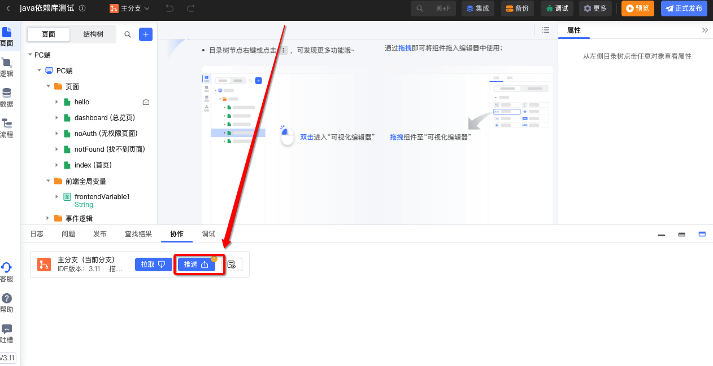

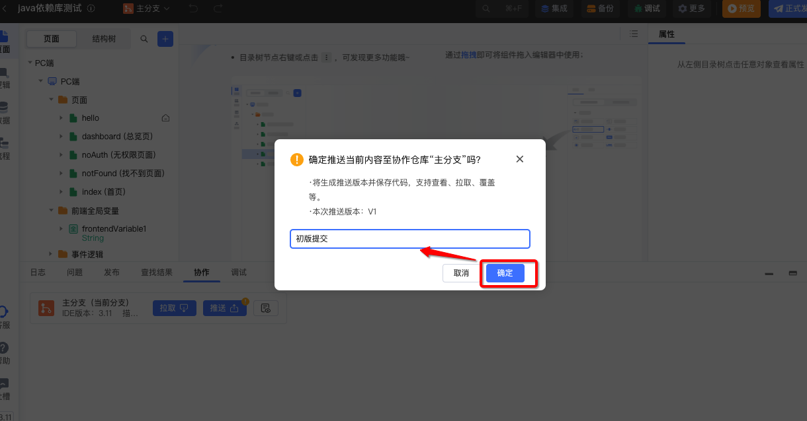

2\. 加一个按钮，再提交一个版本

3\. 查看版本

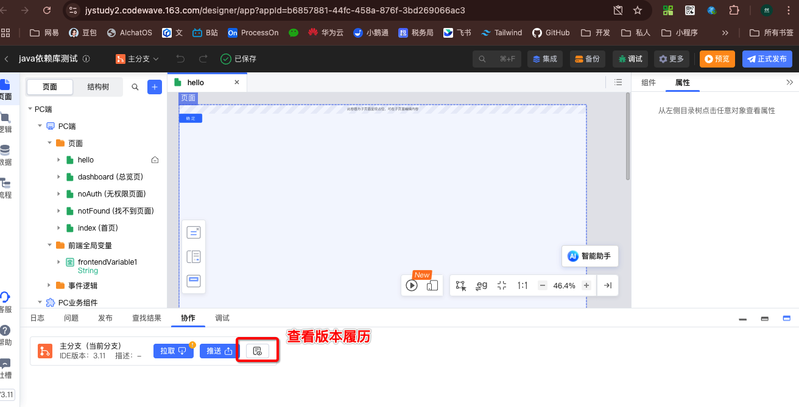

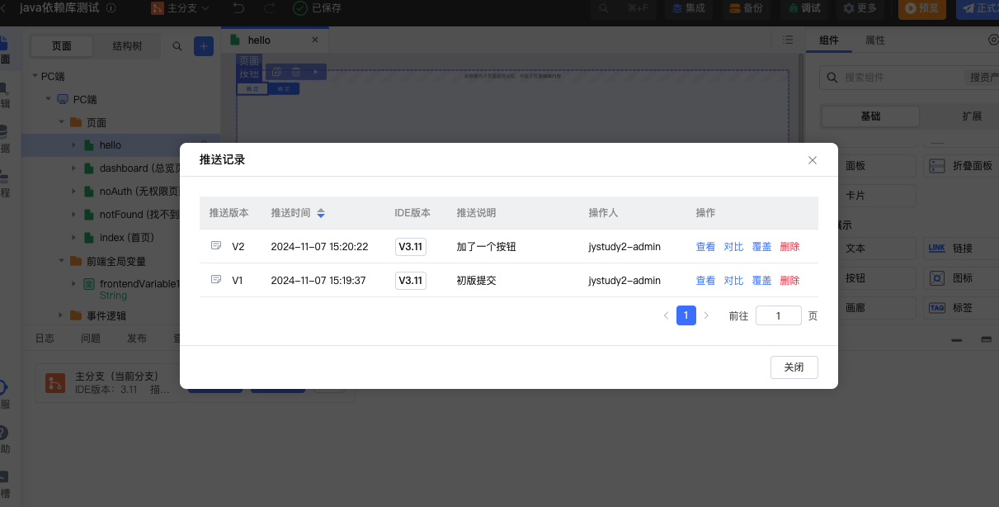

对比差异

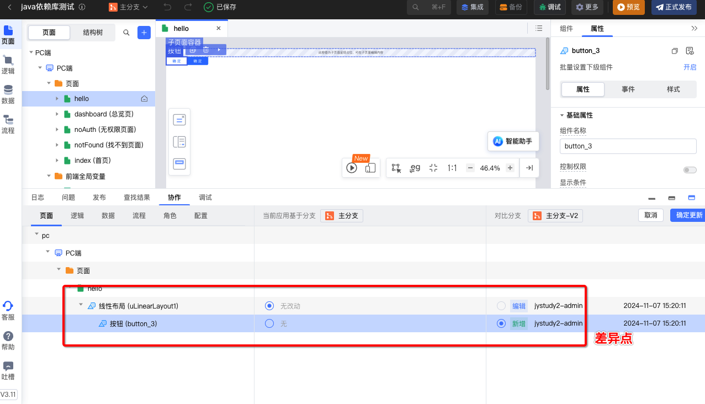

## 三、备份管理（里程碑、Tag）

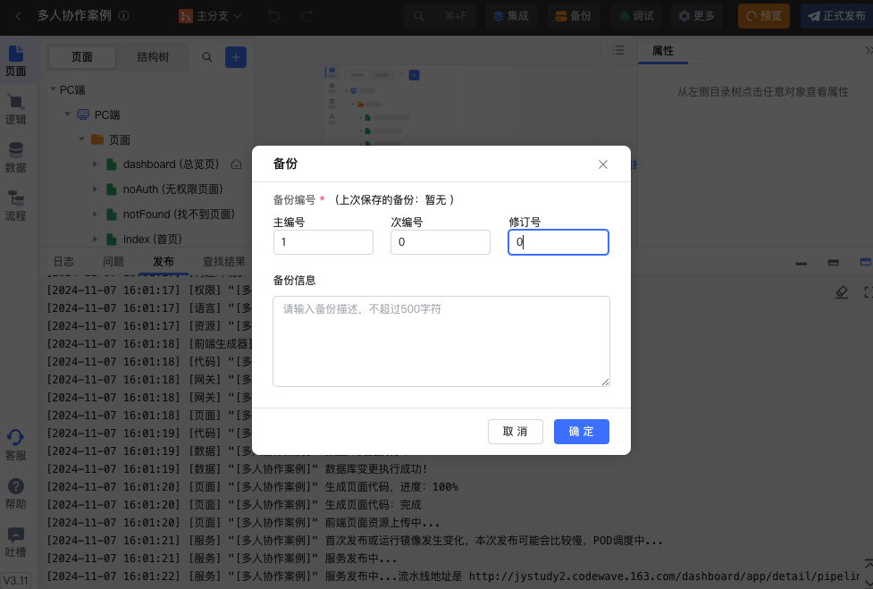

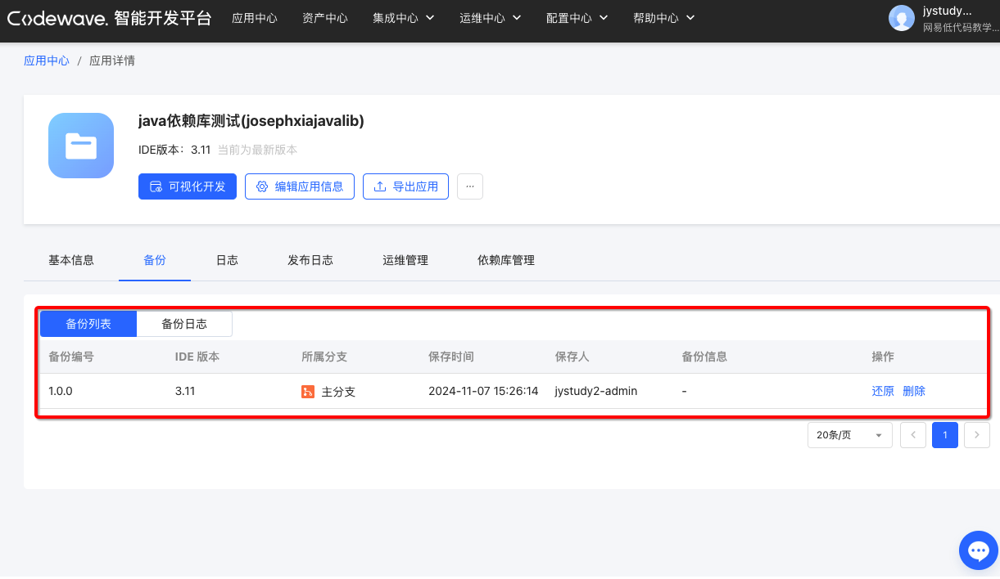

语义化版本（Semantic Versioning）是一种软件版本号的规范。它的格式为MAJOR.MINOR.PATCH，

- MAJOR（主版本号）

- MINOR（次版本号）

- PATCH（修订版本号）都是非负整数，并且它们之间用 “.” 分隔。例如，1.2.3是一个符合语义化版本规范的版本号。

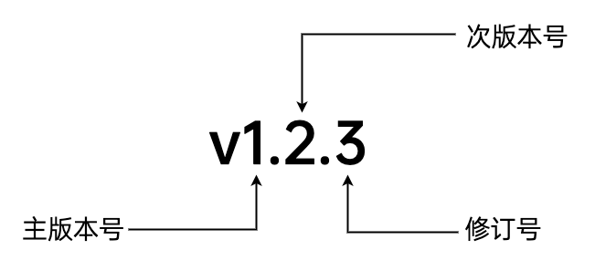

## 四、分支管理（多基线）

### 1\. 分支的概念

分支允许开发人员从主开发线路（通常称为主分支）分离出一个独立的开发线路。例如，开发一个新功能时，可以创建一个新的分支进行开发。当新功能开发完成并测试通过后，可以将这个分支合并回主分支。分支和合并操作能够在多人协作和复杂功能开发场景下，更好地管理开发过程和代码的变化。

常用的分支风格：

- 长期分支：主分支、开发分支、测试分支；

- 特性分支：Feature分支与Fix分支；

- 用户分支： 每个人一个分支；

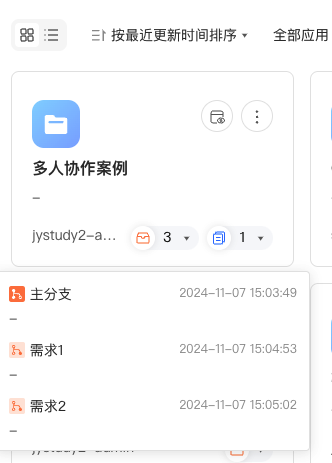

### 2\. 划分分支

1. 从主分支拉取分支（这个时候实际上是最原始的内容）

2. 从主分支拉取内容

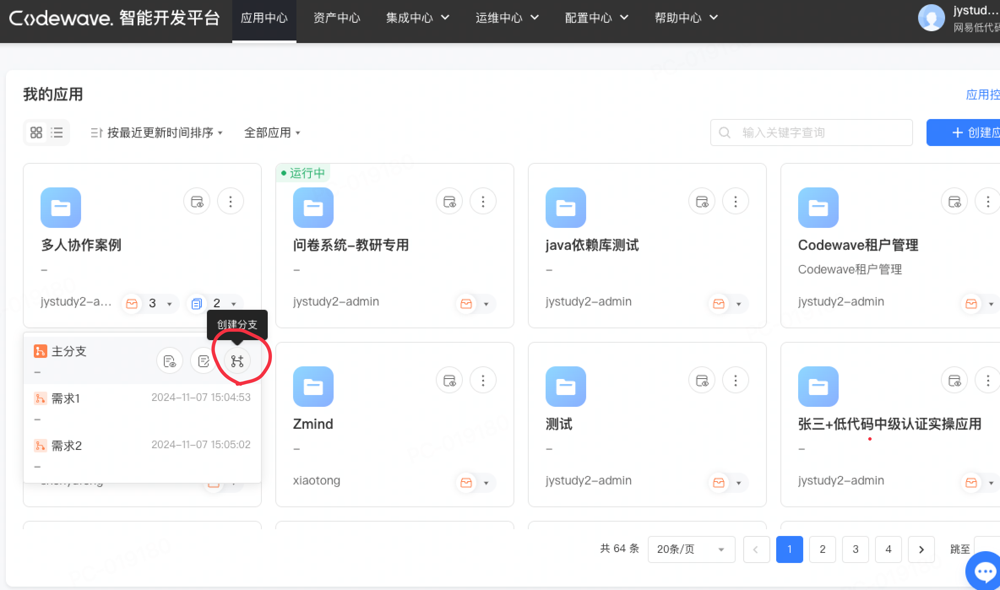

1. 创建一个分支【需求1】，进入【可视化开发环境】在创建一个页面【a】

2. 切换分支【需求1】

​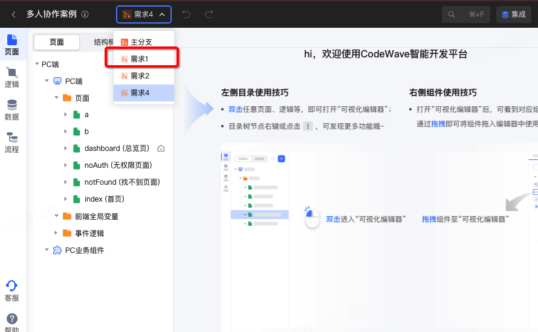        

### 3.拉取与推送

在协作中可以点击【推送】将变化推送至版本服务器

同理可以选择【主分支】可以将变化拉回主版本

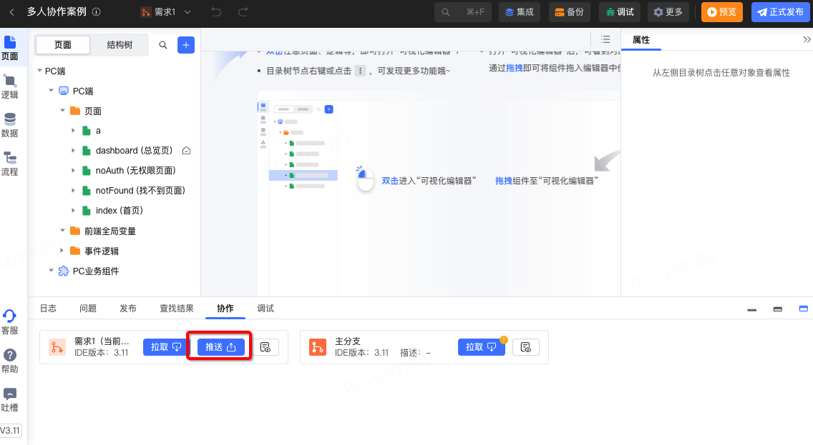

### 3\. 冲突解决

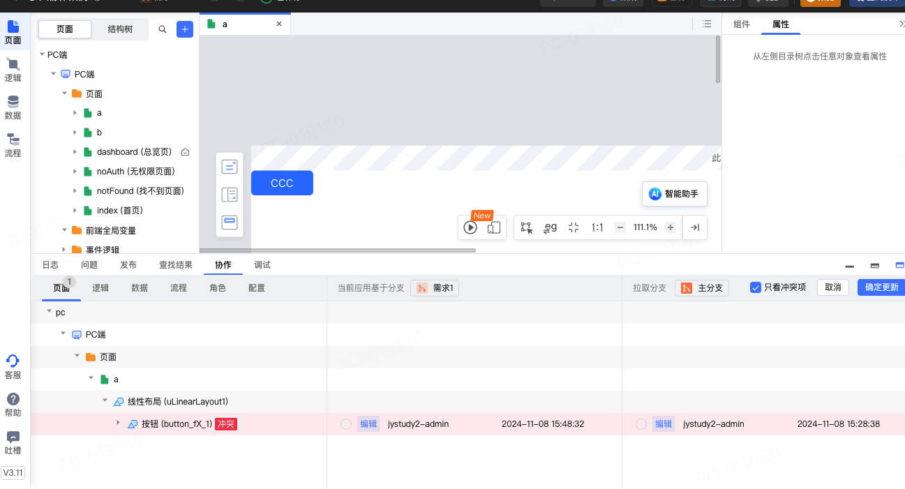

假设两个分支，对同一个属性做了不同的修改，例如同一个按钮一个分支标题改为BBB，另个分支改为CCC

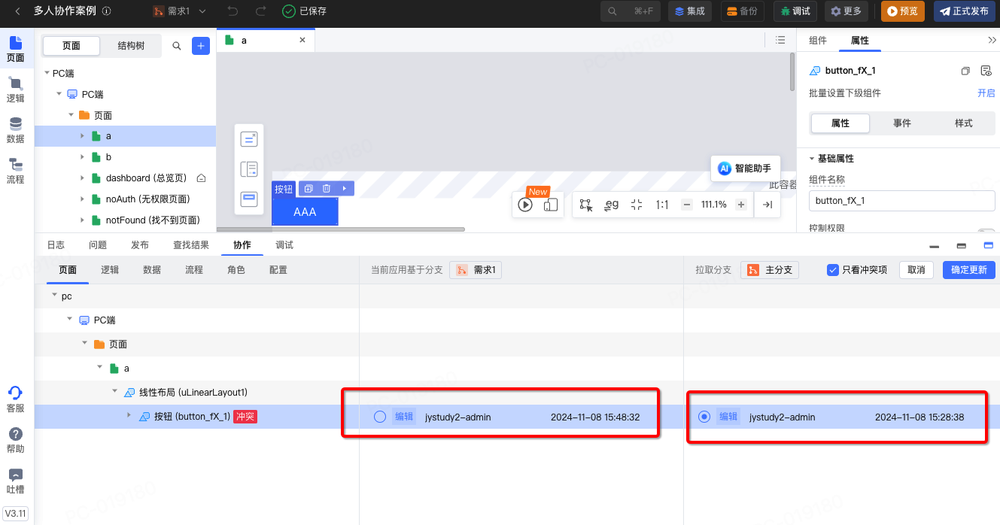

可以分别浏览两者区别，然后选择其中一个版本。

## 五、副本管理（多人协作）

在传统开发中，开发者都会将代码从版本服务器拉一个副本到开发机种进行开发。然而Codewave开发平台是一个在线型开发平台。也就是说你的开发机并不在本地而是在CodeWave服务器中。你手上的电脑只是通过浏览器访问了服务器中的开发机而已。这个时候拉取副本的操作实际上是在线上完成的。

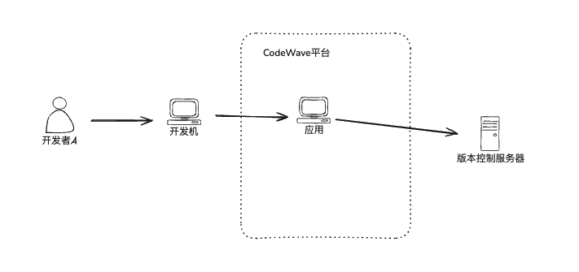

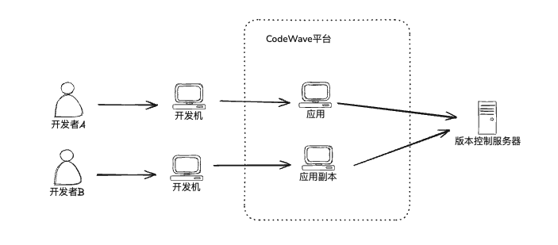

## 六、案例实战

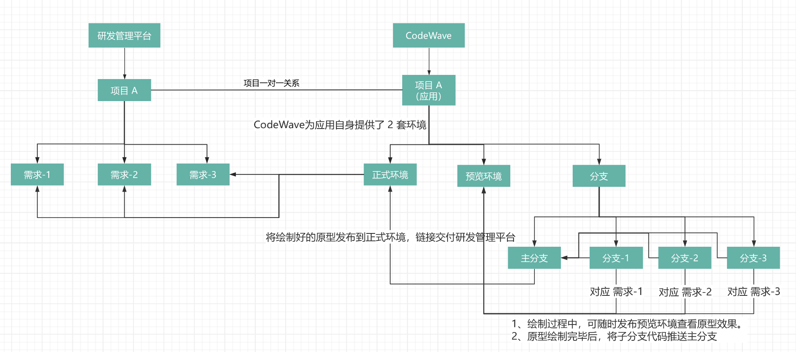

问题解读：

- 多分支：

  - 解决方案： 多特性分支（需求1、需求2、需求3）

- 多部署环境：

  - 解决方案1： 利用项目本身的2套环境(生产环境与开发环境)（缺点：开发环境会定时回收，）

  - 解决方案2：利用副本方式解决（长期有效）

- 预览环境可以拉取不同分支：