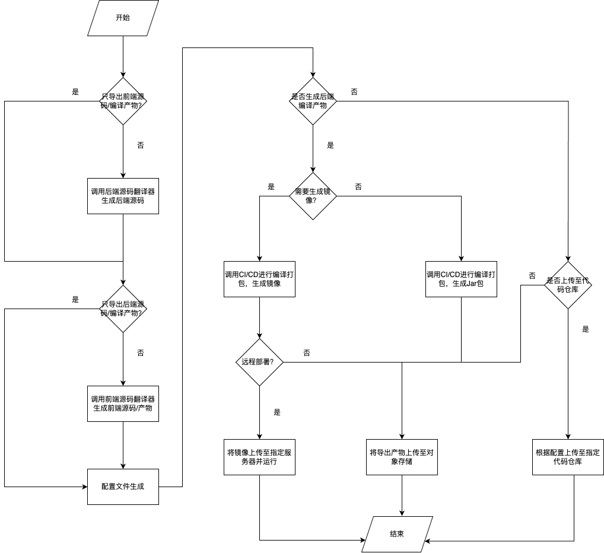
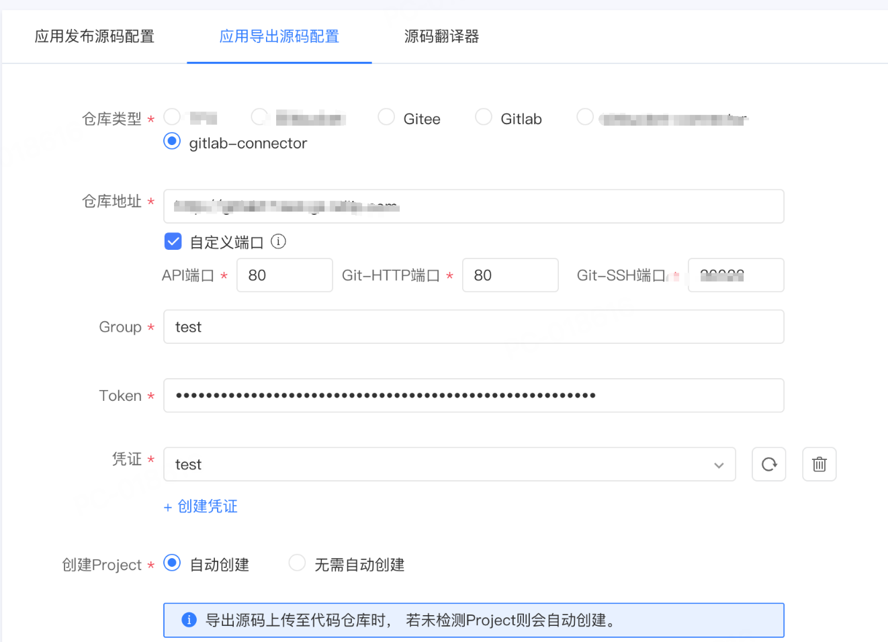
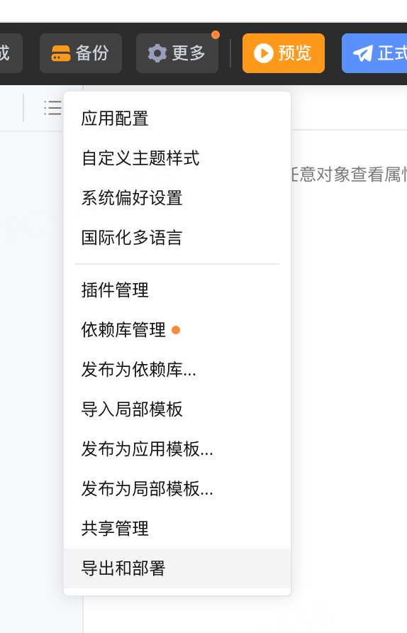
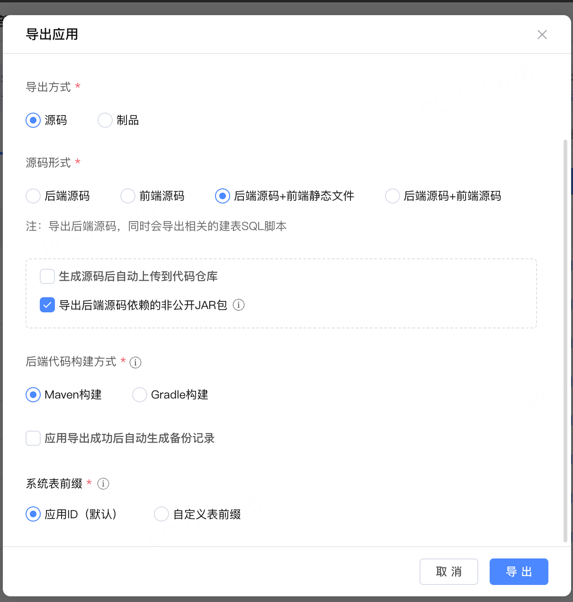
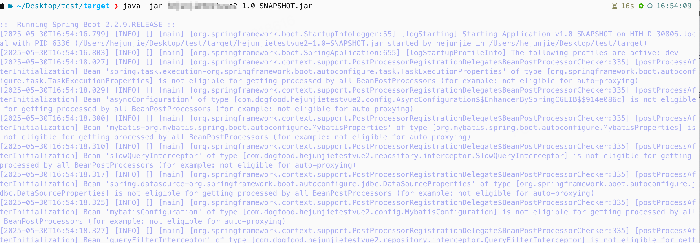

# 源码导出

## 功能介绍

导出源码功能可以将Codewave平台的项目翻译成源码并导出到S3或Gitlab等代码管理平台，以供二次开发或自行部署。

### 源码导出类型

- 后端源码+前端静态文件
- 后端源码+前端源码
- 镜像
- JAR包+前端静态文件
- 远程部署

## 原理介绍

### 实现原理

源码导出将平台所使用的NASL翻译为Java（后端）+TypeScript/JavaScript+HTML+CSS（前端），并根据导出参数将源码进一步翻译和打包，生成最终产物。



### 导出产物目录结构

#### 后端源码+前端静态文件

```shell
.
├── dependency
│   └── ... // 后端源码依赖的依赖库等非公开包
├── Dockerfile
├── exec.sh
├── metadata.json
├── pom.xml
├── README.md
└── src
    └── main
        ├── java
        │   └── ... // Java后端源码
        └── resources
            ├── ... // 主要为配置文件
            └── static
                └── ... // 前端静态文件
```

#### 后端源码+前端源码

```shell
.
├── client // 前端源码
│   └── pc // 浏览器端源码
├── dependency
│   └── ... // 后端源码依赖的依赖库等非公开包
├── Dockerfile
├── exec.sh
├── metadata.json
├── pom.xml
├── README.md
└── src  // 后端源码
    └── main
```

#### 镜像

```shell
.
├── config  // 配置文件
│   ├── application-dev.yml
│   └── application.yml
├── db
│   └── all-defaultDS-mysql.sql  // 全量SQL文件
└── image
    └── xxx.tar.gz  // docker镜像
```

#### JAR包+前端静态文件

```shell
.
├── client  // 前端静态文件
│   └── ...
└── xxx.jar  // 后端Jar包
```

### 源码仓库连接器介绍

目前导出至源码仓库功能内置了Gitlab和Gitee两个源码仓库的支持。源码仓库连接器用于适配更多类型的源码仓库，使用默认租户上传之后即可在导出源码配置页面看到相关配置项，配置后即可在IDE内导出源码功能中使用。



### 部署配置文件介绍

在导出源码/产物后部署时一般需要根据实际情况对配置文件（位于`src/main/resources`目录下）进行修改，下面是一份配置文件，并添加了部分注释。

```yaml
management: # 管理端口等配置
  server:
    port: 9090
  metrics:
    export:
      prometheus:
        enabled: true
    tags:
      application: ${spring.application.id}
  endpoints:
    web:
      base-path: /management
      exposure:
        include:
        - health
        - prometheus
logging:
  file:
    path: ${user.home}
  path: ${logging.file.path}
spring:
  mvc:
    static-path-pattern: /**
  resources:
    static-locations[0]: classpath:/static/
    static-locations[1]: classpath:/static/assets/
    static-locations[2]: classpath:/static/packages/
  main:
    lazy-initialization: false
  application:
    name: test
    id: dfdad2c9-c8ed-4051-bf8f-85143da8e64b
  liquibase:
    enabled: false
  initDatabase:
    enabled: false
  quartz:
    enabled: false
  devtools:
    restart:
      enabled: false
    livereload:
      enabled: false
  datasource:  # 数据库相关配置 根据实际使用的数据库进行修改
    type: com.zaxxer.hikari.HikariDataSource
    driver-class-name: com.mysql.cj.jdbc.Driver
    url: jdbc:mysql://xxx 
    username: xxx
    password: ''
    connection-timeout: 3000
    hikari:
      poolName: Hikari
      auto-commit: false
      data-source-properties:
        cachePrepStmts: true
        prepStmtCacheSize: 250
        prepStmtCacheSqlLimit: 2048
        useServerPrepStmts: true
  servlet:
    multipart:
      max-file-size: 50MB
      max-request-size: 50MB
  messages:
    basename: i18n/messages
mybatis:
  mapper-locations: classpath*:mappings/**/*Mapper.xml
  type-handlers-package: com.test.repository.handler,com.netease.codewave.domain.datasource.handler
  configuration:
    database-id: mysql
    default-enum-type-handler: com.netease.codewave.domain.datasource.handler.AutoEnumTypeHandler
    log-impl: org.apache.ibatis.logging.log4j2.Log4j2Impl
    call-setters-on-nulls: true
server:
  port: 8080
  compression:
    enabled: true
    mime-types: text/html,text/xml,text/plain,text/css, application/javascript, application/json
    min-response-size: 1024
lcp:
  snowflakeNodeId: null
  authCenter:
    enable: true
    address: http://nuims.low-code:8081/nuims
    host: nuims.low-code
    hasUserCenter: true
    hasAuth: true
    security:
      lockMilliseconds: 900000
      maxFailureTimes: 5
    taskEnable: true
    noAuthPaths: /api/a_0bxb:POST,/upload/download_files:POST,/api/logics/downloadFile:POST,/api/logics/downloadFile:GET
  gatewayUrl: ''
  uiResourceAddress: /client.js
  gatewayType: light
  upload:  # 对象存储配置 根据实际情况修改
    sinkType: s3
    sinkPath: /app
    s3Address: http://minio-api.test.com
    s3AccessKey: ''
    s3SecretKey: ''
    s3Bucket: lowcode-static
    access: public
    ttl: -1.0
    cdnAddress: ''
  logResponse: false
  logRequest: true
  report:
    host: ''
    tokenKey: ''
    domainId: null
    projectId: null
    reportIdMap: {}
    componentIdMap: {}
  nuims: http://nuims.low-code:8081
  private: null
  process:
    database:
      schema: ''
      table:
        prefix: PDFDAD2C_
      isPlugin: false
  frontends:
    pc:
      name: pc
      path: /
      title: PC端
      type: pc
  integration:
    hasJsonType: false
  quartzTables: {}
  multiDatasource: false
upload:
  base-path: app
file:
  types: text/plain;text/html;text/css;application/javascript
  event:
    watcher:
      dirs:
      - permission
      - validation
    enable: true
    rootPathEnv: SYSTEM_RELOAD_RESOURCE_PATH
validation:
  onDemandInterfaceGeneration: false
lcap:
  datasource:
    init-config[0]:
      name: defaultDS
      all: db/all-defaultDS-*.sql
      upgrade: db/upgrade-defaultDS-*.sql
  domain:
    package:
      base: com.test.test
      domain: com.test.test.domain
      structure: com.test.test.domain.structure
      anonymous_structure: com.test.test.domain.structure.anonymous
      entities: com.test.test.domain.entities
      enumeration: com.test.test.domain.enumeration
extensions:
  bims_log_aop:
    custom:
      projectInfoTabMapper: ''
      saleRateTabMapper: ''
      machineCardInfoTabMapper: ''
      tSysLogMapper: ''
      serviceInfoTabMapper: ''
  lcap_process_framework:
    custom:
      ignoreExceptionConfig: 'true'
logicAuthFlag: false
auth:
  token:
    secret: 8e5aa447fa55dbe
    expire: 86400
  plugin:
    list:
      Normal:
        category: main
  types: Normal
  Normal: '{"category":"main"}'
process:
  env: dev
connector:
  default_fileStorage_connection:
    accessKey: ''
    secretKey: ''
    bucket: lowcode-static
    privateBucket: 'false'
    endpoint: http://minio-api.test.com
    pathStyleAccessEnabled: 'true'
    cdnAddress: null
    sinkPath: /app
gw:
  app:
    addr:
      lowcode: http://lcap.low-code:22988
      nuims: http://nuims.low-code:8081
custom:
  api:
    context-path: /
  system:
    time-zone: user
fileStorage:
  lcap_default_connection: '{"refConnection":"","defaultConnection":true,"title":"系统文件存储"}'

```

## 实操演示

### 后端源码+前端静态文件

#### 导出源码

在平台上导出源码下载到本地并解压





#### 本地部署

1. 安装依赖。使用命令行进入`dependency`目录执行安装脚本将依赖安装至本地的Maven仓库。在目录下存在两个安装脚本：

    - install-dependency.bat 该脚本供Windows10及以上版本的Windows使用。
    - install-dependency.sh 该脚本供MacOS和Linux使用。
    - 如果使用Windows10以下版本的系统，可使用 [install.cmd](https://gitee.com/KEHFAN_admin/cw-deploy-doc/blob/master/maven/install.cmd)，将该脚本放置到dependency目录下执行。该脚本依赖7Zip，需要安装7Zip到C:\Program Files\7-Zip\目录下。

2. 执行SQL。使用数据库工具/命令行连接数据库执行`src/main/resources/db`目录下的SQL文件。

3. 配置修改。本地运行时，需要根据本地环境来修改配置文件。

    - 如导出开发环境，配置文件目录为：src/main/resources/application-dev.yml
    - 如导出生产环境，配置文件目录为：src/main/resources/application-online.yml
    - 需要修改的配置项为：
      - spring.datasource.url：指定数据库的地址
      - spring.datasource.username：指定连接数据库的用户名
      - spring.datasource.password：指定连接数据库的密码
      - server.port：应用启动端口

4. 编译。在源码目录下执行mvn clean package。注意须使用Java 1.8。

5. 运行。编译后的Jar包在target目录下。执行 `java -jar xxx.jar` 即可。



### 后端源码+前端源码

后端源码+前端源码与上面后端源码+前端静态文件的区别在于前端部分是以源码的形式提供，需要单独运行或编译为静态文件使用Nginx等Web服务器来处理请求。

下面将介绍如何本地运行前端服务。

1. 参照上一部分“后端源码+前端静态文件”启动后端服务。
2. 进入client/pc目录执行`npm install --legacy-peer-deps`安装前端源码所需依赖。
3. 根据需要修改vue.config.js配置文件。主要需要修改port以及proxy下的target。
```javascript
const path = require("path");

module.exports = {
  configureWebpack(config) {
    if (process.env.NODE_ENV === "production") {
      config.devtool = false;
    }

    
  },
  chainWebpack(config) {
    // 构建产物中删除console相关代码
    // config.optimization.minimizer('terser')
    //     .tap((args) => {
    //         args[0].terserOptions.compress.drop_console = ['info', 'log', 'warn'];
    //         return args;
    //     });
  },
  lintOnSave: false,
  runtimeCompiler: true,
  devServer: {
    compress: true,
    port: 8810,  // 前端服务端口号
    proxy: {  // 将下面的target修改为后端服务地址和端口号
      "/assets": {
        target: "http://localhost:8080",
        changeOrigin: true,
        autoRewrite: true,
      },
      "/api": {
        target: "http://localhost:8080",
        changeOrigin: true,
        autoRewrite: true,
      },
      "/rest": {
        target: "http://localhost:8080",
        changeOrigin: true,
        autoRewrite: true,
      },
      "^/gateway/": {
        target: "http://localhost:8080",
        changeOrigin: true,
        autoRewrite: true,
      },
      "^/gw/": {
        target: `http://localhost:8080`,
        changeOrigin: true,
        autoRewrite: true,
      },
      "^/upload": {
        target: "http://localhost:8080",
        changeOrigin: true,
        autoRewrite: true,
      },
    },
  },
};
```
4. 使用npm run serve运行前端服务器。

### 镜像


### Jar包+前端静态文件


### 远程部署


### 代码仓库连接器开发

