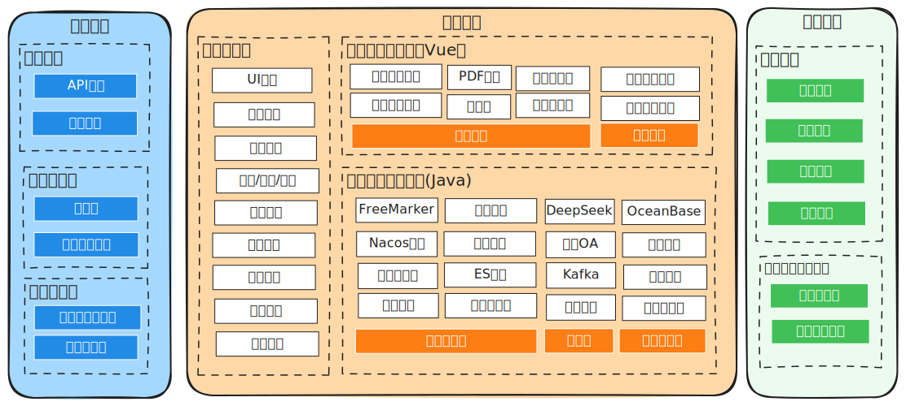

# Codewave架构师课程

<!--  -->

<object data="a2.svg" type="image/svg+xml" style="max-width: 100%;"></object>

## 一、背景
CodeWave平台在复杂企业应用中存在落地困难的现象。主要问题归纳为：

1. 技术选型： 很难判断哪些项目适合低代码开发
2. 扩展能力： 不清楚扩展开发的能力边界，哪些功能可通过扩展开发实现
3. 应用集成： 不了解如何与现有IT系统进行集成，比如第三方应用、单点登录、微服务、微前端
4. CI/CD运维：如何选择上线发布形式，如何与现有的日志监控、持续集成、版本控制对接
5. 项目管理： 低代码项目成本如何估算、开发人员体系如何配置 
6. 安全合规： 源码风格、项目结构如何定制满足安全合规性要求
7. 资产利旧： 旧有系统与低代码结合实现重新利用

在这种背景下，企业迫切需要具备能够综合项目需求与企业IT现状提出合理的CodeWave应用方案的人才。
使得Codewave可以在企业项目中平稳落地。

## 二、架构师的作用
架构师在项目或组织中起着至关重要的作用，主要体现在以下几个方面：
- **系统设计与规划**
    - **整体架构设计**：负责设计系统的整体架构，包括硬件架构、软件架构等。根据业务需求和发展战略，制定出合理的架构方案，确保系统具有高可用性、可扩展性、高性能和安全性等特性。
    - **技术选型**：评估和选择适合项目的技术栈，包括编程语言、框架、数据库、服务器等。考虑技术的成熟度、社区支持度、与现有系统的兼容性等因素，为项目选择最优的技术方案。
    - **规划系统演进**：考虑系统未来的发展和变化，设计出易于演进的架构。预留扩展点和接口，以便在业务增长或需求变更时，能够方便地对系统进行升级和扩展，避免大规模的架构重构。
- **技术指导与决策**
    - **提供技术方向**：为开发团队提供技术方向和指导，确保团队成员理解和遵循架构设计原则。解答团队成员在技术方面的疑问，帮助解决技术难题，提升团队的整体技术水平。
    - **参与关键技术决策**：在项目开发过程中，对于关键的技术问题和决策，如算法选择、数据存储方案、性能优化策略等，架构师凭借其专业知识和经验，给出合理的建议和决策，确保项目的技术实现符合整体架构要求。
    - **推动技术创新**：关注行业内的新技术发展趋势，将合适的新技术引入到项目中，推动技术创新，提升系统的竞争力。例如，引入新的分布式计算框架来提高系统的处理能力，或采用新的安全技术来增强系统的安全性。
- **协调与沟通**
    - **跨团队协作**：与不同的团队进行沟通和协作，包括开发团队、测试团队、运维团队、产品团队等。确保各个团队对系统架构有清晰的理解，协调各团队之间的工作，保证项目的顺利进行。
    - **需求沟通与转化**：与产品经理或业务部门沟通，理解业务需求，并将其转化为技术架构层面的设计。将技术架构的设计思路和实现方案向业务部门进行解释，确保业务部门对技术实现有一定的了解，避免出现需求与实现之间的偏差。
    - **对外技术合作**：在与外部合作伙伴进行技术合作时，作为技术代表参与沟通和协调。确保与合作伙伴的系统能够顺利集成，解决技术对接过程中出现的问题，保障合作项目的成功实施。
- **质量保障**
    - **制定技术规范**：制定项目的技术规范和标准，包括代码规范、设计模式、数据库设计规范等。确保开发团队遵循统一的规范进行开发，提高代码的可读性、可维护性和可测试性，保证系统的质量。
    - **设计评审与代码审查**：参与项目的设计评审和代码审查工作，对系统的架构设计、模块设计、代码实现等进行审查。发现潜在的问题和风险，及时提出改进意见和建议，确保系统的设计和实现符合架构要求和质量标准。
    - **性能优化与调优**：负责系统的性能优化和调优工作，通过对系统的性能分析，找出性能瓶颈所在，并采取相应的优化措施。如优化数据库查询语句、调整系统参数、采用缓存技术等，提高系统的响应速度和处理能力。

## 三、低代码开发技术选型

技术选型是项目开发中的关键环节，需要综合考虑多个因素。以下是进行技术选型的一些步骤和要点：

- **功能需求**：详细梳理项目要实现的功能，如数据管理、流程审批、报表生成等。例如，一个客户关系管理系统需要有客户信息管理、销售机会跟踪、营销活动管理等功能，根据这些功能来判断低代码平台是否能满足。
- **性能需求**：考虑系统的并发处理能力、响应时间等性能指标。如果是一个面向大量用户的在线考试系统，需要保证在考试高峰期能快速加载题目、及时保存答案，这就要求低代码平台具备较好的性能优化机制。
- **集成需求**：确定项目是否需要与其他系统集成，如企业现有的ERP、财务系统等。例如，在一个电商订单处理项目中，可能需要将低代码平台与电商平台的订单接口、物流系统等进行集成，实现订单信息的自动同步和物流状态的实时更新。
