基础操作参考： [SpecDriven官方文档](https://community.codewave.163.com/CommunityParent/fileIndex?filePath=25.%E6%99%BA%E8%83%BD%E5%BC%80%E5%8F%91%2F120.SpecDriven%E6%99%BA%E8%83%BD%E5%BC%80%E5%8F%91%2F120.SpecDriven%E6%99%BA%E8%83%BD%E5%BC%80%E5%8F%91%E6%8C%87%E5%8D%97.md&version=4.5&selectType=codewave)

## 一、需求准备：

SpecDrivien输入的文档格式相对宽泛，即使是一句话的需求也可以。但需求越详细生成效果越好。以下是对输入文档格式的简单的归类：

|文档类型|说明|推荐优先级|
|---|---|---|
|需求规格说明书|结构化的软件需求文档|P0|
|概要设计文档|至少包含功能模块、业务细节描述|P1|
|产品需求文档（PRD）|详细的产品需求说明，含用例/故事|P2|

文档内容可包含：

- 功能需求描述：必须，需要在文档中有清晰表达需求的文字描述，不能只有原型截图或图片上的文字备注

- 业务流程图：非必须

- 数据模型定义：非必须

- 接口规范：如涉及

- 非功能需求：性能、安全等

### 1、如何描述数据绑定关系

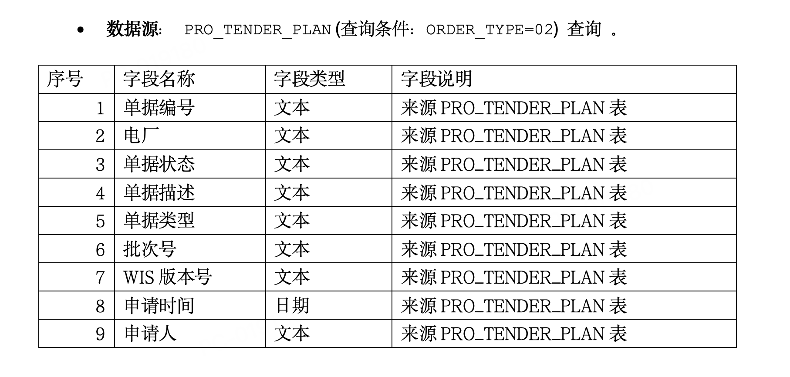

### 2、 界面UI如何描述

可以通过截图方式在页面中加入高保真原型、线框图，最好配合界面定义文字描述。

页面原型

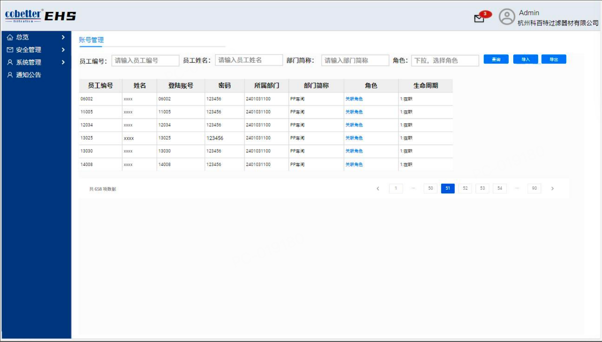

线框图

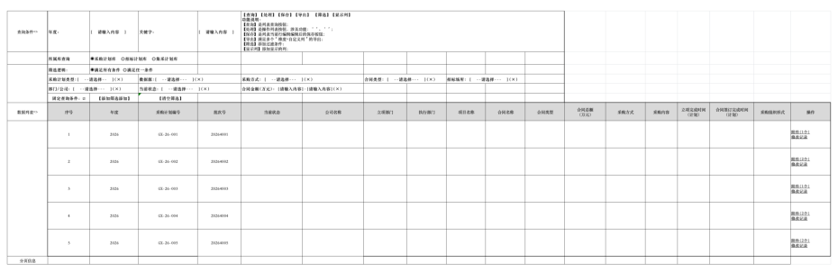

界面描述

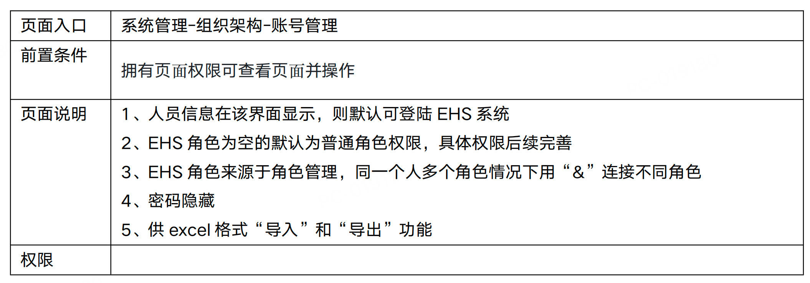

### 3、如何描述界面风格

可以单独一个章节定义页面风格。描述形式可以通过文字描述，也可以直接上传一张UI设计的截图。SDD会自动读取转化问文字描述。

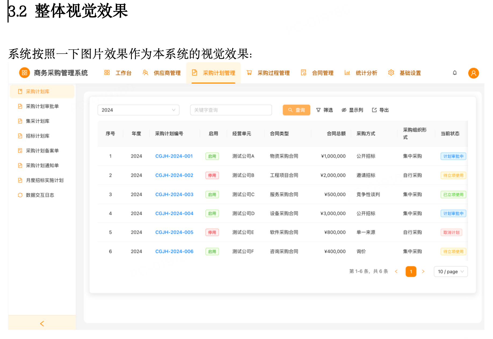

## 二、技术准备

在一些特殊的场景，在生成前做一些技术准备比如提前导入实体、API、已存在的依赖库，这样在技术设计阶段就SpecDriven就可以将这些内容利用起来。

### 1、 引入存量数据实体

SpecDriven在需求阶段是可以读取代码中已经存在的实体的。需要先导入实体并且保证在需求中描述的实体名称或数据库表名与导入的实体名称一致就可以使用存量实体。

Step01: 配置默认数据源为存量实体所在的数据源，目前只支持默认数据源，后期会支持多数据源功能。

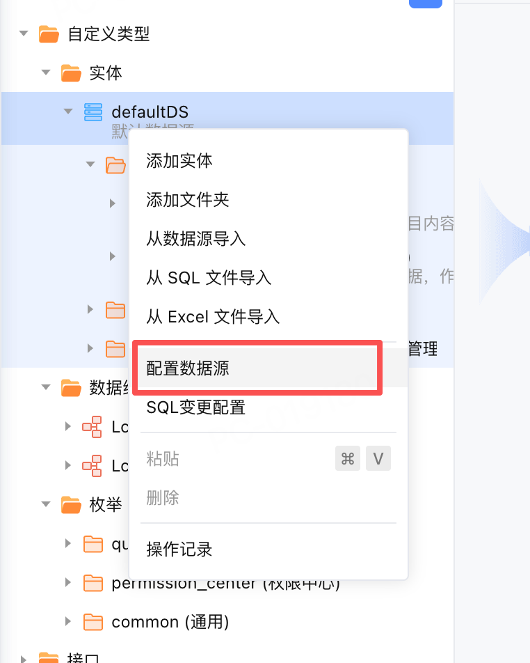

Step02: 利用【从数据源导入】功能导入实体

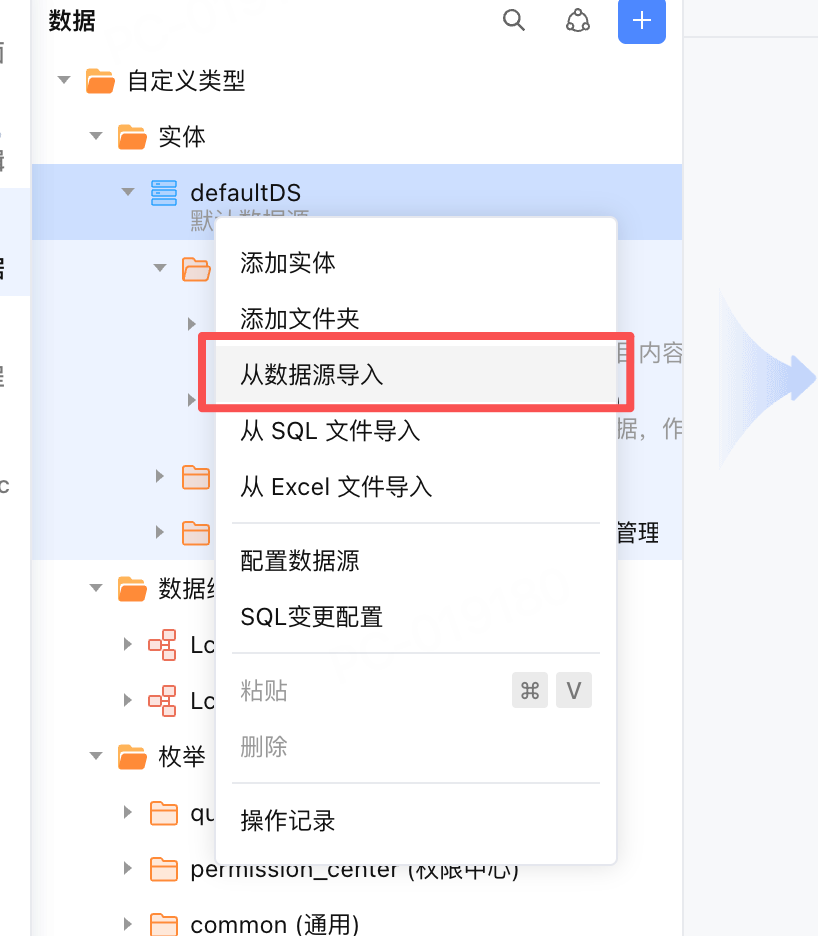

### 2、引入API

待补充

### 3、引入设计稿

待补充

### 4、已存复用已存在资产

待补充

## 三、需求解析调整

输入需求后，系统首先会将需求转换为Markdown格式。其中的图片会根据图片类型的不同转换为不同种类的文字描述方便大模型理解。

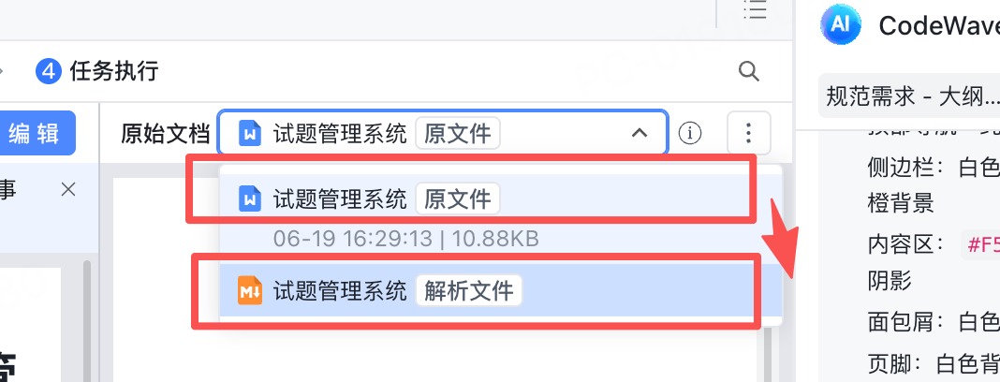

### 1、判断界面截图是否成功解析

界面截图通常会使用Feature+When/Then/And方式描述（Gherkin 语法），并且注明界面布局类。如果系统错误判断类型或者生成内容偏离会严重影响大模型理解。建议重新调整需求中的截图形式或界面的清晰度。

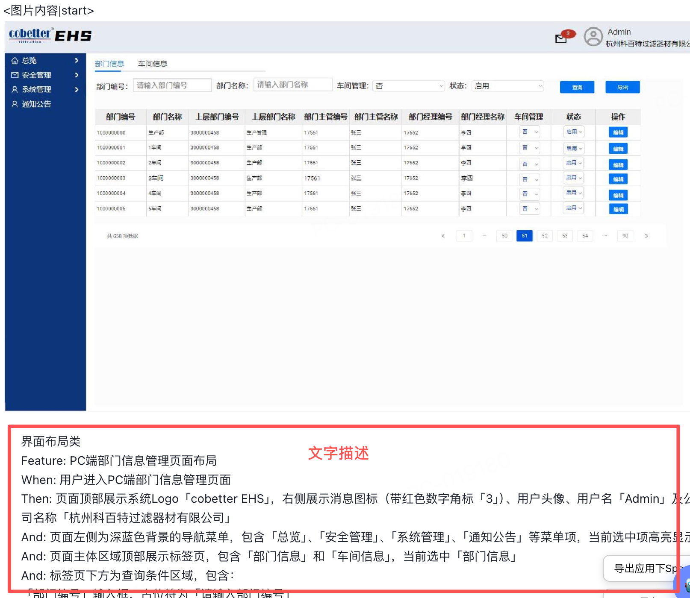

### 2、判断流程图是否成功解析

流程图也会转换为Mermaid 流程图语法。如果系统错误判断类型或者生成内容偏离会严重影响大模型理解。建议重新调整需求中的截图形式或界面的清晰度。

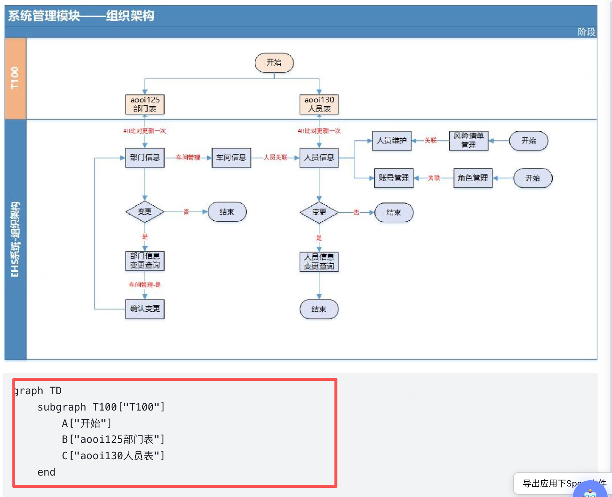

## 四、规范需求调整

生成需求后需要对需求内容进行人工评审（Review），因为大模型解析的结果未必是完全正确的。调整的方式推荐使用AI对话方式。

EARS为需求规范英文缩写，全称：Explicit（明确性）、Assessable（可验证性）、Retraceable（可追溯性）、Succinct（简洁性）。EARS是结构化需求编写标准，核心要求需求必须满足以上四大准则，杜绝模糊词汇（大概、可能、尽量、适配），每条需求独立、无歧义、可落地、可验收。

### 1、确认功能模块目录与页面

首先建议确认功能模块目录，主要核对生成的界面是否与需求一致。如果不一致建议先通过AI对话将界面补全。特别需要注意所有SDD规划的页面都会出现在此目录中。如果有缺少请利用AI补充。

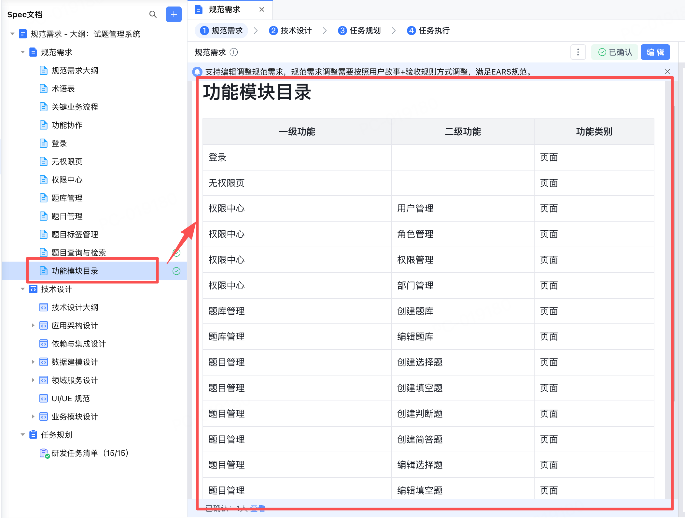

### 2、模块功能确认

可以根据功能模块目录找到对应的页面功能进行具体模块的功能确认。

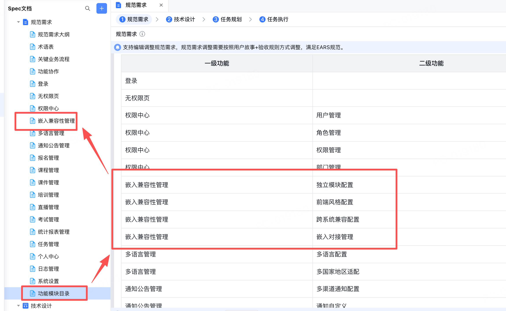

## 五、技术设计调整

[AI对话建议使用姿势](https://docs.popo.netease.com/team/pc/0u6nqau4/pageDetail/e4db23171ba548f69549889acf0a451b)

### 1、 如何增加对UI样式的描述

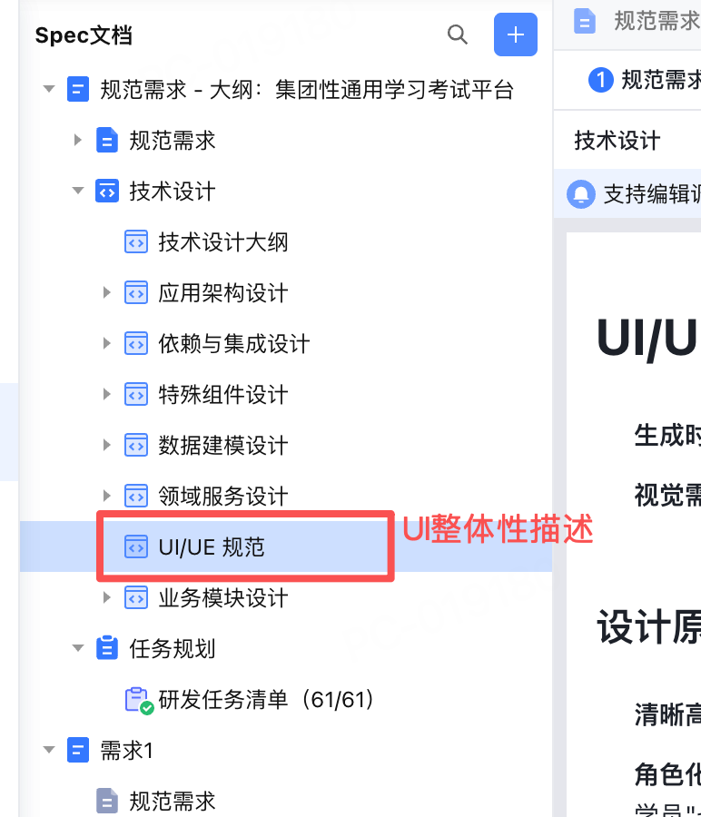

## 六、任务执行后调整

主要调整项参考 [AI对话调优最佳实践](https://docs.popo.netease.com/lingxi/3eea609365b248a1b7284d2a96842a50)

### 1、执行E2E测试

```text
/wave.runAutoTest  生成用例+执行用例 
/wave.runHealLoop 生成用例+执行用例+自动修复
```

### 2、 调整界面风格

[使用UI-UX-PRO-Skill进行页面美化](https://docs.popo.netease.com/team/pc/vjfbrv9g/pageDetail/1bfdabb77c35481f8a4c79c86bd99410)

### 3、 使用头脑风暴功能

待补充

### 4、 通过可视化编辑器调整

待补充

## 七、需求多次迭代

待补充

### 八、 FAQ问题

迭代、E2E测试、定制规范需求

## X、附录

[CodeWave SDD 需求文档自检清单](https://docs.popo.netease.com/team/pc/0u6nqau4/pageDetail/5d7cb56e75974ef4a3631bf1d7c623bb)

2\. 基本操作步骤：

依据 [CW官方SDD步骤](https://community.codewave.163.com/CommunityParent/fileIndex?filePath=25.%E6%99%BA%E8%83%BD%E5%BC%80%E5%8F%91%2F120.SpecDriven%E6%99%BA%E8%83%BD%E5%BC%80%E5%8F%91%2F120.SpecDriven%E6%99%BA%E8%83%BD%E5%BC%80%E5%8F%91%E6%8C%87%E5%8D%97.md&version=4.5&selectType=codewave)

3\. AI对话最佳实践

[AI对话调优最佳实践](https://docs.popo.netease.com/lingxi/3eea609365b248a1b7284d2a96842a50)

[AI对话建议使用姿势](https://docs.popo.netease.com/team/pc/0u6nqau4/pageDetail/e4db23171ba548f69549889acf0a451b)

4\. 特殊场景归纳：

[SDD-第三方API接口最佳使用姿势](https://docs.popo.netease.com/team/pc/0u6nqau4/pageDetail/f287c39ea9ac40daaee1317a38f266a8)

[SDD-连接器最佳使用姿势](https://docs.popo.netease.com/team/pc/0u6nqau4/pageDetail/39ff629ac29149219e4b1e1c7b45bb7c)

[SpecDriven使用指导](https://docs.popo.netease.com/lingxi/00d4d2c94b9d4dcb84eef062262cfe62)